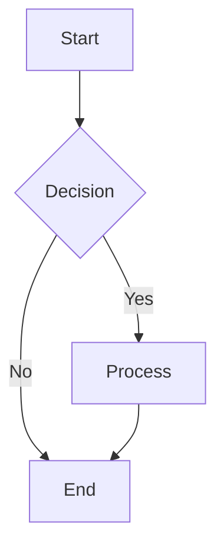

# PKC Landing Page
## Personal Knowledge Container - Decentralized Communication System

A modern, **static-first, modular web application** with **serverless P2P communication capabilities** built entirely with browser-native WebRTC APIs. Features rich markdown documentation viewing, LaTeX math rendering, Mermaid diagrams, and **zero-dependency peer-to-peer networking**.

---

## 🚀 **Core Features**

### **📡 Serverless P2P Communication**
- **Zero Dependencies**: Pure WebRTC APIs - no external servers or CDNs required
- **Browser-Native**: Direct peer-to-peer connections without signaling infrastructure
- **Manual Invitation Exchange**: URL/QR code-based peer discovery (truly serverless)
- **Cross-Device Support**: Connect phones, tablets, and computers on local network
- **End-to-End Encryption**: WebRTC provides transport encryption (DTLS)
- **Privacy-First**: No central servers tracking connections

### **📚 Rich Documentation Viewer**
- **Full Markdown Support**: Headers, lists, tables, code blocks, images, and links
- **LaTeX Math Rendering**: Mathematical equations using KaTeX (Obsidian-compatible)
- **Mermaid Diagrams**: Flowcharts, sequence diagrams, class diagrams, and more
- **Syntax Highlighting**: Code blocks with language-specific highlighting

### **🏗️ Modular Architecture**
- **PKC Core Runtime**: Lightweight module loader with capability detection
- **Progressive Enhancement**: Works as static files, modules add features when supported
- **WebRTC/WebSocket Support**: Automatic capability detection and graceful degradation
- **Static Hosting Ready**: Deploy anywhere (GitHub Pages, Netlify, S3, etc.)

---

## 🔄 **P2P Architecture Highlights**

### **Serverless Design Principles**
- ✅ **No Bootstrap Servers** - Uses STUN only for NAT traversal
- ✅ **No Signaling Servers** - Manual invitation exchange via URL/QR
- ✅ **No External Dependencies** - Pure browser WebRTC APIs
- ✅ **Zero Infrastructure** - Works offline between local peers
- ✅ **Privacy Preserving** - No central tracking or data collection

### **Connection Flow**
```
1. Peer A → Create Invitation (generates offer + ICE candidates)
2. Manual Exchange → Share invitation URL via QR code, messaging, email
3. Peer B → Accept Invitation (generates answer)
4. Manual Exchange → Send answer back to Peer A
5. Peer A → Complete Connection (apply answer)
6. ✅ Direct P2P connection established
```

### **Technical Specifications**
- **Bundle Size**: 20KB (vs 500KB+ for libp2p alternatives)
- **Connection Time**: 2-5 seconds (direct WebRTC)
- **Message Latency**: 10-50ms between connected peers
- **Max Peers**: 8 concurrent connections (recommended)
- **Browser Support**: Chrome 56+, Firefox 44+, Safari 11+

---

## 📁 **Project Structure**

```
├── README.md                          # This file
├── index.html                         # Landing page with P2P demo link
├── js/
│   ├── pkc-core.js                    # Module loader runtime
│   └── modules/
│       ├── markdown-renderer/         # Documentation viewer module
│       ├── net-gateway/               # WebSocket demo module
│       └── p2p-serverless/            # 🆕 Serverless P2P module
│           ├── index.js              (500 lines) - Main P2P interface
│           ├── connection.js         (400 lines) - WebRTC connection manager
│           ├── discovery.js          (300 lines) - Peer discovery system
│           ├── qr-code.js            (200 lines) - QR code utilities
│           ├── example.html          (300 lines) - Full P2P test interface
│           ├── debug-test.html       (250 lines) - Diagnostic tools
│           └── README.md             (500 lines) - P2P API documentation
├── docs/                              # 📚 Comprehensive documentation
│   ├── architecture-serverless-p2p.md    # P2P system architecture
│   ├── p2p-serverless-implementation.md  # Implementation details
│   ├── p2p-testing-guide.md              # Testing instructions
│   ├── p2p-bug-fix-peer-id.md           # Bug fix documentation
│   ├── cleanup-libp2p-migration.md      # Migration guide
│   └── archive/                          # Historical implementations
├── modules.json                        # Module configuration
├── MODULES.md                          # Module system documentation
├── nginx-pkc.conf                      # Nginx server configuration
└── pkc-docs/                           # Documentation files
    ├── Personal Knowledge Container.md
    ├── PKC as the Network.md
    ├── LaTeX-Test.md
    └── ...
```

---

## 🛠️ **Quick Start**

### **1. Basic Setup**
```bash
# Clone repository
git clone https://github.com/xlp0/LandingPage.git
cd LandingPage

# Start local server (port 8000)
python3 -m http.server 8000 --bind 0.0.0.0

# Or for local network access (all devices on WiFi)
python3 -m http.server 8000 --bind 0.0.0.0
```

### **2. Access Application**
- **Landing Page**: `http://localhost:8000` or `http://YOUR_IP:8000`
- **P2P Demo**: `http://localhost:8000/js/modules/p2p-serverless/example.html`
- **Documentation**: `http://localhost:8000/pkc-docs-index.html`

### **3. Test P2P (2 Devices)**
1. Open P2P demo on two devices (same WiFi network)
2. **Device 1**: Click "Create Invitation" → Copy invitation code
3. **Device 2**: Click "Accept Invitation" → Paste code → Copy answer
4. **Device 1**: Click "Complete Connection" → Paste answer
5. ✅ **Connected!** Send messages between devices instantly

---

## 🔧 **P2P Configuration**

### **Application-level configuration (app-config.json)**
The application reads runtime settings from `/app-config.json`. Use this file to configure WebRTC/P2P and other app knobs without changing code.

Example:

```json
{
  "wsHost": "192.168.1.139",
  "wsPort": 3001,
  "wsPath": "/ws/",
  "p2p": {
    "iceServers": [
      { "urls": "stun:stun.l.google.com:19302" },
      { "urls": "stun:stun1.l.google.com:19302" }
    ]
  }
}
```

How it’s loaded:
- `js/modules/p2p-serverless/config.js` fetches `/app-config.json` (no-cache) and resolves effective config via `resolveP2PConfig()`.
- Precedence (highest first): module init overrides → `app-config.json` → built‑in defaults.
- Add TURN servers here if your environment requires relaying.

See also:
- `js/modules/p2p-serverless/README.md` (module-level details)
- `tests/README.md` (why config matters for e2e)

### **Module Configuration** (`modules.json`)
```json
{
  "modules": [
    {
      "id": "p2p-serverless",
      "entry": "/js/modules/p2p-serverless/index.js",
      "enabled": true,
      "when": "webrtc",
      "config": {
        "iceServers": [ /* optional override; prefer app-config.json */ ],
        "channelName": "pkc-p2p-discovery",
        "invitationTTL": 300000
      }
    }
  ]
}
```

### **Capability Detection**
- `webrtc`: WebRTC support (required for P2P)
- `websocket`: WebSocket support (optional)
- `storage.idb`: IndexedDB support (optional)

---

## 🌐 **Server Options**

### **Development Servers**
```bash
# Python (recommended for development)
python3 -m http.server 8000 --bind 0.0.0.0

# Node.js
npx serve . -p 8000

# PHP (built-in)
php -S localhost:8000
```

### **Production Deployment**
- **Static Hosting**: GitHub Pages, Netlify, Vercel, S3
- **CDN**: Cloudflare, Fastly
- **Traditional**: Nginx, Apache, IIS

### **Local Network Access**
```bash
# Allow all network interfaces
python3 -m http.server 8000 --bind 0.0.0.0

# Access from other devices: http://YOUR_LOCAL_IP:8000
```

---

## 📖 **Usage**

### **P2P Communication**
```javascript
// Get P2P module
const p2p = await window.pkc.modules['p2p-serverless'];

// Create invitation
const invitation = await p2p.createInvitation();
console.log('Share this URL:', invitation.url);

// Accept invitation (from another peer)
await p2p.acceptInvitation(invitationUrl);

// Send messages
p2p.broadcast({ type: 'chat', message: 'Hello everyone!' });

// Listen for messages
p2p.onMessage(({ peerId, data }) => {
  console.log('Message from', peerId, ':', data);
});
```

### **Documentation Viewing**
1. Navigate to `pkc-docs-index.html`
2. Click any document card
3. View rich markdown with LaTeX math and Mermaid diagrams
4. Use "Back to Index" to return

---

## 🧮 **LaTeX Math Support**

Obsidian-compatible LaTeX syntax:

### **Inline Math**
```markdown
Einstein's formula: $E = mc^2$
```

### **Display Math**
```markdown
$$
\text{Attention}(Q, K, V) = \text{softmax}\left(\frac{QK^T}{\sqrt{d_k}}\right) \times V
$$
```

### **Supported Features**
- Greek letters: `$\alpha, \beta, \gamma$`
- Fractions: `$\frac{a}{b}$`
- Integrals: `$\int_0^\infty f(x) dx$`
- Matrices: `$\begin{bmatrix} a & b \\ c & d \end{bmatrix}$`

---

## 📊 **Mermaid Diagrams**

All Mermaid diagram types supported:



---

## 🔄 **P2P vs Traditional Systems**

| Feature | PKC Serverless | Traditional P2P | Client-Server |
|---------|----------------|-----------------|---------------|
| **Server Dependencies** | ❌ Zero | ❌ Zero | ✅ Required |
| **External Libraries** | ❌ Zero | ✅ Many | ✅ Many |
| **Bundle Size** | 20KB | 500KB+ | N/A |
| **Connection Setup** | Manual | DHT/Auto | N/A |
| **Privacy** | ✅ High | ⚠️ Medium | ❌ Low |
| **Offline Support** | ✅ Full | ✅ Full | ❌ None |
| **Infrastructure Cost** | $0 | $0 | $$$ |
| **Complexity** | Low | High | High |

---

## 🌐 **Browser Compatibility**

### **P2P Features**
- ✅ Chrome/Edge 56+ (full support)
- ✅ Firefox 44+ (full support)
- ✅ Safari 11+ (full support)
- ⚠️ Mobile Safari (works, some limitations)

### **Documentation Viewer**
- ✅ Chrome/Edge (recommended)
- ✅ Firefox
- ✅ Safari
- ✅ Opera

---

## 📚 **Documentation**

### **P2P System**
- **`docs/architecture-serverless-p2p.md`** - Complete system architecture
- **`docs/p2p-serverless-implementation.md`** - Implementation details
- **`docs/p2p-testing-guide.md`** - Testing instructions
- **`js/modules/p2p-serverless/README.md`** - API reference

### **Project Documentation**
- **`PKC-DOCS-README.md`** - Comprehensive project documentation
- **`MODULES.md`** - Module system guide
- **`LATEX-SUPPORT-SUMMARY.md`** - LaTeX implementation details

### **Historical**
- **`docs/archive/p2p-libp2p-old-2025-11-07/`** - Previous libp2p implementation
- **`docs/cleanup-libp2p-migration.md`** - Migration documentation

---

## 🤝 **Contributing**

### **P2P Module Development**
1. The P2P system is modular and extensible
2. See `js/modules/p2p-serverless/README.md` for API details
3. Test changes using the provided example pages

### **General Development**
1. Fork the repository
2. Create a feature branch
3. Make your changes
4. Test thoroughly (especially P2P functionality)
5. Submit a pull request

---

## 📊 **Project Stats**

- **Lines of Code**: ~4,000+ lines (including docs)
- **Modules**: 3 active (markdown-renderer, net-gateway, p2p-serverless)
- **P2P Bundle Size**: 20KB (uncompressed)
- **Libraries**: Pure browser APIs (WebRTC, BroadcastChannel, etc.)
- **Browser Support**: Modern browsers (2016+)
- **Server Options**: 4+ (Python, Node.js, Nginx, IIS, static hosting)
- **Documentation**: 1,800+ lines across 8 docs
- **Last Updated**: November 7, 2025

---

## 🚀 **Live Demo**

### **Quick Demo**
```bash
# Start server
python3 -m http.server 8000 --bind 0.0.0.0

# Access from any device on your network:
# Landing Page: http://YOUR_LOCAL_IP:8000
# P2P Demo: http://YOUR_LOCAL_IP:8000/js/modules/p2p-serverless/example.html
```

### **P2P Testing**
1. Open demo on two devices (phone + computer)
2. Connect using invitation codes
3. Send messages between devices
4. Experience true peer-to-peer communication!

---

## 🔒 **Security & Privacy**

### **P2P Security**
- **Transport Encryption**: WebRTC DTLS encryption
- **No Central Servers**: No single point of failure or tracking
- **Manual Peer Verification**: Users control who they connect to
- **Privacy-First**: No telemetry or external data collection

### **Web Security**
- **HTTPS Recommended**: Required for full WebRTC functionality
- **CSP Headers**: Security headers configured in nginx
- **No External Dependencies**: Reduces attack surface
- **Static Content**: No server-side processing

---

## 📄 **License**

This project is provided as-is for exploring PKC design concepts and serverless P2P communication.

---

## 🎯 **Architecture Evolution**

### **Phase 1: ✅ Complete**
- Serverless P2P foundation
- WebRTC connection management
- Manual invitation exchange
- Basic messaging
- Documentation and testing

### **Phase 2: Mesh Networking** (Future)
- Multi-peer topologies
- Gossip protocol routing
- Automatic peer discovery
- Network optimization

### **Phase 3: State Synchronization** (Future)
- CRDT integration
- Shared document editing
- Conflict resolution
- Persistence layers

### **Phase 4: Advanced Security** (Future)
- End-to-end encryption
- Peer authentication
- Message signing
- Rate limiting

---

**Built with ❤️ for decentralized communication and personal knowledge management**

**PKC Landing Page** - Where static meets dynamic, and centralized meets decentralized.
