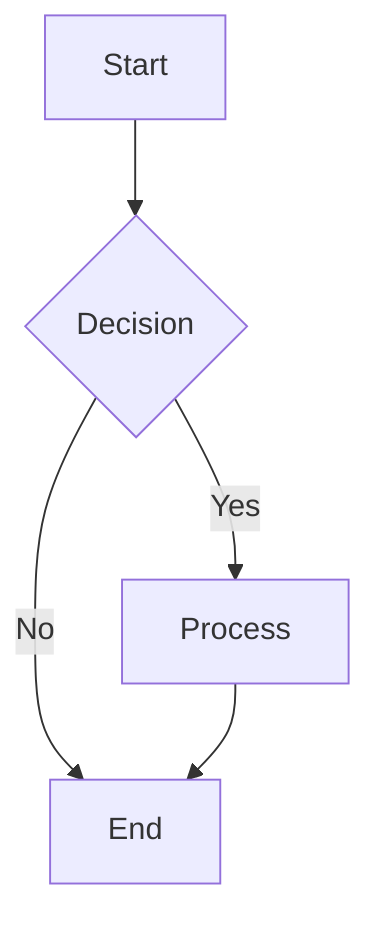

# PKC Documentation Viewer

A modern web-based viewer for PKC (Personal Knowledge Container) design documentation with support for markdown rendering, LaTeX mathematical equations, and Mermaid diagrams.

## 🚀 Features

### **Rich Content Rendering**
- **Full Markdown Support**: Headers, lists, tables, code blocks, images, and links
- **LaTeX Math Rendering**: Mathematical equations using KaTeX (Obsidian-compatible)
  - Inline math: `$E = mc^2$`
  - Display math: `$$\text{Attention}(Q, K, V) = \text{softmax}\left(\frac{QK^T}{\sqrt{d_k}}\right) \times V$$`
- **Mermaid Diagrams**: Flowcharts, sequence diagrams, class diagrams, and more
- **Syntax Highlighting**: Code blocks with language-specific highlighting

### **Modern UI/UX**
- Beautiful gradient design with card-based navigation
- Responsive layout for all devices
- Sticky navigation header
- Clean typography and color-coded elements
- Document metadata display (frontmatter support)

### **Technical Stack**
- **Marked.js** (v11.0.0) - Markdown to HTML conversion
- **KaTeX** (v0.16.9) - Fast LaTeX math rendering
- **Mermaid.js** (v10) - Diagram rendering
- **Highlight.js** (v11.9.0) - Code syntax highlighting
- **Pure HTML/CSS/JavaScript** - No build process required

## 📁 Project Structure

```
├── README.md                    # This file
├── PKC-DOCS-README.md           # Detailed project documentation
├── LATEX-SUPPORT-SUMMARY.md     # LaTeX implementation details
├── pkc-docs-index.html          # Main landing page with document cards
├── pkc-viewer.html              # Dynamic markdown viewer
├── mermaid-test.html            # Mermaid diagram testing
├── iisstart.htm                 # IIS default page (modified)
├── iisstart.png                 # IIS logo
└── pkc-docs/                    # Documents directory
    ├── web.config               # IIS configuration
    ├── MVP Cards Design Rationale.md
    ├── PKC as the Network.md
    ├── Personal Knowledge Container.md
    ├── Yoneda Arithmetic.md
    └── LaTeX-Test.md            # LaTeX math examples
```

## 🛠️ Quick Start

### Option 1: Local Development
1. Clone this repository
2. Serve files with any web server (IIS, Apache, Nginx, or Python's built-in server)
3. Open `pkc-docs-index.html` in your browser

### Option 2: Python Simple Server
```bash
python -m http.server 8000
# Then visit http://localhost:8000/pkc-docs-index.html
```

### Option 3: Node.js Server
```bash
npx serve .
# Then visit http://localhost:3000/pkc-docs-index.html
```

## 📖 Usage

### Viewing Documents
1. Start at the index page: `pkc-docs-index.html`
2. Click any document card to open it in the viewer
3. Use the "Back to Index" button to return

### Direct Document Access
You can link directly to any document:
```
pkc-viewer.html?doc=Personal%20Knowledge%20Container.md
pkc-viewer.html?doc=Yoneda%20Arithmetic.md
pkc-viewer.html?doc=LaTeX-Test.md
```

### Adding New Documents
1. Add markdown files to the `pkc-docs/` directory
2. Update `pkc-docs-index.html` to include a new card:
```html
<a href="pkc-viewer.html?doc=Your%20Document.md" class="doc-card">
    <div class="icon">📄</div>
    <h2>Your Document Title</h2>
    <p>Document description</p>
    <div class="meta">
        <span class="size">XX KB</span>
        <span class="view-btn">View Document →</span>
    </div>
</a>
```

## 🧮 LaTeX Math Support

The viewer supports Obsidian-compatible LaTeX syntax:

### Inline Math
```markdown
The equation $E = mc^2$ is Einstein's famous formula.
```

### Display Math
```markdown
$$
\text{Attention}(Q, K, V) = \text{softmax}\left(\frac{QK^T}{\sqrt{d_k}}\right) \times V
$$
```

### Supported Features
- Greek letters: `$\alpha, \beta, \gamma$`
- Fractions: `$\frac{a}{b}$`
- Superscripts/subscripts: `$x^2, x_i$`
- Integrals: `$\int_0^\infty f(x) dx$`
- Matrices: `$\begin{bmatrix} a & b \\ c & d \end{bmatrix}$`
- And much more!

## 📊 Mermaid Diagrams

All Mermaid diagram types are supported:



Supported diagram types:
- Flowcharts
- Sequence diagrams
- Class diagrams
- State diagrams
- Gantt charts
- Pie charts
- And more!

## 🌐 Browser Compatibility

- ✅ Chrome/Edge (recommended)
- ✅ Firefox
- ✅ Safari
- ✅ Opera

## 🎨 Customization

### Changing Colors
Edit the CSS variables in the HTML files:
```css
/* Main gradient colors */
background: linear-gradient(135deg, #667eea 0%, #764ba2 100%);
```

### Typography
Modify the font families and sizes in the CSS sections.

## 🔧 Technical Details

### IIS Configuration
The `web.config` file ensures:
- Correct MIME types for markdown files
- CORS headers for local development
- Proper static content handling

### Performance
- **Fast Rendering**: KaTeX renders equations in ~10ms
- **Lightweight**: Total library size ≈ 500KB (CDN cached)
- **Progressive**: Content renders as it loads
- **No Build Step**: Pure HTML/CSS/JS

## 📝 Documentation

- **PKC-DOCS-README.md**: Comprehensive project documentation
- **LATEX-SUPPORT-SUMMARY.md**: Detailed LaTeX implementation guide
- **LaTeX-Test.md**: Comprehensive LaTeX examples and test cases

## 🤝 Contributing

1. Fork the repository
2. Create a feature branch
3. Make your changes
4. Test thoroughly
5. Submit a pull request

## 📄 License

This project is provided as-is for viewing PKC design documentation.

## 📊 Project Stats

- **Lines of Code**: ~1,500 lines
- **Documents**: 5 PKC design documents
- **Libraries**: 4 modern JavaScript libraries
- **Browser Support**: All modern browsers
- **Last Updated**: November 5, 2025

## 🚀 Live Demo

To see the viewer in action:
1. Serve the files locally
2. Navigate to `pkc-docs-index.html`
3. Explore the PKC documentation with rich math and diagrams!

---

**Built with ❤️ for the PKC Design Community**
