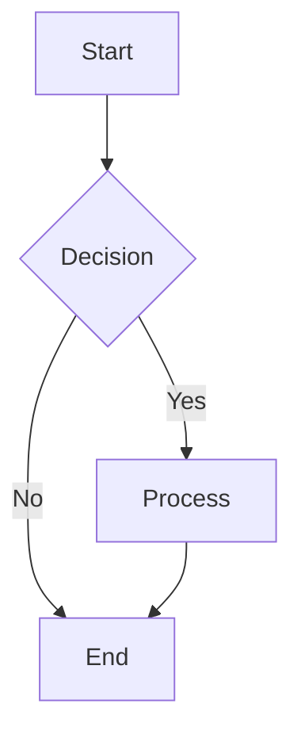

# PKC Landing Page
## Personal Knowledge Container (PKC) - Decentralized Communication System

A modern, **static-first, modular web application** with **serverless P2P communication capabilities** built entirely with browser-native WebRTC APIs. Features rich markdown documentation viewing, LaTeX math rendering, Mermaid diagrams, **interactive games**, and **zero-dependency peer-to-peer networking**.

---

## 🚀 **Core Features**

### **📡 Serverless P2P Communication**
- **Zero Dependencies**: Pure WebRTC APIs - no external servers or CDNs required
- **Browser-Native**: Direct peer-to-peer connections without signaling infrastructure
- **Manual Invitation Exchange**: URL/QR code-based peer discovery (truly serverless)
- **Cross-Device Support**: Connect phones, tablets, and computers on local network
- **End-to-End Encryption**: WebRTC provides transport encryption (DTLS)
- **Privacy-First**: No central servers tracking connections

### **📚 Rich Documentation Viewer**
- **Full Markdown Support**: Headers, lists, tables, code blocks, images, and links
- **LaTeX Math Rendering**: Mathematical equations using KaTeX (Obsidian-compatible)
- **Mermaid Diagrams**: Flowcharts, sequence diagrams, class diagrams, and more
- **Syntax Highlighting**: Code blocks with language-specific highlighting
- **3D Visualization**: Interactive 3D object rendering using Three.js and Anime.js by the **MCard Manager**

### **🎮 Interactive Games & Simulations**
- **Bali Adventure**: Explore the Ubud Rice Terraces in a React-based 2D RPG (`public/examples/games/play_ubud.html`)
- **3D Theater**: High-fidelity 3D visualization engine for viewing complex data structures
- **Music Visualizer V5**: Interactive music notation with 3D frequency visualization, Web Workers, and FileLoader caching (`public/examples/Music/SyncedMusicVisualizerV5.html`)
- **Morphism Cube**: Category theory recursion schemes visualized in 3D (`public/examples/3DGames/MorphismCube/`)
- **3D Object Viewer**: A dedicated 3D model viewer (Git Submodule) located at `public/examples/3DGames/3DObjectViewer`. Ensure submodules are initialized to use this feature.

### **🤖 AI Chatbot Panel**
- **Integrated AI Assistance**: Access external AI tools like ChatGPT, Claude, and Gemini directly within the interface.
- **Microphone Support**: Enabled `microphone` permission for iframe integrations, allowing voice interaction with supported chatbots.
- **Smart Fallback**: Automatically provides a direct link button for services that block iframe embedding (e.g., ChatGPT, Claude), ensuring users can always access their tools.

### **🏗️ Modular Architecture**
- **MCard Manager**: Advanced card management with IndexedDB persistence, handle support (`@welcome`), and **Duplications** detection (v11+).
- **Modular HTML**: `index.html` logic is fully modularized into dedicated ESM-ready scripts (`public/js/pwa-init.js`, `ui-inline-handlers.js`, etc.) while preserving external interfaces.
- **Auth-Gated CSP**: Production-ready Content Security Policy that defaults to strict rules and only enables `unsafe-eval` (required for Pyodide) after secure authentication (HttpOnly cookie).
- **Hybrid Execution**: Configurable CLM execution strategies (`auto`, `browser`, `server`) to balance performance and security.

### **⚡ Hybrid CLM Execution**
The system supports three execution modes for Cubical Logic Models:
1. **Auto (Default)**: Intelligently selects the best runtime. Prefers local browser execution via Pyodide/WebWorkers for privacy and offline support, falling back to server execution if resources are constrained.
2. **Browser (Local)**: Forces client-side execution using `mcard-js` and Pyodide. Fully offline-capable but requires `unsafe-eval` (auth-gated).
3. **Server (Remote)**: Offloads execution to the `/api/clm/execute` endpoint. Useful for low-power devices or when strict CSP blocks WASM/eval.

### **🧹 Automated Duplicate Management**
- **Smart Detection**: Detects duplicate-type MCards (`{"type": "duplicate"}`) via `BrowserContentTypeDetector`.
- **Batch Operations**: Quick removal of all duplicate entries to maintain a clean knowledge container.
- **Sidebar Integration**: Real-time count of duplicates with a distinct UI badge.

---

## 🧊 **CLM-Based Development Architecture**

This project is built on the **Cubic Logic Model (CLM)** - 三套東西 (Three Sets) principle. Every component, test, and feature follows the CLM structure:

### **Core Principle: mcard-js Integration**

The entire project is **served and run through mcard-js**, providing:

| Server | Port | Purpose |
|--------|------|---------|
| **Node WebSocket Server** | 3001 | HTTP + WebSocket + API endpoints (Configurable via .env) |
| **Express Static Server** | 3001 | Serves all static files and CLM components |
| **MCard Dev Server** | 4000 | Configurable dev server via `mcard-js` |

```bash
# Start the unified server (HTTP + WebSocket + CLM APIs)
node ws-server.js  # Serves on port 3000

# Start MCard-managed server (Integrated with serve.yaml)
./start-mcard-server.sh  # Default port 4000
```

### **CLM Component Structure**

Every CLM component follows the **Abstract → Concrete → Balanced** pattern:

```yaml
# Example from clm-registry.yaml
- hash: "youtube-viewer"
  name: "YouTube Video Viewer"
  abstract:
    context: "Video content presentation"
    goal: "Embed and control YouTube playback"
  concrete:
    implementation: "components/youtube-viewer.html"
    sandbox: "allow-scripts allow-same-origin"
  balanced:
    metrics_endpoint: "/metrics/youtube-viewer"
    expected_load_time_ms: 800
```

### **CLM-Driven Testing**

All tests are organized using CLM principles:

| Test Category | Purpose | CLM Alignment |
|---------------|---------|---------------|
| **Smoke Tests** (`tests/smoke/`) | Fast navigation validation | Abstract (goal verification) |
| **Component Tests** (`tests/components/`) | Isolated component testing | Concrete (implementation) |
| **Feature Tests** (`tests/features/`) | Deep feature validation | Balanced (metrics & outcomes) |

```bash
# Run tests by CLM category
npm run test:smoke       # Abstract - Does it load correctly?
npm run test:components  # Concrete - Does the implementation work?
npm run test:features    # Balanced - Does it meet performance metrics?
```

### **CLM Dashboard**

The CLM Dashboard (`/archive/html/index-clm-dashboard.html`) provides:

- **Registry Browser**: View all registered CLM components
- **Component Isolation**: Each component runs in its own iframe
- **Failure Containment**: Crashing components don't affect others
- **Performance Metrics**: Real-time component load time monitoring

### **Key CLM Endpoints**

| Endpoint | Purpose |
|----------|---------|
| `GET /api/clm/registry` | Returns all registered CLM components |
| `GET /api/clm/component/:id` | Returns specific component configuration |
| `GET /api/clm/health/:id` | Health check for component |
| `POST /api/clm/telemetry` | Receives component telemetry data |

---

## 🧠 **AI Project Synthesis & Architectural Commentary**

### **The Philosophy of Failure Containment**
The PKC Landing Page isn't just a website; it's a **resilient execution environment**. By adopting the **Cubic Logic Model (CLM)**, the project moves away from monolithic web design toward a "Micro-Frontend of Functions." Each component is treated as a mathematical transformation `f(goal, process) → output`. Isolation via iframes ensures that the "blast radius" of any specific failure (e.g., a heavy 3D game or a buggy external integration) is strictly limited, preserving the integrity of the host container.

### **Static-First, Decentralized-Always**
The pivot from `libp2p` to a **native WebRTC serverless model** represents a critical realization: true decentralization requires removing even the "hidden" centralization of bootstrap nodes. By leveraging manual invitation exchanges (URL/QR), PKC establishes a trust-based, zero-infrastructure network that thrives on local connectivity without sacrificing privacy.

### **The MCard Backbone**
The integration of `mcard-js` transforms the browser from a simple viewer into a professional knowledge manager. The hybrid detection system in `BrowserContentTypeDetector.js` bridges the gap between structured JSON data and binary media, allowing the container to "understand" its contents rather than just "storing" them. This creates a foundation for **Semantic Knowledge Containers** where the data defines the UI.

### **Evolutionary Trajectory**
The system is currently transitioning from a **passive listener** (basic indexing) to an **active organizer** (as seen in the Duplications Category). Future phases involving CRDT-based state synchronization and Gossip protocols will further solidify PKC as a robust alternative to centralized cloud silos.

---

## 🔄 **P2P Architecture Highlights**

### **Serverless Design Principles**
- ✅ **No Bootstrap Servers** - Uses STUN only for NAT traversal
- ✅ **No Signaling Servers** - Manual invitation exchange via URL/QR
- ✅ **No External Dependencies** - Pure browser WebRTC APIs
- ✅ **Zero Infrastructure** - Works offline between local peers
- ✅ **Privacy Preserving** - No central tracking or data collection

### **Connection Flow**
```
1. Peer A → Create Invitation (generates offer + ICE candidates)
2. Manual Exchange → Share invitation URL via QR code, messaging, email
3. Peer B → Accept Invitation (generates answer)
4. Manual Exchange → Send answer back to Peer A
5. Peer A → Complete Connection (apply answer)
6. ✅ Direct P2P connection established
```

### **Technical Specifications**
- **Bundle Size**: 20KB (vs 500KB+ for libp2p alternatives)
- **Connection Time**: 2-5 seconds (direct WebRTC)
- **Message Latency**: 10-50ms between connected peers
- **Max Peers**: 8 concurrent connections (recommended)
- **Browser Support**: Chrome 56+, Firefox 44+, Safari 11+

---

## 🎭 **3D Visualization & Theater**

The project includes a high-performance 3D visualization engine for viewing complex data structures and models.

### **Features**
- **Interactive Theater**: A dedicated environment for 3D object interaction (`public/examples/THREEJS_ANIMEJS/Theater_Example.html`)
- **Advanced Modeling**: High-fidelity representations including the **Causal Cone** (spacetime structure) and **PKC Box** within a Crystal Ball (nested transparency).
- **Data-Driven Objects**: 3D objects defined in JSON files (`data/objects/`) for easy extensibility
- **Real Satellite Textures**: Earth with 2K satellite imagery from Solar System Scope
- **Modular ESM Architecture**: Cleanly separated logic for scenes, objects, animations, and UI with built-in cache management.
- **Synthesized Audio**: Procedural MIDI-like music generated in real-time using Tone.js
- **Offline Support**: All vendor libraries (Three.js, Anime.js, Tone.js) hosted locally in `/js/vendor/`
- **Dynamic Lighting**: Interactive lighting presets (Neon, Sunset, Studio)
- **High Performance**: Optimized using Three.js R147 with WebGL acceleration

📁 **Project Structure**

```
├── README.md                          # This file
├── index.html                         # Modularized Landing Page
├── js/
│   ├── pkc-core.js                    # Module loader runtime
│   ├── execution/                     # 🆕 Execution Management
│   │   └── ExecutionModeManager.js    # Hybrid execution toggle logic
│   ├── renderers/
│   │   ├── CLMRenderer.js             # CLM Visualization & Execution UI
│   │   └── ServerCLMRunner.js         # Remote execution client
│   └── modules/
│       ├── markdown-renderer/         # Documentation viewer module
│       ├── net-gateway/               # WebSocket demo module
│       └── p2p-serverless/            # Serverless P2P module
├── public/
│   ├── js/                            # 🆕 Modular App Scripts
│   │   ├── app-bootstrap.js           # Main application entry
│   │   ├── pwa-init.js                # PWA, Service Worker & View Toggles
│   │   ├── ui-inline-handlers.js      # Sidebar & Search UI Logic
│   │   ├── env-shim.js                # Process.env polyfill
│   │   ├── importmap-init.js          # Dynamic Import Map generator
│   │   └── mcard/                     # MCard Core System
│   │       ├── MCardManager.js        # Core logic (via mcard-js)
│   │       ├── BrowserCLMRunner.js    # Local Pyodide runner
│   │       └── ...
│   ├── examples/                      # Interactive Demos
├── docs/                              # 📚 Comprehensive documentation
│   ├── architecture-serverless-p2p.md    # P2P system architecture
│   ├── p2p-serverless-implementation.md  # Implementation details
│   ├── p2p-testing-guide.md              # Testing instructions
│   ├── p2p-bug-fix-peer-id.md           # Bug fix documentation
│   ├── cleanup-libp2p-migration.md      # Migration guide
│   └── archive/                          # Historical implementations
├── modules.json                        # Module configuration
├── MODULES.md                          # Module system documentation
├── nginx-pkc.conf                      # Nginx server configuration
├── pkc-docs/                           # Documentation files
├── examples/                           # Interactive demos
│   └── THREEJS_ANIMEJS/
│       └── Theater_Example.html         # 🎭 3D Theater Example
└── ...
```

### **Git Submodules**
This project uses Git submodules to manage large external components.
- **3DObjectViewer**: Located at `public/examples/3DGames/3DObjectViewer`. This is a standalone project maintained at `github.com/xlp0/3DObjectViewer` and included here to provide advanced 3D model viewing capabilities without bloating the main repository history.

---

## 🛠️ **Quick Start**

### **1. Basic Setup**
```bash
# Clone repository with submodules (recommended)
git clone --recursive https://github.com/xlp0/LandingPage.git
cd LandingPage

# If you already cloned without --recursive:
# git submodule update --init --recursive

# Start MCard HTTP server with mcard-js integration (recommended)
./start-mcard-server.sh

# Or use Python HTTP server (basic features only)
python3 -m http.server 8000 --bind 0.0.0.0

# Or for local network access (all devices on WiFi)
python3 -m http.server 8000 --bind 0.0.0.0
```

### **2. Access Application**
- **Landing Page**: `http://localhost:4000` (with mcard-js) or `http://localhost:8000` (Python)
- **MCard Manager**: `http://localhost:4000/index.html` - Main interface with Apps navigation
- **Apps Navigation**: Click "Apps" in sidebar to access:
  - Calendar, Map, 3D Viewer
  - Music Visualizer V5
  - Morphism Cube v1 & v2
- **P2P Demo**: `http://localhost:8000/js/modules/p2p-serverless/example.html`
- **Bali Adventure**: `http://localhost:8000/public/examples/games/play_ubud.html`
- **Documentation**: `http://localhost:8000/pkc-docs-index.html`

### **3. Test P2P (2 Devices)**
1. Open P2P demo on two devices (same WiFi network)
2. **Device 1**: Click "Create Invitation" → Copy invitation code
3. **Device 2**: Click "Accept Invitation" → Paste code → Copy answer
4. **Device 1**: Click "Complete Connection" → Paste answer
5. ✅ **Connected!** Send messages between devices instantly

---

## 🔧 **P2P Configuration**

### **Application-level configuration (app-config.json)**
The application reads runtime settings from `/app-config.json`. Use this file to configure WebRTC/P2P and other app knobs without changing code.

Example:

```json
{
  "wsHost": "192.168.1.139",
  "wsPort": 3001,
  "wsPath": "/ws/",
  "p2p": {
    "iceServers": [
      { "urls": "stun:stun.l.google.com:19302" },
      { "urls": "stun:stun1.l.google.com:19302" }
    ]
  }
}
```

How it’s loaded:
- `js/modules/p2p-serverless/config.js` fetches `/app-config.json` (no-cache) and resolves effective config via `resolveP2PConfig()`.
- Precedence (highest first): module init overrides → `app-config.json` → built‑in defaults.
- Add TURN servers here if your environment requires relaying.

See also:
- `js/modules/p2p-serverless/README.md` (module-level details)
- `tests/README.md` (why config matters for e2e)

### **Module Configuration** (`modules.json`)
```json
{
  "modules": [
    {
      "id": "p2p-serverless",
      "entry": "/js/modules/p2p-serverless/index.js",
      "enabled": true,
      "when": "webrtc",
      "config": {
        "iceServers": [ /* optional override; prefer app-config.json */ ],
        "channelName": "pkc-p2p-discovery",
        "invitationTTL": 300000
      }
    }
  ]
}
```

### **Capability Detection**
- `webrtc`: WebRTC support (required for P2P)
- `websocket`: WebSocket support (optional)
- `storage.idb`: IndexedDB support (optional)

---

## 🌐 **Server Options**

### **Development Servers**
```bash
# Python (recommended for development)
python3 -m http.server 8000 --bind 0.0.0.0

# Node.js
npx serve . -p 8000

# PHP (built-in)
php -S localhost:8000
```

### **Production Deployment**
- **Static Hosting**: GitHub Pages, Netlify, Vercel, S3
- **CDN**: Cloudflare, Fastly
- **Traditional**: Nginx, Apache, IIS

### **Local Network Access**
```bash
# Allow all network interfaces
python3 -m http.server 8000 --bind 0.0.0.0

# Access from other devices: http://YOUR_LOCAL_IP:8000
```

---

## 📖 **MCard Architecture & Usage**

### **Architecture Overhaul (v2)**
The MCard system has been rebuilt to rely on the robust `mcard-js` library for core operations while upgrading specific browser behaviors:
- **`MCardManager.js`**: Now orchestrated via `mcard-js`'s `CardCollection` and `IndexedDBEngine`, ensuring reliable persistence and querying.
- **`BrowserContentTypeDetector.js`**: A hybrid detection system that combines library-standard MIME detection with a custom "Expanded Binary" detector for audio/video formats (MP4, FLAC, MKV, etc.) and specific CLM text patterns.
- **Handle Support**: Native support for friendly names (`@welcome`, `@readme`) alongside content-addressed hashes.

### **Demo MCard Imports (central configuration)**

The MCard Manager ships with a small set of demo/default cards that are **loaded from static files** rather than being embedded (hard-coded) inside JavaScript.

The single source of truth for *what gets imported* (manifest + directory scans) is:
- `public/js/mcard/DemoMCardImportSources.js`

By default, it imports from:
- `public/data/demo/manifest.json` (curated demo items + their `@handle` names)
- `public/data/` (recursive scan for additional content)
- `public/assets/videos/` (video scan for default video MCards)

This approach is intentionally preferred over keeping demo data as hard-coded strings/blobs in JavaScript because it:
- Keeps **content separate from code** (easier review and iteration)
- Avoids code churn when demo content changes
- Makes it easy to add/replace demo content by dropping files into `public/` and adjusting the central import config
- Works naturally with static hosting/CDNs and browser caching

Overrides:
- `MCARD_DEMO_IMPORT_SOURCES` (JSON array) can override the default sources.
  - In localhost development, `DemoMCardImportSources.js` will attempt to read it from `/.env`.
  - In production/static hosting, prefer setting it via `app-config.json` as `mcardDemoImportSources`.

Notes:
- Manifest paths are resolved under `/public/` (for example `data/demo/welcome.md` maps to `/public/data/demo/welcome.md`).
- The demo includes a `@pkc-box-demo` asset using `.webp`. WebP is treated as an **image** in the UI; if the WebP is animated, it will **animate as an animated image** when rendered in the browser.

### **P2P Communication**
```javascript
// Get P2P module
const p2p = await window.pkc.modules['p2p-serverless'];

// Create invitation
const invitation = await p2p.createInvitation();
console.log('Share this URL:', invitation.url);

// Accept invitation (from another peer)
await p2p.acceptInvitation(invitationUrl);

// Send messages
p2p.broadcast({ type: 'chat', message: 'Hello everyone!' });

// Listen for messages
p2p.onMessage(({ peerId, data }) => {
  console.log('Message from', peerId, ':', data);
});
```

### **Documentation Viewing**
1. Navigate to `pkc-docs-index.html`
2. Click any document card
3. View rich markdown with LaTeX math and Mermaid diagrams
4. Use "Back to Index" to return

---

## 🧮 **LaTeX Math Support**

Obsidian-compatible LaTeX syntax:

### **Inline Math**
```markdown
Einstein's formula: $E = mc^2$
```

### **Display Math**
```markdown
$$
\text{Attention}(Q, K, V) = \text{softmax}\left(\frac{QK^T}{\sqrt{d_k}}\right) \times V
$$
```

### **Supported Features**
- Greek letters: `$\alpha, \beta, \gamma$`
- Fractions: `$\frac{a}{b}$`
- Integrals: `$\int_0^\infty f(x) dx$`
- Matrices: `$\begin{bmatrix} a & b \\ c & d \end{bmatrix}$`

---

## 📊 **Mermaid Diagrams**

All Mermaid diagram types supported:



---

## 🔄 **P2P vs Traditional Systems**

| Feature | PKC Serverless | Traditional P2P | Client-Server |
|---------|----------------|-----------------|---------------|
| **Server Dependencies** | ❌ Zero | ❌ Zero | ✅ Required |
| **External Libraries** | ❌ Zero | ✅ Many | ✅ Many |
| **Bundle Size** | 20KB | 500KB+ | N/A |
| **Connection Setup** | Manual | DHT/Auto | N/A |
| **Privacy** | ✅ High | ⚠️ Medium | ❌ Low |
| **Offline Support** | ✅ Full | ✅ Full | ❌ None |
| **Infrastructure Cost** | $0 | $0 | $$$ |
| **Complexity** | Low | High | High |

---

## 🌐 **Browser Compatibility**

### **P2P Features**
- ✅ Chrome/Edge 56+ (full support)
- ✅ Firefox 44+ (full support)
- ✅ Safari 11+ (full support)
- ⚠️ Mobile Safari (works, some limitations)

### **Documentation Viewer**
- ✅ Chrome/Edge (recommended)
- ✅ Firefox
- ✅ Safari
- ✅ Opera

---

## 📚 **Documentation**

### **P2P System**
- **`docs/architecture-serverless-p2p.md`** - Complete system architecture
- **`docs/p2p-serverless-implementation.md`** - Implementation details
- **`docs/p2p-testing-guide.md`** - Testing instructions
- **`js/modules/p2p-serverless/README.md`** - API reference

### **Project Documentation**
- **`PKC-DOCS-README.md`** - Comprehensive project documentation
- **`MODULES.md`** - Module system guide
- **`LATEX-SUPPORT-SUMMARY.md`** - LaTeX implementation details

### **Historical**
- **`docs/archive/p2p-libp2p-old-2025-11-07/`** - Previous libp2p implementation
- **`docs/cleanup-libp2p-migration.md`** - Migration documentation

---

## 🤝 **Contributing**

### **P2P Module Development**
1. The P2P system is modular and extensible
2. See `js/modules/p2p-serverless/README.md` for API details
3. Test changes using the provided example pages

### **General Development**
1. Fork the repository
2. Create a feature branch
3. Make your changes
4. Test thoroughly (especially P2P functionality)
5. Submit a pull request

---

## 📊 **Project Stats**

- **Lines of Code**: ~4,500+ lines (including docs + new game examples)
- **Modules**: 3 active (markdown-renderer, net-gateway, p2p-serverless)
- **P2P Bundle Size**: 20KB (uncompressed)
- **Libraries**: Pure browser APIs (WebRTC, BroadcastChannel, etc.)
- **Browser Support**: Modern browsers (2016+)
- **Server Options**: 4+ (Python, Node.js, Nginx, IIS, static hosting)
- **Documentation**: 1,800+ lines across 8 docs
- **Automated Tests**: P2P Connectivity, Music Visualizer, Landing Page Features (Playwright)
- **Last Updated**: January 2026

---

## 🚀 **Live Demo**

### **Quick Demo**
```bash
# Start server
python3 -m http.server 8000 --bind 0.0.0.0

# Access from any device on your network:
# Landing Page: http://YOUR_LOCAL_IP:8000
# P2P Demo: http://YOUR_LOCAL_IP:8000/js/modules/p2p-serverless/example.html
# Bali Game: http://YOUR_LOCAL_IP:8000/public/examples/games/play_ubud.html
```

### **P2P Testing**
1. Open demo on two devices (phone + computer)
2. Connect using invitation codes
3. Send messages between devices
4. Experience true peer-to-peer communication!

---

## 🔒 **Security & Privacy**

### **P2P Security**
- **Transport Encryption**: WebRTC DTLS encryption
- **No Central Servers**: No single point of failure or tracking
- **Manual Peer Verification**: Users control who they connect to
- **Privacy-First**: No telemetry or external data collection

### **Web Security**
- **HTTPS Recommended**: Required for full WebRTC functionality
- **CSP Headers**: Security headers configured in nginx
- **No External Dependencies**: Reduces attack surface
- **Static Content**: No server-side processing

---

## 🧪 **Testing**

The project includes a comprehensive Playwright E2E test suite.

### Quick Start

```bash
# Start WebSocket server (required)
node ws-server.js

# Run all tests
npx playwright test --project=chromium

# Run CLM Dashboard tests only
npx playwright test tests/test-clm-*.spec.cjs --project=chromium

# View HTML report
npx playwright show-report
```

### Test Coverage

| Category | Tests | Description |
|----------|-------|-------------|
| CLM Dashboard | 18+ | Component loading, iframe isolation, performance |
| Landing Page | 6 | PWA modal, sidebar, app views, chat panel |
| Music Visualizer | 5+ | Audio playback, sync, timer display |

### Documentation

For detailed test documentation including:
- Complete test file reference
- Selector patterns and wait strategies
- Recent fixes and technical details
- Contribution guidelines

See **[tests/TEST_DOCUMENTATION.md](tests/TEST_DOCUMENTATION.md)**

---

## 📄 **License**

This project is provided as-is for exploring PKC design concepts and serverless P2P communication.

---

## 🎯 **Architecture Evolution**

### **Phase 1: ✅ Complete**
- Serverless P2P foundation
- WebRTC connection management
- Manual invitation exchange
- Basic messaging
- Documentation and testing

### **Phase 2: Mesh Networking** (Future)
- Multi-peer topologies
- Gossip protocol routing
- Automatic peer discovery
- Network optimization

### **Phase 3: State Synchronization** (Future)
- CRDT integration
- Shared document editing
- Conflict resolution
- Persistence layers

### **Phase 4: Advanced Security** (Future)
- End-to-end encryption
- Peer authentication
- Message signing
- Rate limiting

---

## 🐛 **Recent Bug Fixes**

### **January 2026**
- **Fixed Apps dropdown in CardTypes sidebar** - The Apps category dropdown was not responding to clicks. Root cause: `viewManager` singleton was created but not exposed to `window`, causing `window.viewManager.toggleSubmenu('apps')` to fail silently. Fix: Added `window.viewManager = viewManager;` in `public/js/ViewManager.js`.
- **Removed Hardcoded WebSocket Port** - Replaced legacy hardcoded port `5321` in `ServerCLMRunner.js` with dynamic port detection (`window.location.port`), defaulting to `3000`. This ensures the client correctly connects to the actual server port (e.g., `3001` in dev) instead of failing to connect to a non-existent service.


---

**Built with ❤️ for decentralized communication and personal knowledge management**

**PKC Landing Page** - Where static meets dynamic, and centralized meets decentralized.
