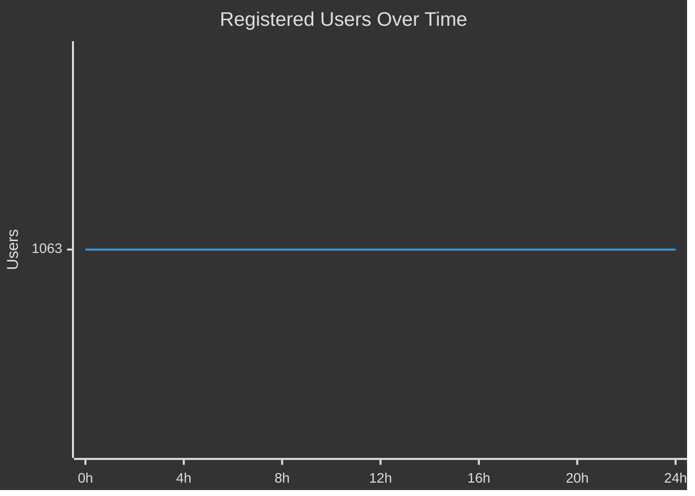
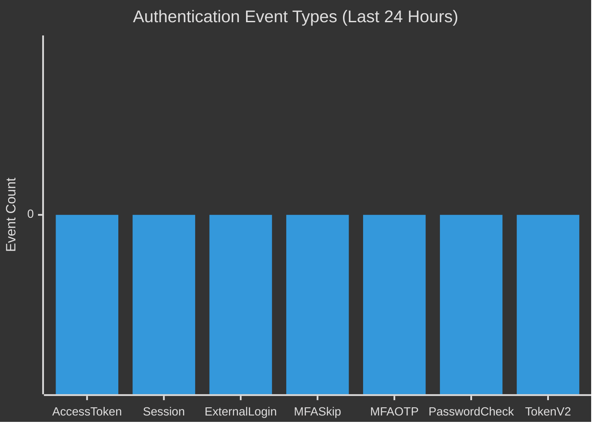
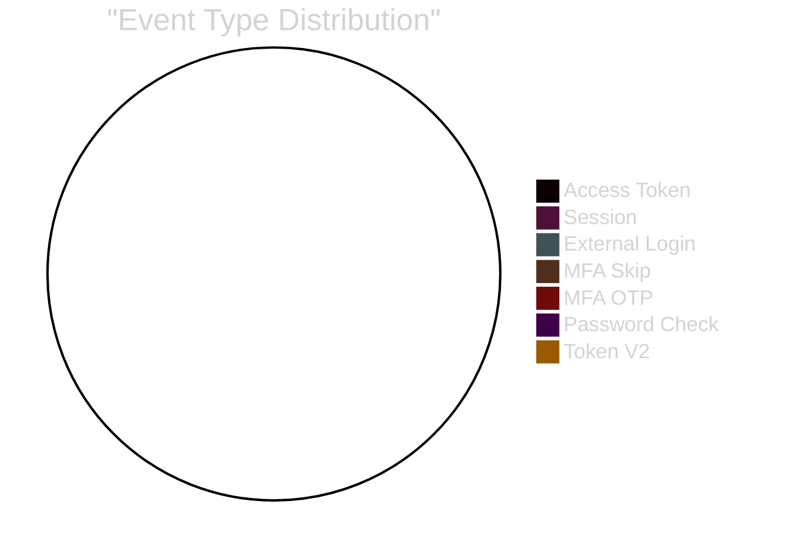

# ZITADEL Metrics Report

**Report Date:** 2026-01-15  
**Time Range:** 24h  
**Data Source:** ZITADEL Prometheus Metrics

---

## Total Users

### User Trend (Last 24 Hours)

---

## Authentication Events

### Event Distribution

### Event Details

| Event Type | Count | Description |
|------------|-------|-------------|
| **oidc_session.access_token.added** | 0 | OAuth access tokens issued |
| **oidc_session.added** | 0 | New sessions created |
| **user.human.externallogin.check.succeeded** | 0 | External IDP login success |
| **user.human.mfa.init.skipped** | 0 | MFA initialization skipped |
| **user.human.mfa.otp.added** | 0 | MFA OTP configured |
| **user.human.password.check.succeeded** | 0 | Password authentication success |
| **user.token.v2.added** | 0 | API tokens created |

### Event Breakdown

---

## Summary

### Key Metrics

| Metric | Value |
|--------|-------|
| **Total Users** | 1.06k |
| **Total Events (24h)** | 0 |
| **Most Common Event** | No events recorded |
| **Data Points Collected** | 1441 |

### Timeline

```mermaid
%%{init: {'theme':'dark'}}%%
gantt
    title Event Activity Timeline (Last 24 Hours)
    dateFormat HH:mm
    axisFormat %H:%M
    
    section Authentication
    Access Token Events    :done, t1, 00:00, 24h
    Session Events         :done, t2, 00:00, 24h
    External Login Events  :active, t3, 00:00, 24h
    MFA Events            :active, t4, 00:00, 24h
    Password Events       :crit, t5, 00:00, 24h
    Token Events          :done, t6, 00:00, 24h
```

---

## Notes

- **Collection Period:** 2026-01-14 10:53 to 2026-01-15 10:53
- **Data Source:** Prometheus via Grafana API
- **Storage:** MinIO bucket `pkc/grafana-metrics/2026-01-15/`