# ZITADEL Metrics Report

**Report Date:** {{date}}  
**Time Range:** {{time_range}}  
**Data Source:** ZITADEL Prometheus Metrics

---

## Total Users

```mermaid
%%{init: {'theme':'dark'}}%%
graph TD
    A[Total Registered Users<br/><b>{{total_users}}</b>]
    
    style A fill:#2d5016,stroke:#4ade80,stroke-width:3px,color:#fff,font-size:18px
```

### User Trend (Last 24 Hours)

```mermaid
%%{init: {'theme':'dark'}}%%
xychart-beta
    title "Registered Users Over Time (Hourly)"
    x-axis [0h, 1h, 2h, 3h, 4h, 5h, 6h, 7h, 8h, 9h, 10h, 11h, 12h, 13h, 14h, 15h, 16h, 17h, 18h, 19h, 20h, 21h, 22h, 23h]
    y-axis "Users"
    line [{{user_trend_data}}]
```

---

## Authentication Events

### Event Distribution

```mermaid
%%{init: {'theme':'dark'}}%%
xychart-beta
    title "Authentication Event Types (Last 24 Hours)"
    x-axis [Access Token, Session, External Login, MFA Skip, MFA OTP, Password Check, Token V2]
    y-axis "Event Count"
    bar [{{event_counts}}]
```

### Event Details

| Event Type | Count | Description |
|------------|-------|-------------|
| **oidc_session.access_token.added** | {{event_access_token}} | OAuth access tokens issued |
| **oidc_session.added** | {{event_session}} | New sessions created |
| **user.human.externallogin.check.succeeded** | {{event_external_login}} | External IDP login success |
| **user.human.mfa.init.skipped** | {{event_mfa_skip}} | MFA initialization skipped |
| **user.human.mfa.otp.added** | {{event_mfa_otp}} | MFA OTP configured |
| **user.human.password.check.succeeded** | {{event_password}} | Password authentication success |
| **user.token.v2.added** | {{event_token_v2}} | API tokens created |

### Event Breakdown


---

## Summary

### Key Metrics

| Metric | Value |
|--------|-------|
| **Total Users** | {{total_users}} |
| **Total Events (24h)** | {{total_events}} |
| **Most Common Event** | {{most_common_event}} |
| **Data Points Collected** | {{data_points}} |

### Timeline

```mermaid
%%{init: {'theme':'dark'}}%%
gantt
    title Event Activity Timeline (Last 24 Hours)
    dateFormat HH:mm
    axisFormat %H:%M
    
    section Authentication
    Access Token Events    :done, t1, 00:00, 24h
    Session Events         :done, t2, 00:00, 24h
    External Login Events  :active, t3, 00:00, 24h
    MFA Events            :active, t4, 00:00, 24h
    Password Events       :crit, t5, 00:00, 24h
    Token Events          :done, t6, 00:00, 24h
```



---

## Notes

- **Collection Period:** {{start_time}} to {{end_time}}
- **Data Source:** Prometheus via Grafana API
- **Storage:** MinIO bucket `pkc/grafana-metrics/{{date}}/`