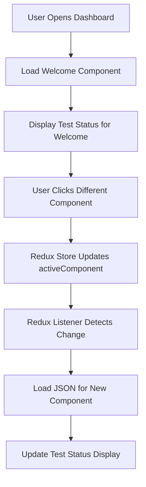
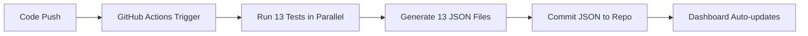

# CLM Multi-Component Testing System

## 📋 Overview

Sistem testing lengkap untuk semua 13 komponen CLM (Cubic Logic Model) dengan Playwright dan GitHub Actions. Setiap komponen memiliki test terpisah, workflow terpisah, dan JSON hasil test terpisah.

**Dashboard secara otomatis menampilkan status testing dari komponen yang sedang aktif/dibuka.**

---

## 🎯 Key Features

1. **13 Independent Tests** - Setiap komponen punya Playwright test sendiri
2. **Parallel Execution** - Semua tests berjalan parallel di GitHub Actions
3. **Individual JSON Results** - Setiap komponen punya file JSON hasil test sendiri
4. **Dynamic Status Display** - Dashboard otomatis update status saat user klik komponen
5. **Real-time Updates** - Status diupdate via Redux store listener
6. **Auto-refresh** - Test status di-refresh setiap 5 menit

---

## 📊 Component List (13 Total)

| Hash | Name | Test File | JSON File |
|------|------|-----------|-----------|
| `welcome` | Welcome Component | `test-clm-welcome.spec.js` | `welcome.json` |
| `hero-content` | Hero Content | `test-clm-hero-content.spec.js` | `hero-content.json` |
| `p2p-status` | P2P Status Panel | `test-clm-p2p-status.spec.js` | `p2p-status.json` |
| `crash-test` | Intentional Failure Component | `test-clm-crash-test.spec.js` | `crash-test.json` |
| `wikipedia-viewer` | Wikipedia Knowledge Base | `test-clm-wikipedia-viewer.spec.js` | `wikipedia-viewer.json` |
| `user-list` | User Account List | `test-clm-user-list.spec.js` | `user-list.json` |
| `user-detail` | User Account Detail | `test-clm-user-detail.spec.js` | `user-detail.json` |
| `redux-state-viewer` | Redux Store Monitor | `test-clm-redux-state-viewer.spec.js` | `redux-state-viewer.json` |
| `wikipedia-search` | Wikipedia Search | `test-clm-wikipedia-search.spec.js` | `wikipedia-search.json` |
| `external-site-demo` | External Website Demo | `test-clm-external-site-demo.spec.js` | `external-site-demo.json` |
| `google-maps` | Google Maps | `test-clm-google-maps.spec.js` | `google-maps.json` |
| `pkc-viewer` | PKC Document Viewer | `test-clm-pkc-viewer.spec.js` | `pkc-viewer.json` |
| `grafana-faro` | Grafana Faro | `test-clm-grafana-faro.spec.js` | `grafana-faro.json` |

---

## 🏗️ Architecture

### File Structure

```
LandingPage/
├── tests/
│   ├── test-clm-welcome.spec.js                    # Test untuk welcome
│   ├── test-clm-hero-content.spec.js               # Test untuk hero-content
│   ├── test-clm-p2p-status.spec.js                 # Test untuk p2p-status
│   ├── test-clm-crash-test.spec.js                 # Test untuk crash-test
│   ├── test-clm-wikipedia-viewer.spec.js           # Test untuk wikipedia-viewer
│   ├── test-clm-user-list.spec.js                  # Test untuk user-list
│   ├── test-clm-user-detail.spec.js                # Test untuk user-detail
│   ├── test-clm-redux-state-viewer.spec.js         # Test untuk redux-state-viewer
│   ├── test-clm-wikipedia-search.spec.js           # Test untuk wikipedia-search
│   ├── test-clm-external-site-demo.spec.js         # Test untuk external-site-demo
│   ├── test-clm-google-maps.spec.js                # Test untuk google-maps
│   ├── test-clm-pkc-viewer.spec.js                 # Test untuk pkc-viewer
│   ├── test-clm-grafana-faro.spec.js               # Test untuk grafana-faro
│   └── test-components/
│       ├── welcome.json                             # Hasil test welcome
│       ├── hero-content.json                        # Hasil test hero-content
│       ├── p2p-status.json                          # Hasil test p2p-status
│       ├── crash-test.json                          # Hasil test crash-test
│       ├── wikipedia-viewer.json                    # Hasil test wikipedia-viewer
│       ├── user-list.json                           # Hasil test user-list
│       ├── user-detail.json                         # Hasil test user-detail
│       ├── redux-state-viewer.json                  # Hasil test redux-state-viewer
│       ├── wikipedia-search.json                    # Hasil test wikipedia-search
│       ├── external-site-demo.json                  # Hasil test external-site-demo
│       ├── google-maps.json                         # Hasil test google-maps
│       ├── pkc-viewer.json                          # Hasil test pkc-viewer
│       └── grafana-faro.json                        # Hasil test grafana-faro
├── .github/workflows/
│   └── clm-test-all-components.yml                  # Master workflow (matrix strategy)
├── index.html                                       # Dashboard dengan dynamic test status
└── clm-registry.yaml                                # Component registry
```

---

## 🔄 How It Works

### 1. User Interaction Flow



### 2. Testing Flow



---

## 🚀 GitHub Actions Workflow

### Matrix Strategy

File: `.github/workflows/clm-test-all-components.yml`

```yaml
strategy:
  fail-fast: false
  matrix:
    component:
      - { hash: "welcome", name: "Welcome Component" }
      - { hash: "hero-content", name: "Hero Content" }
      - { hash: "p2p-status", name: "P2P Status Panel" }
      # ... 10 more components
```

### Workflow Steps (Per Component)

1. **Setup Environment**
   - Checkout code
   - Setup Node.js 18
   - Install Playwright + Docker Compose

2. **Start Services**
   - Start Docker Compose with unique project name
   - Wait for app ready (http://localhost:8765)

3. **Run Test**
   - Execute Playwright test for specific component
   - Continue even if test fails

4. **Save Results**
   - Generate JSON file with test results
   - Include: hash, name, timestamp, test_run, status, URL, commit, branch, actor

5. **Commit & Push**
   - Git commit JSON file
   - Push to repository

6. **Upload Artifacts**
   - Upload screenshots
   - 7 days retention

7. **Cleanup**
   - Stop Docker services

---

## 📝 JSON Result Format

```json
{
  "hash": "welcome",
  "name": "Welcome Component",
  "timestamp": "2025-12-03T05:00:00Z",
  "test_run": 5,
  "status": "success",
  "github_actions_url": "https://github.com/xlp0/LandingPage/actions/runs/123456",
  "commit_sha": "abc123def456",
  "branch": "main",
  "actor": "username"
}
```

### Fields

| Field | Type | Description |
|-------|------|-------------|
| `hash` | string | Component hash (unique ID) |
| `name` | string | Human-readable component name |
| `timestamp` | string | ISO 8601 timestamp (UTC) |
| `test_run` | number | GitHub run number |
| `status` | string | "success" or "failure" |
| `github_actions_url` | string | Full URL to GitHub Actions run |
| `commit_sha` | string | Git commit SHA |
| `branch` | string | Git branch name |
| `actor` | string | GitHub username |

---

## 💻 Dynamic Status Display (index.html)

### JavaScript Implementation

#### 1. Global State Tracking

```javascript
// Track current active component
window.currentComponentHash = 'welcome';
```

#### 2. Dynamic Loading Function

```javascript
async function loadTestStatus(componentHash) {
  // Load JSON for specific component
  const response = await fetch(`/tests/test-components/${componentHash}.json`);
  const testData = await response.json();
  
  // Update UI elements
  updateTestRunBadge(testData);
  updateStatusText(testData);
  updateGitHubLink(testData);
}
```

#### 3. Redux Store Listener

```javascript
window.reduxStore.subscribe(() => {
  const state = window.reduxStore.getState();
  const currentHash = state.clm?.activeComponent;
  
  if (currentHash && currentHash !== previousComponentHash) {
    previousComponentHash = currentHash;
    window.currentComponentHash = currentHash;
    loadTestStatus(currentHash);  // Load new component's test status
  }
});
```

#### 4. PostMessage Listener (Backup)

```javascript
window.addEventListener('message', (event) => {
  if (event.data.type === 'clm_component_loaded') {
    const componentHash = event.data.componentId;
    loadTestStatus(componentHash);
  }
});
```

#### 5. Auto-refresh

```javascript
// Refresh every 5 minutes for current component
setInterval(() => {
  loadTestStatus(window.currentComponentHash);
}, 5 * 60 * 1000);
```

---

## 🎨 UI Components

### Dashboard Header Layout

```
┌────────────────────────────────────────────────────────────────┐
│ 🏢 CLM Dashboard [SINGLE VIEW] [3rd testing]                  │
│                                                                 │
│     Latest Test: Success    [View GitHub Actions]              │
│                                                      🔐 Login   │
└────────────────────────────────────────────────────────────────┘
```

### Dynamic Updates

When user clicks "Hero Content" component:

```
Before:
[SINGLE VIEW] [3rd testing] - Latest Test: Success (welcome)

After:
[SINGLE VIEW] [5th testing] - Latest Test: Error (hero-content)
```

---

## 🧪 Running Tests

### Run All Tests Locally

```bash
# Start services
docker-compose -f github-actions-docker-compose.yml up -d

# Run all tests
npx playwright test tests/test-clm-*.spec.js

# Stop services
docker-compose down -v
```

### Run Specific Component Test

```bash
# Test welcome component
npx playwright test tests/test-clm-welcome.spec.js

# Test hero-content component
npx playwright test tests/test-clm-hero-content.spec.js

# Test with UI mode
npx playwright test tests/test-clm-pkc-viewer.spec.js --ui
```

### Trigger GitHub Actions

**Automatic**:
- Push to `main` or `develop` branch
- Create Pull Request

**Manual**:
1. Go to GitHub → Actions
2. Select "CLM Test - All Components"
3. Click "Run workflow"

---

## 📊 Monitoring & Observability

### Test Results Dashboard

Access test results:
1. **Live Dashboard**: http://localhost:8765 (or production URL)
2. **GitHub Actions**: Repository → Actions tab
3. **JSON Files**: `tests/test-components/{component}.json`

### Test Status Indicators

| Status | Color | Badge | Display |
|--------|-------|-------|---------|
| Success | Green | `rgba(46, 204, 113, 0.3)` | `Latest Test: Success` |
| Failure | Red | `rgba(231, 76, 60, 0.3)` | `Latest Test: Error` |
| Unknown | Gray | `rgba(255, 255, 255, 0.3)` | `No test data available` |

---

## 🔧 Troubleshooting

### Component Test Status Not Updating

**Problem**: Status doesn't change when clicking different components

**Solution**:
1. Check browser console for errors
2. Verify Redux store is available: `console.log(window.reduxStore)`
3. Check component hash matches JSON filename
4. Verify JSON file exists: `curl http://localhost:8765/tests/test-components/{hash}.json`

### Test Fails in GitHub Actions

**Problem**: Test passes locally but fails in CI

**Solution**:
1. Check Docker Compose logs
2. Verify app starts within timeout (120s)
3. Check for timing issues (increase `waitForTimeout`)
4. Review screenshots in artifacts

### JSON File Not Committed

**Problem**: Test runs but JSON file doesn't appear in repository

**Solution**:
1. Verify GitHub Actions has write permissions
2. Check branch protection rules allow bot commits
3. Review workflow logs for commit/push errors

---

## 📈 Performance

### Parallel Execution

- **13 tests run simultaneously** in GitHub Actions
- Each test isolated in separate Docker environment
- Average test time: **2-3 minutes per component**
- Total workflow time: **~5 minutes** (vs. 30+ minutes sequential)

### Resource Usage

- **Memory**: ~4GB per test container
- **CPU**: 2 cores per test
- **Disk**: ~500MB per test (including screenshots)

---

## 🚦 Best Practices

### 1. Test Independence

✅ **DO**:
- Each test should work independently
- No shared state between tests
- Clean Docker environment per test

❌ **DON'T**:
- Depend on other tests running first
- Share test data files
- Rely on specific test execution order

### 2. Timing & Waits

✅ **DO**:
- Use `waitForLoadState('networkidle')`
- Add reasonable timeouts (2-3s after clicks)
- Use `expect().toBeVisible({ timeout: 10000 })`

❌ **DON'T**:
- Use fixed `sleep()` without reason
- Set very short timeouts
- Assume instant component loading

### 3. JSON Result Management

✅ **DO**:
- Always commit JSON after test
- Include full test context in JSON
- Use ISO 8601 timestamps

❌ **DON'T**:
- Manually edit JSON files
- Delete JSON files
- Change JSON structure

---

## 🔮 Future Enhancements

### 1. Test Coverage Report

```javascript
// Generate coverage report for all components
const coverage = {
  total: 13,
  passed: 11,
  failed: 2,
  coverage: "84.6%"
};
```

### 2. Historical Trend Chart

```javascript
// Show test status trend over time
const trends = loadTestHistory('welcome');
renderLineChart(trends);
```

### 3. Performance Benchmarks

```javascript
// Track component load time trends
{
  "welcome": {
    "expected": 500,
    "actual": 450,
    "trend": "improving"
  }
}
```

### 4. Slack/Discord Notifications

```yaml
- name: Notify on failure
  if: failure()
  uses: 8398a7/action-slack@v3
  with:
    status: ${{ job.status }}
    text: 'CLM Test failed for ${{ matrix.component.name }}'
```

### 5. Visual Regression Testing

```javascript
// Compare screenshots between runs
await expect(page).toHaveScreenshot('hero-content.png');
```

---

## 📚 Related Documentation

- [CLM Testing System](./CLM_TESTING_SYSTEM.md) - Original single-component testing
- [CLM Testing UI Update](./CLM_TESTING_UI_UPDATE.md) - UI changes documentation
- [CLM Registry](../clm-registry.yaml) - Component definitions
- [Playwright Docs](https://playwright.dev) - Playwright documentation
- [GitHub Actions Docs](https://docs.github.com/actions) - GitHub Actions guide

---

## 🎓 Quick Reference

### Run Specific Test
```bash
npx playwright test tests/test-clm-{component-hash}.spec.js
```

### View JSON Results
```bash
cat tests/test-components/{component-hash}.json
```

### Force Test Status Reload
```javascript
// In browser console
loadTestStatus('welcome');
```

### Check Current Component
```javascript
// In browser console
console.log(window.currentComponentHash);
```

---

## 📊 Summary

- ✅ **13 Playwright tests** - One per component
- ✅ **13 JSON result files** - Individual test results
- ✅ **1 GitHub Actions workflow** - Matrix strategy for parallel execution
- ✅ **Dynamic status display** - Updates based on active component
- ✅ **Redux integration** - Listens to component changes
- ✅ **Auto-refresh** - Updates every 5 minutes
- ✅ **Independent execution** - Each test isolated

---

**Last Updated**: 2024-12-03  
**Version**: 2.0.0  
**Author**: Alessandro Rumampuk
