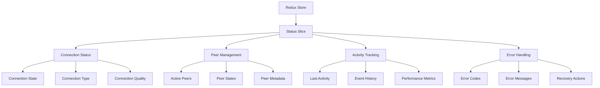

# CLM: Communication Status Badge Design

## 🔷 Abstract Dimension (What?)

### 1.1 Problem Space Analysis
#### 1.1.1 Current Challenges
- **Visibility Gap**: Users lack real-time feedback on WebRTC connection status
- **Ambiguity**: Unclear distinction between connection states (connecting/connected/error)
- **Debugging Difficulty**: No immediate indication of peer connectivity issues
- **User Uncertainty**: Inability to determine if communication issues are local or remote

#### 1.1.2 Impact
- Decreased user confidence in the application
- Increased support requests for connection-related issues
- Potential data loss during unstable connections
- Poor user experience during network transitions

### 1.2 Core Requirements
#### 1.2.1 Functional Requirements
- **FR1**: Display real-time connection status (Connected/Connecting/Error/Offline)
- **FR2**: Show active peer count with visual indicators
- **FR3**: Provide connection quality metrics (latency, packet loss)
- **FR4**: Display last activity timestamp
- **FR5**: Support tooltip with detailed connection information

#### 1.2.2 Non-Functional Requirements
- **NFR1**: Update status within 100ms of state change
- **NFR2**: Support at least 100 simultaneous peer connections
- **NFR3**: Maintain <1% CPU usage during normal operation
- **NFR4**: Ensure accessibility (WCAG 2.1 AA compliance)
- **NFR5**: Support mobile and desktop viewports (320px - 2560px)

### 1.3 Success Metrics
#### 1.3.1 Performance Metrics
- Status update latency: <100ms (P99)
- Memory usage: <10MB for status system
- Render time: <16ms per frame (60fps)
- Bundle size impact: <15KB gzipped

#### 1.3.2 Business Metrics
- 30% reduction in connection-related support tickets
- 15% improvement in user engagement metrics
- 99.9% status accuracy in production
- <0.1% error rate in status reporting

## 🛠️ Concrete Dimension (How?)

### 2.1 Technical Architecture

#### 2.1.1 State Management (Redux)


#### 2.1.2 Component Architecture
```
components/
  ├── StatusSystem/
  │   ├── StatusBadge/               # Main container component
  │   │   ├── StatusBadge.jsx        # Container component
  │   │   ├── StatusBadge.css        # Styling
  │   │   └── index.js               # Public API
  │   │
  │   ├── StatusIndicator/           # Visual indicator
  │   │   ├── StatusIndicator.jsx    # SVG-based indicator
  │   │   ├── StatusIndicator.css    # Animation styles
  │   │   └── index.js
  │   │
  │   └── StatusTooltip/             # Detailed status view
  │       ├── StatusTooltip.jsx      # Tooltip content
  │       ├── ConnectionGraph.jsx    # Quality visualization
  │       └── PeerList.jsx           # Connected peers list
  │
  └── hooks/
      ├── useConnectionStatus.js     # Connection state management
      ├── usePeerMonitoring.js       # Peer connection tracking
      └── usePerformanceMetrics.js   # Connection quality metrics
```

### 2.2 Implementation Details

#### 2.2.1 WebRTC Integration Layer
```javascript
// services/WebRTCService.js
class WebRTCService {
  constructor(store) {
    this.store = store;
    this.peers = new Map();
    this.metrics = new ConnectionMetrics();
  }

  initialize() {
    // Connection state monitoring
    this.connection.onconnectionstatechange = () => {
      const state = this.connection.connectionState;
      this.store.dispatch(updateConnectionState(state));
      this.metrics.recordStateChange(state);
    };

    // ICE connection monitoring
    this.connection.oniceconnectionstatechange = () => {
      const iceState = this.connection.iceConnectionState;
      this.store.dispatch(updateIceState(iceState));
    };

    // Peer management
    this.on('peerConnected', this.handlePeerConnected);
    this.on('peerDisconnected', this.handlePeerDisconnected);
    this.on('dataReceived', this.handleDataReceived);
  }

  handlePeerConnected(peerId, metadata) {
    const peer = {
      id: peerId,
      connectedAt: Date.now(),
      lastActivity: Date.now(),
      ...metadata
    };
    this.peers.set(peerId, peer);
    this.store.dispatch(peerConnected(peer));
    this.metrics.trackPeer(peerId);
  }
  
  // Additional methods for peer and connection management
}
```

#### 2.2.2 Redux State Structure
```javascript
// store/statusSlice.js
const initialState = {
  connection: {
    status: 'disconnected', // 'connecting' | 'connected' | 'error' | 'disconnected'
    type: null, // 'direct' | 'relay' | 'stun' | 'turn'
    iceState: 'new', // 'new' | 'checking' | 'connected' | 'completed' | 'disconnected' | 'failed' | 'closed'
    quality: {
      latency: 0, // ms
      packetLoss: 0, // percentage
      jitter: 0, // ms
      score: 100 // 0-100
    },
    lastStateChange: null
  },
  peers: {
    count: 0,
    list: [],
    byId: {}
  },
  activity: {
    lastMessage: null,
    lastActivity: null,
    events: []
  },
  error: {
    code: null,
    message: null,
    timestamp: null,
    recovery: null
  }
};
```

### 2.3 Visual Design System

#### 2.3.1 Status States Specification
| State       | Color (HEX) | Icon | Animation | Description |
|-------------|-------------|------|-----------|-------------|
| Connected   | #4CAF50     | ✓    | Pulse (2s) | Stable connection with all peers |
| Connecting  | #FFC107     | ⟳    | Rotate (2s) | Establishing connection |
| Degraded    | #FF9800     | !    | Fade (1s) | Connection established with issues |
| Error       | #F44336     | ⚠    | Shake (0.5s) | Connection failed or lost |
| Offline     | #9E9E9E     | ⚫    | None | No active connection |

#### 2.3.2 Responsive Behavior
- **Desktop (>1024px)**: Full status with text and icon
- **Tablet (600px-1024px)**: Icon with tooltip
- **Mobile (<600px)**: Minimal indicator (dot only)

#### 2.3.3 Accessibility Features
- ARIA labels for screen readers
- High contrast mode support
- Reduced motion preferences
- Keyboard navigation support
- Localization support for status messages

## ⚖️ Balanced Dimension (Why?)

### 3.1 Validation Framework

#### 3.1.1 Testing Strategy

**Unit Testing**
```javascript
// Example test for status reducer
describe('statusSlice', () => {
  it('should handle initial state', () => {
    expect(reducer(undefined, {})).toEqual(initialState);
  });

  it('should handle connection state changes', () => {
    const previousState = { ...initialState };
    expect(
      reducer(previousState, updateConnectionState('connected'))
    ).toEqual(
      expect.objectContaining({
        connection: expect.objectContaining({
          status: 'connected',
          lastStateChange: expect.any(Number)
        })
      })
    );
  });
});
```

**Integration Testing**
```javascript
describe('StatusBadge Integration', () => {
  let store;
  let component;
  
  beforeEach(() => {
    store = configureStore({
      reducer: {
        status: statusReducer
      }
    });
    
    component = render(
      <Provider store={store}>
        <StatusBadge />
      </Provider>
    );
  });
  
  it('should display connecting state', () => {
    store.dispatch(updateConnectionState('connecting'));
    expect(component.getByTestId('status-indicator')).toHaveClass('connecting');
  });
});
```

**Performance Testing**
```javascript
describe('Performance', () => {
  it('should handle 100 state updates under 100ms', () => {
    const start = performance.now();
    
    // Simulate rapid state changes
    for (let i = 0; i < 100; i++) {
      store.dispatch(updateConnectionState(i % 2 ? 'connected' : 'disconnected'));
    }
    
    const duration = performance.now() - start;
    expect(duration).toBeLessThan(100);
  });
});
```

### 3.2 User Experience Validation

#### 3.2.1 User Feedback Mechanisms
- **Status Tooltip**: Hover/click for detailed connection info
- **Activity Log**: Timestamped history of connection events
- **Quality Indicators**: Visual representation of connection health
- **Error Recovery**: Clear guidance for resolving common issues

#### 3.2.2 Analytics Integration
- Connection success/failure rates
- Average connection establishment time
- Common error patterns
- User interaction with status elements

### 3.3 Performance Monitoring

#### 3.3.1 Key Metrics
- **Connection Time**: Time to establish WebRTC connection
- **State Transition Speed**: Time between state changes
- **Render Performance**: FPS during status updates
- **Memory Usage**: Impact on application memory

#### 3.3.2 Monitoring Tools
- Custom performance markers
- Web Vitals integration
- Real User Monitoring (RUM) events
- Error tracking and reporting

## 4. Implementation Roadmap

### 4.1 Phase 1: Core Functionality (Sprint 1-2)
**Objectives**: Establish foundation with essential features

**Tasks**:
1. **Redux Integration**
   - Set up status slice with basic state management
   - Create action creators and reducers
   - Implement middleware for WebRTC events

2. **Basic UI Components**
   - StatusIndicator component with state-based styling
   - Basic StatusBadge container
   - Simple tooltip implementation

3. **WebRTC Integration**
   - Connection state monitoring
   - Basic peer tracking
   - Error handling

### 4.2 Phase 2: Enhanced UX (Sprint 3-4)
**Objectives**: Improve user experience and feedback

**Tasks**:
1. **Visual Enhancements**
   - Smooth animations and transitions
   - Connection quality visualization
   - Responsive design improvements

2. **Advanced Features**
   - Detailed status tooltip
   - Connection statistics
   - Basic error recovery UI

3. **Performance Optimization**
   - State update batching
   - Memoization of components
   - Performance monitoring

### 4.3 Phase 3: Advanced Features (Sprint 5-6)
**Objectives**: Add intelligence and reliability

**Tasks**:
1. **Connection Management**
   - Auto-reconnection logic
   - Offline mode support
   - Network resilience features

2. **Advanced Analytics**
   - Connection quality history
   - Event logging
   - Performance metrics

3. **Accessibility & Localization**
   - Full WCAG 2.1 AA compliance
   - Multi-language support
   - Screen reader optimization

## 5. Future Enhancements

### 5.1 Short-term (Next 3 months)
- Audio/visual feedback for state changes
- Network quality visualization
- Custom status themes
- Mobile-optimized UI components

### 5.2 Medium-term (3-6 months)
- Predictive connection management
- AI-driven error recovery
- Advanced peer-to-peer metrics
- Integration with monitoring tools

### 5.3 Long-term (6+ months)
- Machine learning for connection optimization
- Cross-device synchronization
- Advanced debugging tools
- Self-healing connections

## 6. Appendix

### 6.1 Dependencies
- React 18+
- Redux Toolkit
- WebRTC API
- Styled Components
- Testing Library

### 6.2 Browser Support
- Chrome 88+
- Firefox 78+
- Safari 15.4+
- Edge 88+

### 6.3 Performance Budget
- Initial load: <5KB (gzipped)
- Memory: <10MB for status system
- CPU: <1% during normal operation
- Updates: <100ms latency

### 6.4 Error Codes Reference
| Code | Description | Recovery Action |
|------|-------------|-----------------|
| E1001 | Connection Timeout | Retry connection |
| E1002 | ICE Failed | Check network settings |
| E1003 | Signaling Error | Refresh page |
| E1004 | Peer Disconnected | Attempt reconnection |

---

*Document Version: 1.0.0*  
*Last Updated: 2025-11-21*  
*Owners: Frontend Team*
