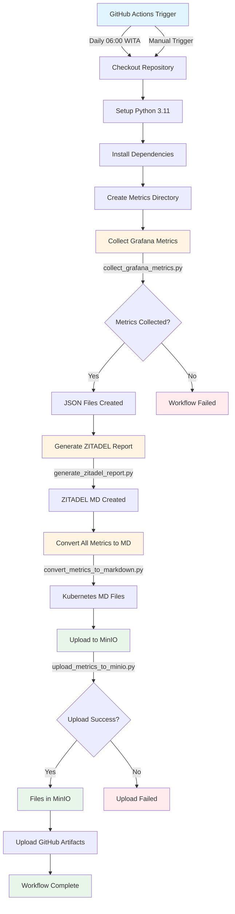
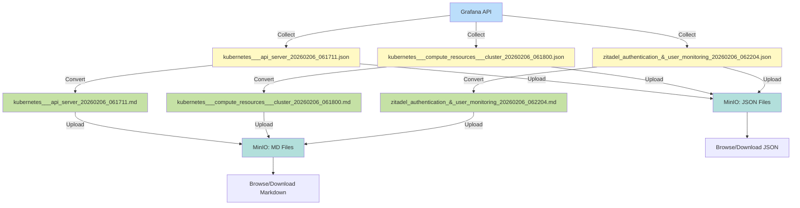
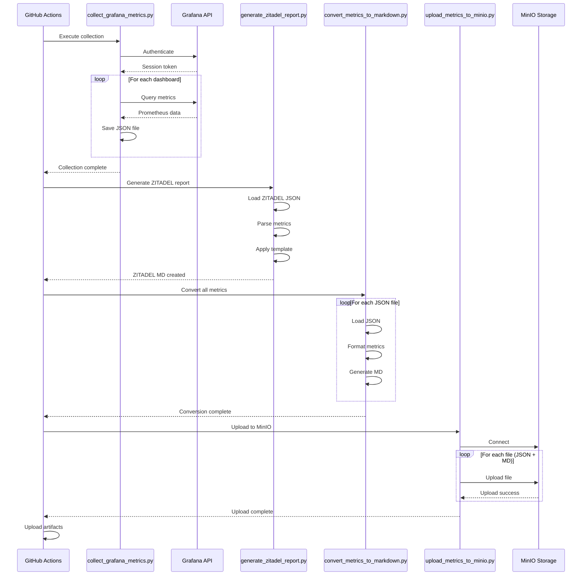
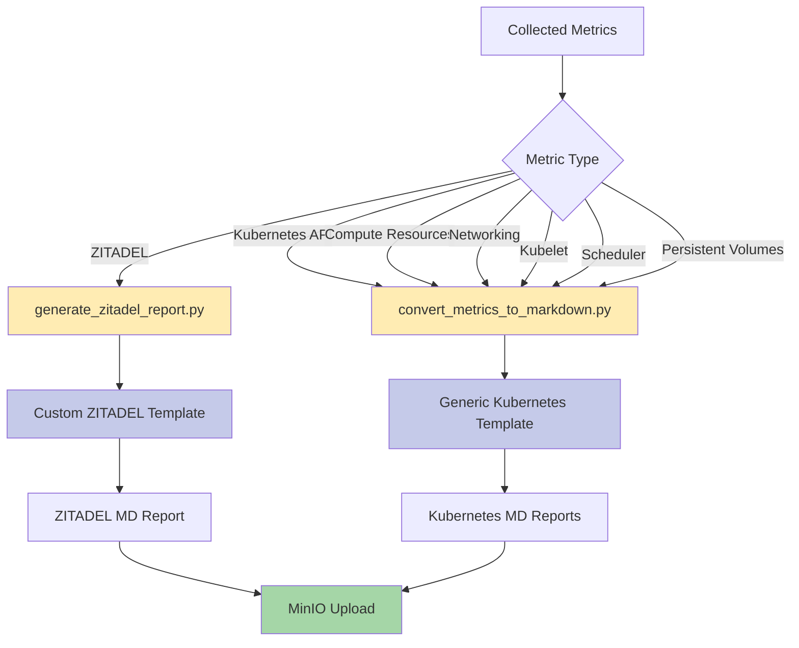
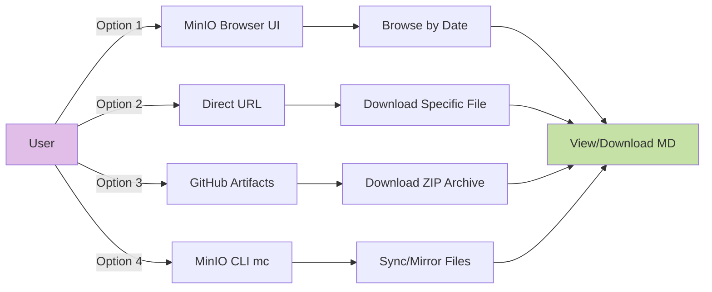

# Grafana Metrics Pipeline - Workflow Diagram

## Complete Pipeline Flow



## Data Flow

```mermaid
graph LR
    A[Grafana Dashboards] -->|API Query| B[Prometheus Metrics]
    B -->|JSON Response| C[collect_grafana_metrics.py]
    
    C -->|Save| D[JSON Files]
    
    D -->|ZITADEL| E[generate_zitadel_report.py]
    D -->|Kubernetes| F[convert_metrics_to_markdown.py]
    
    E -->|Generate| G[ZITADEL MD]
    F -->|Generate| H[Kubernetes MD Files]
    
    D --> I[upload_metrics_to_minio.py]
    G --> I
    H --> I
    
    I -->|Upload| J[MinIO Storage]
    
    J --> K[minio.pkc.pub/pkc/grafana-metrics/YYYY-MM-DD/]
    
    style A fill:#e3f2fd
    style B fill:#e3f2fd
    style C fill:#fff9c4
    style E fill:#fff9c4
    style F fill:#fff9c4
    style I fill:#fff9c4
    style J fill:#c8e6c9
    style K fill:#c8e6c9
```



## File Transformation Flow



## Script Execution Sequence



## Directory Structure

```
LandingPage/
├── .github/
│   ├── workflows/
│   │   └── grafana-metrics-collector.yml    ← Main workflow
│   └── scripts/
│       ├── collect_grafana_metrics.py       ← Step 1: Collect
│       ├── convert_metrics_to_markdown.py   ← Step 3: Convert
│       ├── upload_metrics_to_minio.py       ← Step 4: Upload
│       └── README.md                        ← Scripts documentation
│
├── daily-reports/
│   ├── generate_zitadel_report.py           ← Step 2: ZITADEL report
│   └── zitadel_report_template.md           ← ZITADEL template
│
├── docs/09-performance/observability/
│   ├── GRAFANA-METRICS-PIPELINE.md          ← Complete pipeline docs
│   ├── METRICS-CONVERSION-GUIDE.md          ← Conversion guide
│   ├── PIPELINE-WORKFLOW-DIAGRAM.md         ← This file
│   └── GRAFANA-DASHBOARD-OBSERVABILITY.md   ← Dashboard setup
│
└── grafana-metrics/                         ← Output directory
    ├── *.json                               ← Raw metrics
    ├── *.md                                 ← Markdown reports
    ├── latest_summary.json                  ← Collection summary
    └── upload_results.json                  ← Upload status
```

## MinIO Storage Structure

```
minio.pkc.pub/
└── pkc/                                     ← Bucket
    └── grafana-metrics/                     ← Base path
        ├── 2026-02-05/                      ← Date folder
        │   ├── *.json
        │   └── *.md
        ├── 2026-02-06/                      ← Today's metrics
        │   ├── kubernetes___api_server_20260206_061711.json
        │   ├── kubernetes___api_server_20260206_061711.md
        │   ├── kubernetes___compute_resources___cluster_20260206_061800.json
        │   ├── kubernetes___compute_resources___cluster_20260206_061800.md
        │   ├── zitadel_authentication_&_user_monitoring_20260206_062204.json
        │   ├── zitadel_authentication_&_user_monitoring_20260206_062204.md
        │   └── latest_summary.json
        └── 2026-02-07/                      ← Future metrics
            └── ...
```

## Metric Types and Handlers



## Time Zones

```
UTC Time:     22:00 (Previous day)
              ↓
WITA Time:    06:00 (Current day) ← Workflow trigger
              ↓
Collection:   06:00 - 06:22
              ↓
Upload:       06:22
              ↓
Available:    06:22+ (MinIO)
```

## Access Patterns



---

*Diagrams use Mermaid syntax - viewable in GitHub, VS Code, and most Markdown renderers*
