# CLM Framework Mermaid Diagram Template

```mermaid
%%{init: {'theme': 'base', 'themeVariables': { 'primaryColor': '#f5f6fa', 'primaryTextColor': '#2d3436', 'primaryBorderColor': '#dfe6e9'}, 'gantt': {'fontSize': '16px'}}}%%
graph TB
    %% ===== CLM Framework Structure =====
    subgraph CLM["🔷 Cubical Logic Model (CLM) Framework"]
        direction TB

        %% --- Abstract Dimension ---
        subgraph D1["🔍 Abstract Dimension (What?)"]
            A1[Problem Definition]
            A2[Stakeholder Analysis]
            A3[Success Criteria]
            A4[Constraints & Boundaries]
            style D1 fill:#e3f2fd,stroke:#1976d2,stroke-width:2px,color:#0d47a1
        end

        %% --- Concrete Dimension ---
        subgraph D2["🛠️ Concrete Dimension (How?)"]
            B1[Solution Architecture]
            B2[Resource Allocation]
            B3[Implementation Plan]
            B4[Risk Mitigation]
            style D2 fill:#e8f5e9,stroke:#388e3c,stroke-width:2px,color:#1b5e20
        end

        %% --- Balanced Dimension ---
        subgraph D3["⚖️ Balanced Dimension (Why?)"]
            C1[Validation Testing]
            C2[Performance Metrics]
            C3[Feedback Integration]
            C4[Iterative Refinement]
            style D3 fill:#f3e5f5,stroke:#8e24aa,stroke-width:2px,color:#4a148c
        end

        %% --- Relationships within CLM ---
        A1 --> A2 & A3 & A4
        B1 --> B2 & B3 & B4
        C1 --> C2 & C3 & C4
    end

    %% ===== Verification Layer =====
    subgraph Verification["✅ Verification Layer"]
        direction LR
        VA[Peer Review] <--> VB[Testing] <--> VC[User Feedback]
        style Verification fill:#fff3e0,stroke:#e65100,stroke-width:2px,color:#bf360c
    end

    %% ===== Process Flow =====
    subgraph Process["🔄 Process Flow"]
        direction LR
        P1[Input] --> P2[Process] --> P3[Output] --> P4[Feedback] --> P1
        style Process fill:#e1f5fe,stroke:#0288d1,stroke-width:2px,color:#01579b
    end

    %% ===== Cross-Dimension Connections =====
    A1 -.->|Informs| B1
    B1 -.->|Validated by| C1
    C1 -.->|Refines| A1

    %% ===== Connections to Verification & Process =====
    A1 & B1 & C1 --> Verification
    Verification --> Process

    %% ===== Styling Definitions =====
    classDef abstract fill:#bbdefb,stroke:#1976d2,stroke-width:2px,color:#0d47a1
    classDef concrete fill:#c8e6c9,stroke:#388e3c,stroke-width:2px,color:#1b5e20
    classDef balanced fill:#e1bee7,stroke:#8e24aa,stroke-width:2px,color:#4a148c
    classDef process fill:#b3e5fc,stroke:#0288d1,stroke-width:2px,color:#01579b
    classDef verify fill:#ffcc80,stroke:#e65100,stroke-width:2px,color:#bf360c

    %% ===== Apply Styling =====
    class A1,A2,A3,A4 abstract
    class B1,B2,B3,B4 concrete
    class C1,C2,C3,C4 balanced
    class P1,P2,P3,P4 process
    class VA,VB,VC verify

    %% ===== Legend =====
    subgraph Legend["📊 Legend"]
        direction TB
        L1[Abstract]:::abstract
        L2[Concrete]:::concrete
        L3[Balanced]:::balanced
        L4[Process]:::process
        L5[Verification]:::verify
    end
```

## How to Use This Template

1. Copy the Mermaid code block above
2. Paste it into any Markdown file that supports Mermaid diagrams
3. Customize the content within each node (e.g., replace "Problem Definition" with your specific problem)
4. Adjust relationships as needed for your specific use case

## Customization Tips

- **Change Colors**: Modify the hex codes in the `classDef` sections
- **Add/Remove Nodes**: Copy and paste node definitions as needed
- **Adjust Layout**: Change `direction TB` (top to bottom) to `LR` (left to right) for horizontal layouts
- **Add Icons**: Use emoji or Font Awesome icons within node labels

## Dependencies
- Requires Mermaid.js support in your Markdown viewer/editor
- Tested with Mermaid.js v9.1.0+
