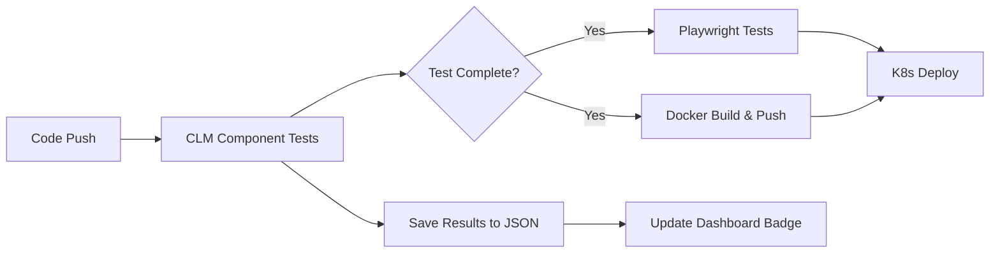

# CLM Component Testing System

## 📋 Daftar Isi
- [Overview](#overview)
- [Arsitektur](#arsitektur)
- [Komponen Sistem](#komponen-sistem)
- [Workflow GitHub Actions](#workflow-github-actions)
- [Format Data Testing](#format-data-testing)
- [Cara Menggunakan](#cara-menggunakan)
- [Pengembangan Lebih Lanjut](#pengembangan-lebih-lanjut)

---

## Overview

Sistem ini mengintegrasikan **Playwright testing** untuk komponen CLM (Cubic Logic Model) dengan **GitHub Actions** untuk continuous testing, dengan fitur:

1. ✅ **Automated Testing**: Test otomatis untuk setiap komponen CLM
2. 🔄 **Sequential Workflow**: GitHub Actions berjalan berurutan (CLM Test → Playwright → Docker → K8s)
3. 💾 **Test Results Storage**: Hasil test disimpan dalam format JSON
4. 📊 **Real-time Display**: Status test ditampilkan di dashboard utama
5. 🔗 **Deep Linking**: Klik badge untuk lihat detail di GitHub Actions

---

## Arsitektur

### Alur Testing



### Struktur File

```
LandingPage/
├── tests/
│   ├── test-clm-welcome.spec.js          # Playwright test untuk welcome component
│   ├── test-components/                   # Direktori untuk hasil test JSON
│   │   └── welcome.json                   # Hasil test welcome component
│   └── test-results/                      # Screenshots & videos
│       ├── clm-welcome-component.png
│       └── clm-welcome-performance.png
├── .github/workflows/
│   ├── clm-component-test.yml            # Workflow untuk CLM testing
│   ├── playwright-test.yml               # Workflow Playwright (wait for CLM)
│   ├── docker-deploy.yml                 # Workflow Docker (wait for CLM)
│   └── deploy-k8s.yml                    # Workflow K8s (wait for Docker)
├── components/
│   └── welcome.html                       # CLM welcome component
├── index.html                             # Dashboard dengan test status badge
└── clm-registry.yaml                      # CLM component registry
```

---

## Komponen Sistem

### 1. Playwright Test Script

**File**: `tests/test-clm-welcome.spec.js`

Script ini menjalankan 3 jenis test untuk welcome component:

#### Test 1: Basic Component Loading
```javascript
test('should load and display welcome component correctly', async ({ page }) => {
  // 1. Navigate ke halaman utama
  // 2. Klik tombol welcome component
  // 3. Verify iframe loaded
  // 4. Check heading & subtitle visible
  // 5. Take screenshot
  // 6. Verify component isolation
});
```

**Verifikasi**:
- ✅ Component button muncul di sidebar
- ✅ Iframe dengan `data-component-id="welcome"` dimuat
- ✅ Heading "Welcome to PKC Landing" visible
- ✅ Subtitle "Cubical Logic Model" visible
- ✅ Component isolated dalam iframe

#### Test 2: Failure Isolation
```javascript
test('should handle component failure gracefully', async ({ page }) => {
  // 1. Load crash-test component (jika ada)
  // 2. Verify main page tetap stabil
  // 3. Switch back ke welcome component
  // 4. Verify welcome component masih berfungsi
});
```

**Tujuan**: Memastikan failure satu component tidak crash seluruh aplikasi

#### Test 3: Performance Measurement
```javascript
test('should measure component performance', async ({ page }) => {
  // 1. Measure navigation time
  // 2. Measure component load time
  // 3. Compare dengan expected_load_time_ms dari clm-registry.yaml
  // 4. Log performance metrics
});
```

**Metrics**:
- Navigation time (halaman utama)
- Component load time (dari klik sampai visible)
- Comparison dengan expected load time (500ms)

### 2. GitHub Actions Workflow

**File**: `.github/workflows/clm-component-test.yml`

#### Trigger Events
```yaml
on:
  push:
    branches: [main, develop]
  pull_request:
    branches: [main, develop]
  workflow_dispatch:
```

#### Steps Utama

1. **Setup Environment**
   ```yaml
   - Checkout code
   - Setup Node.js 18
   - Install Playwright browsers (chromium)
   - Install Docker Compose
   ```

2. **Start Services**
   ```yaml
   - Start Docker Compose
   - Wait for app ready (http://localhost:8765)
   ```

3. **Run Tests**
   ```yaml
   - Run Playwright tests
   - Continue-on-error: true (agar workflow lanjut meski test fail)
   ```

4. **Save Results**
   ```yaml
   - Create JSON file dengan format:
     {
       "hash": "welcome",
       "timestamp": "2024-12-03T10:30:00Z",
       "test_run": 123,
       "status": "success",
       "github_actions_url": "https://github.com/...",
       "commit_sha": "abc123",
       "branch": "main",
       "actor": "username"
     }
   ```

5. **Commit & Push Results**
   ```yaml
   - Git commit welcome.json
   - Push ke repository
   ```

6. **Upload Artifacts**
   ```yaml
   - Upload screenshots
   - Upload videos (jika ada)
   - Retention: 7 days
   ```

### 3. Sequential Workflow Configuration

#### CLM Test → Playwright Test
**File**: `.github/workflows/playwright-test.yml`
```yaml
on:
  workflow_run:
    workflows: ["CLM Component Tests"]
    types:
      - completed
  workflow_dispatch:

jobs:
  playwright-tests:
    if: ${{ github.event.workflow_run.conclusion == 'success' || 
            github.event.workflow_run.conclusion == 'failure' || 
            github.event_name == 'workflow_dispatch' }}
```

#### CLM Test → Docker Build
**File**: `.github/workflows/docker-deploy.yml`
```yaml
on:
  workflow_run:
    workflows: ["CLM Component Tests"]
    types:
      - completed
  workflow_dispatch:

jobs:
  build-and-push:
    if: ${{ github.event.workflow_run.conclusion == 'success' || 
            github.event.workflow_run.conclusion == 'failure' || 
            github.event_name == 'workflow_dispatch' }}
```

#### Docker Build → K8s Deploy
**File**: `.github/workflows/deploy-k8s.yml`
```yaml
on:
  workflow_run:
    workflows: ["Build and Push Docker Image LandingPage"]
    types:
      - completed
  workflow_dispatch:

jobs:
  deploy:
    if: ${{ github.event.workflow_run.conclusion == 'success' || 
            github.event_name == 'workflow_dispatch' }}
```

**Urutan Eksekusi**:
```
CLM Test → (Playwright Test || Docker Build) → K8s Deploy
```

### 4. Dashboard Badge Display

**File**: `index.html`

#### HTML Badge Element
```html
<div id="testStatusBadge" style="...">
  <span style="opacity: 0.7;">Loading test status...</span>
</div>
```

Posisi: Di dashboard header, antara "SINGLE VIEW" dan tombol "Login"

#### JavaScript Loader
```javascript
async function loadTestStatus() {
  // 1. Fetch /tests/test-components/welcome.json
  // 2. Parse JSON data
  // 3. Determine status icon & color
  //    - ✅ Green (success)
  //    - ❌ Red (failure)
  //    - ❓ Gray (unknown)
  // 4. Update badge HTML
  // 5. Add click handler → open GitHub Actions
  // 6. Add tooltip with details
}

// Load on page load
document.addEventListener('DOMContentLoaded', loadTestStatus);

// Auto-refresh every 5 minutes
setInterval(loadTestStatus, 5 * 60 * 1000);
```

#### Badge Display Format
```
[✅ welcome] • [Run #123] • [Passed]
```

**Interaktif**:
- **Hover**: Scale 1.02x, background opacity meningkat
- **Click**: Buka GitHub Actions di tab baru
- **Tooltip**: Tampilkan detail lengkap (run number, status, date, branch)

---

## Format Data Testing

### JSON Schema

**File**: `tests/test-components/{hash}.json`

```json
{
  "hash": "welcome",
  "timestamp": "2024-12-03T10:30:00Z",
  "test_run": 123,
  "status": "success",
  "github_actions_url": "https://github.com/user/repo/actions/runs/123456",
  "commit_sha": "abc123def456",
  "branch": "main",
  "actor": "github-actions[bot]"
}
```

### Field Descriptions

| Field | Type | Description | Example |
|-------|------|-------------|---------|
| `hash` | string | Component hash dari clm-registry.yaml | `"welcome"` |
| `timestamp` | string | ISO 8601 timestamp (UTC) | `"2024-12-03T10:30:00Z"` |
| `test_run` | number | GitHub run number | `123` |
| `status` | string | Test result: "success" atau "failure" | `"success"` |
| `github_actions_url` | string | Full URL ke GitHub Actions run | `"https://github.com/..."` |
| `commit_sha` | string | Git commit SHA | `"abc123def456"` |
| `branch` | string | Git branch name | `"main"` |
| `actor` | string | GitHub username yang trigger workflow | `"username"` |

### Status Values

| Status | Icon | Color | Description |
|--------|------|-------|-------------|
| `success` | ✅ | Green (`rgba(46, 204, 113, 0.3)`) | All tests passed |
| `failure` | ❌ | Red (`rgba(231, 76, 60, 0.3)`) | One or more tests failed |
| `unknown` | ❓ | Gray (`rgba(255, 255, 255, 0.3)`) | No data or error loading |

---

## Cara Menggunakan

### 1. Menjalankan Test Lokal

```bash
# Install dependencies
npm install

# Start Docker Compose
docker-compose -f github-actions-docker-compose.yml up -d

# Run CLM welcome component test
npx playwright test tests/test-clm-welcome.spec.js

# Stop services
docker-compose down -v
```

### 2. Menjalankan via GitHub Actions

**Otomatis**:
- Push ke branch `main` atau `develop`
- Buat Pull Request ke `main` atau `develop`

**Manual**:
1. Buka GitHub repository
2. Actions tab → CLM Component Tests
3. Run workflow → Run workflow

### 3. Melihat Hasil Test

#### Di Dashboard
1. Buka `http://localhost:8765` atau URL production
2. Lihat badge di header (antara "SINGLE VIEW" dan "Login")
3. Badge menampilkan: `[✅ welcome] • [Run #123] • [Passed]`
4. Klik badge untuk buka GitHub Actions detail

#### Di GitHub
1. Buka repository
2. Actions tab
3. Pilih workflow "CLM Component Tests"
4. Lihat run history dan details

#### File JSON
```bash
# Lihat hasil test di file
cat tests/test-components/welcome.json
```

### 4. Menambah Component Test Baru

#### Step 1: Buat Test Script
```bash
# Copy template
cp tests/test-clm-welcome.spec.js tests/test-clm-{component-name}.spec.js

# Edit test sesuai component
vim tests/test-clm-{component-name}.spec.js
```

#### Step 2: Update Workflow
Edit `.github/workflows/clm-component-test.yml`:
```yaml
- name: Run CLM {Component Name} tests
  id: clm_test_{component_name}
  continue-on-error: true
  run: |
    npx playwright test tests/test-clm-{component-name}.spec.js
```

#### Step 3: Update JSON Save Logic
```yaml
- name: Save test results to JSON
  run: |
    cat > tests/test-components/{component-hash}.json << EOF
    {
      "hash": "{component-hash}",
      ...
    }
    EOF
```

#### Step 4: Update Dashboard (Opsional)
Jika ingin tampilkan multiple component status di dashboard:
```javascript
// Load all component test results
['welcome', 'hero-content', 'p2p-status'].forEach(async (hash) => {
  await loadTestStatus(hash);
});
```

---

## Pengembangan Lebih Lanjut

### 1. Multi-Component Testing

Saat ini sistem hanya test 1 component (welcome). Untuk test multiple components:

```yaml
# .github/workflows/clm-component-test.yml
jobs:
  test-matrix:
    strategy:
      matrix:
        component: [welcome, hero-content, p2p-status, crash-test]
    steps:
      - name: Run CLM ${{ matrix.component }} tests
        run: npx playwright test tests/test-clm-${{ matrix.component }}.spec.js
```

### 2. Test Coverage Report

Tambahkan step untuk generate coverage report:
```yaml
- name: Generate test coverage
  run: |
    npx playwright test --reporter=html
    
- name: Upload coverage report
  uses: actions/upload-artifact@v4
  with:
    name: test-coverage
    path: playwright-report/
```

### 3. Slack/Discord Notification

Tambahkan notifikasi saat test fail:
```yaml
- name: Notify on failure
  if: failure()
  uses: 8398a7/action-slack@v3
  with:
    status: ${{ job.status }}
    text: 'CLM Component Test failed!'
    webhook_url: ${{ secrets.SLACK_WEBHOOK }}
```

### 4. Test History Tracking

Simpan history test results:
```javascript
// Append to history instead of replace
const history = require('./test-components/welcome-history.json');
history.push(newTestResult);
fs.writeFileSync('welcome-history.json', JSON.stringify(history));
```

### 5. Performance Trends

Visualisasi performance trends:
```javascript
// Chart.js or D3.js
const loadTimes = history.map(r => r.load_time_ms);
const labels = history.map(r => new Date(r.timestamp).toLocaleDateString());
// Render line chart
```

### 6. Component Health Score

Kalkulasi health score berdasarkan:
- Test success rate (70%)
- Average load time (20%)
- Error frequency (10%)

```javascript
function calculateHealthScore(component) {
  const successRate = component.successCount / component.totalTests;
  const performanceScore = Math.max(0, 1 - (component.avgLoadTime / 1000));
  const errorScore = Math.max(0, 1 - (component.errorCount / 10));
  
  return (successRate * 0.7 + performanceScore * 0.2 + errorScore * 0.1) * 100;
}
```

---

## FAQ

### Q: Bagaimana jika test fail tapi saya tetap ingin deploy?

A: Workflow menggunakan `continue-on-error: true` dan condition `conclusion == 'success' || conclusion == 'failure'`, jadi workflow berikutnya tetap jalan meski test fail. Namun status failure akan tercatat di badge.

### Q: Bagaimana cara skip CLM test sementara?

A: Ada 2 cara:
1. **Manual trigger workflow lain**: Gunakan `workflow_dispatch` di workflow yang ingin di-run
2. **Disable workflow**: Di GitHub Settings → Actions → Disable "CLM Component Tests"

### Q: Apakah bisa test multiple components sekaligus?

A: Ya, gunakan strategy matrix (lihat [Pengembangan Lebih Lanjut](#1-multi-component-testing))

### Q: File JSON tidak ter-commit ke repository?

A: Pastikan:
1. GitHub Actions punya permission write: `permissions: contents: write`
2. Branch protection rules allow bot commits
3. Check git config di workflow step

### Q: Badge tidak muncul di dashboard?

A: Debug:
1. Check browser console untuk error
2. Verify `/tests/test-components/welcome.json` accessible
3. Check web server static file serving config
4. Verify JSON file format valid

---

## Changelog

### Version 1.0.0 (2024-12-03)
- ✨ Initial release
- ✅ Playwright test untuk welcome component
- 🔄 Sequential GitHub Actions workflow
- 💾 JSON test results storage
- 📊 Dashboard badge display
- 📖 Dokumentasi lengkap

---

## Credits

**Author**: Alessandro Rumampuk  
**Project**: PKC Landing Page - CLM Dashboard  
**Architecture**: Cubic Logic Model (CLM)  
**Testing Framework**: Playwright  
**CI/CD**: GitHub Actions  

---

## License

MIT License - Feel free to use and modify for your projects.
