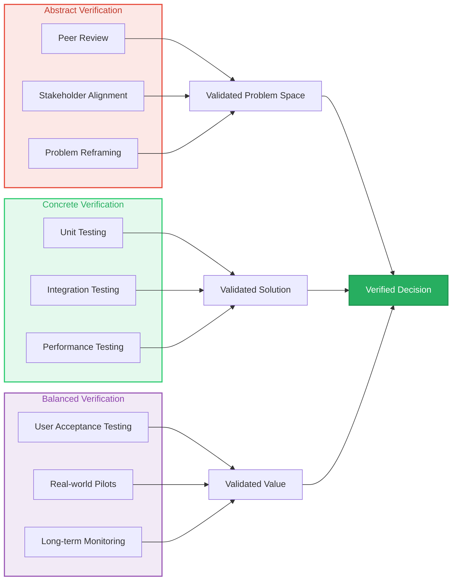
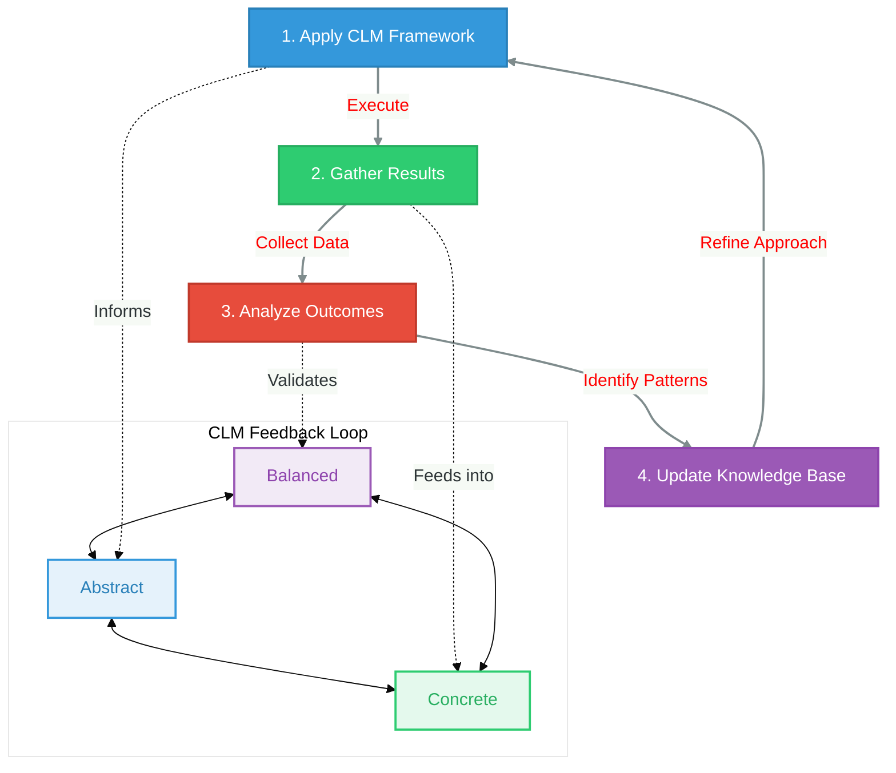

# CLM: A Framework for Systematic Thinking

## 🔷 Core Principle
Cubical Logic Model (CLM) provides a three-dimensional framework for structured problem-solving, ensuring comprehensive analysis and verification at each stage of the decision-making process.

```mermaid
%%{init: {'theme': 'base', 'themeVariables': { 'primaryColor': '#2c3e50', 'primaryTextColor': '#fff', 'primaryBorderColor': '#2c3e50', 'lineColor': '#2c3e50', 'secondaryColor': '#f5f6fa', 'tertiaryColor': '#f5f6fa'}}}%%
flowchart TD
    subgraph Problem_Space["🔍 Problem Space"]
        A[Problem Statement] --> B[CLM 3D Analysis]
    end
    
    subgraph CLM_Dimensions["🎯 CLM Dimensions"]
        B --> C[Abstract\n(What?)]
        B --> D[Concrete\n(How?)]
        B --> E[Balanced\n(Why?)]
        
        C --> F[Clear Problem\nDefinition]
        D --> G[Executable\nSolution]
        E --> H[Validation &
        Verification]
    end
    
    subgraph Outcomes["✨ Outcomes"]
        F & G & H --> I[Optimal\nDecision]
        I --> J[Continuous\nImprovement]
    end
    
    style A fill:#3498db,stroke:#2980b9,color:white,stroke-width:2px
    style B fill:#2c3e50,stroke:#1a252f,color:white,stroke-width:2px
    style C fill:#e74c3c,stroke:#c0392b,color:white,stroke-width:2px
    style D fill:#2ecc71,stroke:#27ae60,color:white,stroke-width:2px
    style E fill:#9b59b6,stroke:#8e44ad,color:white,stroke-width:2px
    style F fill:#e67e22,stroke:#d35400,color:white,stroke-width:2px
    style G fill:#1abc9c,stroke:#16a085,color:white,stroke-width:2px
    style H fill:#8e44ad,stroke:#9b59b6,color:white,stroke-width:2px
    style I fill:#27ae60,stroke:#219653,color:white,stroke-width:3px
    style J fill:#3498db,stroke:#2980b9,color:white,stroke-width:2px,dashed
    
    style Problem_Space fill:none,stroke:#3498db,stroke-width:2px,stroke-dasharray: 5 5
    style CLM_Dimensions fill:none,stroke:#2ecc71,stroke-width:2px,stroke-dasharray: 5 5
    style Outcomes fill:none,stroke:#9b59b6,stroke-width:2px,stroke-dasharray: 5 5
```

## 🎯 The Three Dimensions of CLM

### 1. Abstract Dimension (What?)
**Purpose**: Define and understand the problem space with clarity and precision.

**Key Components**:
- **Problem Definition**: Explicit statement of the issue
- **Success Criteria**: Quantifiable metrics for success
- **Constraints & Boundaries**: Limitations and edge cases
- **Stakeholder Analysis**: Understanding all affected parties

**Verification Methods**:
- Peer review sessions
- Problem reframing exercises
- Stakeholder alignment workshops

**Example Questions**:
- What is the root cause of this problem?
- What would a perfect solution accomplish?
- What are the absolute constraints we must work within?

### 2. Concrete Dimension (How?)
**Purpose**: Develop actionable, implementable solutions.

**Key Components**:
- **Solution Architecture**: Technical design and approach
- **Resource Allocation**: People, time, and materials
- **Implementation Roadmap**: Phased execution plan
- **Risk Mitigation**: Contingency planning

**Verification Methods**:
- Technical design reviews
- Resource planning sessions
- Prototype development

**Example Questions**:
- What specific steps will we take to implement this?
- What skills and resources are essential?
- How will we measure progress at each stage?

### 3. Balanced Dimension (Why?)
**Purpose**: Validate and refine the solution against real-world conditions.

**Key Components**:
- **Validation Testing**: Real-world scenario testing
- **Performance Metrics**: Quantitative success measures
- **Feedback Integration**: Incorporating stakeholder input
- **Iterative Refinement**: Continuous improvement cycles

**Verification Methods**:
- A/B testing
- User acceptance testing
- Performance benchmarking

**Example Questions**:
- How does this solution perform under stress conditions?
- What are the potential failure modes?
- How can we improve the solution based on feedback?

## 🧠 Enhancing Intelligence with CLM

### 1. Critical Thinking Development
**How CLM Helps**:
- **Structured Reasoning**: Forces explicit articulation of thought processes
- **Bias Mitigation**: Reduces cognitive biases through multi-dimensional analysis
- **Perspective Integration**: Encourages considering multiple viewpoints

**Practical Applications**:
- Decision journals using CLM framework
- Structured debate formats
- Pre-mortem analysis sessions

### 2. Systematic Problem-Solving
**CLM Approach**:
- **Decomposition**: Breaks complex problems into manageable components
- **Verification Layers**: Multiple checkpoints for solution validity
- **Traceability**: Clear documentation of reasoning paths

**Implementation Techniques**:
- Problem decomposition trees
- Solution impact mapping
- Decision matrices using CLM dimensions

### 3. Evidence-Based Decision Making
**CLM Framework**:
- **Data-Driven**: Emphasizes empirical validation
- **Feedback Loops**: Continuous improvement mechanisms
- **Risk Assessment**: Structured evaluation of potential downsides

**Decision Tools**:
- CLM decision logs
- Impact/effort matrices
- Scenario planning templates

## ✅ Comprehensive Verification Framework



| Dimension | Verification Methods | Purpose | Key Activities |
|-----------|----------------------|---------|----------------|
| **Abstract** | Peer Review, Stakeholder Workshops | Ensure problem clarity and alignment | Problem framing sessions, Requirements validation |
| **Concrete** | Unit Testing, Code Reviews | Validate technical implementation | Test-driven development, Design reviews |
| **Balanced** | User Testing, A/B Testing | Confirm real-world effectiveness | Beta testing, Performance monitoring |

## 🔄 Continuous Improvement Cycle



### Key Components of the Improvement Cycle:

1. **Application Phase**
   - Implement CLM framework
   - Document all decisions and reasoning
   
2. **Data Collection**
   - Gather quantitative metrics
   - Collect qualitative feedback
   - Monitor system performance
   
3. **Analysis**
   - Compare results against success criteria
   - Identify patterns and insights
   - Document lessons learned
   
4. **Knowledge Integration**
   - Update templates and checklists
   - Refine processes based on findings
   - Share insights with the team