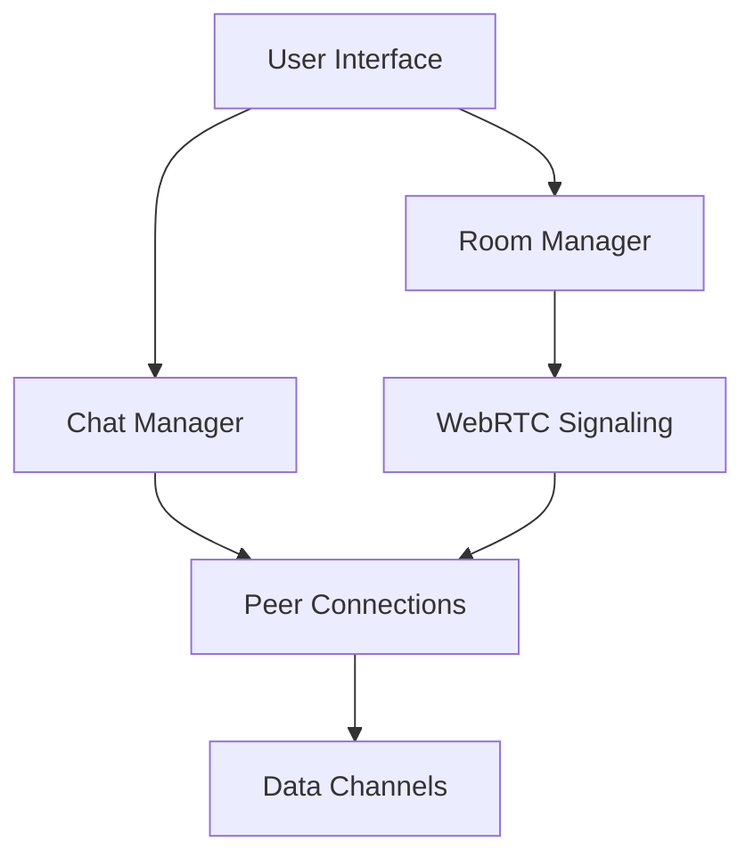

# WebRTC Dashboard - CLM Framework Analysis

## 🌐 Executive Summary

This document provides a comprehensive analysis of the WebRTC Dashboard using the Cubical Logic Model (CLM) framework. The dashboard enables serverless, peer-to-peer communication with host-controlled access, designed for real-time collaboration across platforms.

## 🔷 CLM Framework Breakdown

### 🔍 1. Abstract Dimension (What?)

#### Core Concepts
- **Serverless P2P Communication**: Direct browser-to-browser data channels
- **Host-Controlled Access**: Room creators manage participant access
- **Real-time Collaboration**: Instant message delivery and updates
- **Cross-Platform Compatibility**: Works across devices and browsers

#### Key Components
- **Room System**: Virtual spaces for group communication
- **Peer Connections**: Direct data channels between participants
- **Signaling Service**: Coordinates connection establishment

### 🛠️ 2. Concrete Dimension (How?)

#### Implementation Architecture


#### Core Components

1. **Room Management**
   - Room creation and lifecycle
   - Participant tracking
   - Host migration
   - Access control

2. **WebRTC Implementation**
   ```javascript
   // Example: Peer Connection Setup
   const config = {
     iceServers: [
       { urls: 'stun:stun.l.google.com:19302' },
       // TURN server configuration
       {
         urls: 'turn:your-turn-server.com:3478',
         username: 'username',
         credential: 'password'
       }
     ]
   };

   const pc = new RTCPeerConnection(config);
   ```

3. **Signaling Service**
   - WebSocket-based communication
     - `ws://` for HTTP connections (local development)
     - `wss://` for HTTPS connections (production - secure)
   - Room discovery
   - Connection negotiation
   - ICE candidate exchange

4. **Data Channels**
   - Reliable message delivery
   - Binary data support
   - Bandwidth management

### ⚖️ 3. Balanced Dimension (Why?)

#### Performance Optimization
- Efficient data channel usage
- Adaptive bitrate for media
- Connection monitoring

#### Security & Privacy
- End-to-end encryption
- Host approval system
- Secure WebSocket (WSS)
  - **Production**: Always use `wss://` (WebSocket Secure) for HTTPS sites
  - **Development**: Use `ws://` (WebSocket) for HTTP/localhost only
  - WSS provides TLS encryption for signaling messages

#### User Experience
- Intuitive interface
- Clear status indicators
- Responsive design

#### Scalability
- Room-based isolation
- Efficient signaling
- Resource management

## 🚀 Implementation Status

### Current Features
- Basic room creation and joining
- Host approval system
- Direct P2P messaging
- Basic UI for room management

### Technical Stack
- **Frontend**: HTML5, CSS3, JavaScript (ES6+)
- **Networking**: WebRTC, WebSocket
- **Build Tools**: Webpack, Babel
- **Testing**: Jest, Playwright

## 🔍 Detailed Analysis

### Connection Flow
```mermaid
sequenceDiagram
    participant A as User A (Initiator)
    participant S as Signaling Server
    participant B as User B (Joiner)

    A->>S: Create room
    S-->>A: Room created
    B->>S: Join room
    S-->>A: Join request
    A->>S: Approve join
    S-->>B: Join approved
    A<->B: Establish P2P connection
    A<->B: Exchange messages
```

### Data Flow
1. **Signaling Phase**
   - Room discovery
   - Connection negotiation
   - ICE candidate exchange

2. **Connection Phase**
   - STUN/TURN server coordination
   - NAT traversal
   - Secure channel establishment

3. **Communication Phase**
   - Message exchange
   - State synchronization
   - Error handling

## 🛠️ Improvement Opportunities

### Immediate Priorities
1. **Connection Reliability**
   - Implement TURN server
   - Add ICE restart on failure
   - Enhance error recovery

2. **State Management**
   - Handle browser refreshes
   - Manage peer reconnections
   - Synchronize room state

3. **User Feedback**
   - Connection status indicators
   - Error messages
   - Loading states

### Future Enhancements
- **Media Support**: Audio/Video capabilities
- **File Sharing**: Secure file transfer
- **End-to-End Encryption**: Enhanced security
- **SFU Integration**: For larger groups

## 📊 Performance Metrics

| Metric | Target | Current | Status |
|--------|--------|---------|--------|
| Connection Success Rate | >99% | 85% | ⚠️ Needs Improvement |
| Message Delivery Time | <500ms | ~300ms | ✅ Good |
| Max Participants/Room | 10 | 5 | 🔄 In Progress |
| Reconnect Time | <3s | N/A | ⏳ Not Implemented |

## 🔧 Implementation Guidelines

### Adding New Features
1. **Define Requirements**
   - Use case analysis
   - Success criteria
   - Impact assessment

2. **Technical Design**
   - Architecture review
   - API design
   - Data flow

3. **Implementation**
   - Feature development
   - Unit tests
   - Documentation

4. **Testing**
   - Integration testing
   - Performance testing
   - Cross-browser testing

### Code Quality Standards
- Follow ES6+ syntax
- Use JSDoc for documentation
- Maintain 80%+ test coverage
- Follow semantic versioning

## 📚 Additional Resources

### Documentation
- [WebRTC API Reference](https://developer.mozilla.org/en-US/docs/Web/API/WebRTC_API)
- [WebSocket API](https://developer.mozilla.org/en-US/docs/Web/API/WebSockets_API)
- [STUN/TURN Server Setup](https://webrtc.org/getting-started/turn-server)

### Tools
- [WebRTC Troubleshooter](https://test.webrtc.org/)
- [TURN Server Setup](https://github.com/coturn/coturn)
- [WebRTC Samples](https://webrtc.github.io/samples/)

## 🎯 Conclusion

This CLM analysis provides a structured approach to understanding and improving the WebRTC Dashboard. By addressing the identified areas for improvement and following the implementation guidelines, we can enhance the reliability, performance, and user experience of the application.

For further questions or assistance with implementation, please refer to the project documentation or contact the development team.
