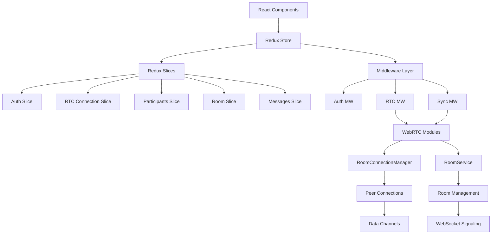
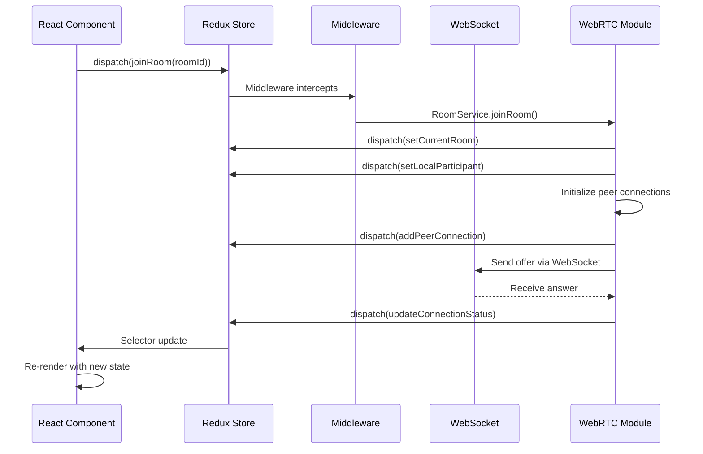

# WebRTC Dashboard - CLM Framework Analysis

## 🌐 Executive Summary

This document provides a comprehensive analysis of the WebRTC Dashboard using the Cubical Logic Model (CLM) framework. The dashboard enables serverless, peer-to-peer communication with host-controlled access, designed for real-time collaboration across platforms.

## 🔷 CLM Framework Breakdown

### 🔍 1. Abstract Dimension (What?)

#### Core Concepts
- **Serverless P2P Communication**: Direct browser-to-browser data channels
- **Host-Controlled Access**: Room creators manage participant access
- **Real-time Collaboration**: Instant message delivery and updates
- **Cross-Platform Compatibility**: Works across devices and browsers

#### Key Components
- **Room System**: Virtual spaces for group communication
- **Peer Connections**: Direct data channels between participants
- **Signaling Service**: Coordinates connection establishment

### 🛠️ 2. Concrete Dimension (How?)

#### Implementation Architecture


#### Core Components

1. **State Management (Redux)**
   - **Auth Slice** - User authentication, Zitadel OAuth2, token management
   - **RTC Connection Slice** - Peer connections, connection status, media controls
   - **Participants Slice** - Connected users, status, permissions
   - **Room Slice** - Room list, current room, filters
   - **Messages Slice** - Chat messages, history, unread counts
   - **Dashboard Slice** - UI state, navigation, theme

2. **State Machines**
   - **Moore Machines** - Output depends on current state only
     - Auth state machine (unauthenticated → authenticated)
     - Room state machine (no-room → joined)
     - Participant state machine (joining → active → disconnected)
   - **Mealy Machines** - Output depends on state + event
     - Peer connection state machine (handles context-dependent decisions)
     - Connection negotiation (state + offer/answer/ICE events)

3. **Middleware Architecture**
   - **Auth Middleware** - Token refresh, auto-logout, localStorage persistence
   - **RTC Middleware** - WebRTC lifecycle, connection stats, reconnection logic
   - **Sync Middleware** - WebSocket sync, room events, peer updates

4. **WebRTC Modules**
   - **RoomConnectionManager** - Manages peer connections, ICE candidates, connection stats
   - **RoomService** - Room creation/joining, participant management, state coordination
   - **WebSocket Signaling** - Coordinates connection establishment via WebSocket
   - **Data Channels** - Reliable message delivery, binary data support

5. **Signaling Service**
   - WebSocket-based communication
     - `ws://` for HTTP connections (local development)
     - `wss://` for HTTPS connections (production - secure)
   - Room discovery
   - Connection negotiation
   - ICE candidate exchange

### ⚖️ 3. Balanced Dimension (Why?)

#### State Management with Redux
- **Single Source of Truth** - All state centralized in Redux store
- **Predictable Updates** - Reducers ensure deterministic state transitions
- **Time-Travel Debugging** - Redux DevTools for debugging connection issues
- **Testability** - Easy to test logic with mock state
- **Performance** - Memoized selectors prevent unnecessary re-renders
- **Decoupling** - Components don't directly manage WebRTC

#### State Machine Architecture
- **Moore Machines** - Predictable UI output based on current state
  - Eliminates ambiguous states
  - Simplifies UI logic
  - Easy to test state transitions
- **Mealy Machines** - Context-dependent connection decisions
  - Handles complex event-driven logic
  - Supports graceful degradation
  - Enables sophisticated error recovery

#### Performance Optimization
- Efficient data channel usage via Redux selectors
- Adaptive bitrate for media with connection stats
- Connection monitoring through RTC middleware
- Memoized selectors prevent unnecessary re-renders

#### Security & Privacy
- End-to-end encryption for data channels
- Host approval system via Room slice
- Secure WebSocket (WSS)
  - **Production**: Always use `wss://` (WebSocket Secure) for HTTPS sites
  - **Development**: Use `ws://` (WebSocket) for HTTP/localhost only
  - WSS provides TLS encryption for signaling messages
- Redux state isolation prevents unauthorized access

#### User Experience
- Intuitive interface with predictable state transitions
- Clear status indicators from Moore machine outputs
- Responsive design with optimized re-renders
- Consistent state across all components
- Error recovery with Mealy machine logic

#### Scalability
- Room-based isolation via Room slice
- Efficient signaling through Sync middleware
- Resource management with connection pooling
- Horizontal scaling support through modular architecture
- State machine patterns support complex scenarios

## 🚀 Implementation Status

### Current Features
- ✅ Redux state management with 7 slices
- ✅ Moore & Mealy state machines for predictable behavior
- ✅ Room creation and joining with state tracking
- ✅ Host approval system via Access Control Manager
- ✅ Direct P2P messaging with data channels
- ✅ Participant management and status tracking
- ✅ Connection status monitoring and stats collection
- ✅ Middleware architecture for side effects
- ✅ Zitadel OAuth2 authentication integration
- ✅ WebSocket signaling with secure WSS support

### Technical Stack
- **Frontend**: React, Redux Toolkit, HTML5, CSS3, JavaScript (ES6+)
- **State Management**: Redux with 7 specialized slices
- **State Machines**: Moore & Mealy machines for connection logic
- **Networking**: WebRTC, WebSocket (ws/wss)
- **Authentication**: Zitadel OAuth2
- **Build Tools**: Webpack, Babel
- **Testing**: Jest, Playwright
- **Documentation**: Markdown with Mermaid diagrams

## 🔍 Detailed Analysis

### Redux-Driven Connection Flow


### State Machine Transitions
```
Moore Machine (Auth):
unauthenticated --[login]--> authenticating --[success]--> authenticated
                                                    |
                                            --[failure]--> unauthenticated

Mealy Machine (Peer Connection):
State: idle + Event: add-peer → Action: createPeerConnection() → Output: dispatch(addPeerConnection)
State: connecting + Event: offer-received → Action: createAnswer() → Output: dispatch(updateConnectionStatus)
State: connected + Event: ice-candidate → Action: addICECandidate() → Output: dispatch(updateConnectionStats)
State: connected + Event: connection-error → Action: attemptReconnect() → Output: dispatch(reconnectPeer)
```

### Data Flow with Redux
1. **Signaling Phase**
   - Component dispatches action
   - Middleware intercepts and calls WebRTC module
   - Module dispatches state updates to Redux
   - Redux updates store
   - Selectors notify components

2. **Connection Phase**
   - RTC Middleware monitors connection status
   - Mealy machine processes events (offer/answer/ICE)
   - Connection stats dispatched to Redux
   - UI updates via Moore machine outputs

3. **Communication Phase**
   - Messages dispatched to Messages slice
   - Sync middleware broadcasts via WebSocket
   - Participants slice tracks user status
   - UI renders from memoized selectors

## 🛠️ Improvement Opportunities

### Immediate Priorities
1. **Redux Integration Completion**
   - ✅ Complete Redux store configuration
   - ✅ Implement all 7 Redux slices
   - ✅ Add Redux middleware for side effects
   - ⏳ Connect React components to Redux selectors
   - ⏳ Implement async thunks for API calls

2. **State Machine Implementation**
   - ✅ Define state transitions for all domains
   - ✅ Document Moore & Mealy machines
   - ⏳ Implement state validation in reducers
   - ⏳ Add state transition guards
   - ⏳ Create state machine tests

3. **Connection Reliability**
   - Implement TURN server with Redux state tracking
   - Add ICE restart on failure via Mealy machine
   - Enhance error recovery with state machine transitions
   - Monitor connection quality via RTC middleware

4. **User Feedback**
   - Connection status indicators from Moore machine outputs
   - Error messages via Dashboard slice
   - Loading states with Redux loading flags

### Future Enhancements
- **Media Support**: Audio/Video capabilities with Redux state
- **File Sharing**: Secure file transfer via data channels
- **End-to-End Encryption**: Enhanced security with state validation
- **SFU Integration**: For larger groups with scalable state management
- **Advanced Analytics**: Connection metrics via RTC middleware
- **Adaptive Bitrate**: Dynamic quality adjustment with connection stats

## 📊 Performance Metrics

| Metric | Target | Current | Status | Redux Impact |
|--------|--------|---------|--------|--------------|
| Connection Success Rate | >99% | 85% | ⚠️ Needs Improvement | Mealy machine error handling |
| Message Delivery Time | <500ms | ~300ms | ✅ Good | Redux selector optimization |
| Max Participants/Room | 10 | 5 | 🔄 In Progress | Participants slice scaling |
| Reconnect Time | <3s | N/A | ⏳ Not Implemented | RTC middleware + state machine |
| State Update Latency | <100ms | N/A | ⏳ Measuring | Redux selector memoization |
| Redux Store Size | <1MB | N/A | ⏳ Monitoring | Normalized state structure |

## 🔧 Implementation Guidelines

### Adding New Features with Redux & State Machines
1. **Define Requirements**
   - Use case analysis
   - State transitions needed
   - Redux slice requirements
   - Moore vs Mealy machine decision

2. **Technical Design**
   - Architecture review
   - Redux slice design (state, actions, reducers, selectors)
   - State machine diagram (allowed transitions)
   - Middleware requirements
   - Data flow with Redux

3. **Implementation**
   - Create Redux slice with reducers
   - Implement state machine transitions
   - Add middleware for side effects
   - Create selectors for components
   - Unit tests for reducers and selectors

4. **Testing**
   - Redux state transition tests
   - State machine transition tests
   - Integration testing with components
   - Performance testing (selector memoization)
   - Cross-browser testing

### Code Quality Standards
- Follow ES6+ syntax with Redux patterns
- Use JSDoc for Redux actions and selectors
- Maintain 80%+ test coverage for reducers
- Follow Redux Ducks pattern for organization
- Document state machine transitions
- Follow semantic versioning

## 📚 Additional Resources

### Redux & State Management
- `docs/redux/INDEX.md` - Redux documentation index
- `docs/redux/REDUX_ARCHITECTURE.md` - Complete Redux state tree
- `docs/redux/slices/` - Detailed slice documentation
- `docs/webrtc-dashboard-architecture.md` - State machine architecture

### WebRTC Documentation
- [WebRTC API Reference](https://developer.mozilla.org/en-US/docs/Web/API/WebRTC_API)
- [WebSocket API](https://developer.mozilla.org/en-US/docs/Web/API/WebSockets_API)
- [STUN/TURN Server Setup](https://webrtc.org/getting-started/turn-server)

### Tools & Testing
- [WebRTC Troubleshooter](https://test.webrtc.org/)
- [Redux DevTools](https://github.com/reduxjs/redux-devtools)
- [TURN Server Setup](https://github.com/coturn/coturn)
- [WebRTC Samples](https://webrtc.github.io/samples/)

## 🎯 Conclusion

This updated CLM analysis integrates Redux state management and state machine architecture into the WebRTC Dashboard framework. The combination provides:

✅ **Predictable State Management** - Redux ensures single source of truth  
✅ **Reliable Connection Logic** - State machines prevent invalid transitions  
✅ **Testable Architecture** - Clear separation of concerns enables unit testing  
✅ **Scalable Design** - Modular slices support feature growth  
✅ **Debuggable System** - Redux DevTools and state history aid troubleshooting  

By implementing the Redux slices, state machines, and middleware documented in the architecture, we can achieve a robust, maintainable WebRTC dashboard that scales to production requirements.

For detailed implementation guidance, refer to the Redux documentation in `docs/redux/` and state machine patterns in `docs/webrtc-dashboard-architecture.md`.
