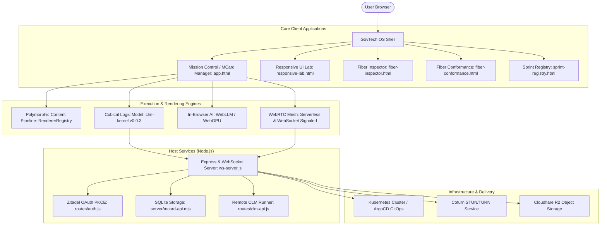

# Master Functional Overview & Architecture Map

> **Location**: [`LandingPage/docs/functionalities/00-OVERVIEW-AND-FUNCTIONALITY-MAP.md`](file:///Users/bkoo/Documents/Development/GovTech/MCard_TDD/LandingPage/docs/functionalities/00-OVERVIEW-AND-FUNCTIONALITY-MAP.md)  
> **Target Project**: [`LandingPage`](file:///Users/bkoo/Documents/Development/GovTech/MCard_TDD/LandingPage) (`pkc-landing-page-monorepo`)  
> **Status**: Comprehensive Functional Specification  
> **Related Architecture**: [`docs/01-architecture/`](file:///Users/bkoo/Documents/Development/GovTech/MCard_TDD/LandingPage/docs/01-architecture/)

---

## 1. Executive Summary

The **LandingPage** project (formally `pkc-landing-page-monorepo`) is a distributed, client-centric **Personal Knowledge Container (PKC)** and **GovTech OS** platform. It provides sovereign knowledge storage, fault-isolated component execution, mathematical and scientific hypermedia rendering, serverless and signaled peer-to-peer (WebRTC) collaboration, in-browser artificial intelligence (WebLLM), type-theoretic state verification (Cubical Logic Model / CLM), and GitOps-ready Kubernetes deployment.

Rather than a static promotional site, the LandingPage project is a rich, multi-tiered web operating environment that integrates local-first browser computing with distributed microservices and declarative design systems.



---

## 2. Monorepo Package Topology

The repository is structured as an npm workspaces monorepo containing modular libraries under [`packages/`](file:///Users/bkoo/Documents/Development/GovTech/MCard_TDD/LandingPage/packages/):

| Package | Path | Purpose | Key Exports & Dependencies |
| :--- | :--- | :--- | :--- |
| **`@pkc/core`** | [`packages/core`](file:///Users/bkoo/Documents/Development/GovTech/MCard_TDD/LandingPage/packages/core) | Lightweight module loader and capability detection for browser environments | Feature detection (`webworkers`, `webrtc`, `indexeddb`, `webgpu`), modular loader |
| **`@pkc/markdown-renderer`** | [`packages/markdown-renderer`](file:///Users/bkoo/Documents/Development/GovTech/MCard_TDD/LandingPage/packages/markdown-renderer) | Modular Markdown parser with math and diagram support | `marked`, `katex`, `mermaid`, sanitized HTML generation |
| **`@pkc/p2p`** | [`packages/p2p`](file:///Users/bkoo/Documents/Development/GovTech/MCard_TDD/LandingPage/packages/p2p) | Serverless peer-to-peer networking | WebRTC connection orchestrator, manual SDP/QR code exchange |
| **`pkc-server`** | [`packages/server`](file:///Users/bkoo/Documents/Development/GovTech/MCard_TDD/LandingPage/packages/server) | Server utilities, WebSocket gateway & Express middleware | Signaling bridge, room registry, proxy handlers |

---

## 3. High-Level Functional Capabilities

```mermaid
mindmap
  root((LandingPage Platform))
    Mission Control & MCard Management
      MCard Lifecycle & CRUD
      Local-First SQLite & IndexedDB Storage
      Dynamic View Portals (Maps, Calendars, 3D)
      PWA Offline Engine & Install Modals
    Polymorphic Rendering Pipeline
      Markdown with Callouts & Code Blocks
      LaTeX Math (KaTeX & MathJax v3)
      TikZ-CD Commutative Diagrams (TikZJax / SVG)
      Audio Synthesis (Tone.js) & Waveforms
      Video & PDF In-Browser Viewing
    Cubical Logic Model (CLM)
      clm-kernel v0.0.3 Evaluation
      Fault-Isolated Iframe Membrane
      Fiber Inspector & Conformance Harness
      Redux Type-Theoretic State Middleware
    WebRTC P2P Collaboration
      Serverless P2P (QR Code / Manual SDP)
      WebSocket Signaled Multi-User Mesh
      Multi-Party Video Meeting Rooms
      STUN/TURN NAT Traversal
    Multiplayer Realtime Games
      P2P Tic-Tac-Toe
      Authenticated Monopoly
      Authenticated Chess
      Authenticated Go
      D&D Bali Adventure Engine
    Authentication & Security
      Zitadel OAuth 2.0 / OIDC
      PKCE Code Challenge Verification
      Secure Session State & Redux Auth Slice
    In-Browser Artificial Intelligence
      WebLLM Client Engine (@mlc-ai/web-llm)
      WebGPU Hardware Acceleration
      Zero-Server Streaming Chat & Inference
    Observability & Variational Principles
      Software Lagrangian Mechanics (L = S - H)
      Fibration Dashboard & Correctness Evaluation
      Grafana Faro Real User Monitoring (RUM)
    Design System & Viewport Workbench
      Responsive UI Lab & Rotation Simulation
      Declarative Device Preset Registry
      Penpot Design Sync & Drift Verification
    DevOps & Cloud Native Delivery
      Docker & Multi-Container Compose
      ArgoCD GitOps & Kubernetes Ingress
      Cloudflare R2 Storage Synchronization
      Automated Daily Metric Reports
```

---

## 4. Master Entry Points & Routing Directory

| Entry Point / View | URL / File Path | Core Functionality |
| :--- | :--- | :--- |
| **Mission Control Portal** | [`index.html`](file:///Users/bkoo/Documents/Development/GovTech/MCard_TDD/LandingPage/index.html) | System navigation hub, environment configuration loader, links to core apps. |
| **MCard Manager** | [`app.html`](file:///Users/bkoo/Documents/Development/GovTech/MCard_TDD/LandingPage/app.html) | Primary operational interface for card management, view switching, multimedia rendering, and authenticated games. |
| **Responsive UI Lab** | [`responsive-lab.html`](file:///Users/bkoo/Documents/Development/GovTech/MCard_TDD/LandingPage/responsive-lab.html) | Multi-device viewport testing workbench with device rotation, custom dimension scaling, and layout freeze analysis. |
| **Fiber Inspector** | [`fiber-inspector.html`](file:///Users/bkoo/Documents/Development/GovTech/MCard_TDD/LandingPage/fiber-inspector.html) | Observability and correctness panel evaluating epistemic capability ($S$) against axiomatic entropy ($H$). |
| **Fiber Conformance Harness** | [`fiber-conformance.html`](file:///Users/bkoo/Documents/Development/GovTech/MCard_TDD/LandingPage/fiber-conformance.html) | Automated test harness verifying Triad compliance and membrane isolation invariants. |
| **CLM Sprint Registry** | [`sprint-registry.html`](file:///Users/bkoo/Documents/Development/GovTech/MCard_TDD/LandingPage/sprint-registry.html) | Visual SSoT display projection of the 122 sprints and 284 grammar handles from `clm-registry.yaml`. |
| **PKC Design Archive** | [`pkc-docs-index.html`](file:///Users/bkoo/Documents/Development/GovTech/MCard_TDD/LandingPage/pkc-docs-index.html) | Curated interactive reader for foundational whitepapers (Yoneda Arithmetic, Sovereign Knowledge Networks). |

---

## 5. Functional Documentation Series Index

The functionalities extracted from the LandingPage codebase are organized into the following series of dedicated specifications:

1. [`01-MISSION-CONTROL-AND-MCARD-MANAGEMENT.md`](file:///Users/bkoo/Documents/Development/GovTech/MCard_TDD/LandingPage/docs/functionalities/01-MISSION-CONTROL-AND-MCARD-MANAGEMENT.md)  
   *MCard lifecycle, storage backends (SQLite/WAL), PWA offline caching, and dynamic view management.*
2. [`02-POLYMORPHIC-CONTENT-RENDERING-PIPELINE.md`](file:///Users/bkoo/Documents/Development/GovTech/MCard_TDD/LandingPage/docs/functionalities/02-POLYMORPHIC-CONTENT-RENDERING-PIPELINE.md)  
   *RendererRegistry, Markdown with callouts, KaTeX/MathJax, TikZ-CD vectorization, and Tone.js audio synthesis.*
3. [`03-CUBICAL-LOGIC-MODEL-AND-FIBER-CORRECTNESS.md`](file:///Users/bkoo/Documents/Development/GovTech/MCard_TDD/LandingPage/docs/functionalities/03-CUBICAL-LOGIC-MODEL-AND-FIBER-CORRECTNESS.md)  
   *CLM kernel integration (v0.0.3), iframe membrane isolation, Redux CLM middleware, and Fiber conformance.*
4. [`04-WEBRTC-P2P-MESH-AND-REALTIME-COLLABORATION.md`](file:///Users/bkoo/Documents/Development/GovTech/MCard_TDD/LandingPage/docs/functionalities/04-WEBRTC-P2P-MESH-AND-REALTIME-COLLABORATION.md)  
   *Dual-mode WebRTC (serverless QR/SDP vs WebSocket signaling), RoomService v3, video meetings, and STUN/TURN NAT traversal.*
5. [`05-REALTIME-MULTIPLAYER-BOARD-GAMES.md`](file:///Users/bkoo/Documents/Development/GovTech/MCard_TDD/LandingPage/docs/functionalities/05-REALTIME-MULTIPLAYER-BOARD-GAMES.md)  
   *Distributed game engines: P2P Tic-Tac-Toe, Authenticated Monopoly, Chess, Go, and D&D Bali adventure.*
6. [`06-AUTHENTICATION-AND-IDENTITY-SYSTEM.md`](file:///Users/bkoo/Documents/Development/GovTech/MCard_TDD/LandingPage/docs/functionalities/06-AUTHENTICATION-AND-IDENTITY-SYSTEM.md)  
   *Zitadel OAuth2/OIDC integration, PKCE code challenge verification, token refresh cycles, and Redux auth slices.*
7. [`07-IN-BROWSER-AI-AND-WEB-LLM-RUNTIME.md`](file:///Users/bkoo/Documents/Development/GovTech/MCard_TDD/LandingPage/docs/functionalities/07-IN-BROWSER-AI-AND-WEB-LLM-RUNTIME.md)  
   *Zero-server in-browser WebLLM engine, WebGPU acceleration, model lifecycle management, and streaming chat.*
8. [`08-OBSERVABILITY-LAGRANGIAN-AND-TELEMETRY.md`](file:///Users/bkoo/Documents/Development/GovTech/MCard_TDD/LandingPage/docs/functionalities/08-OBSERVABILITY-LAGRANGIAN-AND-TELEMETRY.md)  
   *Principle of Least Action (ℒ), Lagrangian software scoring, Fibration dashboards, and Grafana Faro RUM.*
9. [`09-RESPONSIVE-LAB-PENPOT-AND-DESIGN-SYSTEM.md`](file:///Users/bkoo/Documents/Development/GovTech/MCard_TDD/LandingPage/docs/functionalities/09-RESPONSIVE-LAB-PENPOT-AND-DESIGN-SYSTEM.md)  
   *Responsive UI Lab, device registry, Penpot design sync & drift detection, CSS tokens, and accessibility audits.*
10. [`10-DEV-OPS-ARGO-CD-AND-INFRASTRUCTURE.md`](file:///Users/bkoo/Documents/Development/GovTech/MCard_TDD/LandingPage/docs/functionalities/10-DEV-OPS-ARGO-CD-AND-INFRASTRUCTURE.md)  
    *Containerization, Kubernetes manifests, ArgoCD GitOps, Cloudflare R2 object storage, and automated daily reporting.*
