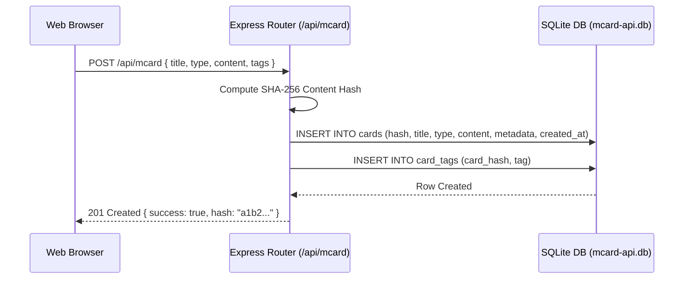

# Mission Control & MCard Management

> **Location**: [`LandingPage/docs/functionalities/01-MISSION-CONTROL-AND-MCARD-MANAGEMENT.md`](file:///Users/bkoo/Documents/Development/GovTech/MCard_TDD/LandingPage/docs/functionalities/01-MISSION-CONTROL-AND-MCARD-MANAGEMENT.md)  
> **Source Files**: [`app.html`](file:///Users/bkoo/Documents/Development/GovTech/MCard_TDD/LandingPage/app.html), [`public/js/ViewManager.js`](file:///Users/bkoo/Documents/Development/GovTech/MCard_TDD/LandingPage/public/js/ViewManager.js), [`server/mcard-api.mjs`](file:///Users/bkoo/Documents/Development/GovTech/MCard_TDD/LandingPage/server/mcard-api.mjs), [`public/js/PWAManager.js`](file:///Users/bkoo/Documents/Development/GovTech/MCard_TDD/LandingPage/public/js/PWAManager.js)  
> **Status**: Comprehensive Functional Specification

---

## 1. Overview & Capabilities

The **Mission Control / MCard Manager** (`app.html`) is the primary operational dashboard of the LandingPage platform. It provides a local-first interface for managing Personal Knowledge Cards (MCards), switching between embedded sub-applications and interactive portals, managing local SQLite databases, synchronizing with remote APIs, and supporting complete offline execution via Progressive Web App (PWA) primitives.

```mermaid
graph LR
    subgraph "App Shell: app.html"
        Header[Header & Navigation Bar]
        Sidebar[Apps Menu & Card Categories]
        MainCanvas[Dynamic Viewport & Content Canvas]
        OfflineBadge[Offline Indicator & PWA Banner]
    end

    subgraph "View Orchestration: ViewManager"
        VM[ViewManager.js]
        Config[app-views.json]
        LazyLoader[Lazy Iframe Loader]
    end

    subgraph "Storage & Data Tier"
        MCardAPI[mcard-api.mjs (Express/Node)]
        LocalDB[(data/mcard-api.db SQLite WAL)]
        BrowserStorage[(LocalStorage & IndexedDB)]
    end

    Sidebar --> VM
    VM --> Config
    VM --> LazyLoader
    LazyLoader --> MainCanvas
    MainCanvas <--> MCardAPI
    MCardAPI <--> LocalDB
    MainCanvas <--> BrowserStorage
```

---

## 2. Dynamic View Management (`ViewManager.js`)

View transitions and sub-application embeddings in [`app.html`](file:///Users/bkoo/Documents/Development/GovTech/MCard_TDD/LandingPage/app.html) are governed by the declarative [`ViewManager`](file:///Users/bkoo/Documents/Development/GovTech/MCard_TDD/LandingPage/public/js/ViewManager.js) class driven by [`public/config/app-views.json`](file:///Users/bkoo/Documents/Development/GovTech/MCard_TDD/LandingPage/public/config/app-views.json).

### 2.1 View Lifecycle & Methods

| Method | Signature | Purpose & Invariant |
| :--- | :--- | :--- |
| `init()` | `async init(configUrl)` | Fetches configuration, registers views, hooks Escape key handler, and initializes Lucide icons. |
| `show(viewId)` | `show(viewId: string)` | Hides main content canvas, reveals target view container, and triggers lazy loading if an iframe is present. |
| `hide(viewId)` | `hide(viewId: string)` | Hides view container and restores the default MCard content workspace. |
| `toggle(viewId)` | `toggle(viewId: string)` | Toggles target view visibility. Closes any other active full-screen view. |
| `hideAll()` | `hideAll()` | Reverts all views to hidden state; displays main content canvas. |
| `_lazyLoadIframe()` | `_lazyLoadIframe(element)` | Reads `data-src` on embedded iframes, sets `src`, and deletes `data-src` to prevent re-fetching. |

### 2.2 Registered View Catalog

The view manager orchestrates specialized workspaces embedded in [`app.html`](file:///Users/bkoo/Documents/Development/GovTech/MCard_TDD/LandingPage/app.html):

| View Identifier | Container ID | Description & Component Embed |
| :--- | :--- | :--- |
| `calendar` | `calendarView` | Interactive schedule viewer (`components/google-calendar.html`). |
| `map` | `mapView` | Geospatial visualization portal (`public/examples/location-map.html`). |
| `threeD` | `threeDView` | WebGL 3D interactive graphics laboratory (`public/examples/THREEJS_ANIMEJS/`). |
| `music` | `musicView` | Audio synthesizer & interactive sound playground (`public/examples/Music/`). |
| `dashboard` | `dashboardView` | WebRTC real-time network dashboard (`js/modules/webrtc-dashboard/`). |
| `morphismV1` | `morphismV1View` | Category-theoretic morphism animator (Generation 1). |
| `morphismV2` | `morphismV2View` | Category-theoretic morphism animator (Generation 2). |
| `monopoly` | `monopolyView` | Local multiplayer Monopoly board game. |
| `monopolyAuth` | `monopolyAuthView` | Authenticated peer-to-peer Monopoly session. |
| `chessAuth` | `chessAuthView` | Authenticated peer-to-peer Chess match. |
| `goAuth` | `goAuthView` | Authenticated peer-to-peer Go match. |

---

## 3. MCard Model & Storage API

The MCard is the fundamental atomic unit of content and state. Each card carries a cryptographic content hash, metadata descriptor, type indicator, and payload.

### 3.1 Backend Service: [`server/mcard-api.mjs`](file:///Users/bkoo/Documents/Development/GovTech/MCard_TDD/LandingPage/server/mcard-api.mjs)

Built on Express and `better-sqlite3`, managing [`data/mcard-api.db`](file:///Users/bkoo/Documents/Development/GovTech/MCard_TDD/LandingPage/data/mcard-api.db) configured with SQLite Write-Ahead Logging (WAL) for concurrent read/write throughput:



### 3.2 REST API Specification

| Endpoint | Method | Payload / Query | Response Structure |
| :--- | :--- | :--- | :--- |
| `/api/mcard` | `POST` | `{ title, type, content, tags, metadata }` | `{ success: true, hash, message: "Card created" }` |
| `/api/mcard` | `GET` | `?type=markdown&limit=50&offset=0` | `{ success: true, cards: [...], count }` |
| `/api/mcard/stats` | `GET` | *(none)* | `{ success: true, stats: { totalCards, typesCount, tagsCount } }` |
| `/api/mcard/search` | `GET` | `?q=query_term` | `{ success: true, results: [...] }` (Full-text search) |
| `/api/mcard/:hash` | `GET` | Path param `:hash` | `{ success: true, card: { hash, title, type, content, ... } }` |
| `/api/mcard/:hash` | `DELETE` | Path param `:hash` | `{ success: true, message: "Card deleted" }` |

---

## 4. Progressive Web App (PWA) & Offline Engine

Mission Control delivers full offline functionality through local storage fallback and progressive web app capabilities:

1. **Service Worker Architecture** ([`public/sw.js`](file:///Users/bkoo/Documents/Development/GovTech/MCard_TDD/LandingPage/public/sw.js) & [`public/sw-clm.js`](file:///Users/bkoo/Documents/Development/GovTech/MCard_TDD/LandingPage/public/sw-clm.js)):
   - **Static Asset Cache**: Caches core JavaScript, CSS tokens, fonts, and vendor libraries on installation (`install` event).
   - **Network-First with Cache Fallback**: Applies to dynamic data queries and MCard API requests.
   - **Offline Indicator**: Monitored via `window.addEventListener('online')` and `window.addEventListener('offline')`, toggling the `#offline-indicator` badge in [`app.html`](file:///Users/bkoo/Documents/Development/GovTech/MCard_TDD/LandingPage/app.html).
2. **PWA Installation Modal** ([`public/js/PWAInstallModal.js`](file:///Users/bkoo/Documents/Development/GovTech/MCard_TDD/LandingPage/public/js/PWAInstallModal.js)):
   - Captures browser `beforeinstallprompt` event.
   - Presents an unobtrusive UI prompt allowing users to add Mission Control as a standalone desktop application.
3. **Local Storage Synchronization** ([`js/local-storage-manager.js`](file:///Users/bkoo/Documents/Development/GovTech/MCard_TDD/LandingPage/js/local-storage-manager.js)):
   - Manages client-side card drafts and unsaved modifications in `localStorage` and `IndexedDB`.
   - Reconciles local changes with the SQLite backend upon reconnecting.
