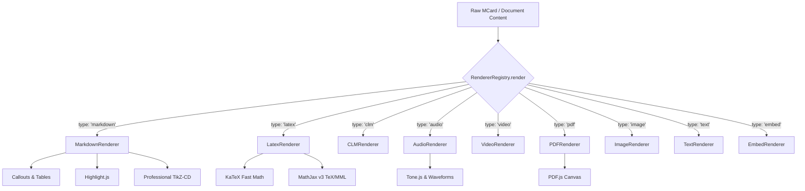

# Polymorphic Content Rendering Pipeline

> **Location**: [`LandingPage/docs/functionalities/02-POLYMORPHIC-CONTENT-RENDERING-PIPELINE.md`](file:///Users/bkoo/Documents/Development/GovTech/MCard_TDD/LandingPage/docs/functionalities/02-POLYMORPHIC-CONTENT-RENDERING-PIPELINE.md)  
> **Source Directory**: [`js/renderers/`](file:///Users/bkoo/Documents/Development/GovTech/MCard_TDD/LandingPage/js/renderers/)  
> **Primary Classes**: [`RendererRegistry`](file:///Users/bkoo/Documents/Development/GovTech/MCard_TDD/LandingPage/js/renderers/RendererRegistry.js), [`BaseRenderer`](file:///Users/bkoo/Documents/Development/GovTech/MCard_TDD/LandingPage/js/renderers/BaseRenderer.js), [`MarkdownRenderer`](file:///Users/bkoo/Documents/Development/GovTech/MCard_TDD/LandingPage/js/renderers/MarkdownRenderer.js), [`LatexRenderer`](file:///Users/bkoo/Documents/Development/GovTech/MCard_TDD/LandingPage/js/renderers/LatexRenderer.js), [`AudioRenderer`](file:///Users/bkoo/Documents/Development/GovTech/MCard_TDD/LandingPage/js/renderers/AudioRenderer.js), [`VideoRenderer`](file:///Users/bkoo/Documents/Development/GovTech/MCard_TDD/LandingPage/js/renderers/VideoRenderer.js), [`PDFRenderer`](file:///Users/bkoo/Documents/Development/GovTech/MCard_TDD/LandingPage/js/renderers/PDFRenderer.js)  
> **Status**: Comprehensive Functional Specification

---

## 1. Pipeline Architecture & Registry Pattern

The LandingPage platform implements a **Polymorphic Content Rendering Pipeline** based on the Strategy and Registry design patterns. The central [`RendererRegistry`](file:///Users/bkoo/Documents/Development/GovTech/MCard_TDD/LandingPage/js/renderers/RendererRegistry.js) decouples content representation from UI presentation, dynamically delegating rendering tasks to specialized handlers based on MIME types or schema headers.



---

## 2. Core Renderers & Capabilities

### 2.1 Markdown Engine: [`MarkdownRenderer.js`](file:///Users/bkoo/Documents/Development/GovTech/MCard_TDD/LandingPage/js/renderers/MarkdownRenderer.js)
- **Engine**: Built upon `marked.min.js`.
- **Syntax Highlighting**: Automatic language detection and theme styling via Highlight.js.
- **GitHub-style Alerts**: Renders contextual alert blocks (`[!NOTE]`, `[!TIP]`, `[!IMPORTANT]`, `[!WARNING]`, `[!CAUTION]`).
- **Table Styling**: Formats GitHub Flavored Markdown (GFM) tables with zebra striping and responsive wrappers.
- **Sanitization**: Safe HTML entity encoding and URI scheme allowlisting (`https:`, `mailto:`, `urn:`).

### 2.2 Mathematical & Scientific Notation: [`LatexRenderer.js`](file:///Users/bkoo/Documents/Development/GovTech/MCard_TDD/LandingPage/js/renderers/LatexRenderer.js)
- **Inline & Display Mathematics**: Parses delimiters (`$...$` for inline, `$$...$$` for block math).
- **Dual Engine Fallback**:
  - Primary: **KaTeX** (`0.16.9`) for millisecond-latency formula rendering.
  - Fallback: **MathJax v3** (`tex-mml-chtml.js`) for complex environments (multi-line `align*`, commutative diagrams, custom macros).
- **DOM Injection**: Asynchronously injects stylesheet dependencies if not already present in the active document.

### 2.3 Commutative Diagrams & TikZ: [`professional-tikz-renderer.js`](file:///Users/bkoo/Documents/Development/GovTech/MCard_TDD/LandingPage/js/modules/professional-tikz-renderer.js)
- **Category-Theoretic Diagrams**: Renders complex commutative squares, pullbacks, isomorphisms, and adjoint functors (`tikz-cd`).
- **Two-Tier Resolution**:
  - **Pre-rendered Vector SVGs**: Matches normalized diagram code against [`assets/tikz-diagrams/diagram-manifest.json`](file:///Users/bkoo/Documents/Development/GovTech/MCard_TDD/LandingPage/assets/tikz-diagrams/diagram-manifest.json) for instantaneous zero-CPU vector display.
  - **Dynamic In-Browser Compilation**: Fallback to client-side TikZ compiler (TikZJax via WebAssembly) when unmanifested LaTeX code is provided.

### 2.4 Audio Synthesis & Visualizers: [`AudioRenderer.js`](file:///Users/bkoo/Documents/Development/GovTech/MCard_TDD/LandingPage/js/renderers/AudioRenderer.js)
- **Format Sniffing**: Inspects magic bytes (ID3 tags `49 44 33` for MP3, RIFF headers for WAV, OggS for OGG, fLaC for FLAC).
- **Playback Controls**: Custom styled player with seekbar, volume gain, loop toggle, and duration counter.
- **Tone.js & Audio Nodes**: Supports programmatic audio generation, Web Audio API analysis, and real-time waveform visualizers.

### 2.5 Video & Hypermedia: [`VideoRenderer.js`](file:///Users/bkoo/Documents/Development/GovTech/MCard_TDD/LandingPage/js/renderers/VideoRenderer.js) & [`EmbedRenderer.js`](file:///Users/bkoo/Documents/Development/GovTech/MCard_TDD/LandingPage/js/renderers/EmbedRenderer.js)
- **HTML5 Direct Playback**: MP4, WebM, and OGV playback with responsive video containers.
- **YouTube Embedding & Clipping**: Embeds external videos and supports timestamped clip extractions (`components/youtube-clip.html`).
- **Sandboxed Embedding**: Handles interactive third-party hypermedia frames with restricted permissions (`allow-scripts`, `allow-same-origin`).

### 2.6 PDF Canvas Viewer: [`PDFRenderer.js`](file:///Users/bkoo/Documents/Development/GovTech/MCard_TDD/LandingPage/js/renderers/PDFRenderer.js)
- **PDF.js Canvas Pipeline**: Renders document pages directly onto HTML5 `<canvas>` elements without external PDF plugin dependencies.
- **Page Controls**: Previous/Next navigation, zoom scaling (50% to 200%), and page indicator.

---

## 3. Extension & Custom Renderer Protocol

All custom renderers extend [`BaseRenderer`](file:///Users/bkoo/Documents/Development/GovTech/MCard_TDD/LandingPage/js/renderers/BaseRenderer.js) adhering to the standard lifecycle interface:

```javascript
import { BaseRenderer } from './BaseRenderer.js';

export class CustomRenderer extends BaseRenderer {
  constructor() {
    super('custom-mime-type');
  }

  canRender(type) {
    return type === 'custom-mime-type';
  }

  async render(container, content, options = {}) {
    // 1. Clear previous content
    this.destroy(container);

    // 2. Build DOM elements
    const element = document.createElement('div');
    element.className = 'custom-renderer-container';
    element.textContent = this.transform(content);

    // 3. Attach to container
    container.appendChild(element);
    return element;
  }

  destroy(container) {
    container.innerHTML = '';
  }
}
```
