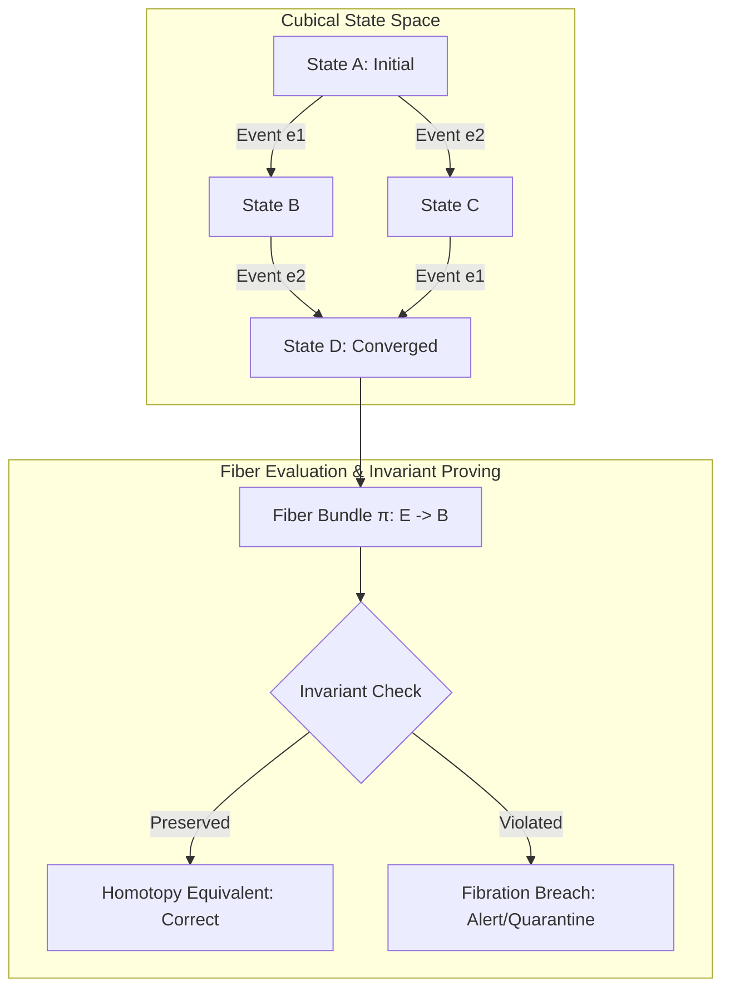

# Cubical Logic Model (CLM) & Fiber Correctness

> **Location**: [`LandingPage/docs/functionalities/03-CUBICAL-LOGIC-MODEL-AND-FIBER-CORRECTNESS.md`](file:///Users/bkoo/Documents/Development/GovTech/MCard_TDD/LandingPage/docs/functionalities/03-CUBICAL-LOGIC-MODEL-AND-FIBER-CORRECTNESS.md)  
> **Source Files**: [`fiber-inspector.html`](file:///Users/bkoo/Documents/Development/GovTech/MCard_TDD/LandingPage/fiber-inspector.html), [`fiber-conformance.html`](file:///Users/bkoo/Documents/Development/GovTech/MCard_TDD/LandingPage/fiber-conformance.html), [`js/clm-iframe-loader.js`](file:///Users/bkoo/Documents/Development/GovTech/MCard_TDD/LandingPage/js/clm-iframe-loader.js), [`js/redux/slices/clm-slice.js`](file:///Users/bkoo/Documents/Development/GovTech/MCard_TDD/LandingPage/js/redux/slices/clm-slice.js), [`js/redux/middleware/clm-middleware.js`](file:///Users/bkoo/Documents/Development/GovTech/MCard_TDD/LandingPage/js/redux/middleware/clm-middleware.js)  
> **Kernel Version**: `clm-kernel@0.0.3` ([`public/js/vendor/clm-kernel.bundle.js`](file:///Users/bkoo/Documents/Development/GovTech/MCard_TDD/LandingPage/public/js/vendor/clm-kernel.bundle.js))  
> **Status**: Comprehensive Functional Specification

---

## 1. Mathematical Foundations & Concept

The **Cubical Logic Model (CLM)** is a formal, type-theoretic framework for modeling distributed, multi-agent state machines, protocols, and hypermedia documents as cubes within a higher-dimensional cubical set.

In this paradigm:
- **Vertices (0-cubes)**: Discrete static states (e.g., Unauthenticated, Connected, In-Call).
- **Edges (1-cubes)**: Single transitions or operational steps.
- **Faces (2-cubes)**: Commutative paths proving that execution order does not affect the final state (concurrency independence).
- **Volumes (3-cubes) & Fibers**: Higher homotopies representing protocol coherence, multi-party consensus, and fiber bundles over state projections.



---

## 2. Kernel Integration (`clm-kernel@0.0.3`)

The client embeds the bundled kernel [`public/js/vendor/clm-kernel.bundle.js`](file:///Users/bkoo/Documents/Development/GovTech/MCard_TDD/LandingPage/public/js/vendor/clm-kernel.bundle.js) built from `clm-kernel@0.0.3`.

Key capabilities exposed:
1. **Manifest Parsing & Validation**: Reads declarative YAML/JSON Petri net and CLM manifests (`examples/*.clm.yaml`).
2. **Deterministic Evaluation Engine**: Evaluates state transitions, Petri net firing counts, final markings, and invariants across execution sequences.
3. **Cross-Language Equivalence**: Guarantees identical execution semantics with Rust (`clm_rust_core`) and Python (`clm_py_core`).

---

## 3. Fault-Isolated Iframe Membrane

To prevent malformed or crashing third-party plugins from taking down the host workspace, components execute inside isolated iframes mediated by the **CLM Membrane Protocol**:

```mermaid
sequenceDiagram
    participant Host as Host Page (GovTech OS)
    participant Middleware as Redux CLM Middleware
    participant Frame as Isolated Component Iframe

    Host->>Frame: window.postMessage({ type: 'clm_init', config })
    Frame-->>Middleware: window.postMessage({ type: 'clm_heartbeat', componentId, timestamp })
    Note over Middleware: Heartbeat tracked in clm-slice

    alt User Interacts inside Component
        Frame-->>Middleware: window.postMessage({ type: 'clm_event', componentId, event: 'card_clicked', data })
        Middleware->>Host: Dispatch componentEvent() to Redux
        Middleware-->>Frame: Broadcast update to peer components
    else Component Crashes / Uncaught Exception
        Frame--x Middleware: Heartbeat times out (>5000ms)
        Middleware->>Host: Dispatch componentFailed({ componentId, reason: 'timeout' })
        Host->>Host: Render fallback error boundary; isolated frame quarantined
    end
```

### 3.1 Membrane Messages Specification

| Message Type | Direction | Payload Structure | Purpose |
| :--- | :--- | :--- | :--- |
| `clm_init` | Host $\to$ Frame | `{ type: 'clm_init', componentId, registryEntry, theme }` | Initializes iframe with host configuration. |
| `clm_heartbeat` | Frame $\to$ Host | `{ type: 'clm_heartbeat', componentId, timestamp, memoryUsage }` | Liveness proof; watchdog resets timeout counter. |
| `clm_event` | Frame $\to$ Host | `{ type: 'clm_event', componentId, event, data, timestamp }` | State transition or user action emitted to host Redux store. |
| `clm_state_update`| Host $\to$ Frame | `{ type: 'clm_state_update', slice, newState }` | Synchronizes global application state to child iframe. |

---

## 4. Fiber Inspector & Observability Panel

Located at [`fiber-inspector.html`](file:///Users/bkoo/Documents/Development/GovTech/MCard_TDD/LandingPage/fiber-inspector.html) and implemented by [`js/observability/correctness/correctness-panel.js`](file:///Users/bkoo/Documents/Development/GovTech/MCard_TDD/LandingPage/js/observability/correctness/correctness-panel.js):

- **Correctness Evaluation**: Compares measured epistemic capability ($S$) against residual axiomatic entropy ($H$).
- **Lattice Inspection**: Live inspection of Hasse diagrams and state lattices.
- **Witness Verification**: Reads and validates cryptographic witness records from [`public/conformance/witness.json`](file:///Users/bkoo/Documents/Development/GovTech/MCard_TDD/LandingPage/public/conformance/witness.json).

---

## 5. Fiber Conformance Test Harness

Located at [`fiber-conformance.html`](file:///Users/bkoo/Documents/Development/GovTech/MCard_TDD/LandingPage/fiber-conformance.html):

- **Automated Invariant Verification**: Runs battery of tests against [`public/conformance/harness-data.json`](file:///Users/bkoo/Documents/Development/GovTech/MCard_TDD/LandingPage/public/conformance/harness-data.json).
- **Unit Lint Integration**: Reads static and dynamic linter violations from [`public/conformance/unit-lint.json`](file:///Users/bkoo/Documents/Development/GovTech/MCard_TDD/LandingPage/public/conformance/unit-lint.json).
- **Membrane Probe**: Uses [`public/conformance/membrane-probe.html`](file:///Users/bkoo/Documents/Development/GovTech/MCard_TDD/LandingPage/public/conformance/membrane-probe.html) to stress-test cross-frame security and data boundary leaks.
