# WebRTC P2P Mesh & Real-Time Collaboration

> **Location**: [`LandingPage/docs/functionalities/04-WEBRTC-P2P-MESH-AND-REALTIME-COLLABORATION.md`](file:///Users/bkoo/Documents/Development/GovTech/MCard_TDD/LandingPage/docs/functionalities/04-WEBRTC-P2P-MESH-AND-REALTIME-COLLABORATION.md)  
> **Source Directories**: [`js/modules/p2p-serverless/`](file:///Users/bkoo/Documents/Development/GovTech/MCard_TDD/LandingPage/js/modules/p2p-serverless/), [`js/modules/webrtc-dashboard/`](file:///Users/bkoo/Documents/Development/GovTech/MCard_TDD/LandingPage/js/modules/webrtc-dashboard/), [`js/modules/video-meeting/`](file:///Users/bkoo/Documents/Development/GovTech/MCard_TDD/LandingPage/js/modules/video-meeting/)  
> **Backend Components**: [`ws-server.js`](file:///Users/bkoo/Documents/Development/GovTech/MCard_TDD/LandingPage/ws-server.js), [`room-registry.mjs`](file:///Users/bkoo/Documents/Development/GovTech/MCard_TDD/LandingPage/room-registry.mjs), [`room-message-handler-server.mjs`](file:///Users/bkoo/Documents/Development/GovTech/MCard_TDD/LandingPage/room-message-handler-server.mjs)  
> **Status**: Comprehensive Functional Specification

---

## 1. Dual-Mode Networking Architecture

The LandingPage platform implements a **Dual-Mode WebRTC Architecture** designed to support both completely decentralized zero-server environments (air-gapped or local networks) and high-concurrency orchestrated mesh rooms.

```mermaid
graph TB
    subgraph "Mode 1: Serverless P2P (Zero Infrastructure)"
        PeerA[Peer A: Initiator]
        PeerB[Peer B: Receiver]
        SDP[Manual SDP / Base64 Token / QR Code]
        
        PeerA <-->|Out-of-band Token Exchange| SDP
        SDP <-->|Token Ingestion| PeerB
        PeerA ===|Direct P2P DataChannel / AudioVideo| PeerB
    end

    subgraph "Mode 2: WebSocket Signaled Multi-User Mesh"
        HostNode[Host Client]
        Guest1[Peer Node 1]
        Guest2[Peer Node 2]
        WSServer[WebSocket Hub: ws-server.js]

        HostNode <-->|Signaling: Offer/Answer/ICE| WSServer
        Guest1 <-->|Signaling: Offer/Answer/ICE| WSServer
        Guest2 <-->|Signaling: Offer/Answer/ICE| WSServer
        
        HostNode <===>|WebRTC Mesh| Guest1
        Guest1 <===>|WebRTC Mesh| Guest2
        HostNode <===>|WebRTC Mesh| Guest2
    end
```

---

## 2. Serverless P2P Module (`p2p-serverless/`)

Located at [`js/modules/p2p-serverless/`](file:///Users/bkoo/Documents/Development/GovTech/MCard_TDD/LandingPage/js/modules/p2p-serverless/):

- **Perfect Negotiation Pattern**: Implements standard W3C WebRTC perfect negotiation with `makingOffer`, `ignoreOffer`, and polite peer resolution to eliminate glare race conditions.
- **Manual Discovery via QR & Token**:
  - Encodes compressed Session Description Protocol (SDP) and ICE candidates into base64 JSON tokens.
  - Interactive QR code generation (`qr-code.js`) allows peer pairing across mobile devices with camera scanners.
- **DataChannel Protocol**:
  - Label: `pkc-data-channel`.
  - Ordered, reliable message delivery for text chat, MCard exchange, and game move updates.

---

## 3. WebRTC Dashboard & Room Service v3.0

Located at [`js/modules/webrtc-dashboard/`](file:///Users/bkoo/Documents/Development/GovTech/MCard_TDD/LandingPage/js/modules/webrtc-dashboard/):

The room architecture was refactored into a modular suite orchestrated by [`RoomService`](file:///Users/bkoo/Documents/Development/GovTech/MCard_TDD/LandingPage/js/modules/webrtc-dashboard/room-service-v3.js):

| Component Service | Source File | Responsibilities |
| :--- | :--- | :--- |
| **`RoomState`** | [`services/room-state.js`](file:///Users/bkoo/Documents/Development/GovTech/MCard_TDD/LandingPage/js/modules/webrtc-dashboard/services/room-state.js) | Centralized reactive state store for room configuration, members, and active channels. |
| **`RoomCreator`** | [`services/room-creator.js`](file:///Users/bkoo/Documents/Development/GovTech/MCard_TDD/LandingPage/js/modules/webrtc-dashboard/services/room-creator.js) | Handles room creation, password protection, host permissions, and Redux sync. |
| **`RoomJoiner`** | [`services/room-joiner.js`](file:///Users/bkoo/Documents/Development/GovTech/MCard_TDD/LandingPage/js/modules/webrtc-dashboard/services/room-joiner.js) | Manages admission handshake, participant authorization, and connection establishment. |
| **`RoomBroadcaster`**| [`services/room-broadcaster.js`](file:///Users/bkoo/Documents/Development/GovTech/MCard_TDD/LandingPage/js/modules/webrtc-dashboard/services/room-broadcaster.js) | Emits room updates and participant activity across connected peers. |
| **`RoomDiscovery`** | [`services/room-discovery.js`](file:///Users/bkoo/Documents/Development/GovTech/MCard_TDD/LandingPage/js/modules/webrtc-dashboard/services/room-discovery.js) | Polls and listens for active rooms advertised by the WebSocket signaling server. |
| **`WebRTCCoordinator`**| [`services/webrtc-coordinator.js`](file:///Users/bkoo/Documents/Development/GovTech/MCard_TDD/LandingPage/js/modules/webrtc-dashboard/services/webrtc-coordinator.js) | Manages peer connection pools, track additions, and renegotiations. |
| **`RoomMessageHandler`**| [`services/room-message-handler.js`](file:///Users/bkoo/Documents/Development/GovTech/MCard_TDD/LandingPage/js/modules/webrtc-dashboard/services/room-message-handler.js) | Routes inbound chat, system notifications, and card transfer messages. |

---

## 4. Multi-Party Video Meetings (`video-meeting/`)

Located at [`js/modules/video-meeting/`](file:///Users/bkoo/Documents/Development/GovTech/MCard_TDD/LandingPage/js/modules/video-meeting/):

- **Media Pipeline**: Captures local camera and microphone via `navigator.mediaDevices.getUserMedia()`.
- **Dynamic Video Grid**: Automatically recalculates aspect ratios and layout grid columns based on active participant count.
- **Audio/Video Controls**:
  - Dynamic track toggling (`track.enabled = !track.enabled`) without renegotiating SDP.
  - In-meeting text chat and status banners.
  - Participant leave/disconnect cleanup with stream teardown.

---

## 5. NAT Traversal & STUN/TURN Infrastructure

- **Local STUN Server**:
  - Automated deployment via [`docker-compose.stun.yml`](file:///Users/bkoo/Documents/Development/GovTech/MCard_TDD/LandingPage/docker-compose.stun.yml) running Coturn on port `3478` (UDP/TCP).
  - Controlled by script [`scripts/start-stun.sh`](file:///Users/bkoo/Documents/Development/GovTech/MCard_TDD/LandingPage/scripts/start-stun.sh).
- **Public Fallback**:
  - Built-in failover to Google Public STUN (`stun:stun.l.google.com:19302`) when local infrastructure is unreachable.
- **Candidate Filtering**: Automatically prioritizes host and server-reflexive candidates for minimal latency on intranet deployments.
