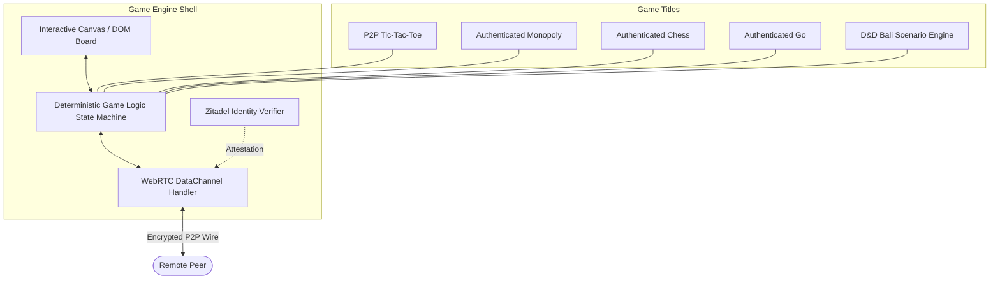

# Real-Time Multiplayer Board Games

> **Location**: [`LandingPage/docs/functionalities/05-REALTIME-MULTIPLAYER-BOARD-GAMES.md`](file:///Users/bkoo/Documents/Development/GovTech/MCard_TDD/LandingPage/docs/functionalities/05-REALTIME-MULTIPLAYER-BOARD-GAMES.md)  
> **Source Directories**: [`js/modules/tic-tac-toe-p2p/`](file:///Users/bkoo/Documents/Development/GovTech/MCard_TDD/LandingPage/js/modules/tic-tac-toe-p2p/), [`public/examples/games/`](file:///Users/bkoo/Documents/Development/GovTech/MCard_TDD/LandingPage/public/examples/games/), [`docs/Dungeons and Dragons/`](file:///Users/bkoo/Documents/Development/GovTech/MCard_TDD/LandingPage/docs/Dungeons%20and%20Dragons/)  
> **Status**: Comprehensive Functional Specification

---

## 1. Overview & Gaming Architecture

The LandingPage platform integrates a suite of **distributed peer-to-peer multiplayer games**. These games serve a dual purpose: demonstrating sub-millisecond client-to-client state synchronization over WebRTC data channels, and showcasing authenticated multi-user sessions secured by Zitadel OAuth 2.0.



---

## 2. Distributed Turn-Based Engine (`tic-tac-toe-p2p/`)

Located at [`js/modules/tic-tac-toe-p2p/`](file:///Users/bkoo/Documents/Development/GovTech/MCard_TDD/LandingPage/js/modules/tic-tac-toe-p2p/):

### 2.1 State Model ([`game-logic.js`](file:///Users/bkoo/Documents/Development/GovTech/MCard_TDD/LandingPage/js/modules/tic-tac-toe-p2p/game-logic.js))
- **Board Representation**: Array of 9 cells (`null`, `'X'`, or `'O'`).
- **Turn Alternation**: Rigorous enforcement of `canMakeMove()`, verifying that the local player's role matches `currentPlayer`.
- **Win Condition Detection**: Checks 8 winning lines (3 horizontal, 3 vertical, 2 diagonal) after every move; detects draw states when all 9 cells are filled with no winning line.

### 2.2 Wire Protocol & Message Serialization
Messages exchanged over the `pkc-game-channel`:

```json
{
  "type": "game-move",
  "position": 4,
  "player": "X",
  "sequence": 1,
  "timestamp": 1770547200000
}
```

```json
{
  "type": "game-reset-request",
  "proposedBy": "O"
}
```

---

## 3. Authenticated Multiplayer Board Game Suite

Integrated into [`app.html`](file:///Users/bkoo/Documents/Development/GovTech/MCard_TDD/LandingPage/app.html) via specialized views:

### 3.1 Authenticated Monopoly (`monopolyAuthView`)
- **Board Topology**: 40 tiles including properties, railroads, utilities, Chance, Community Chest, and Jail.
- **Economic Simulation**: Dice roll mechanics, property buying, rent calculations, mortgage status, and player bankruptcy logic.
- **Identity Invariant**: Player pieces and bank accounts are cryptographically tied to verified Zitadel user IDs (`sub` claim), preventing impersonation.

### 3.2 Authenticated Chess (`chessAuthView`)
- **Engine Rules**: Complete FIDE rule compliance: castling, en passant, pawn promotion, check, checkmate, and stalemate.
- **Time Controls**: Synchronized chess clocks with increment timers.
- **PGN Export**: Generates Portable Game Notation (PGN) stored as an MCard upon match completion.

### 3.3 Authenticated Go (`goAuthView`)
- **Board Dimensions**: Supports 9x9, 13x13, and standard 19x19 grids.
- **Territory & Capture Rules**: Liberty counting, group capturing, suicide move prohibition, and Ko rule enforcement.
- **Handicap & Scoring**: Japanese and Chinese scoring algorithms.

### 3.4 Dungeons & Dragons (D&D Bali) Adventure Engine
- Located at [`docs/Dungeons and Dragons/`](file:///Users/bkoo/Documents/Development/GovTech/MCard_TDD/LandingPage/docs/Dungeons%20and%20Dragons/).
- Dynamic narrative branching with dice-rolling probability distributions (d20 system) and collaborative party inventory management.

---

## 4. Concurrency Control & Disconnect Recovery

1. **Deterministic Move Ordering**: All actions carry monotonic sequence numbers. Out-of-order packets are buffered until gaps resolve.
2. **Optimistic Local Update with Rollback**: Move is staged immediately on the local board and confirmed upon peer acknowledgment.
3. **Heartbeat & Graceful Reconnection**: Data channels transmit ping/pong frames every 2000ms. If connection drops, game state is frozen for a 30-second grace window allowing ICE restart before forfeiture.
