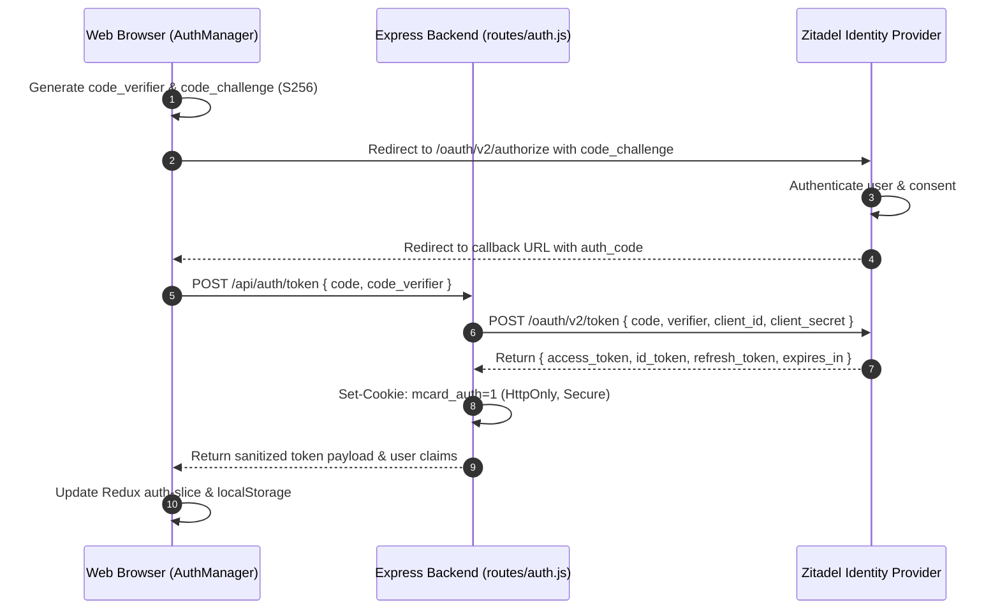

# Authentication & Identity System

> **Location**: [`LandingPage/docs/functionalities/06-AUTHENTICATION-AND-IDENTITY-SYSTEM.md`](file:///Users/bkoo/Documents/Development/GovTech/MCard_TDD/LandingPage/docs/functionalities/06-AUTHENTICATION-AND-IDENTITY-SYSTEM.md)  
> **Source Files**: [`routes/auth.js`](file:///Users/bkoo/Documents/Development/GovTech/MCard_TDD/LandingPage/routes/auth.js), [`js/modules/auth-manager.js`](file:///Users/bkoo/Documents/Development/GovTech/MCard_TDD/LandingPage/js/modules/auth-manager.js), [`public/config/zitadel-config.js`](file:///Users/bkoo/Documents/Development/GovTech/MCard_TDD/LandingPage/public/config/zitadel-config.js), [`js/components/AuthStatusComponent.js`](file:///Users/bkoo/Documents/Development/GovTech/MCard_TDD/LandingPage/js/components/AuthStatusComponent.js)  
> **Identity Provider**: Zitadel OpenID Connect (OIDC)  
> **Status**: Comprehensive Functional Specification

---

## 1. Security Architecture & Threat Model

The LandingPage identity subsystem is built on **OAuth 2.0 and OpenID Connect (OIDC)**, integrated with an enterprise Zitadel instance (`vpn.pkc.pub`). 

The architecture strictly isolates secrets and tokens through a **Hybrid Backend-For-Frontend (BFF)** pattern:
- **Client Application**: Operates using Authorization Code Flow with **Proof Key for Code Exchange (PKCE)**. The browser never holds or sees the `ZITADEL_CLIENT_SECRET`.
- **Backend API Gateway** ([`routes/auth.js`](file:///Users/bkoo/Documents/Development/GovTech/MCard_TDD/LandingPage/routes/auth.js)): Holds the confidential `CLIENT_SECRET` in server environment variables, appending it when exchanging authorization codes with Zitadel's token endpoint (`/oauth/v2/token`).
- **Secure Session Cookies**: Sets `HttpOnly`, `SameSite=Lax`, and `Secure` (in production) cookies (`mcard_auth=1`) preventing Cross-Site Scripting (XSS) token exfiltration.



---

## 2. Backend Authentication Endpoints ([`routes/auth.js`](file:///Users/bkoo/Documents/Development/GovTech/MCard_TDD/LandingPage/routes/auth.js))

| Endpoint | Method | Input Parameters | Processing & Invariants |
| :--- | :--- | :--- | :--- |
| `/api/auth/token` | `POST` | `{ code, code_verifier, redirect_uri }` | Validates PKCE code against backend secret; issues auth cookie; returns access & ID tokens. |
| `/api/auth/refresh`| `POST` | `{ refresh_token }` | Refreshes expired access tokens without re-prompting user; maintains session continuity. |
| `/api/auth/logout` | `POST` | `{ token }` | Clears `mcard_auth` cookie; invalidates session on Zitadel if supported; returns success. |

---

## 3. Client Authentication Manager ([`js/modules/auth-manager.js`](file:///Users/bkoo/Documents/Development/GovTech/MCard_TDD/LandingPage/js/modules/auth-manager.js))

The client manager maintains session state, handles token refreshes, and binds identity into Redux:

### 3.1 Redux Auth Slice Schema
```javascript
{
  name: 'auth',
  initialState: {
    isAuthenticated: false,
    user: null,          // { sub, name, email, preferred_username, roles }
    token: null,         // JWT access token
    refreshToken: null,  // Token rotation string
    loading: false,
    error: null
  }
}
```

### 3.2 Key Methods

| Method | Behavior |
| :--- | :--- |
| `init()` | Bootstraps Redux slice, loads configuration, checks existing tokens in `localStorage`. |
| `login()` | Generates cryptographically secure 128-byte random `code_verifier`, computes SHA-256 `code_challenge`, stores verifier in `sessionStorage`, and redirects to Zitadel authorize URL. |
| `handleCallback()` | Extracts `code` parameter from URL query string, retrieves `code_verifier`, posts to `/api/auth/token`, and populates Redux store. |
| `refreshToken()` | Automatically called 60 seconds before token expiration (`expires_at`) to rotate JWT credentials seamlessly. |
| `logout()` | Clears `sessionStorage`, `localStorage`, dispatches Redux reset, and posts to `/api/auth/logout`. |

---

## 4. UI Components & Status Indicators

- **Auth Status Badge** ([`components/auth-status.html`](file:///Users/bkoo/Documents/Development/GovTech/MCard_TDD/LandingPage/components/auth-status.html) / [`js/components/AuthStatusComponent.js`](file:///Users/bkoo/Documents/Development/GovTech/MCard_TDD/LandingPage/js/components/AuthStatusComponent.js)): Displays authenticated username, user avatar, roles, and a quick-action Sign In / Sign Out button in the navigation header.
- **Role-Based Access Control (RBAC)**: Views like `monopolyAuthView` and administrative tabs inspect `state.auth.user.roles` before allowing room creation or game participation.
