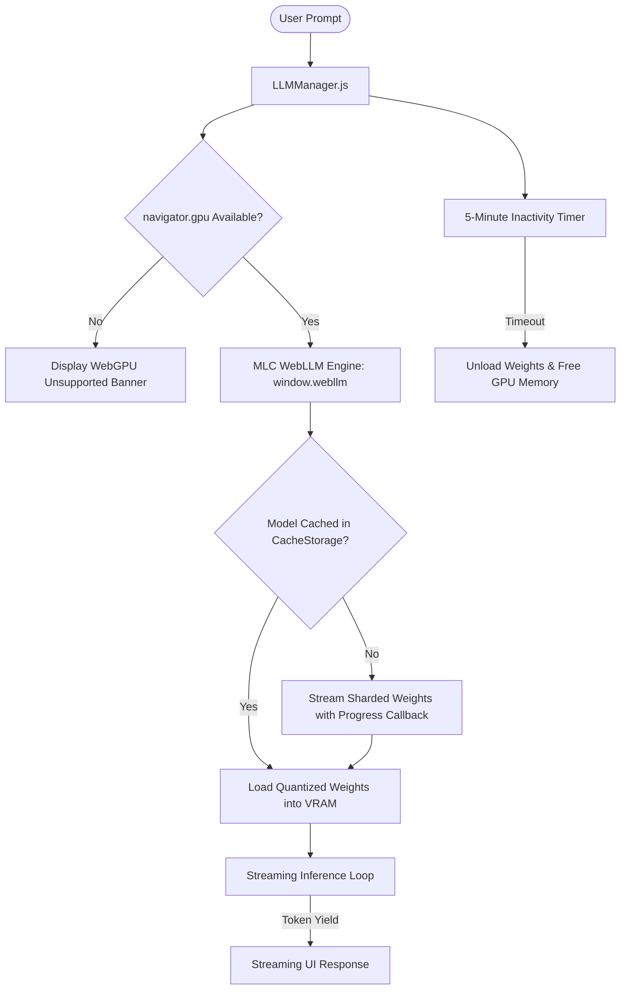

# In-Browser AI & WebLLM Runtime

> **Location**: [`LandingPage/docs/functionalities/07-IN-BROWSER-AI-AND-WEB-LLM-RUNTIME.md`](file:///Users/bkoo/Documents/Development/GovTech/MCard_TDD/LandingPage/docs/functionalities/07-IN-BROWSER-AI-AND-WEB-LLM-RUNTIME.md)  
> **Source Directory**: [`js/modules/web-llm/`](file:///Users/bkoo/Documents/Development/GovTech/MCard_TDD/LandingPage/js/modules/web-llm/)  
> **Core Engine**: [`@mlc-ai/web-llm`](https://github.com/mlc-ai/web-llm)  
> **Status**: Comprehensive Functional Specification

---

## 1. Overview & Sovereign AI Thesis

The **WebLLM Runtime** enables zero-server, privacy-preserving, in-browser artificial intelligence directly on the user's hardware. By leveraging modern **WebGPU primitives**, quantized Large Language Models (LLMs) execute client-side inside the browser sandbox without sending user queries or MCard contents to third-party cloud providers.



---

## 2. Model Catalog & Quantization Profiles ([`config.js`](file:///Users/bkoo/Documents/Development/GovTech/MCard_TDD/LandingPage/js/modules/web-llm/config.js))

The runtime defines three standardized models optimized for client hardware:

| Model Identifier | Display Name | Quantized Size | Target Hardware & Performance | Default |
| :--- | :--- | :--- | :--- | :--- |
| **`Phi-2-q4f16_1`** | **Phi-2 (Fast)** | ~1.3 GB | Fast responses; recommended for general chat and MCard assistance on Apple Silicon / RTX GPUs. | **Yes** (Recommended) |
| **`Llama-2-7b-chat-hf-q4f16_1`** | **Llama-2 7B (Balanced)** | ~4.0 GB | Higher reasoning quality; suitable for complex workflow analysis and code generation. | No |
| **`TinyLlama-1.1B-Chat-v0.4-q4f16_1`** | **TinyLlama (Ultra Fast)** | ~600 MB | Minimal memory footprint; ideal for lower-spec laptops and rapid test validation. | No |

---

## 3. Architecture & Lifecycle ([`llm-manager.js`](file:///Users/bkoo/Documents/Development/GovTech/MCard_TDD/LandingPage/js/modules/web-llm/llm-manager.js))

The [`LLMManager`](file:///Users/bkoo/Documents/Development/GovTech/MCard_TDD/LandingPage/js/modules/web-llm/llm-manager.js) encapsulates all lifecycle and generation operations:

### 3.1 State Transitions
```
UNLOADED ──(request)──> DOWNLOADING ────> LOADING ────> READY
   ▲                                                      │
   │                                                      ▼
   └──────────────(5-min Inactivity Timeout)──────────────┘
```

### 3.2 Core Methods & Capabilities

| Method | Behavior & Contract |
| :--- | :--- |
| `checkWebGPUAvailability()` | Verifies `navigator.gpu` presence and requests `GPUAdapter`; throws structured `WEBGPU_NOT_AVAILABLE` error on failure. |
| `loadModel(modelId, progressCallback)` | Initializes `CreateMLCEngine()`; streams model shards into browser Cache Storage, reporting download percentage to UI progress bars. |
| `generateResponse(prompt, onTokenCallback)` | Formats system prompt and conversation history (capped at 10 turns); streams tokens incrementally via async generator. |
| `resetInactivityTimer()` | Resets the 5-minute inactivity watchdog on user interaction; triggers automatic model disposal if idle to reclaim GPU VRAM. |
| `clearHistory()` | Flushes conversation context buffer while maintaining loaded model weights in memory. |

---

## 4. Prompt Engineering & Domain Assistant Integration

The runtime injects a domain-specific system prompt tailoring the assistant for the GovTech / CLM platform:

- **CLM & MCard Knowledge**: Educated to guide users in authoring Cubical Logic Model manifests and understanding category-theoretic diagrams.
- **Workflow Navigation**: Explains dashboard panels, responsive viewports, and P2P room creation.
- **Troubleshooting**: Guides users through Zitadel OAuth setups and WebRTC connection diagnostics.
