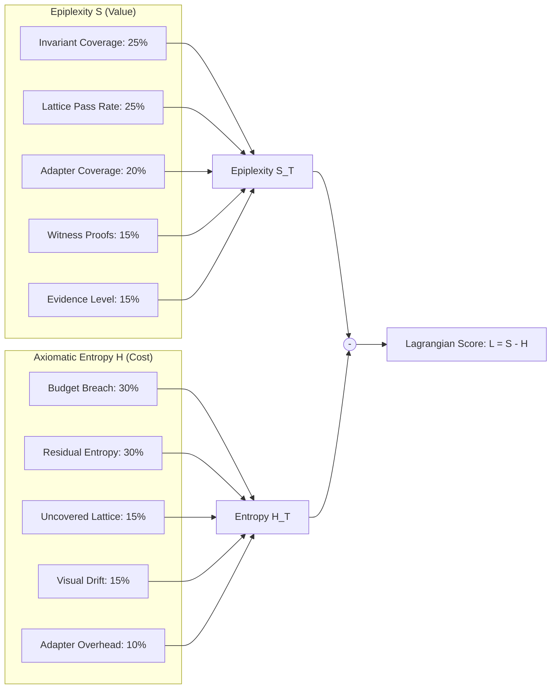

# Observability, Lagrangian Mechanics & Telemetry

> **Location**: [`LandingPage/docs/functionalities/08-OBSERVABILITY-LAGRANGIAN-AND-TELEMETRY.md`](file:///Users/bkoo/Documents/Development/GovTech/MCard_TDD/LandingPage/docs/functionalities/08-OBSERVABILITY-LAGRANGIAN-AND-TELEMETRY.md)  
> **Source Directories**: [`js/observability/`](file:///Users/bkoo/Documents/Development/GovTech/MCard_TDD/LandingPage/js/observability/), [`js/telemetry/`](file:///Users/bkoo/Documents/Development/GovTech/MCard_TDD/LandingPage/js/telemetry/)  
> **Key Implementations**: [`lagrangian.js`](file:///Users/bkoo/Documents/Development/GovTech/MCard_TDD/LandingPage/js/observability/lagrangian.js), [`fibration-dashboard.js`](file:///Users/bkoo/Documents/Development/GovTech/MCard_TDD/LandingPage/js/observability/fibration-dashboard.js), [`faro-collector.js`](file:///Users/bkoo/Documents/Development/GovTech/MCard_TDD/LandingPage/js/telemetry/faro-collector.js)  
> **Status**: Comprehensive Functional Specification

---

## 1. The Software Lagrangian Variational Principle

The platform introduces a formal mathematical framework for measuring software quality and architecture health derived from analytical mechanics:

$$\mathcal{L}(u, \tau) = S_T(u, \tau) - H_T(u, \tau)$$

Where:
- **$\mathcal{L}(u, \tau)$ (Software Lagrangian)**: The net variational score of system unit $u$ at evolution step $\tau$. High positive values denote high structural integrity with minimal debt.
- **$S_T$ (Epiplexity / Epistemic Capability)**: The sum of verified structural invariants, test suite coverage, type lattice pass rates, and cryptographic witness counts.
- **$H_T$ (Axiomatic Entropy / Friction)**: The measure of residual debt, budget breaches, visual layout drift, and adapter coupling overhead.



---

## 2. Lagrangian Scorer Implementation ([`lagrangian.js`](file:///Users/bkoo/Documents/Development/GovTech/MCard_TDD/LandingPage/js/observability/lagrangian.js))

The scorer takes raw metric telemetry and computes the normalized variational action:

```javascript
import { computeLagrangian, DEFAULT_WEIGHTS } from './js/observability/lagrangian.js';

const metrics = {
  functionality: {
    invariant_coverage: 1.0,
    lattice_pass_rate: 1.0,
    adapter_coverage: 0.95,
    witness_count: 6,
    evidence_level: 1.0
  },
  entropy: {
    budget_breach_ratio: 0.0,
    residual_entropy: 0.05,
    uncovered_lattice_fraction: 0.0,
    visual_drift_ratio: 0.02,
    adapter_overhead: 0.04
  }
};

const result = computeLagrangian(metrics);
// result.lagrangian: ~0.90 (Optimal stationary action)
```

The [`least-action-navigator.js`](file:///Users/bkoo/Documents/Development/GovTech/MCard_TDD/LandingPage/js/runtime/least-action-navigator.js) uses these scores to optimize page transitions, routing users along paths of least computational and cognitive action ($\delta \int \mathcal{L} \, dt = 0$).

---

## 3. Fibration Observability Dashboard ([`fibration-dashboard.js`](file:///Users/bkoo/Documents/Development/GovTech/MCard_TDD/LandingPage/js/observability/fibration-dashboard.js))

The Fibration Dashboard provides real-time visualization of fiber bundles, state topologies, and metric collectors:

- **Fiber Space Visualization**: Uses D3.js and Chart.js to plot higher-dimensional state projections into 2D/3D charts.
- **Metric Collectors**:
  - [`collectors/functionality.js`](file:///Users/bkoo/Documents/Development/GovTech/MCard_TDD/LandingPage/js/observability/collectors/functionality.js): Tracks invariant verification, test results, and runtime assertions.
  - [`collectors/payload.js`](file:///Users/bkoo/Documents/Development/GovTech/MCard_TDD/LandingPage/js/observability/collectors/payload.js): Monitors asset byte sizes, compression ratios, and cache hit percentages.
  - [`collectors/performance.js`](file:///Users/bkoo/Documents/Development/GovTech/MCard_TDD/LandingPage/js/observability/collectors/performance.js): Records CPU frame times, memory allocations, and WebRTC round-trip times (RTT).

---

## 4. Grafana Faro Telemetry ([`faro-collector.js`](file:///Users/bkoo/Documents/Development/GovTech/MCard_TDD/LandingPage/js/telemetry/faro-collector.js))

The frontend integrates the **Grafana Faro Web SDK** for Real User Monitoring (RUM) and distributed tracing:

- **Type Lattice Tagging**: Every frontend trace, console error, and web vital is tagged with its active Type Lattice coordinate (`{ layer, dimension, state }`), providing deep contextual traceability.
- **Automated Web Vitals**: Captures Core Web Vitals:
  - Largest Contentful Paint (LCP)
  - First Input Delay (FID) / Interaction to Next Paint (INP)
  - Cumulative Layout Shift (CLS)
- **Error & Promise Watchdog**: Listens globally for uncaught JavaScript exceptions and unhandled promise rejections, streaming stack traces to the telemetry collector (`FARO_COLLECTOR_URL`).
