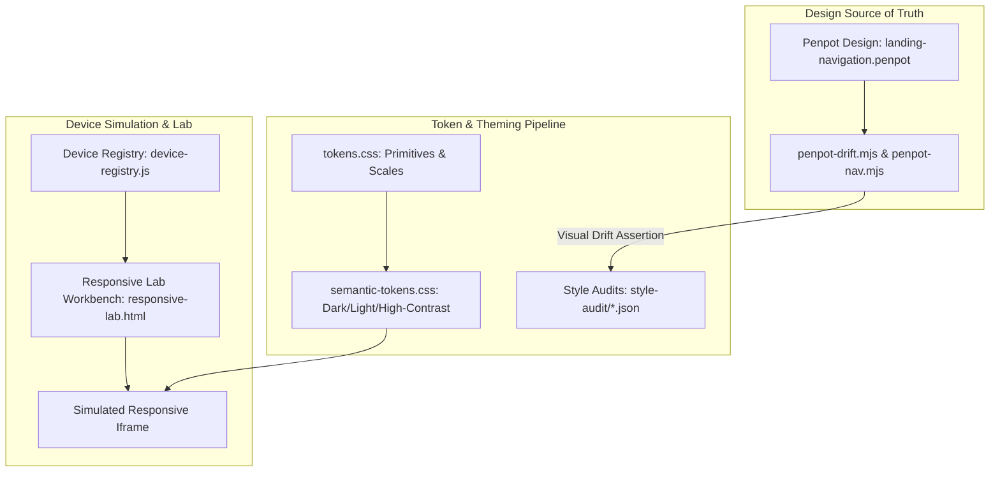

# Responsive UI Lab, Penpot & Design System

> **Location**: [`LandingPage/docs/functionalities/09-RESPONSIVE-LAB-PENPOT-AND-DESIGN-SYSTEM.md`](file:///Users/bkoo/Documents/Development/GovTech/MCard_TDD/LandingPage/docs/functionalities/09-RESPONSIVE-LAB-PENPOT-AND-DESIGN-SYSTEM.md)  
> **Source Files**: [`responsive-lab.html`](file:///Users/bkoo/Documents/Development/GovTech/MCard_TDD/LandingPage/responsive-lab.html), [`js/device-registry.js`](file:///Users/bkoo/Documents/Development/GovTech/MCard_TDD/LandingPage/js/device-registry.js), [`design/landing-navigation.penpot`](file:///Users/bkoo/Documents/Development/GovTech/MCard_TDD/LandingPage/design/landing-navigation.penpot), [`scripts/penpot-*.mjs`](file:///Users/bkoo/Documents/Development/GovTech/MCard_TDD/LandingPage/scripts/)  
> **Styles & Tokens**: [`public/css/tokens.css`](file:///Users/bkoo/Documents/Development/GovTech/MCard_TDD/LandingPage/public/css/tokens.css), [`public/css/semantic-tokens.css`](file:///Users/bkoo/Documents/Development/GovTech/MCard_TDD/LandingPage/public/css/semantic-tokens.css)  
> **Status**: Comprehensive Functional Specification

---

## 1. Overview & Workbench Architecture

The LandingPage frontend is engineered to guarantee perfect visual fidelity, accessibility, and responsiveness across the entire spectrum of consumer hardware (mobile phones, foldable devices, tablets, desktop monitors, and 4K/8K displays). 

Rather than relying on basic browser devtools, the platform includes a built-in, standalone **Responsive UI Lab** ([`responsive-lab.html`](file:///Users/bkoo/Documents/Development/GovTech/MCard_TDD/LandingPage/responsive-lab.html)) and an automated **Penpot Design-to-Code Drift Verification Pipeline**.

---

## 2. Declarative Device Registry (`js/device-registry.js`)

Governed by specification **RVP-02**, the device registry replaces ad-hoc CSS media queries with a validated, persistent preset catalog:

### 2.1 Geometric Contracts & Invariants
- **Closed Dimension Contract (`INV-RVP-03`)**: Enforces dimension boundaries $100\text{px} \le \text{dimension} \le 7680\text{px}$.
- **Zero Drift Aspect Ratios**: Aspect ratios are never hardcoded strings; they are computed dynamically from pixel dimensions using the Greatest Common Divisor ($gcd(w, h)$), eliminating label-to-geometry drift.
- **Pure Store Invariant (`INV-RVP-05`)**: Implemented as pure ESM with zero DOM dependencies, using Web Storage (`pkc_responsive_lab_devices_v1`) for user-customized presets.

### 2.2 Standard Built-in Device Profiles

| Device Identifier | Model Name | Category | CSS Dimensions (W x H) | Aspect Ratio | Device Pixel Ratio (DPR) |
| :--- | :--- | :--- | :--- | :--- | :--- |
| `iphone-16-pro` | iPhone 16 Pro | Phone | 393 x 852 px | 131:284 | 3.0 |
| `iphone-se` | iPhone SE | Phone | 375 x 667 px | 375:667 | 2.0 |
| `pixel-8` | Google Pixel 8 | Phone | 412 x 915 px | ~9:20 | 2.625 |
| `galaxy-s24` | Samsung Galaxy S24 | Phone | 360 x 780 px | 6:13 | 3.0 |
| `ipad-air-11` | iPad Air 11" | Tablet | 820 x 1180 px | 41:59 | 2.0 |
| `ipad-mini` | iPad Mini | Tablet | 744 x 1133 px | ~2:3 | 2.0 |
| `macbook-air-13`| MacBook Air 13" | Desktop | 1280 x 832 px | 20:13 | 2.0 |
| `desktop-fhd` | Desktop 1080p | Desktop | 1920 x 1080 px | 16:9 | 1.0 |

---

## 3. Responsive Lab Capabilities ([`responsive-lab.html`](file:///Users/bkoo/Documents/Development/GovTech/MCard_TDD/LandingPage/responsive-lab.html))

- **Full-Window Viewport Workbench**: Emulates target screen sizes inside an isolated sandbox container.
- **Dynamic Rotation**: One-click toggle between Portrait and Landscape orientations, recalculating layout constraints in real time.
- **Layout Freeze Detection**: Stress-tests reflow performance by cycling rapidly through viewport dimensions and asserting zero element clipping or horizontal overflow.
- **Zoom & Pan Scaling**: Scales the preview container (25% to 150%) to fit 4K/desktop viewports on small laptop displays.

---

## 4. Penpot Design-to-Code Synchronization

The project integrates directly with open-source design tool **Penpot**:

- **Design Specification**: [`design/landing-navigation.penpot`](file:///Users/bkoo/Documents/Development/GovTech/MCard_TDD/LandingPage/design/landing-navigation.penpot) defines the canonical screen hierarchy, component boundaries, and navigation graph.
- **Drift Detection** ([`scripts/penpot-drift.mjs`](file:///Users/bkoo/Documents/Development/GovTech/MCard_TDD/LandingPage/scripts/penpot-drift.mjs)):
  - Compares the Penpot navigation graph with the live Express and client-side routes.
  - Flags unbound routes, unmapped buttons, drifted color palettes, and broken link cases (`INV-CDO-11`, `INV-CDO-12`, `INV-CDO-13`).
- **Automated Screen Export** ([`scripts/penpot-screens.mjs`](file:///Users/bkoo/Documents/Development/GovTech/MCard_TDD/LandingPage/scripts/penpot-screens.mjs)): Extracts SVG assets and screen thumbnails directly from the `.penpot` zip archive.

---

## 5. Design Tokens & Accessibility Audits

- **Token Cascade**:
  - [`public/css/tokens.css`](file:///Users/bkoo/Documents/Development/GovTech/MCard_TDD/LandingPage/public/css/tokens.css): Defines foundational scales (spacing, typography, border-radii, motion durations, z-indexes).
  - [`public/css/semantic-tokens.css`](file:///Users/bkoo/Documents/Development/GovTech/MCard_TDD/LandingPage/public/css/semantic-tokens.css): Maps primitives to contextual roles (`--bg-primary`, `--text-muted`, `--accent-focus`).
- **Theme Modes**: Supports `dark`, `light`, and `high-contrast` themes via `data-theme` DOM attributes.
- **Style Audits** ([`style-audit/`](file:///Users/bkoo/Documents/Development/GovTech/MCard_TDD/LandingPage/style-audit/)): Machine-generated audits validating color contrast ratios against WCAG 2.1 AA standards across all views.
