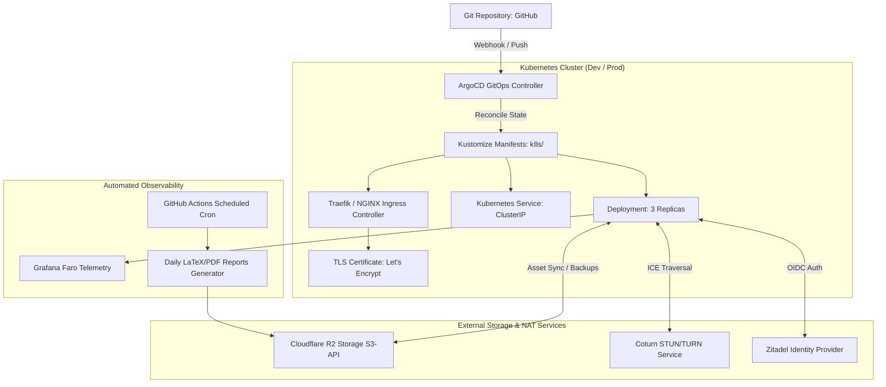

# DevOps, ArgoCD GitOps & Cloud Infrastructure

> **Location**: [`LandingPage/docs/functionalities/10-DEV-OPS-ARGO-CD-AND-INFRASTRUCTURE.md`](file:///Users/bkoo/Documents/Development/GovTech/MCard_TDD/LandingPage/docs/functionalities/10-DEV-OPS-ARGO-CD-AND-INFRASTRUCTURE.md)  
> **Source Directories**: [`k8s/`](file:///Users/bkoo/Documents/Development/GovTech/MCard_TDD/LandingPage/k8s/), [`.github/workflows/`](file:///Users/bkoo/Documents/Development/GovTech/MCard_TDD/LandingPage/.github/workflows/), [`daily-reports/`](file:///Users/bkoo/Documents/Development/GovTech/MCard_TDD/LandingPage/daily-reports/)  
> **Deployment Files**: [`Dockerfile`](file:///Users/bkoo/Documents/Development/GovTech/MCard_TDD/LandingPage/Dockerfile), [`argocd-application.yaml`](file:///Users/bkoo/Documents/Development/GovTech/MCard_TDD/LandingPage/argocd-application.yaml), [`docker-compose.yml`](file:///Users/bkoo/Documents/Development/GovTech/MCard_TDD/LandingPage/docker-compose.yml)  
> **Status**: Comprehensive Functional Specification

---

## 1. Overview & Cloud-Native Topology

The LandingPage infrastructure is engineered for continuous delivery and high availability across Kubernetes clusters using declarative **ArgoCD GitOps** patterns. Changes committed to `main` are automatically reconciled, deployed, tested, and monitored across development and production environments.

---

## 2. Containerization: [`Dockerfile`](file:///Users/bkoo/Documents/Development/GovTech/MCard_TDD/LandingPage/Dockerfile)

The application container is built using a secure multi-stage Node.js Alpine base:

- **Security Hardening**:
  - Non-root execution (`USER node`).
  - Read-only container root filesystem where applicable.
  - Stripped build dependencies in the runtime image.
- **Exposed Ports**:
  - `3000`: HTTP web application and REST APIs (`/api/mcard`, `/api/auth`, `/api/clm`).
  - `3001` / WebSocket path `/ws/`: Real-time signaling and room coordination.
- **Health Checks**: Implements standard liveness probe hitting `/health` returning `{ status: "ok", timestamp }`.

---

## 3. Kubernetes & ArgoCD GitOps Engine ([`k8s/`](file:///Users/bkoo/Documents/Development/GovTech/MCard_TDD/LandingPage/k8s/))

### 3.1 High-Availability Deployment ([`deployment-dev-with-configmap.yaml`](file:///Users/bkoo/Documents/Development/GovTech/MCard_TDD/LandingPage/k8s/deployment-dev-with-configmap.yaml))
- **Replica Strategy**: 3 replicas with rolling updates (`maxUnavailable: 0`, `maxSurge: 1`).
- **Custom DNS Policy**: Configured with `dnsPolicy: "None"` and explicit upstream nameservers (`8.8.8.8`, `8.8.4.4`) to ensure reliable external resolution of the Zitadel identity endpoint (`vpn.pkc.pub`).
- **Resource Constraints**: Explicit CPU and memory limits preventing noisy-neighbor degradation.

### 3.2 Ingress Routing & SSL Termination
- [`ingress-test.pkc.pub.yaml`](file:///Users/bkoo/Documents/Development/GovTech/MCard_TDD/LandingPage/k8s/ingress-test.pkc.pub.yaml): Maps public domain traffic to the internal ClusterIP service on port 3000.
- Automatic HTTPS certificate provisioning using Cert-Manager and ACME DNS-01 challenges.

### 3.3 ArgoCD Application Specification ([`argocd-application.yaml`](file:///Users/bkoo/Documents/Development/GovTech/MCard_TDD/LandingPage/argocd-application.yaml))
- **Automated Sync Policy**: Enables automated prune and self-heal (`automated: { prune: true, selfHeal: true }`).
- **Sync Options**: Creates namespace dynamically if missing; validates schema syntax before applying changes.

---

## 4. Cloudflare R2 Object Storage & Asset CDN

- **S3 API Compatibility**: R2 provides zero-egress fee cloud storage for heavy assets (videos, 3D models, PDF documentation, MCard SQLite backups).
- **Credentials Secret** ([`k8s/secret-r2-credentials.yaml`](file:///Users/bkoo/Documents/Development/GovTech/MCard_TDD/LandingPage/k8s/secret-r2-credentials.yaml)): Mounts access keys, endpoint URLs, and bucket names securely as environment variables.
- **Cache Strategy**: Assets served from R2 leverage Cloudflare edge cache rules with immutable content-hash headers (`Cache-Control: public, max-age=31536000, immutable`).

---

## 5. Automated CI/CD & Daily Reporting Engine

Located in [`.github/workflows/`](file:///Users/bkoo/Documents/Development/GovTech/MCard_TDD/LandingPage/.github/workflows/) and [`daily-reports/`](file:///Users/bkoo/Documents/Development/GovTech/MCard_TDD/LandingPage/daily-reports/):

1. **Automated Component Battery** ([`clm-test-all-components.yml`](file:///Users/bkoo/Documents/Development/GovTech/MCard_TDD/LandingPage/.github/workflows/clm-test-all-components.yml)): Runs Playwright browser integration tests on every pull request, certifying all 12 viewports and WebRTC data channels.
2. **Daily Commit Summaries** ([`daily-commit-summary.yml`](file:///Users/bkoo/Documents/Development/GovTech/MCard_TDD/LandingPage/.github/workflows/daily-commit-summary.yml)): Aggregates commits, issues, and PRs across the day, generating human-readable changelog digests.
3. **Zitadel Monitoring & PDF Generator** ([`generate_zitadel_report.py`](file:///Users/bkoo/Documents/Development/GovTech/MCard_TDD/LandingPage/daily-reports/generate_zitadel_report.py), [`convert_md_to_latex_to_pdf.py`](file:///Users/bkoo/Documents/Development/GovTech/MCard_TDD/LandingPage/daily-reports/convert_md_to_latex_to_pdf.py)):
   - Queries Zitadel management APIs for active user sessions and authentication failures.
   - Compiles structured Markdown into publication-grade LaTeX and PDF reports.
   - Uploads compiled PDFs to MinIO/R2 and sends automated distribution notifications.
