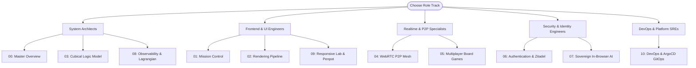

# 🧭 LandingPage Functional Specifications Library

> **Location**: [`LandingPage/docs/functionalities/README.md`](file:///Users/bkoo/Documents/Development/GovTech/MCard_TDD/LandingPage/docs/functionalities/README.md)  
> **Platform**: GovTech OS / Personal Knowledge Container (`pkc-landing-page-monorepo`)  
> **Target Base**: [`LandingPage/`](file:///Users/bkoo/Documents/Development/GovTech/MCard_TDD/LandingPage/)  
> **Status**: Comprehensive Functional Documentation

---

## 📖 Introduction

This directory contains the **authoritative, exhaustive functional documentation series** for the **LandingPage** project. Each document extracts and specifies a major functional domain of the platform, detailing its architecture, data models, runtime engines, API endpoints, wire protocols, UI interactions, and underlying source files.

---

## 📚 Specification Index

| Index | Functional Specification Document | Domain & Key Technologies |
| :---: | :--- | :--- |
| **00** | [**Master Overview & Architecture Map**](00-OVERVIEW-AND-FUNCTIONALITY-MAP.md) | Platform topology, monorepo packages, capability taxonomy, master entry points. |
| **01** | [**Mission Control & MCard Management**](01-MISSION-CONTROL-AND-MCARD-MANAGEMENT.md) | `app.html`, `ViewManager`, SQLite WAL backend, card lifecycle, PWA offline engine. |
| **02** | [**Polymorphic Content Rendering Pipeline**](02-POLYMORPHIC-CONTENT-RENDERING-PIPELINE.md) | `RendererRegistry`, Markdown with alerts, KaTeX/MathJax, TikZ-CD, Tone.js audio, PDF.js. |
| **03** | [**Cubical Logic Model (CLM) & Fiber Correctness**](03-CUBICAL-LOGIC-MODEL-AND-FIBER-CORRECTNESS.md) | `clm-kernel@0.0.3`, iframe membrane isolation, Fiber Inspector, Redux CLM middleware. |
| **04** | [**WebRTC P2P Mesh & Real-Time Collaboration**](04-WEBRTC-P2P-MESH-AND-REALTIME-COLLABORATION.md) | Dual-mode networking (serverless QR/SDP vs WebSocket signaling), `RoomService v3`, video meeting, STUN/TURN. |
| **05** | [**Real-Time Multiplayer Board Games**](05-REALTIME-MULTIPLAYER-BOARD-GAMES.md) | P2P Tic-Tac-Toe, Authenticated Monopoly, Chess, Go, D&D Bali engine, move reconciliation. |
| **06** | [**Authentication & Identity System**](06-AUTHENTICATION-AND-IDENTITY-SYSTEM.md) | Zitadel OAuth2/OIDC, PKCE code exchange, secure cookies, token rotation, Redux auth slice. |
| **07** | [**In-Browser AI & WebLLM Runtime**](07-IN-BROWSER-AI-AND-WEB-LLM-RUNTIME.md) | Zero-server WebGPU LLM execution (`@mlc-ai/web-llm`), Phi-2/Llama-2, streaming token chat. |
| **08** | [**Observability, Lagrangian Mechanics & Telemetry**](08-OBSERVABILITY-LAGRANGIAN-AND-TELEMETRY.md) | Software Lagrangian ($\mathcal{L} = S - H$), Fibration dashboard, Grafana Faro RUM, Web Vitals. |
| **09** | [**Responsive UI Lab, Penpot & Design System**](09-RESPONSIVE-LAB-PENPOT-AND-DESIGN-SYSTEM.md) | Viewport workbench (`responsive-lab.html`), device registry (RVP-02), Penpot drift verification, CSS tokens. |
| **10** | [**DevOps, ArgoCD GitOps & Cloud Infrastructure**](10-DEV-OPS-ARGO-CD-AND-INFRASTRUCTURE.md) | Docker, Kubernetes 3-replica HA deployment, ArgoCD GitOps, Cloudflare R2 storage, automated reporting. |

---

## 🎯 Role-Based Reading Tracks

Depending on your engineering focus, we recommend the following reading paths:

---

## 🗺️ Codebase Traceability Matrix

| Functional Domain | Primary Source Files | Key Tests | Configuration / Specs |
| :--- | :--- | :--- | :--- |
| **MCard Management** | [`app.html`](file:///Users/bkoo/Documents/Development/GovTech/MCard_TDD/LandingPage/app.html), [`public/js/ViewManager.js`](file:///Users/bkoo/Documents/Development/GovTech/MCard_TDD/LandingPage/public/js/ViewManager.js), [`server/mcard-api.mjs`](file:///Users/bkoo/Documents/Development/GovTech/MCard_TDD/LandingPage/server/mcard-api.mjs) | `tests/smoke/landing-page.spec.js` | `public/config/app-views.json` |
| **Content Renderers**| [`js/renderers/`](file:///Users/bkoo/Documents/Development/GovTech/MCard_TDD/LandingPage/js/renderers/), [`packages/markdown-renderer/`](file:///Users/bkoo/Documents/Development/GovTech/MCard_TDD/LandingPage/packages/markdown-renderer/) | `tests/components/` | `assets/tikz-diagrams/diagram-manifest.json` |
| **Cubical Logic Model**| [`public/js/vendor/clm-kernel.bundle.js`](file:///Users/bkoo/Documents/Development/GovTech/MCard_TDD/LandingPage/public/js/vendor/clm-kernel.bundle.js), [`js/clm-iframe-loader.js`](file:///Users/bkoo/Documents/Development/GovTech/MCard_TDD/LandingPage/js/clm-iframe-loader.js) | `tests/features/fiber-conformance.spec.js` | `public/conformance/witness.json` |
| **WebRTC Networking**| [`js/modules/p2p-serverless/`](file:///Users/bkoo/Documents/Development/GovTech/MCard_TDD/LandingPage/js/modules/p2p-serverless/), [`js/modules/webrtc-dashboard/`](file:///Users/bkoo/Documents/Development/GovTech/MCard_TDD/LandingPage/js/modules/webrtc-dashboard/), [`ws-server.js`](file:///Users/bkoo/Documents/Development/GovTech/MCard_TDD/LandingPage/ws-server.js) | `tests/components/test-clm-p2p-status.spec.cjs` | `docker-compose.stun.yml` |
| **Board Games** | [`js/modules/tic-tac-toe-p2p/`](file:///Users/bkoo/Documents/Development/GovTech/MCard_TDD/LandingPage/js/modules/tic-tac-toe-p2p/), [`public/examples/games/`](file:///Users/bkoo/Documents/Development/GovTech/MCard_TDD/LandingPage/public/examples/games/) | `tests/features/chat-panel.spec.js` | `docs/MONOPOLY_GAME_DOCUMENTATION.md` |
| **Authentication** | [`routes/auth.js`](file:///Users/bkoo/Documents/Development/GovTech/MCard_TDD/LandingPage/routes/auth.js), [`js/modules/auth-manager.js`](file:///Users/bkoo/Documents/Development/GovTech/MCard_TDD/LandingPage/js/modules/auth-manager.js) | `tests/components/AuthStatusComponent.js` | `public/config/zitadel-config.js` |
| **In-Browser AI** | [`js/modules/web-llm/`](file:///Users/bkoo/Documents/Development/GovTech/MCard_TDD/LandingPage/js/modules/web-llm/) | Client WebGPU integration tests | `js/modules/web-llm/config.js` |
| **Observability** | [`js/observability/`](file:///Users/bkoo/Documents/Development/GovTech/MCard_TDD/LandingPage/js/observability/), [`js/telemetry/faro-collector.js`](file:///Users/bkoo/Documents/Development/GovTech/MCard_TDD/LandingPage/js/telemetry/faro-collector.js) | `tests/observability/correctness.test.js` | `mcard.yaml` (`lagrangian_weights`) |
| **Responsive Lab** | [`responsive-lab.html`](file:///Users/bkoo/Documents/Development/GovTech/MCard_TDD/LandingPage/responsive-lab.html), [`js/device-registry.js`](file:///Users/bkoo/Documents/Development/GovTech/MCard_TDD/LandingPage/js/device-registry.js) | `tests/features/responsive-rotation-and-devices.spec.js` | `design/landing-navigation.penpot` |
| **DevOps & GitOps** | [`Dockerfile`](file:///Users/bkoo/Documents/Development/GovTech/MCard_TDD/LandingPage/Dockerfile), [`k8s/`](file:///Users/bkoo/Documents/Development/GovTech/MCard_TDD/LandingPage/k8s/), [`argocd-application.yaml`](file:///Users/bkoo/Documents/Development/GovTech/MCard_TDD/LandingPage/argocd-application.yaml) | GitHub Actions CI pipelines | `k8s/kustomization.yaml` |
