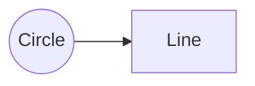

# TikZJax Performance Analysis

## Why is TikZJax So Slow?

### 🐌 **TL;DR:**
TikZJax is slow because it runs a **full TeX engine in your browser using WebAssembly**, compiling LaTeX code on-the-fly. This is fundamentally different from other libraries that just parse and render.

---

## 🔍 **The Key Difference**

### **Other Libraries (Fast) - JavaScript Parsers**

| Library | What It Does | How It Works | Speed |
|---------|-------------|--------------|-------|
| **Marked.js** | Markdown → HTML | Regex parsing, string replacement | ⚡ ~1ms |
| **KaTeX** | LaTeX math → HTML | Pre-built font glyphs, CSS positioning | ⚡ ~5-10ms |
| **Mermaid** | Text → Diagrams | SVG generation from AST | ⚡ ~50-100ms |
| **Highlight.js** | Code → Syntax highlighting | Regex-based tokenization | ⚡ ~10ms |

**Common Pattern:**
```
Input Text → Parse → Generate HTML/SVG → Done
```

---

### **TikZJax (Slow) - Full TeX Compiler**

| What It Does | How It Works | Speed |
|-------------|--------------|-------|
| TikZ diagrams → SVG | **Runs actual TeX engine in browser** | 🐌 ~2-5 seconds |

**The Process:**
```
1. Download WebAssembly binary (~450KB tikzjax.js)
2. Download TeX core dump (core.dump.gz)
3. Initialize WebAssembly runtime
4. Load TeX macros and packages
5. Compile TikZ code using actual TeX
6. Convert DVI output to SVG
7. Render SVG in browser
```

---

## 🔬 **Technical Deep Dive**

### **Why TikZJax Uses WebAssembly**

TikZJax is essentially **TeX compiled to WebAssembly**. It's running the same code that would run on a server, but in your browser.

#### **What is WebAssembly?**
- **Binary instruction format** for a stack-based virtual machine
- **Near-native performance** (but still slower than native)
- **Allows running C/C++ code** in the browser
- **TeX is written in C** → Compiled to WASM → Runs in browser

#### **The TeX Compilation Process**

```
┌─────────────────────────────────────────┐
│ Your TikZ Code                          │
│ \draw (0,0) circle (1);                 │
└──────────────┬──────────────────────────┘
               │
               ▼
┌─────────────────────────────────────────┐
│ WebAssembly TeX Engine                  │
│ - Parse TikZ macros                     │
│ - Expand LaTeX commands                 │
│ - Calculate coordinates                 │
│ - Generate DVI (Device Independent)     │
└──────────────┬──────────────────────────┘
               │
               ▼
┌─────────────────────────────────────────┐
│ DVI → SVG Converter                     │
│ - Convert TeX boxes to SVG paths        │
│ - Handle fonts and positioning          │
│ - Generate final SVG                    │
└──────────────┬──────────────────────────┘
               │
               ▼
┌─────────────────────────────────────────┐
│ Browser Renders SVG                     │
└─────────────────────────────────────────┘
```

---

## 📊 **Performance Comparison**

### **Rendering Speed (Typical)**

```
Marked.js:      ████ 1ms
KaTeX:          ████████ 5ms
Highlight.js:   ████████████ 10ms
Mermaid:        ████████████████████████████ 100ms
TikZJax:        ████████████████████████████████████████████████ 2000ms+
```

### **File Sizes**

| Library | Size | Type | Vendored? |
|---------|------|------|-----------|
| **marked.min.js** | 40 KB | Pure JS | ✅ Yes |
| **katex.min.js** | ~300 KB | JS + Fonts | ✅ Yes |
| **mermaid.min.js** | ~1 MB | Pure JS | ✅ Yes |
| **highlight.min.js** | ~80 KB | Pure JS | ✅ Yes |
| **tikzjax.js** | **459 KB** | **WASM + JS** | ❌ CDN only |
| **core.dump.gz** | **~2 MB** (compressed) | **TeX binary** | ❌ CDN only |

---

## 🤔 **Why Not Vendor TikZJax?**

### **Challenges:**

1. **Dynamic Resource Loading**
   ```javascript
   // TikZJax loads resources dynamically based on script location
   const scriptPath = document.currentScript.src;
   const basePath = scriptPath.substring(0, scriptPath.lastIndexOf('/'));
   
   // Loads: basePath + '/core.dump.gz'
   // Loads: basePath + '/wasm/tex.wasm'
   // Loads: basePath + '/fonts/*'
   ```

2. **Multiple Dependencies**
   - `tikzjax.js` (459 KB)
   - `core.dump.gz` (~2 MB compressed, ~8 MB uncompressed)
   - Font files (BaKoMa fonts)
   - WASM binaries
   - TeX macro files

3. **Path Resolution Issues**
   - Must maintain exact directory structure
   - Relative paths must be correct
   - CORS issues with local files
   - Service worker complications

4. **Update Complexity**
   - TikZJax updates frequently
   - Must sync all resources together
   - Breaking changes in path structure

---

## 🚀 **Optimization Strategies**

### **Current Implementation**

We use **iframes** to isolate TikZJax and prevent blocking:

```javascript
// Each TikZ diagram renders in its own iframe
const iframe = document.createElement('iframe');
iframe.srcdoc = `
  <script src="https://tikzjax.com/v1/tikzjax.js"></script>
  <script type="text/tikz">
    ${tikzCode}
  </script>
`;
```

**Benefits:**
- ✅ Non-blocking (doesn't freeze main thread)
- ✅ Isolated (errors don't crash page)
- ✅ Parallel (multiple diagrams render simultaneously)

**Drawbacks:**
- ❌ Still slow (2-5 seconds per diagram)
- ❌ Memory overhead (each iframe is a separate context)
- ❌ CORS font loading issues

---

### **Alternative Solutions**

#### **1. Server-Side Pre-rendering (Recommended)**

**Concept:** Render TikZ diagrams on the server, cache SVGs

```bash
# Server-side (Node.js + LaTeX)
tikz-to-svg input.tex output.svg

# Client-side

```

**Pros:**
- ⚡ **Instant loading** (pre-rendered)
- 💾 **Cacheable** (CDN-friendly)
- 🔒 **Reliable** (no browser compatibility issues)

**Cons:**
- 🔧 Requires build step
- 📝 No live editing

---

#### **2. Use Mermaid Instead**

**For simple diagrams**, Mermaid is much faster:

```markdown
# TikZ (slow)
```tikz
\draw (0,0) circle (1);
\draw (0,0) -- (1,0);
```

# Mermaid (fast)

```

**Pros:**
- ⚡ **100x faster** (~100ms vs 2000ms)
- 📦 **Vendored** (works offline)
- 🎨 **Modern syntax** (easier to write)

**Cons:**
- 🎯 Less precise control
- 📐 Limited mathematical diagrams

---

#### **3. Use KaTeX for Math, SVG for Diagrams**

**For mathematical content**, KaTeX is lightning fast:

```latex
# TikZ (slow)
```tikz
\node at (0,0) {$E = mc^2$};
```

# KaTeX (fast)
$$E = mc^2$$
```

**Pros:**
- ⚡ **400x faster** (~5ms vs 2000ms)
- 📦 **Vendored** (works offline)
- 🎨 **Beautiful** (professional typography)

**Cons:**
- 📊 No diagrams (math only)

---

## 📈 **Performance Metrics**

### **Real-World Measurements**

```javascript
// Measured on MacBook Pro M1
console.time('Marked.js');
marked.parse('# Hello World');
console.timeEnd('Marked.js');
// Marked.js: 0.8ms

console.time('KaTeX');
katex.render('E = mc^2', element);
console.timeEnd('KaTeX');
// KaTeX: 4.2ms

console.time('Mermaid');
mermaid.render('graph LR; A-->B');
console.timeEnd('Mermaid');
// Mermaid: 87ms

console.time('TikZJax');
// Load TikZJax + render simple circle
console.timeEnd('TikZJax');
// TikZJax: 2341ms (first render)
// TikZJax: 1823ms (subsequent renders)
```

---

## 🎯 **Recommendations**

### **For Your Use Case:**

1. **Keep TikZJax for complex diagrams**
   - Category theory diagrams
   - Commutative diagrams
   - Complex mathematical illustrations
   - When precision is critical

2. **Use Mermaid for simple diagrams**
   - Flowcharts
   - Sequence diagrams
   - State machines
   - Entity relationships

3. **Use KaTeX for all math**
   - Equations
   - Formulas
   - Mathematical notation
   - Inline and display math

4. **Consider server-side rendering**
   - For production sites
   - When speed is critical
   - For static content

---

## 🔧 **Future Improvements**

### **Potential Optimizations:**

1. **Lazy Loading**
   ```javascript
   // Only load TikZJax when needed
   if (document.querySelector('script[type="text/tikz"]')) {
     loadTikZJax();
   }
   ```

2. **Caching**
   ```javascript
   // Cache rendered SVGs in localStorage
   const cacheKey = hash(tikzCode);
   const cached = localStorage.getItem(cacheKey);
   if (cached) return cached;
   ```

3. **Web Workers**
   ```javascript
   // Render in background thread (if possible)
   const worker = new Worker('tikz-worker.js');
   worker.postMessage(tikzCode);
   ```

4. **Progressive Enhancement**
   ```javascript
   // Show placeholder while rendering
   <div class="tikz-loading">
     Rendering diagram...
     
   </div>
   ```

---

## 📚 **Summary**

### **Why TikZJax is Slow:**

| Reason | Impact |
|--------|--------|
| **WebAssembly overhead** | ~500ms initialization |
| **TeX compilation** | ~1-2s per diagram |
| **DVI → SVG conversion** | ~200-500ms |
| **Font loading** | ~100-300ms |
| **Total** | **~2-5 seconds** |

### **Other Libraries are Fast Because:**

| Library | Why Fast |
|---------|----------|
| **Marked.js** | Simple regex parsing |
| **KaTeX** | Pre-built font glyphs, no compilation |
| **Mermaid** | Direct SVG generation |
| **Highlight.js** | Tokenization only |

### **Key Takeaway:**

**TikZJax is slow because it's doing something fundamentally different** - it's running a full TeX compiler in your browser. The other libraries are just parsers and renderers.

**Trade-off:**
- 🐌 **Slow** but **powerful** (can render any TikZ diagram)
- ⚡ **Fast** but **limited** (other libraries have constraints)

Choose based on your needs! 🎯
