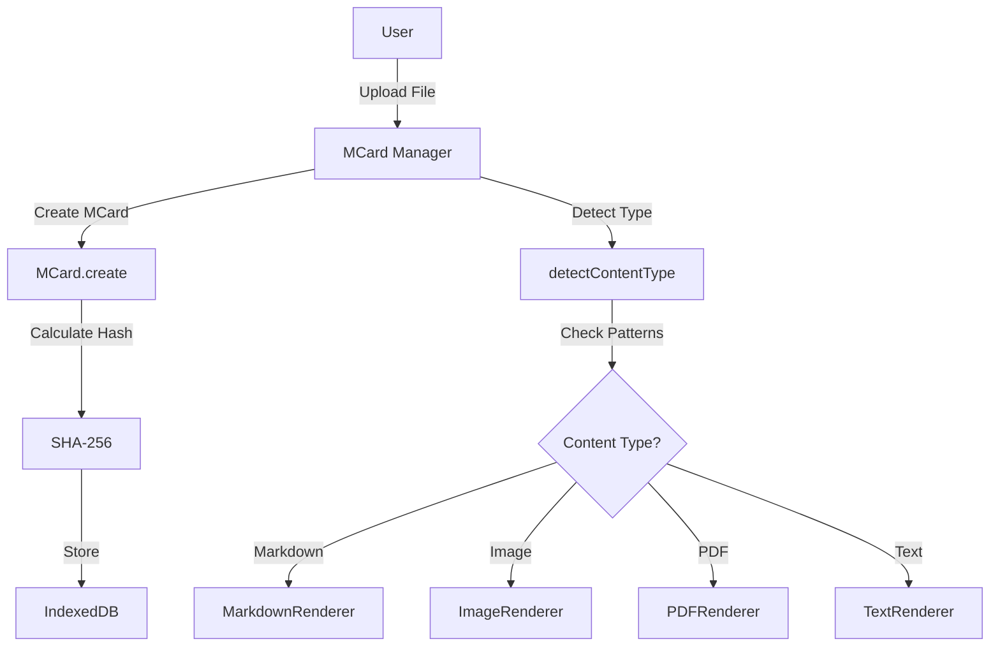
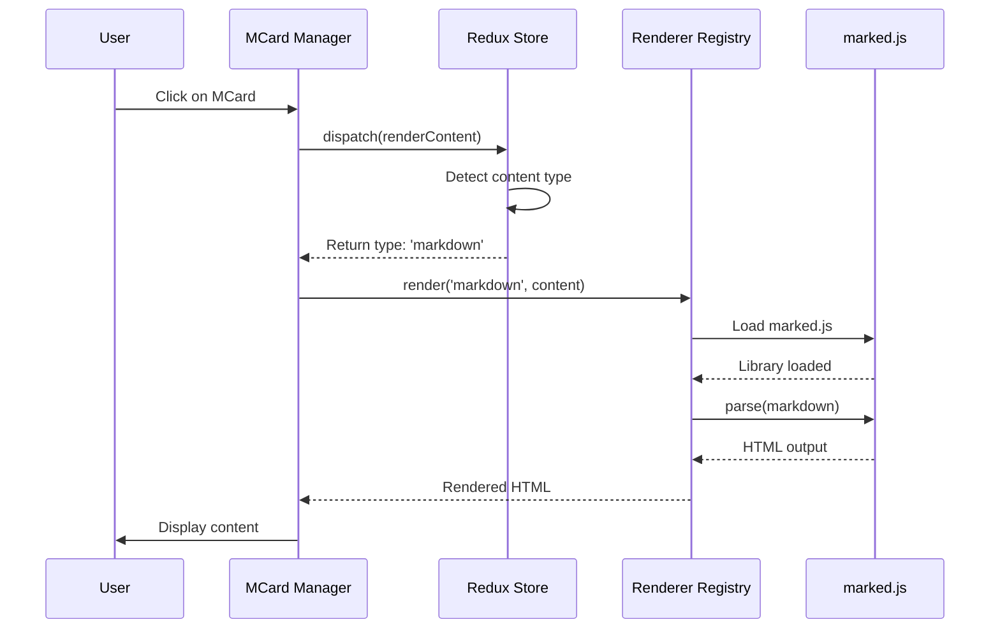
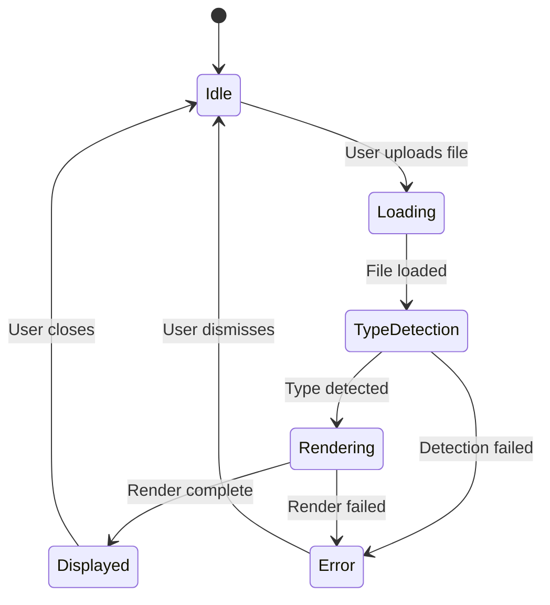
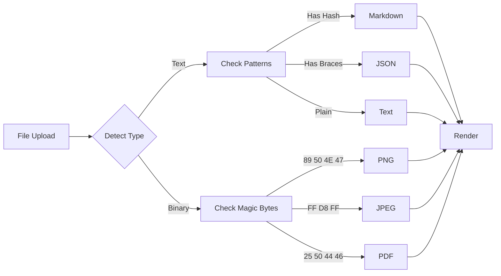
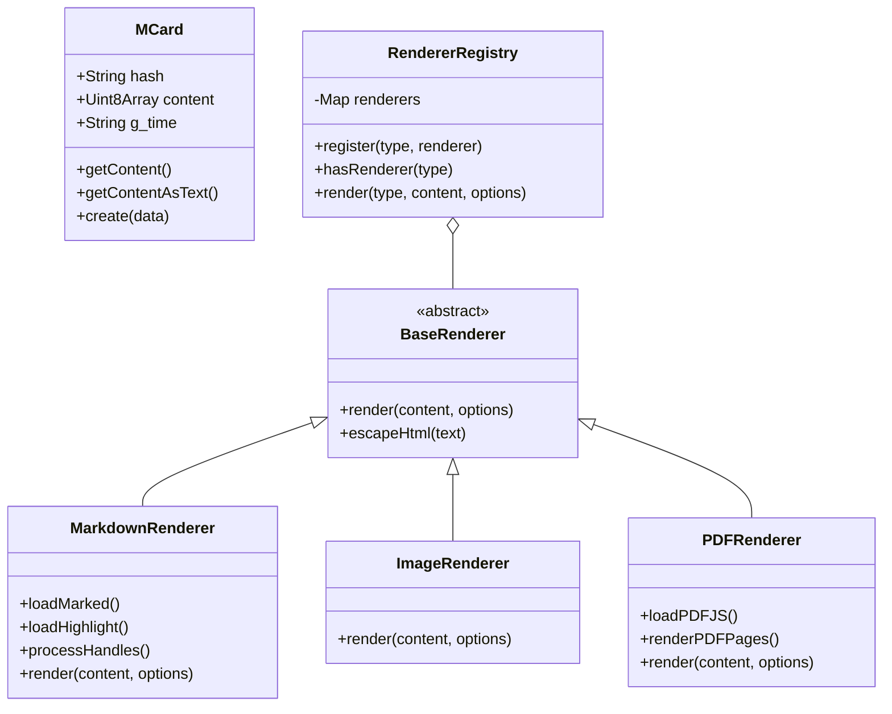
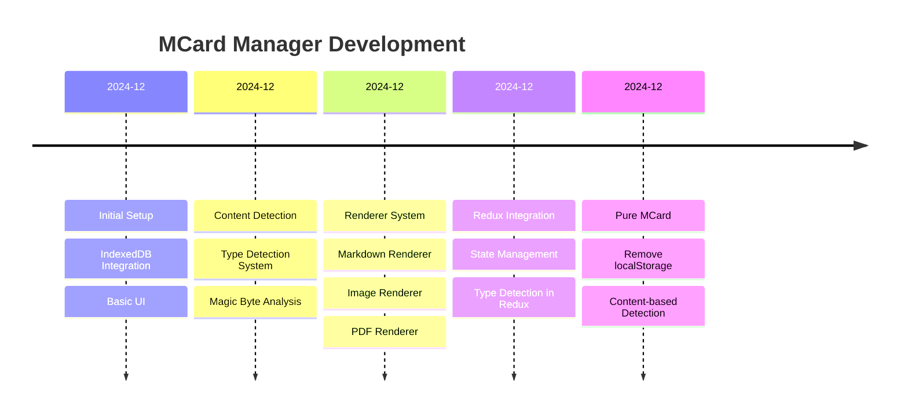
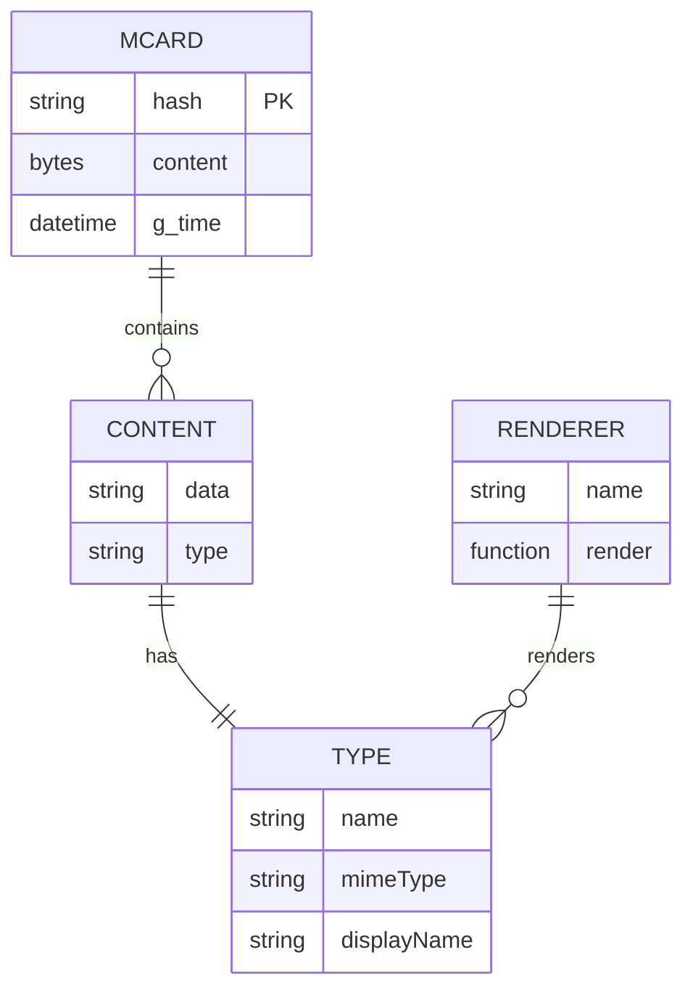
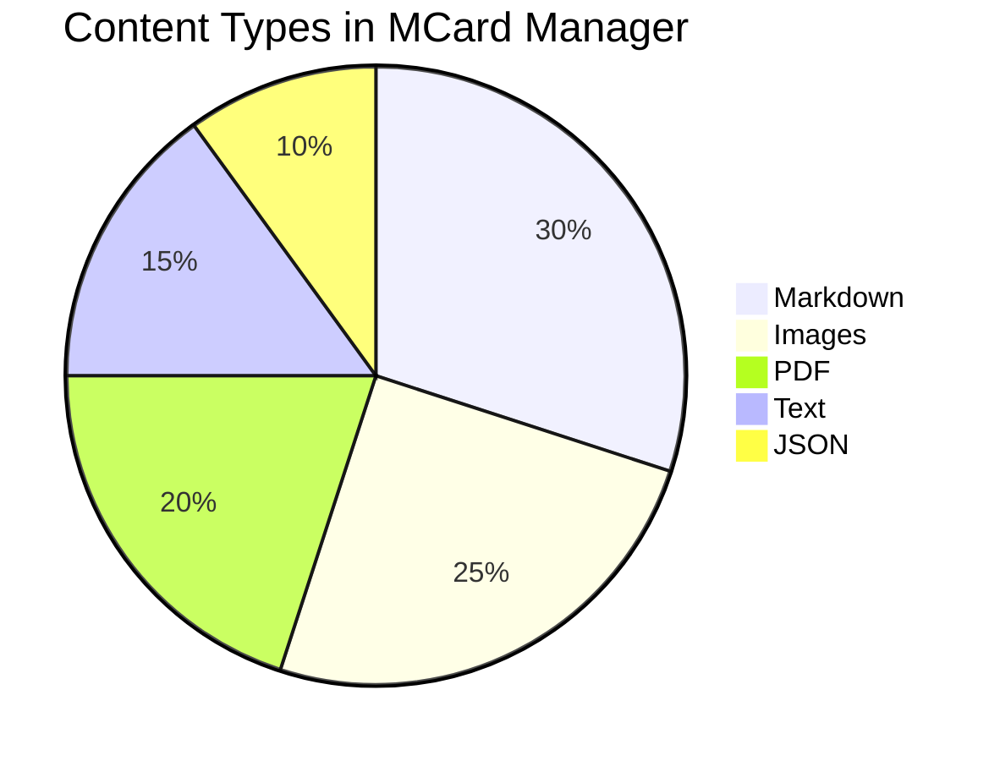
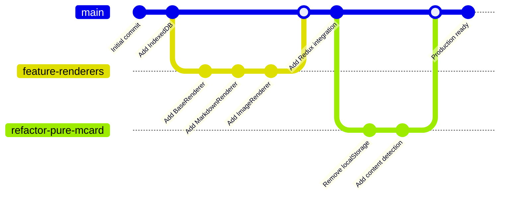

# MCard Architecture with Mermaid Diagrams

This document demonstrates Mermaid diagram support in the MCard Manager.

## Hash-Based Hyperlinks

MCards use content-addressable storage, so each file has a unique SHA-256 hash. You can link between MCards using hash-based hyperlinks!

**Example:** Click this link to view another MCard → [View Related MCard](hash:c4a522a88ed4915ccc9b7b3c334b00eec018c1bc23aacfc0e4f63b5f4f1888d6)

You can also reference it inline: The [related document](hash:c4a522a88ed4915ccc9b7b3c334b00eec018c1bc23aacfc0e4f63b5f4f1888d6) contains important information about the MCard service.

**Multiple links:** You can create multiple links in the same document:
- [First MCard](hash:c4a522a88ed4915ccc9b7b3c334b00eec018c1bc23aacfc0e4f63b5f4f1888d6)
- [Second MCard](hash:f6058fe25ef47ae8554c58c01cb536aa71d8532277cf1900cbd1d64caad917cc)
- [Third MCard](hash:2e125d23a57866a17c3a20e45db0baa17c09e8e473851eb1da8cf39cff6c6df6)

## System Architecture

## Content Rendering Flow

## State Management

## Data Flow

## Class Diagram

## Timeline

## Entity Relationship

## Pie Chart: Content Types

## Git Graph

## Conclusion

This example demonstrates various Mermaid diagram types:
- Flowcharts
- Sequence diagrams
- State diagrams
- Class diagrams
- Timeline
- Entity-relationship diagrams
- Pie charts
- Git graphs

All rendered beautifully in the MCard Manager! 🎨
