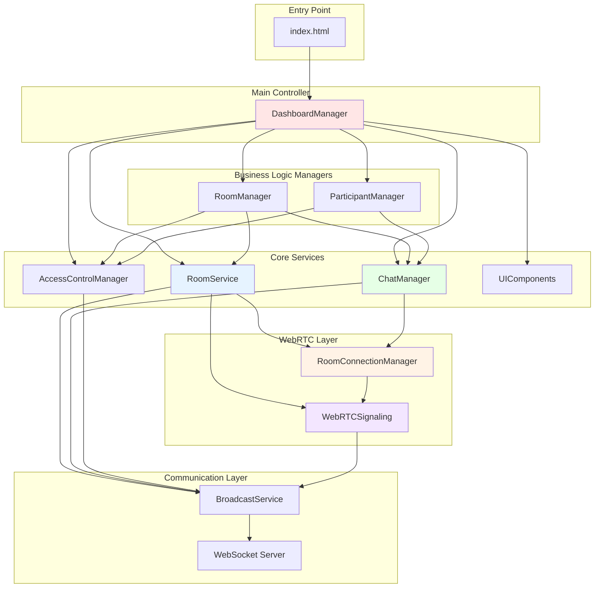
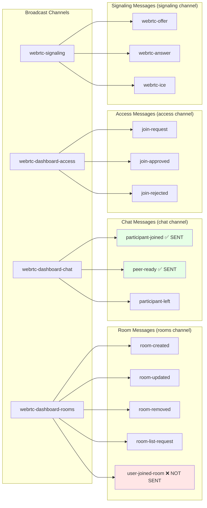
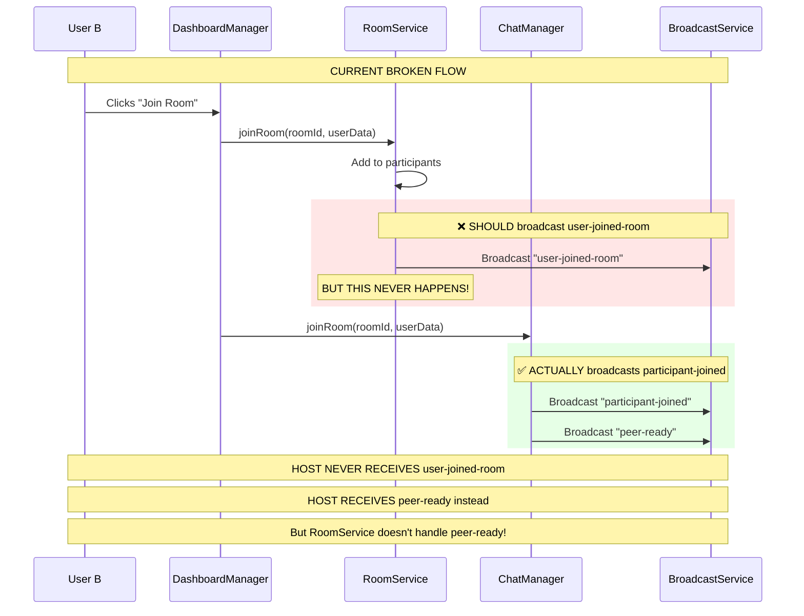
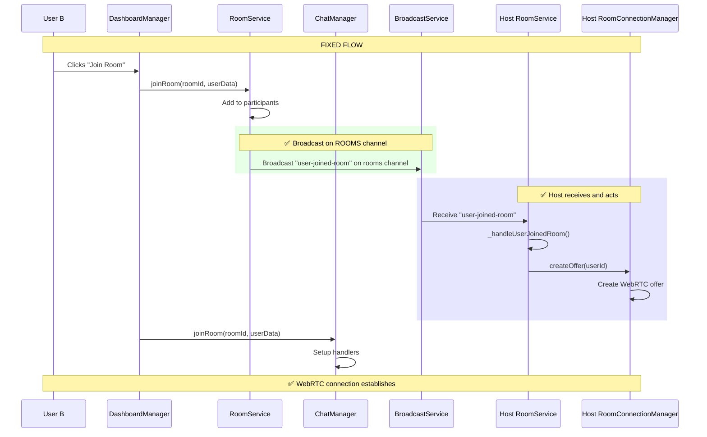
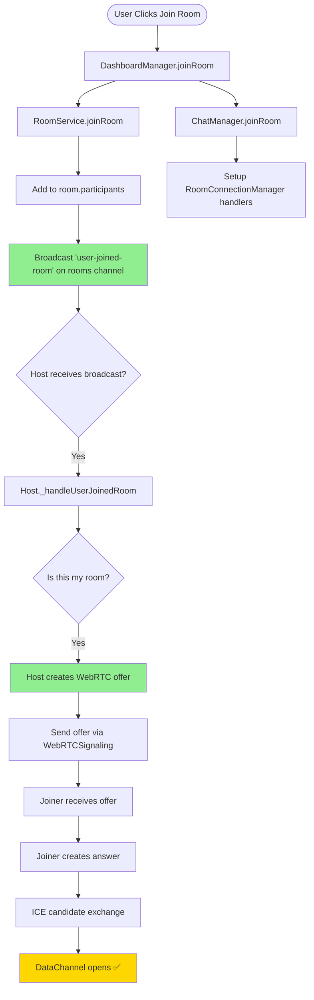
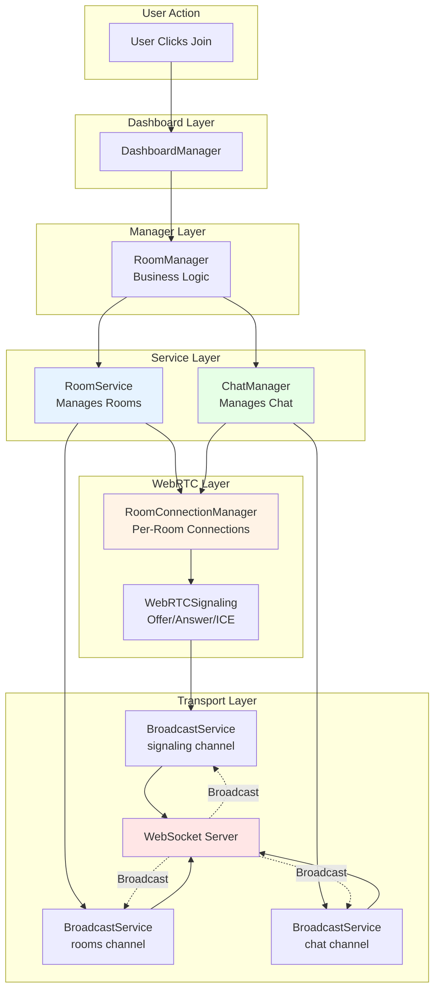

# WebRTC Dashboard Architecture - Complete Component Interaction Map

## Component Hierarchy and Responsibilities



## Message Flow Architecture

### Current Message Types and Channels



## The Problem: Duplicate Join Notification Systems



## Component Interaction Matrix

| Component | Creates | Uses | Broadcasts To | Listens To |
|-----------|---------|------|---------------|------------|
| **DashboardManager** | RoomManager, ParticipantManager | RoomService, ChatManager, AccessControl | - | - |
| **RoomService** | RoomConnectionManager, WebRTCSignaling | BroadcastService | rooms channel | rooms channel |
| **ChatManager** | - | RoomConnectionManager (from RoomService) | chat channel | chat channel |
| **RoomManager** | - | RoomService, ChatManager, AccessControl | - | - |
| **RoomConnectionManager** | RTCPeerConnection, DataChannel | WebRTCSignaling | - | - |
| **WebRTCSignaling** | - | BroadcastService | signaling channel | signaling channel |

## The Solution: Unified Join Flow



## Correct Message Flow for Room Joining



## Key Issues Identified

### Issue 1: Message Type Mismatch
- **RoomService broadcasts**: `user-joined-room` (on rooms channel)
- **RoomService listens for**: `user-joined-room` (on rooms channel) ✅
- **ChatManager broadcasts**: `participant-joined`, `peer-ready` (on chat channel)
- **RoomService does NOT listen to**: chat channel ❌

### Issue 2: Broadcast Not Being Sent
Looking at the logs, we see:
- ✅ `participant-joined` broadcast (chat channel)
- ✅ `peer-ready` broadcast (chat channel)
- ❌ `user-joined-room` broadcast (rooms channel) - **MISSING!**

### Issue 3: Duplicate Responsibilities
- Both RoomService AND ChatManager try to handle joining
- RoomService should handle room membership
- ChatManager should handle WebRTC connections
- Currently they're not coordinated

## Recommended Fix

### Option 1: Use RoomService's Flow (Recommended)
Make sure `RoomService.joinRoom()` actually broadcasts `user-joined-room`:

```javascript
// In RoomService.joinRoom()
async joinRoom(roomId, userData) {
    // ... add to participants ...
    
    // CRITICAL: Broadcast on ROOMS channel
    this._broadcastMessage('user-joined-room', {
        roomId: roomId,
        userId: userData.id,
        userName: userData.name
    });
}
```

### Option 2: Make RoomService Listen to Chat Channel
Add chat channel listener in RoomService:

```javascript
// In RoomService._initializeBroadcastService()
const chatBroadcast = getSharedBroadcastService('webrtc-dashboard-chat');
chatBroadcast.on('peer-ready', (data) => {
    this._handleUserJoinedRoom({
        roomId: data.roomId,
        userId: data.userId,
        userName: data.userName
    });
});
```

## Complete Data Flow Diagram



## Summary

**Root Cause**: `RoomService.joinRoom()` is supposed to broadcast `user-joined-room` but it's not actually doing it. The broadcast call exists in the code but something is preventing it from executing or being received.

**Next Steps**:
1. Verify `this._broadcastMessage()` is being called in `RoomService.joinRoom()`
2. Check if broadcast service is initialized when joinRoom is called
3. Ensure the message is being sent to the correct channel
4. Verify host is subscribed to the rooms channel
5. Check for any errors in the broadcast/receive chain
