# WebRTC Dashboard Initialization Flow

This document maps the initialization sequence to match the User A & User B connection diagram.

## Component Initialization Order

```mermaid
graph TD
    Start[Application Start] --> LoadConfig[Load Config]
    LoadConfig --> CreateDashboard[Create DashboardManager]
    CreateDashboard --> InitElements[Initialize DOM Elements]
    
    InitElements --> InitServices[Initialize Core Services]
    
    subgraph "Core Services (Parallel)"
        InitServices --> RS[RoomService.init]
        InitServices --> AC[AccessControlManager.init]
        InitServices --> CM[ChatManager.init]
        InitServices --> UI[UIComponents.init]
    end
    
    RS --> InitManagers[Initialize Managers]
    AC --> InitManagers
    CM --> InitManagers
    UI --> InitManagers
    
    subgraph "Managers"
        InitManagers --> RM[RoomManager]
        InitManagers --> PM[ParticipantManager]
    end
    
    RM --> SetupHandlers[Setup Event Handlers]
    PM --> SetupHandlers
    
    SetupHandlers --> StartDiscovery[Start Room Discovery]
    StartDiscovery --> Ready[✅ Dashboard Ready]
    
    style Start fill:#e1f5ff
    style Ready fill:#90EE90
```



## Detailed Initialization Steps

### Phase 1: Bootstrap (index.html)
```javascript
// 1. Load configuration from server
await loadConfig();  // Sets window.__WEBSOCKET_URL__

// 2. Import and create DashboardManager
const { DashboardManager } = await import('./dashboard-manager-v2.js');
window.dashboard = new DashboardManager();

// 3. Initialize dashboard
await window.dashboard.init();
```

### Phase 2: DashboardManager.init()
```javascript
async init() {
    // Step 1: Initialize DOM element references
    this._initializeElements();
    
    // Step 2: Create core services
    this.roomService = new RoomService();
    this.accessControl = new AccessControlManager();
    this.chatManager = new ChatManager();
    this.ui = new UIComponents();
    
    // Step 3: Initialize services (parallel async operations)
    await this.roomService.init();
    await this.accessControl.init();
    await this.chatManager.init();
    await this.ui.init();
    
    // Step 4: Create managers (depend on services)
    this.roomManager = new RoomManager(
        this.roomService, 
        this.chatManager, 
        this.accessControl
    );
    this.participantManager = new ParticipantManager(
        this.chatManager, 
        this.accessControl
    );
    this.participantManager.init();
    
    // Step 5: Setup event handlers
    this._setupEventHandlers();
    this._setupUIHandlers();
    
    // Step 6: Load user preferences
    this._loadUserPreferences();
    
    // Step 7: Start room discovery
    await this.roomService.startDiscovery();
}
```

### Phase 3: Service Initialization Details

#### RoomService.init()
```javascript
async init() {
    // 1. Initialize WebSocket signaling
    await this._initializeSignaling();
    
    // 2. Initialize broadcast service (for room discovery)
    this._initializeBroadcastService();
    
    // 3. Setup message handlers
    this._setupMessageHandlers();
    
    // 4. Initialize room connection managers map
    this.roomConnectionManagers = new Map();
}
```

#### AccessControlManager.init()
```javascript
async init() {
    // 1. Get shared broadcast service
    this.broadcastService = getSharedBroadcastService('webrtc-dashboard-access');
    
    // 2. Setup message handlers for join requests/approvals
    this._setupMessageHandlers();
}
```

#### ChatManager.init()
```javascript
async init() {
    // 1. Get shared broadcast service
    this.broadcastService = getSharedBroadcastService('webrtc-dashboard-chat');
    
    // 2. Setup message handlers
    this._setupMessageHandlers();
    
    // 3. Initialize message history
    this.messageHistory = [];
}
```

## User A (Host) Flow - Room Creation


## User B (Joiner) Flow - Joining Room

```mermaid
sequenceDiagram
    participant User as 👤 User B
    participant UI as Browser UI
    participant DM as DashboardManager
    participant RS as RoomService
    participant RM as RoomManager
    participant WS as WebSocket Server
    participant Host_RS as User A RoomService
    participant Host_RCM as User A RoomConnectionManager
    
    Note over User,Host_RCM: PHASE 1: Room Discovery
    User->>UI: Opens dashboard
    UI->>RS: Initialized (auto-discovery)
    RS->>WS: Broadcast "room-list-request"
    WS->>Host_RS: Forward request
    Host_RS->>WS: Broadcast "room-created"
    WS->>RS: Forward room info
    RS->>UI: Update room list
    UI-->>User: Shows available rooms
    
    Note over User,Host_RCM: PHASE 2: Join Request
    User->>UI: Clicks "Join Room"
    UI->>DM: handleJoinRoom(roomId)
    DM->>RM: requestToJoin(roomId, currentUser)
    RM->>AccessControl: sendJoinRequest(request)
    AccessControl->>WS: Broadcast "join-request"
    
    Note over User,Host_RCM: PHASE 3: Auto-Join (No Approval Needed)
    DM->>RS: joinRoom(roomId, userData)
    RS->>RS: Add to room.participants
    RS->>WS: Broadcast "user-joined-room"
    
    Note over User,Host_RCM: PHASE 4: Host Receives & Initiates WebRTC
    WS->>Host_RS: Forward "user-joined-room"
    Host_RS->>Host_RS: _handleUserJoinedRoom()
    Host_RS->>Host_RS: Check: Is this my room? ✅
    Host_RS->>Host_RCM: createOffer(userId)
    
    Note over Host_RCM: WebRTC Offer Creation
    Host_RCM->>Host_RCM: Create RTCPeerConnection
    Host_RCM->>Host_RCM: Create DataChannel
    Host_RCM->>Host_RCM: Generate SDP Offer
    Host_RCM->>WS: Send offer via signaling
    
    Note over User,Host_RCM: PHASE 5: Joiner Receives & Answers
    WS->>RS: Forward offer (via signaling)
    RS->>RCM: handleOffer(fromUserId, offer)
    RCM->>RCM: Create RTCPeerConnection
    RCM->>RCM: Set Remote Description
    RCM->>RCM: Generate SDP Answer
    RCM->>WS: Send answer via signaling
    
    Note over User,Host_RCM: PHASE 6: ICE Exchange
    Host_RCM->>WS: Send ICE candidates
    WS->>RCM: Forward ICE candidates
    RCM->>WS: Send ICE candidates
    WS->>Host_RCM: Forward ICE candidates
    
    Note over User,Host_RCM: PHASE 7: Connection Established
    Host_RCM->>Host_RCM: DataChannel opens
    RCM->>RCM: DataChannel opens
    RCM->>UI: onPeerConnected event
    UI-->>User: Shows "Connected ✅"
```



## Component Dependencies


## Event Flow Map

### Room Creation Events
1. `DashboardManager.handleCreateRoom()` → User clicks create
2. `RoomManager.createRoom()` → Validates and creates room
3. `RoomService.createRoom()` → Generates ID, initializes RCM
4. `RoomService._broadcastMessage('room-created')` → Notifies network
5. `ChatManager.joinRoom()` → Host joins chat
6. `DashboardManager._showChatView()` → Updates UI

### Room Joining Events
1. `DashboardManager.handleJoinRoom()` → User clicks join
2. `RoomManager.requestToJoin()` → Creates join request
3. `AccessControlManager.sendJoinRequest()` → Broadcasts request
4. `RoomService.joinRoom()` → Adds to participants
5. `RoomService._broadcastMessage('user-joined-room')` → Notifies host
6. **Host receives** → `RoomService._handleUserJoinedRoom()`
7. **Host initiates** → `RoomConnectionManager.createOffer()`
8. **Joiner receives** → `RoomConnectionManager.handleOffer()`
9. **Joiner responds** → `RoomConnectionManager.createAnswer()`
10. **Host receives** → `RoomConnectionManager.handleAnswer()`
11. **ICE exchange** → Both exchange candidates
12. **Connection established** → DataChannel opens
13. `ChatManager.onPeerConnected()` → Updates UI

### Message Sending Events
1. `DashboardManager._sendChatMessage()` → User types message
2. `ChatManager.sendMessage()` → Validates connection
3. `RoomConnectionManager.sendMessage()` → Uses DataChannel
4. **Direct P2P** → Message sent via DataChannel
5. **Peer receives** → `RoomConnectionManager` receives
6. `ChatManager` emits `onMessage` event
7. `DashboardManager._handleChatMessage()` → Updates UI

## Critical Initialization Checks

### ✅ Required Before Room Creation
- [ ] `DashboardManager` initialized
- [ ] `RoomService` initialized
- [ ] `RoomManager` created
- [ ] User has set their name
- [ ] WebSocket signaling connected

### ✅ Required Before Joining Room
- [ ] `DashboardManager` initialized
- [ ] `RoomService` initialized
- [ ] `RoomManager` created
- [ ] `AccessControlManager` initialized
- [ ] User has set their name
- [ ] Room exists in room list

### ✅ Required Before Sending Messages
- [ ] Room joined successfully
- [ ] `RoomConnectionManager` exists for room
- [ ] WebRTC peer connection established
- [ ] DataChannel is open
- [ ] At least one peer connected

## Debugging Checklist

### If Room Creation Fails
1. Check: `this.roomService` is initialized
2. Check: `this.roomService.signaling` is connected
3. Check: User has valid name
4. Check: Console for `[RoomService] Creating room:` log
5. Check: `roomConnectionManagers.has(roomId)` returns true

### If Room Joining Fails
1. Check: Room exists in `this.roomService.rooms`
2. Check: `user-joined-room` broadcast is sent
3. Check: Host receives `_handleUserJoinedRoom` call
4. Check: Host's `localRooms.has(roomId)` returns true
5. Check: `createOffer` is called on host side

### If WebRTC Connection Fails
1. Check: Offer is created and sent
2. Check: Answer is received by host
3. Check: ICE candidates are exchanged
4. Check: `pc.connectionState` transitions to "connected"
5. Check: `dataChannel.readyState` transitions to "open"
6. Check: Console for `[RoomConnectionManager] ✅ DATA CHANNEL OPENED`

### If Messages Don't Send
1. Check: `getConnectedPeers()` returns array with peers
2. Check: `dataChannel.readyState === 'open'`
3. Check: No error in `sendMessage()` call
4. Check: Peer's `onmessage` handler is set up
5. Check: Console for `[ChatManager] ✅ Message sent to X peer(s)`

## Summary

The initialization flow ensures:
1. **Proper dependency order** - Services before managers
2. **Event handler setup** - Before any user actions
3. **WebRTC infrastructure** - Ready before room creation
4. **Automatic connection** - Host initiates when user joins
5. **Error handling** - Each phase can fail gracefully

All components follow the exact flow shown in the User A & User B connection diagram.
