# WebRTC Dashboard

A serverless peer-to-peer dashboard system that allows users to create and join chat rooms with host approval.

## Overview

The WebRTC Dashboard provides a room-based chat system where:
- **Anyone** can create rooms and become the host
- **Room creators** automatically become hosts with management privileges
- **All participants** can invite others using shareable links
- **Real-time chat** happens directly between peers (no server required)
- **Host approval** system for controlled access to rooms
- **Automatic host handover** when the current host leaves the room

## Architecture

### System Architecture Diagram


### WebRTC Connection Flow


## Core Components

### 1. Dashboard Manager
```javascript
class DashboardManager {
  - Manages main dashboard UI
  - Handles room creation and discovery
  - Coordinates between different views
  - Manages user preferences and settings
}
```

### 2. Room Service
```javascript
class RoomService {
  - Creates and manages WebRTC rooms
  - Handles room broadcasting and discovery
  - Manages room metadata and status
  - Coordinates with BroadcastChannel for room sync
}
```

### 3. Access Control Manager
```javascript
class AccessControlManager {
  - Handles join requests from participants
  - Manages host approval workflow
  - Maintains pending requests queue
  - Sends approval/rejection notifications
  - Manages host handover when current host leaves
}
```

### 4. Chat Manager
```javascript
class ChatManager {
  - Manages P2P chat connections
  - Handles message routing between peers
  - Maintains chat history and user list
  - Manages user name changes and status
}
```

### 5. WebRTC Connection Handler
```javascript
class WebRTCConnectionHandler {
  - Establishes peer-to-peer connections
  - Handles ICE candidates and offers/answers
  - Manages connection state and reconnection
  - Coordinates multi-peer mesh network
}
```

## User Interaction Diagrams

### Complete User Journey


### Multi-User Chat Interaction


### Room Creation and Discovery Flow


### WebRTC Signaling State Machine


### Detailed User A & User B Connection Flow

```mermaid
sequenceDiagram
    autonumber
    participant A as 👤 User A<br/>(Host)
    participant A_UI as User A<br/>Browser UI
    participant A_RS as User A<br/>RoomService
    participant A_RCM as User A<br/>RoomConnectionManager
    participant WS as 🌐 WebSocket<br/>Server
    participant B_RS as User B<br/>RoomService
    participant B_RCM as User B<br/>RoomConnectionManager
    participant B_UI as User B<br/>Browser UI
    participant B as 👤 User B<br/>(Joiner)
    
    Note over A,B: PHASE 1: Room Creation by User A
    A->>A_UI: Opens dashboard
    A->>A_UI: Clicks "Create Room"
    A->>A_UI: Enters room name "Team Chat"
    A_UI->>A_RS: createRoom({name: "Team Chat"})
    A_RS->>A_RS: Generate roomId: "room-abc123"
    A_RS->>A_RCM: Initialize RoomConnectionManager
    A_RCM->>A_RCM: Setup WebRTC signaling handlers
    A_RS->>WS: Subscribe to channels
    activate WS
    A_RS->>WS: Broadcast "room-created"
    WS-->>B_RS: Forward "room-created"
    deactivate WS
    A_UI->>A: Shows "Room created! You are the host"
    
    Note over A,B: PHASE 2: Room Discovery by User B
    B->>B_UI: Opens dashboard
    B_UI->>B_RS: Request room list
    B_RS->>WS: Subscribe to channels
    activate WS
    B_RS->>WS: Broadcast "room-list-request"
    WS-->>A_RS: Forward "room-list-request"
    A_RS->>WS: Broadcast "room-created" (response)
    WS-->>B_RS: Forward "room-created"
    deactivate WS
    B_RS->>B_UI: Update room list
    B_UI->>B: Shows "Team Chat" in available rooms
    
    Note over A,B: PHASE 3: User B Joins Room
    B->>B_UI: Clicks "Join Room" on "Team Chat"
    B_UI->>B_RS: joinRoom("room-abc123", {name: "User B"})
    B_RS->>B_RS: Add self to room.participants
    B_RS->>WS: Broadcast "user-joined-room"
    activate WS
    WS-->>A_RS: Forward "user-joined-room"
    deactivate WS
    B_UI->>B: Shows "Joining room..."
    
    Note over A,B: PHASE 4: Host Initiates WebRTC Connection
    A_RS->>A_RS: _handleUserJoinedRoom(message)
    A_RS->>A_RS: Check: Is this my room? ✅ Yes
    A_RS->>A_RCM: createOffer("user-b-id")
    A_RCM->>A_RCM: Create RTCPeerConnection
    A_RCM->>A_RCM: Create DataChannel "chat"
    A_RCM->>A_RCM: Generate SDP Offer
    A_RCM->>A_RCM: Set Local Description
    A_RCM->>WS: Send WebRTC Offer to User B
    activate WS
    WS-->>B_RCM: Forward WebRTC Offer
    deactivate WS
    A_UI->>A: Shows "User B is joining..."
    
    Note over A,B: PHASE 5: User B Processes Offer & Creates Answer
    B_RCM->>B_RCM: handleOffer(offer)
    B_RCM->>B_RCM: Create RTCPeerConnection
    B_RCM->>B_RCM: Set Remote Description (Offer)
    B_RCM->>B_RCM: Generate SDP Answer
    B_RCM->>B_RCM: Set Local Description
    B_RCM->>WS: Send WebRTC Answer to User A
    activate WS
    WS-->>A_RCM: Forward WebRTC Answer
    deactivate WS
    
    Note over A,B: PHASE 6: Host Processes Answer
    A_RCM->>A_RCM: handleAnswer(answer)
    A_RCM->>A_RCM: Set Remote Description (Answer)
    
    Note over A,B: PHASE 7: ICE Candidate Exchange
    A_RCM->>A_RCM: Gather ICE candidates
    A_RCM->>WS: Send ICE candidates
    activate WS
    WS-->>B_RCM: Forward ICE candidates
    deactivate WS
    B_RCM->>B_RCM: Add ICE candidates
    
    B_RCM->>B_RCM: Gather ICE candidates
    B_RCM->>WS: Send ICE candidates
    activate WS
    WS-->>A_RCM: Forward ICE candidates
    deactivate WS
    A_RCM->>A_RCM: Add ICE candidates
    
    Note over A,B: PHASE 8: P2P Connection Established
    A_RCM->>A_RCM: ICE Connection: checking → connected
    B_RCM->>B_RCM: ICE Connection: checking → connected
    A_RCM->>A_RCM: DataChannel: connecting → open
    B_RCM->>B_RCM: DataChannel: connecting → open
    A_RCM->>A_UI: onPeerConnected("user-b-id")
    B_RCM->>B_UI: onPeerConnected("user-a-id")
    A_UI->>A: Shows "User B connected ✅"
    B_UI->>B: Shows "Connected to room ✅"
    
    Note over A,B: PHASE 9: Direct P2P Messaging
    rect rgb(200, 255, 200)
        Note over A,B: WebSocket no longer needed for messages!
        A->>A_UI: Types "Hello User B!"
        A_UI->>A_RCM: sendMessage("Hello User B!")
        A_RCM-->>B_RCM: Direct P2P DataChannel
        B_RCM->>B_UI: Display message
        B_UI->>B: Shows "User A: Hello User B!"
        
        B->>B_UI: Types "Hi User A!"
        B_UI->>B_RCM: sendMessage("Hi User A!")
        B_RCM-->>A_RCM: Direct P2P DataChannel
        A_RCM->>A_UI: Display message
        A_UI->>A: Shows "User B: Hi User A!"
    end
    
    Note over A,B: ✅ Connection Complete - All messages now P2P!
```



### User A & User B Connection Timeline


### Connection State Transitions

```mermaid
graph LR
    subgraph "User A (Host) States"
        A1[Idle] --> A2[Room Created]
        A2 --> A3[Waiting for Joiner]
        A3 --> A4[Creating Offer]
        A4 --> A5[Offer Sent]
        A5 --> A6[Waiting Answer]
        A6 --> A7[Answer Received]
        A7 --> A8[ICE Exchange]
        A8 --> A9[Connected ✅]
        A9 --> A10[Chatting]
    end
    
    subgraph "User B (Joiner) States"
        B1[Idle] --> B2[Browsing Rooms]
        B2 --> B3[Joining Room]
        B3 --> B4[Join Sent]
        B4 --> B5[Waiting Offer]
        B5 --> B6[Offer Received]
        B6 --> B7[Creating Answer]
        B7 --> B8[Answer Sent]
        B8 --> B9[ICE Exchange]
        B9 --> B10[Connected ✅]
        B10 --> B11[Chatting]
    end
    
    subgraph "Synchronization Points"
        A3 -.->|user-joined-room| B4
        A5 -.->|WebRTC Offer| B5
        B8 -.->|WebRTC Answer| A6
        A8 <-.->|ICE Candidates| B9
        A9 <-.->|P2P Messages| B10
    end
    
    style A9 fill:#90EE90
    style B10 fill:#90EE90
    style A10 fill:#87CEEB
    style B11 fill:#87CEEB
```



## User Flow

### Room Creation Flow (Anyone can create)
```
1. User opens Dashboard
   ├─> Sees available rooms list
   ├─> Clicks "Create New Room"
   └─> Enters room name and settings

2. Room Creation & Host Assignment
   ├─> Generates unique room ID
   ├─> Creator automatically becomes host
   ├─> Creates WebRTC offer
   ├─> Broadcasts room to other tabs/users
   ├─> Generates shareable room link
   └─> Shows room management interface

3. Link Sharing (Available to all participants)
   ├─> Any participant can copy shareable link
   ├─> Send link via email/chat/social media
   ├─> Link contains room ID and access token
   └─> Recipients can join directly via link

4. Host Management Privileges
   ├─> Receives join requests (dashboard users)
   ├─> Receives direct joins (link users)
   ├─> Reviews participant info
   ├─> Approves/rejects requests
   └─> Can manage room settings and participants

5. Host Handover (Manual or Automatic)
   ├─> Manual: Host can transfer privileges to any participant
   ├─> Automatic: System detects host disconnection
   ├─> Automatically promotes most recent participant
   ├─> New host receives management privileges
   ├─> Room continues without interruption
   └─> All participants notified of host change
```

### Participant Flow (Joining Room)

#### Option A: Dashboard Discovery
```
1. Participant opens Dashboard
   ├─> Sees list of available rooms
   ├─> Clicks on desired room
   └─> Sees room details

2. Join Request
   ├─> Clicks "Request to Join"
   ├─> Enters display name
   ├─> Sends join request to host
   └─> Waits for approval

3. Approved Access
   ├─> Receives approval notification
   ├─> Establishes WebRTC connection
   ├─> Joins chat room
   └─> Can chat with other participants
```

#### Option B: Direct Link Access
```
1. Participant receives shared link
   ├─> Clicks on room link
   ├─> Opens dashboard with room pre-selected
   └─> Sees room join interface

2. Direct Join Process
   ├─> Enters display name
   ├─> Clicks "Join Room"
   ├─> Sends join request with link token
   └─> Waits for host approval (if required)

3. Quick Access
   ├─> Host can enable instant join for links
   ├─> Bypasses approval for trusted links
   ├─> Establishes WebRTC connection immediately
   └─> Joins chat room directly
```

## Features

### 🏠 Dashboard Features
- **Open Room Creation**: Anyone can create new rooms and become host
- **Room Discovery**: Browse available chat rooms
- **Real-time Updates**: Live room list with participant counts
- **Search & Filter**: Find rooms by name or topic

### 🔐 Access Control Features
- **Democratic Link Sharing**: All participants can generate and share room links
- **Join Requests**: Participants request access to rooms
- **Host Approval**: Room creators can approve/reject join requests
- **Link-based Joining**: Users can join directly via shared links
- **Host Transfer**: Manual transfer to any participant or automatic handover when host leaves
- **Pending Queue**: Visual queue of pending requests
- **User Profiles**: Display names and basic info

### 💬 Chat Features
- **Real-time Messaging**: Instant P2P chat
- **Multi-peer Support**: Support for multiple participants
- **Name Changes**: Users can change display names
- **Chat History**: Local message history
- **User List**: See who's in the room

### 🔧 Technical Features
- **Serverless**: No backend server required
- **P2P Architecture**: Direct peer-to-peer connections
- **Cross-tab Sync**: Room discovery across browser tabs
- **Connection Recovery**: Automatic reconnection handling
- **Host Continuity**: Seamless host handover when host disconnects
- **Mobile Responsive**: Works on desktop and mobile

## File Structure

```
webrtc-dashboard/
├── README.md                    # This file
├── index.html                   # Main dashboard page
├── dashboard-manager.js         # Main dashboard controller
├── room-service.js             # Room creation and management
├── access-control-manager.js   # Join requests and approval
├── chat-manager.js             # P2P chat functionality
├── webrtc-handler.js           # WebRTC connection management
├── ui-components.js            # Reusable UI components
├── styles.css                  # Dashboard styling
└── utils.js                    # Utility functions
```

## Usage Examples

### Creating a Room (Anyone can create)
```javascript
const dashboard = new DashboardManager();
const room = await dashboard.createRoom({
  name: "Team Meeting",
  description: "Weekly team sync",
  maxParticipants: 10,
  requireApproval: true,
  allowDirectLinks: true
});

// Creator automatically becomes host
console.log("You are now the host of:", room.name);

// Anyone in the room can generate shareable links
const shareableLink = dashboard.generateRoomLink(room.id, {
  instantJoin: false, // Still require approval
  expiresIn: 24 * 60 * 60 * 1000 // 24 hours
});
console.log("Share this link:", shareableLink);
```

### Joining via Dashboard
```javascript
const joinRequest = await dashboard.requestToJoin(roomId, {
  displayName: "John Doe",
  message: "Hi, I'd like to join the meeting"
});
```

### Joining via Direct Link
```javascript
// When user clicks a shared link like:
// https://yoursite.com/webrtc-dashboard?room=abc123&token=xyz789

const urlParams = new URLSearchParams(window.location.search);
const roomId = urlParams.get('room');
const token = urlParams.get('token');

if (roomId && token) {
  const joinRequest = await dashboard.joinViaLink(roomId, token, {
    displayName: "Jane Smith"
  });
}
```

### Managing Join Requests (Host only)
```javascript
// Only room creators (hosts) can approve/reject requests
dashboard.onJoinRequest((request) => {
  // Show approval UI with request source
  showApprovalDialog({
    ...request,
    source: request.viaLink ? 'Direct Link' : 'Dashboard'
  });
});

// Approve request (host privilege)
await dashboard.approveJoinRequest(requestId);

// Any participant can generate links for sharing
const participantLink = dashboard.generateRoomLink(room.id, {
  instantJoin: false, // Still requires host approval
  sharedBy: "participant_name"
});

// Host can generate instant-join links (bypasses approval)
const instantLink = dashboard.generateRoomLink(room.id, {
  instantJoin: true,
  maxUses: 5 // Limit to 5 uses
});
```

### Host Transfer (Manual & Automatic)
```javascript
// Manual Host Transfer (Host can choose successor)
dashboard.transferHost(participantId, {
  reason: "Going offline, passing host to John"
});

// Get list of participants for transfer selection
const participants = dashboard.getParticipants();
participants.forEach(participant => {
  if (!participant.isHost) {
    console.log(`Can transfer to: ${participant.name} (${participant.id})`);
  }
});

// Listen for host changes (manual or automatic)
dashboard.onHostChange((newHost, previousHost, transferType) => {
  if (newHost.isMe) {
    console.log("You are now the host!");
    // Show host controls
    showHostControls();
  } else {
    console.log(`${newHost.name} is now the host`);
  }
  
  // Show different messages based on transfer type
  if (transferType === 'manual') {
    showNotification(`${previousHost.name} transferred host to ${newHost.name}`);
  } else {
    showNotification(`Host automatically transferred to ${newHost.name}`);
  }
});

// Automatic handover happens when:
// 1. Current host closes browser/tab
// 2. Current host loses connection
// 3. Current host explicitly leaves room
// → System automatically promotes the most recent participant

// Manual transfer happens when:
// 1. Host explicitly transfers to chosen participant
// 2. Host uses "Transfer Host" button in UI
// 3. Host wants to step down but stay in room
```

## Integration

The WebRTC Dashboard integrates with:
- **BroadcastChannel API**: For cross-tab room synchronization
- **WebRTC API**: For peer-to-peer connections
- **Local Storage**: For user preferences and room history
- **Existing P2P modules**: Reuses connection handling logic

## Security Considerations

- **Host Control**: Only current host can approve participants
- **Host Transfer Options**: Manual transfer to chosen participant or automatic succession
- **P2P Encryption**: WebRTC provides built-in encryption
- **No Server Storage**: All data stays client-side
- **Room Continuity**: Rooms persist even when original host leaves

## Browser Support

- Chrome 60+
- Firefox 55+
- Safari 11+
- Edge 79+

## Getting Started

### For Room Creators (Anyone):
1. Open `index.html` in a modern browser
2. Click "Create Room" to start hosting (you become the host automatically)
3. **Option A**: Let others discover your room via dashboard
4. **Option B**: Generate and share direct room link
5. Approve join requests as they come in
6. Start chatting with participants!

### For Participants:
1. **Via Dashboard**: Open dashboard, browse rooms, request to join
2. **Via Link**: Click shared room link, enter name, join directly
3. Wait for host approval (if required)
4. **Share with others**: Generate your own invite links once in the room
5. Start chatting once approved!

### Link Sharing Examples:
```
Standard Link (requires approval):
https://yoursite.com/webrtc-dashboard?room=abc123&token=xyz789

Instant Join Link (no approval needed):
https://yoursite.com/webrtc-dashboard?room=abc123&token=xyz789&instant=true
```

---

*Built with vanilla JavaScript and WebRTC - no external dependencies required.*
