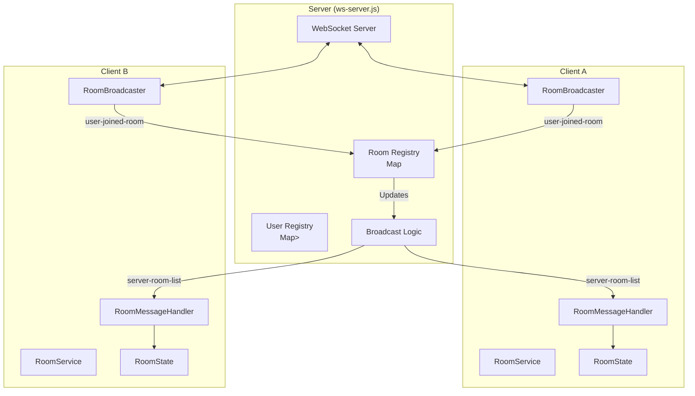
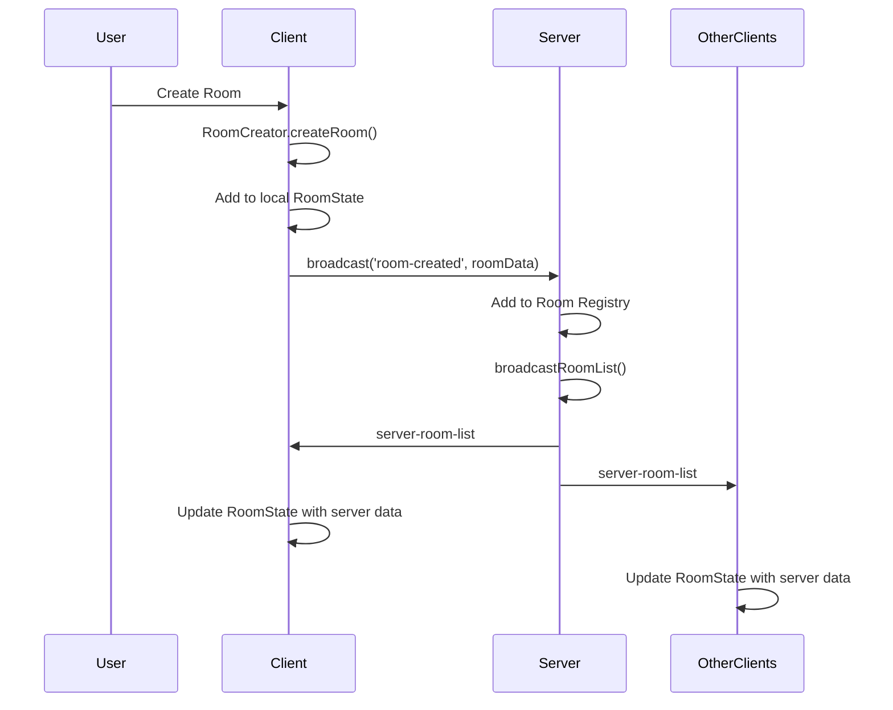
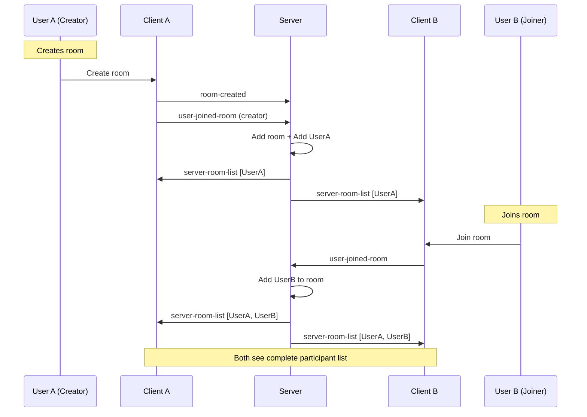

# WebRTC Dashboard - Server-Side Room Management Architecture

## Overview

The WebRTC Dashboard uses a **hybrid architecture** combining:
- **Server-side room registry** (authoritative source of truth)
- **Client-side WebRTC connections** (peer-to-peer data channels)
- **WebSocket signaling** (for coordination and room updates)

## Architecture Diagram



## Message Flow

### 1. Room Creation Flow



### 2. User Join Flow



## Data Structures

### Server-Side

```javascript
// Room Registry (Authoritative)
const rooms = new Map();
// Structure:
rooms.set(roomId, {
    id: 'room_abc123',
    name: 'Team Meeting',
    host: 'Alice',
    hostId: 'user_alice',
    createdAt: '2024-11-21T10:00:00Z',
    participants: Set([
        { id: 'user_alice', name: 'Alice' },
        { id: 'user_bob', name: 'Bob' }
    ])
});

// User-Room Mapping
const userRooms = new Map();
// Structure:
userRooms.set('user_alice', Set(['room_abc123']));
```

### Client-Side

```javascript
// RoomState (Synchronized with server)
class RoomState {
    rooms = new Map();        // roomId -> room data
    localRooms = new Set();   // rooms created by this client
    
    // When server-room-list received:
    // 1. Clear existing rooms
    // 2. Populate with server data
    // 3. Maintain local room tracking
}
```

## Message Types

### Client → Server Messages

| Message | Purpose | Data |
|---------|---------|------|
| `room-created` | Notify server of new room | `{id, name, host, hostId}` |
| `user-joined-room` | User joined a room | `{roomId, userId, userName}` |
| `user-left-room` | User left a room | `{roomId, userId}` |
| `room-list-request` | Request current room list | `{}` |

### Server → Client Messages

| Message | Purpose | Data |
|---------|---------|------|
| `server-room-list` | Authoritative room list | `{rooms: [{id, name, participants, ...}]}` |
| (relay) | Relay client messages | Original message |

## Critical Implementation Details

### 1. Room Creator MUST Join Their Own Room

```javascript
// room-manager.js
async createRoom(options, currentUser) {
    const room = await this.roomService.createRoom(roomData);
    
    // CRITICAL: Creator must join via RoomService
    await this.roomService.joinRoom(room.id, currentUser);  // ← This was missing!
    
    // Then setup ChatManager
    await this.chatManager.joinRoom(room.id, currentUser);
}
```

### 2. RoomBroadcaster MUST Listen for server-room-list

```javascript
// room-broadcaster.js
const messageTypes = [
    'server-room-list',  // ← This was missing!
    'room-created',
    'user-joined-room',
    // ...
];
```

### 3. Server MUST Broadcast Room List

```javascript
// ws-server.js
// After any room change:
broadcastRoomList();

// Periodic sync (every 5 seconds):
setInterval(() => {
    if (rooms.size > 0) {
        broadcastRoomList();
    }
}, 5000);
```

### 4. Client MUST Request Room List on Init

```javascript
// room-service-v3.js
async init() {
    // ... initialization ...
    
    // Start room discovery
    this.discovery.startDiscovery();  // ← This was missing!
}
```

## Synchronization Strategy

### Initial Sync
1. Client starts up
2. RoomService initializes
3. RoomDiscovery sends `room-list-request`
4. Server responds with `server-room-list`
5. Client updates RoomState

### Continuous Sync
1. Server broadcasts `server-room-list` on any change
2. Server broadcasts periodically (5 seconds)
3. Client re-syncs when tab becomes visible
4. Client can manually refresh

### Conflict Resolution
- **Server is ALWAYS authoritative**
- Client state is replaced, not merged
- Local room tracking preserved for cleanup

## Testing Checklist

### Room Creation
- [ ] Creator appears in participant list
- [ ] Room shows "👤 1/10" immediately
- [ ] Other clients see room in list
- [ ] Room persists in server registry

### User Joining
- [ ] Joiner sees existing participants
- [ ] Existing users see new joiner
- [ ] Count updates to "👤 2/10"
- [ ] Server registry updated

### Synchronization
- [ ] New tabs see existing rooms
- [ ] Refresh maintains room state
- [ ] Periodic sync works
- [ ] Tab switching triggers sync

### WebRTC Connection
- [ ] Offer/Answer exchange works
- [ ] Data channel opens
- [ ] Messages flow P2P
- [ ] Multiple peers connect in mesh

## Common Issues & Solutions

### Issue 1: "existingParticipants: Array(0)"
**Cause:** RoomState not synchronized with server
**Solution:** Ensure server-room-list is received and processed

### Issue 2: Room shows "👤 0/10"
**Cause:** Room creator not added to participants
**Solution:** Call roomService.joinRoom() after createRoom()

### Issue 3: Users don't see each other
**Cause:** Server not broadcasting room list
**Solution:** Ensure broadcastRoomList() called after changes

### Issue 4: Stale room data
**Cause:** No periodic sync
**Solution:** Implement periodic broadcast on server

## Best Practices

1. **Always trust server data** - Replace, don't merge
2. **Log extensively** - Track message flow
3. **Handle edge cases** - Tab switching, network issues
4. **Test with multiple tabs** - Ensure sync works
5. **Monitor server logs** - Verify room registry updates
