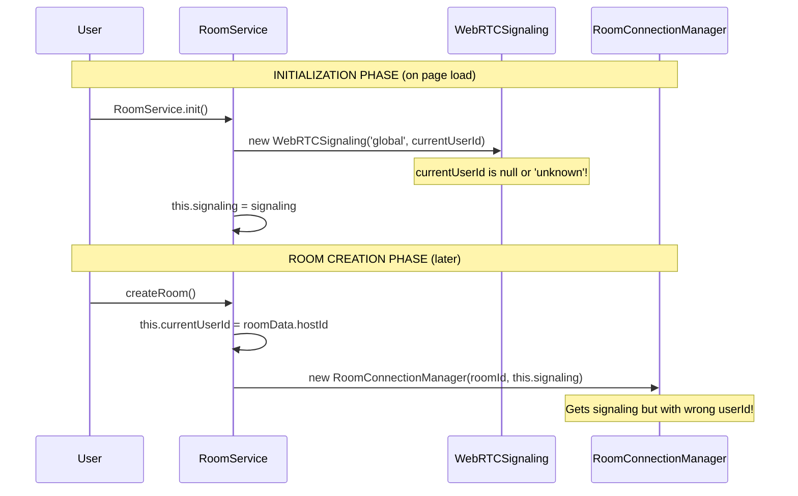
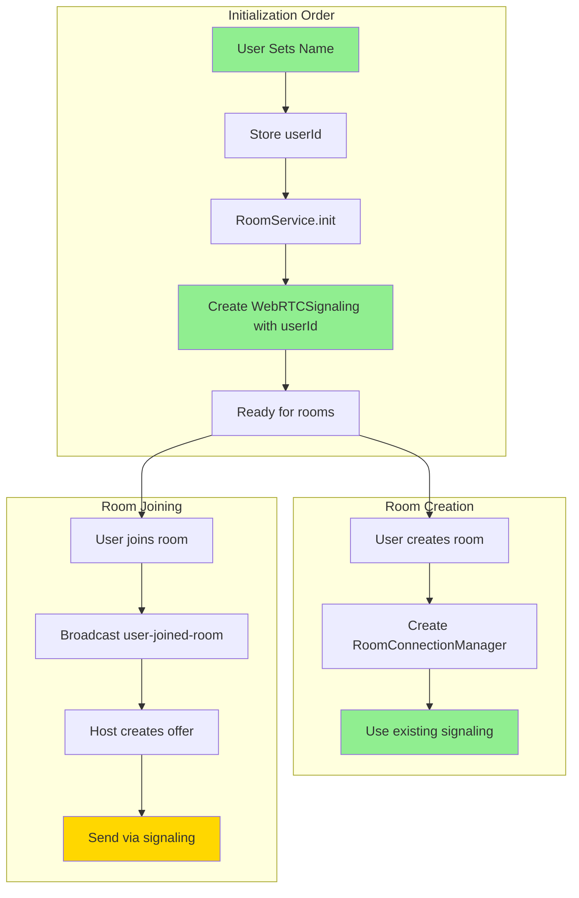

# WebRTC Signaling Architecture Fix

## Current Problem Analysis

### What's Working ✅
1. **Room Creation**: Host creates room successfully
2. **Room Discovery**: Rooms are discovered via broadcast
3. **Join Broadcast**: `user-joined-room` is sent and received
4. **Host Response**: Host receives join and tries to create offer

### What's Broken ❌
```
[RoomConnection:room_5ez] ❌ No signaling service available!
```

## Root Cause

The signaling service initialization has a timing issue:



## The Architecture Problem

### Current Flow (BROKEN)
1. **RoomService.init()** → Creates WebRTCSignaling with `currentUserId = null`
2. **User creates room** → Sets `currentUserId = hostId`
3. **Creates RoomConnectionManager** → Uses signaling with wrong userId
4. **Signaling doesn't work** → Wrong userId in signaling

### Required Flow (FIXED)
1. **User sets name** → Store userId globally
2. **RoomService.init()** → Create WebRTCSignaling with correct userId
3. **Create/Join room** → RoomConnectionManager uses working signaling

## Detailed Component Flow



## Component Responsibilities

### WebRTCSignaling
- **Purpose**: Handle WebRTC offer/answer/ICE exchange via WebSocket
- **Created by**: RoomService during init
- **Used by**: RoomConnectionManager for all signaling
- **Problem**: Created with wrong userId

### RoomConnectionManager
- **Purpose**: Manage WebRTC connections for a specific room
- **Created by**: RoomService when creating/joining room
- **Uses**: WebRTCSignaling for offer/answer/ICE
- **Problem**: Gets null or broken signaling

### RoomService
- **Purpose**: Manage rooms and orchestrate connections
- **Creates**: WebRTCSignaling, RoomConnectionManager
- **Problem**: Creates signaling too early (before userId known)

## The Fix

### Option 1: Lazy Initialize Signaling
```javascript
// In RoomService
async _ensureSignaling() {
    if (!this.signaling && this.currentUserId) {
        this.signaling = new WebRTCSignaling('global', this.currentUserId);
        await this.signaling.init();
    }
    return this.signaling;
}

// When creating RoomConnectionManager
const signaling = await this._ensureSignaling();
const rcm = new RoomConnectionManager(roomId, signaling);
```

### Option 2: Recreate Signaling When User Known
```javascript
// In RoomService.createRoom()
if (!this.signaling || this.signaling.userId !== roomData.hostId) {
    this.signaling = new WebRTCSignaling('global', roomData.hostId);
    await this.signaling.init();
}

// In RoomService.joinRoom()
if (!this.signaling || this.signaling.userId !== userData.id) {
    this.signaling = new WebRTCSignaling('global', userData.id);
    await this.signaling.init();
}
```

### Option 3: Pass Signaling to RoomConnectionManager Later
```javascript
// Create RoomConnectionManager without signaling
const rcm = new RoomConnectionManager(roomId);

// Set signaling later when available
rcm.setSignaling(this.signaling);
```

## Verification Checklist

After fix, verify these logs appear in order:

### Host Side
```
[RoomService] Creating room: Test Room
[RoomService] 🔧 Creating RoomConnectionManager for host
[WebRTCSignaling] Created for room: global, user: <actual-user-id>
[RoomService] WebRTC signaling initialized
[RoomConnection] Created for room: room_xxx
[RoomService] 👥 User joined room: {userId: "...", userName: "..."}
[RoomConnection] 📤 Creating offer for: user_xxx
[WebRTCSignaling] Sending offer to: user_xxx ✅
```

### Joiner Side
```
[RoomService] Joining room: room_xxx
[WebRTCSignaling] Created for room: global, user: <actual-user-id>
[WebRTCSignaling] Received offer from: host_xxx ✅
[RoomConnection] 📥 Received offer from: host_xxx
[WebRTCSignaling] Sending answer to: host_xxx ✅
```

## Implementation Priority

1. **IMMEDIATE FIX**: Ensure signaling is created with correct userId
2. **VERIFY**: RoomConnectionManager receives valid signaling
3. **TEST**: Offers/answers are sent via signaling
4. **CONFIRM**: DataChannel opens successfully
