## Architectural Foundation: Networks of Card-Arrows

The MVP Cards architecture represents a fundamental realization: **the network itself IS the knowledge container**. Rather than deploying cards as separate entities on network infrastructure, cards function as **arrow-like pointers** forming a self-describing network at every scale—from personal knowledge management to national digital infrastructure.

This design is grounded in Category Theory's principle that **all networks are compositions of arrows** (morphisms). Each card type—MCard, PCard, VCard—realizes this arrow principle at different operational levels:

- **MCard**: Content → Hash-addressed identity (immutable data arrows)
- **PCard**: Specifications → Implementations (computational transformation arrows)
- **VCard**: Credentials → Validated capabilities (effectful authorization arrows)

Cards compose recursively: a single card is an arrow; collections of cards are networks of arrows; networks of networks scale freely through the same compositional primitive. This **arrow-grounded architecture** dramatically simplifies implementation while enabling truly sovereign, self-governing networks—precisely what distributed and archipelago nations require.

**Validation**: IT Del's pioneering deployment establishes the first institution where students and faculty operate within a coherent, self-governing knowledge mesh-network at Internet scale, proving this vision is operational, not theoretical.

## Summary

The MVP Cards architecture introduces a formal system that establishes a clear separation between **dynamic computational processes** and **static information carriers**. This triadic framework implements mathematical structures based on polynomial functors, content-addressable storage, and monadic design principles, creating three complementary card types that form a complete computational ecosystem:

- **[[MCard]] (Data Plane)**: **Static information carrier** - Immutable, content-addressable data structures that serve as the foundational storage for all information
- **[[PCard]] (Control Plane)**: **Dynamic computational component** - Polynomial programming interface that processes and transforms any static information carriers through representable functors
- **[[VCard]] (Application Plane)**: **Static external trigger** - External information carriers that function as sovereign triggers and inputs for knowledge workflow generation

- Prefer composition over inheritance.
- [[PCard]] and [[VCard]] reference [[MCard]]s by hash; they do not embed payloads or reuse storage APIs.
- Cryptographic functions reside in VCard libraries; storage is MCard; composition/control is PCard.
- Triadic planes deliver a scale-free knowledge production backbone that can be operated by individuals, teams, and institutions with the same vocabulary.

### PCard as Dynamic Algorithmic Framework

PCard represents the **dynamic computational component** of the system—the algorithms that operate on data structures—while MCard and VCard serve as **static information carriers**:

#### Dynamic Computation vs. Static Information
- **PCard (Dynamic)**: Represents algorithms, transformations, and computational processes that can operate on any static information
- **MCard/VCard (Static)**: Serve as immutable data structures and information carriers that PCard processes
- **Universal Applicability**: PCard is designed to work with any static information carrier, not just MCard or VCard
- **Algorithm-Data Separation**: Clear separation between computational logic (PCard) and information storage (static carriers)

This architecture establishes PCard as the **dynamic algorithmic layer** that processes static information carriers, just as algorithms in computer science are designed to operate on data structures. The framework ensures that PCard can work with any static information carrier, making it a universal computational interface rather than being limited to specific card types.

### VCard: External MCards as Triggers and Inputs

VCard represents a specialized class of MCards that exist **external** to the standard MCard collection, serving as **inputs or triggers** for generating additional MCards within the ecosystem. This external positioning enables VCard to act as sovereign catalysts that can initiate new knowledge workflows without being constrained by existing collection boundaries.

For VCards containing sensitive information such as credentials, passwords, or key phrases, they employ **encrypted storage** or **conditional exposure** mechanisms. These secrets are only revealed to MCard Collections after execution of **known executable procedures** that validate authorization context, ensuring cryptographic sovereignty while enabling controlled access to protected assets.

### PCard: Polynomial Representation and Universal Programming Interface

PCards function as **polynomial representations** of any static information content, utilizing **representable functors** (Polynomial Functors) to extract information of interest within specific contexts. In essence, PCard serves as a **universal polynomial programming interface** to any static information carrier, enabling:

- **Contextual extraction**: Polynomial functors selectively retrieve relevant data patterns from any static information source
- **Computational transformation**: Representable functors process and transform content regardless of the underlying carrier
- **Interface abstraction**: PCard provides a structured programming layer over raw static information carriers

This architecture establishes PCard as the **dynamic computational component** that can operate on any static information carrier, not just MCard or VCard. Just as algorithms in computer science are designed to operate on data structures, PCard is designed to operate on any static information through its universal polynomial computational framework.

### HyperCard Heritage: Cards as Network Navigation

The MVP Cards system draws direct inspiration from Apple's revolutionary **HyperCard** (1987-2004), reimagining its "Easy, Fun, Interesting" rapid authoring philosophy for the modern age of cryptographic sovereignty and distributed networks.

**Original HyperCard Innovation**:
- Cards as visual/informational units connected by hyperlinks
- Stack-based navigation through card-to-card relationships
- Accessible programming through visual scripting
- "Anyone can author" democratic knowledge creation

**MVP Cards Evolution**:
- **Cards as arrow-like pointers**: Each card is a directed relationship (morphism) in a network
- **Content-addressable navigation**: Follow hash-chains instead of URLs
- **Cryptographic sovereignty**: Hash-based identity eliminates trust dependencies
- **Network IS the container**: Not cards IN a network, but cards AS the network

**Why "Card" Metaphor Matters**:
- **Cognitive accessibility**: Non-technical users understand "cards" intuitively
- **Compositional thinking**: Cards naturally compose into stacks, networks, and workflows
- **Visual navigation**: Card-based interfaces map directly to human spatial reasoning
- **Democratic participation**: Lowers barriers to knowledge creation and curation

**From HyperCard to Network-Card**:

| HyperCard (1987) | MVP Cards (2025) |
|------------------|------------------|
| Cards on desktop | Cards as network nodes |
| Links via buttons | Arrows via content-hashes |
| Stack-based | Graph-based (Merkle-DAG) |
| Single-user | Distributed sovereignty |
| Visual scripting | Polynomial functors (PCard) |
| No authentication | Zero Trust (VCard) |

The genius of HyperCard was recognizing that **cards + links = knowledge navigation**. MVP Cards extends this insight: **cards + arrows = self-describing networks** that scale from personal notebooks to national infrastructure without architectural rewrites.

By grounding HyperCard's accessibility in Category Theory's mathematical rigor (arrows/morphisms), MVP Cards achieves the rare combination of **intuitive interface** + **formal verification** + **sovereign infrastructure**.

By minimizing the footprint of asset identities—assigning every artifact a condensed yet extensible description anchored in hash-derived MRefs—the platform reduces the computational overhead required to operate [[Zero Trust Architecture|ZTA]] controls. Lightweight identifiers allow policy engines to evaluate subjects, devices, and workloads without repeatedly parsing heavyweight schemas, while extensible metadata keeps the system adaptable to new governance requirements.

Drawing on the scale-free objectives outlined in [[MVP Cards for PKC]], this document positions the MVP vocabulary as the connective tissue for a Progressive Knowledge Container ecosystem: immutable evidence (`MCard`), composable intent (`PCard`), and value-realizing effects (`VCard`) that can propagate from personal notebooks to national knowledge infrastructures without architectural rewrites.

## IT Del Deployment: Institutional-Scale Validation

### First Operational Proof at Internet Scale

Institut Teknologi Del's (IT Del) campus-wide PKC deployment provides the first **institutional-scale validation** of the MVP Cards architecture operating as a self-governing network:

**Operational Evidence**:
- **Scale**: Entire campus (students + faculty) operating within coherent knowledge mesh-network
- **Heterogeneity**: Diverse users, varying devices, inconsistent connectivity
- **Real-world conditions**: Production environment, not laboratory simulation
- **Self-governance**: Network maintains connectivity as services turn on/off independently

**Architectural Validation**:
1. **Data-oriented transcends service status**: As long as MCards maintain connectivity through hash-addressing, individual services can operate independently without disrupting network coherence
2. **Arrow composition at scale**: Same card primitives function identically from building-to-building, island-to-island, demonstrating true scale-freeness
3. **Immutable primitives eliminate bugs**: Content-addressable MCards prevent race conditions, version conflicts, and "which copy is authoritative?" problems by construction
4. **Graceful degradation**: Network continues functioning even when individual nodes experience failures

### Strategic Implications for Indonesia

IT Del's deployment positions Indonesia with **first-mover advantage** in sovereign network infrastructure:

**Technology Leadership**:
- Major nations are still theorizing sovereign networks while Indonesia is implementing
- Arrow-based architecture addresses the fundamental challenge traditional solutions ignore: **how to build digital infrastructure across 17,000+ islands** without requiring datacenter-grade connectivity everywhere
- Same mathematical principles apply whether connecting 100 users or 100 million—**linear scaling** from campus to nation

**Export Opportunity**:
- Proven implementation pattern transferable to other institutions and nations
- Technology AND governance model exportable
- Positions Indonesia not as technology consumer, but as infrastructure innovator

This real-world validation demonstrates that MVP Cards architecture is not academic theory but **operational infrastructure** proven under production conditions.

## Hash Namespace and Identity-Centric Zero Trust

- **Single source of truth**: [[MCard]] hashes create a universal namespace where every datum, event, and resource is addressed by immutable content signatures. This satisfies the "one canonical record" mandate championed in the vault [[README]], ensuring governance policies and automation pipelines reason over consistent identifiers.
- **Identity as first-class infrastructure**: In ZTA literature, identity spans people, devices, workloads, and knowledge artifacts. By binding all of them to the MCard namespace, the PEP/PDP pairing described in [[Policy Enforcing Point]] and [[Policy Decision Point]] can evaluate requests with constant-time lookups against content-addressed manifests, enabling high-throughput Zero Trust enforcement.
- **BMAD orchestration**: Modern conversational programming workflows depend on deterministic references when chaining [[BMAD]]/[[SpecKit]] tasks. Hash-based identities guarantee that conversational prompts, CLM manifests, and generated code all resolve to the same artifacts regardless of where the workflow executes.
- **Scalable observability**: Because every enforcement action stores telemetry as new MCards, policy drift, anomaly detection, and forensics operate over the same namespace as runtime enforcement—closing the loop between design intent and operational reality.

## Scale-Free Knowledge Production Strategy

- **Unified triadic spine**: [[MCard]], [[PCard]], and [[VCard]] split responsibilities across data, control, and value planes, mirroring the software-defined networking pattern that enables horizontal scaling and plug-and-play innovation.
- **Fractal deployment**: Every card type is self-similar across scales—personal PKCs, community hubs, and sectoral platforms reuse the same hashes, functors, and manifests, ensuring interoperability and zero conversion cost.
- **Zero Trust by default**: Condensed identity descriptors and hash-first integration keep authentication/authorization decisions lightweight, allowing pervasive PEP/PDP enforcement without overburdening edge or community-hosted infrastructure.

### Architect Perspective — Holistic System Blueprint
- **Composable infrastructure**: Architects can treat the MVP stack as a reference architecture where each plane exposes clean APIs and plane-specific guardrails, accelerating platform assembly across cloud, edge, and sovereign environments.
- **Defense-in-depth alignment**: The separation of payload (`MCard`), control logic (`PCard`), and cryptographic acts (`VCard`) enables layered security analysis and simplifies mapping to Zero Trust control catalogs (NIST SP 800-207, DoD ZT Strategy).
- **Progressive enhancement**: Systems can start with minimal functionality (single-plane deployments) and evolve into full triadic stacks, preserving investments while adding observability, automation, and value routing capabilities.

### Analyst Perspective — Adoption and Market Fit
- **Accessible mental model**: HyperCard-inspired cards and conversational interactions lower learning curves, making advanced knowledge ops intelligible to educators, civic organizations, and SMEs.
- **Scalable incentives**: VCard-native value flows (reputation, rights, settlements) unlock sustainable participation models for communities, aligning economic incentives with knowledge stewardship.
- **Ecosystem interoperability**: Hash-based namespaces and polynomial functor contracts reduce switching costs between existing systems, supporting partnerships and federated data sharing without bespoke integrations.

## Competitive Advantages: Why MVP Cards vs. Traditional Approaches

Understanding MVP Cards' strategic position requires comparison against established distributed systems paradigms:

### vs. Traditional Software-Defined Networking (SDN)
**Traditional SDN**:
- Centralized control plane managing distributed data plane
- Single point of failure; controller bottleneck at scale

**MVP Cards Advantage**:
- **Distributed sovereignty**: No central controller; every PKC node autonomous yet coordinated through arrow composition
- **Data-oriented network**: Connectivity transcends service operational status
- **Self-describing**: Network structure encoded in card relationships

### vs. Kubernetes and Container Orchestration
**Kubernetes Architecture**:
- Service-oriented deployment with imperative configuration
- Constant maintenance burden: version management, health monitoring, service dependencies

**MVP Cards Advantage**:
- **Data orientation**: Services can turn on/off independently; data maintains connectivity
- **Immutable references**: MCard hash-addressing eliminates "configuration drift"
- **Compositional deployment**: PCard functors compose predictably without orchestration overhead

### vs. Blockchain and Distributed Ledgers
**Blockchain Architecture**:
- Consensus-based immutable ledger with high computational overhead
- Limited throughput, complex smart contract verification

**MVP Cards Advantage**:
- **Lightweight immutability**: Hash-indexing without proof-of-work
- **Local verification**: Scales independently without global consensus requirements
- **Content-addressable efficiency**: Storage deduplication through MCard hashing

### vs. Traditional Cloud Infrastructure (AWS/Azure/GCP)
**Cloud Provider Model**:
- Vendor-controlled infrastructure with proprietary APIs
- Vendor lock-in, sovereignty concerns, cost scales with usage

**MVP Cards Advantage**:
- **Self-sovereign infrastructure**: Deployable on any hardware
- **Open standards**: MVP Card framework enables interoperability
- **Edge-friendly**: Archipelago-optimized, doesn't require centralized datacenters
- **Cost efficiency**: No usage-based pricing from external vendors

### vs. IPFS and Content-Addressable Storage
**IPFS Architecture**:
- Distributed content addressing with DHT-based routing
- Content storage without process specification or credential management

**MVP Cards Advantage**:
- **Unified framework**: MCard (content) + PCard (process) + VCard (credentials) as integrated arrow network
- **Not just "what" but "how" and "who"**: Complete computational ecosystem
- **Zero Trust integration**: Built-in authentication/authorization through VCard

### Strategic Differentiator

MVP Cards' unique position emerges from **unifying content, process, and credentials as a single compositional framework** (arrow networks) rather than treating them as separate concerns:

- **Operational simplicity** through data-orientation (vs. service-orientation)
- **Sovereignty by design** through local-first architecture (vs. cloud-dependence)
- **Scale-free deployment** through universal arrow composition (vs. scale-specific solutions)
- **Archipelago optimization** through edge-friendly content-addressing (vs. datacenter-centric models)

For distributed nations and archipelago geographies specifically, MVP Cards addresses what traditional solutions ignore: **building digital infrastructure without requiring datacenter-grade connectivity everywhere**. Arrow-based networks work identically whether connecting two buildings or two continents—same mathematics, same implementation, same operational model.

## Conversational Programming & Vibe Coding Alignment

- **HyperCard lineage, modernized**: The MVP interface extends the "Easy, Fun, Interesting" ethos by turning every card into a conversational surface where users, [[BMAD-Method|BMAD]]-based workflows, and LLM copilots co-orchestrate knowledge work.
- **Architect synthesis (`@[/architect]`)**: Winston's system blueprint treats conversational prompts as first-class control-plane signals. [[SpecKit]] contributes spec-driven guardrails that let architects script end-to-end flows where `PCard` functors are generated from executable specifications.
- **Analyst facilitation (`@[/analyst]`)**: Mary's discovery exercises capture user intents as structured narratives. These intents compile into `PCard` templates and `VCard` value flows, keeping socio-technical context intact during automation.
- **Vibe coding lifecycle**: LLM-driven agents translate natural language intent → CLM-typed specs → `PCard` orchestration → `VCard` effect sealing, forming a continuous "prep → exec → post" pipeline defined in the BMAD playbooks.

### Monadic Conversational Programming Patterns

The MVP Cards architecture naturally supports **[[Conversational Programming — Monadic Patterns]]** for LLM interactions:

**Prompt Engineering as Kleisli Pipelines**:

See [MVP Cards Code Examples](MVP%20Cards%20Code%20Examples.md#kleisli-pipelines-for-prompt-engineering) for the implementation of monadic Kleisli pipelines that power conversational programming.

**Context Engineering with Reader/State/Writer**:
- **Reader Env**: Policies, capabilities, and constraints stored as MCards, automatically threaded
- **State Ctx**: Conversation history and evolving plans tracked as MCard references
- **Writer Log**: Rationale and tool traces accumulated as MCard audit trail

See [PCard as Monadic Composition](MVP%20Cards%20Code%20Examples.md#readerstatewriter-pattern-implementation) for implementation details.

**Benefits for Conversational Programming** (see [[Monadic Thinking in Conversational Programming — A Practical Comparison]]):
- **Cohort M advantage**: Programmers trained with monadic patterns achieve 3-5x faster development, 50-70% less debugging, 60-80% fewer runtime failures
- **Explicit context**: No hidden state or prompt drift; all context visible as MCard references
- **Graceful failure**: Either/Validation enable actionable error messages instead of silent drops
- **Composability**: Complex LLM workflows built from small, tested, reusable steps
- **Auditability**: Complete provenance via Writer logs stored as MCards

### Automated Knowledge Production Workflow (GenAI Era)
- **Specify**: Analysts and domain experts capture requirements conversationally; [[SpecKit]]/[[BMAD]]-driven workflow renders them as executable specifications linked to MCard evidence. See [[Automated Knowledge Production]].
- **Design & Validate**: Architects assemble reusable `PCard` modules, simulate policies, and align enforcement with Zero Trust controls before deployment.
- **Execute & Learn**: Vibe coding agents enact flows, produce `VCard` artifacts, and write back immutable telemetry (`MCard`) for future refinement.
- **Iterate at scale**: Because every artifact is hash-addressed and spec-linked, teams can fork, remix, and federate knowledge production without schema drift, fulfilling the scale-free mandate for community and institutional adoption.

Additions for clarity:
- **Unified namespace**: [[MCard]] is the unified hash‑value namespace for all content/data artifacts across PKC.
- **Process/function modeling**: [[PCard]] models processes and functions compositionally over `MCard` hashes, partially inspired and enabled by the [[MCP|Model Context Protocol (MCP)]] as a named‑function, interoperable triggering/composition space grounded in the MCard namespace, guided by a [[Purely Functional Software Deployment Model]] (PFSD).
- **Universal connectivity**: [[VCard]] is the networking and value plane for sovereign asset domains, relying on [[Universal Connectivity]]/[[UPnP]] (e.g., [[Literature/PKM/Tools/Networking/libp2p|libp2p]] + [[Hub/Theory/Category Theory/Kademlia DHT|Kademlia DHT]]) and interoperable AuthN/AuthZ (OIDC/DID/ACE) to govern access and transfer rights without centralized brokers.

## Functional programming rationale (MCard → PCard → VCard)

The MVP triad is intentionally aligned with functional programming (FP) and **monadic design principles** so that the full stack benefits from immutability, referential transparency, composition, and explicit context management.

### MCard (Data Plane) = Exposed World of Immutable Values

- Content-addressable storage by `content_hash` makes each MCard an immutable value identified by its content, not location. This yields FP properties:
  - **Referential transparency**: a given hash always denotes the same value; it can be freely substituted anywhere.
  - **Determinism and memoization**: identical inputs (hashes) produce identical outputs, enabling safe caching and reproducible builds.
  - **Merkle-DAG provenance**: functions over data produce new hashes, forming auditable computation graphs.
  - **Open Sharing**: MCards are designed for the **exposed world** - content is shared openly without encryption barriers.

**Monadic connection**: MCard implements the foundation for monadic computations by providing immutable, content-addressed values that serve as the "plain values" that monads wrap. Each MCard is a pure value that can be lifted into monadic context via `return`/`unit`.

**The Two Worlds Architecture**:

> **🔐 Core Design Principle**: [[MCard]] serves the **exposed world** where content is meant to be shared openly, while **VCard** serves the **protected world** where credentials require authentication and authorization for any access.

For a visual representation of the Two Worlds Architecture, see the [Mermaid diagram](MVP%20Cards%20Code%20Examples.md#two-worlds-architecture) in the code examples document.

### PCard (Control Plane) = Pure Composition with Monadic Context

- PCard expresses computations as polynomial functors over `MRef` hashes, i.e., structure-preserving, side-effect–free transformations that map input references to output references.
- Effects are not performed here; PCard remains a pure layer that orchestrates evaluation order, alternatives (sum types), and products (pairings) while preserving the FP discipline (no payload mutation, no cryptography).

**Monadic enhancement**: PCard naturally implements **Reader/State/Writer** monadic patterns:
- **Reader Env**: PCard can reference environment MCards (policies, capabilities, constraints) that are threaded through all operations
- **State Ctx**: PCard can track evolving state (conversation history, computation progress) as a sequence of MCard references
- **Writer Log**: PCard can accumulate logs/traces as a list of MCard references, creating auditable computation provenance

For implementation details of the PCard monadic composition pattern, see the [PCard as Monadic Composition](MVP%20Cards%20Code%20Examples.md#readerstatewriter-pattern-implementation) section in the code examples document.

**Benefits**:
- **Explicit context**: Environment, state, and logs are first-class MCard references, not hidden
- **Composability**: PCard operations compose with automatic context threading
- **Testability**: Pure PCard logic can be tested independently of effects
- **Provenance**: All context changes tracked as MCard references in Merkle-DAG

### VCard (Application Plane) = Protected Key Ring with Authenticated Effects

- **VCard is fundamentally a **protected subset of MCard** that serves as a **cryptographic key ring** for credential management. Unlike regular MCards that belong to the "exposed world," VCards exist in the "protected world" where all access requires authentication and authorization.
- Real-world effects (sealing, signatures, access rights, settlements) are introduced behind explicit authentication and authorization gates.
- VCard libraries perform cryptographic operations; outcomes are sealed as new MCards. Thus, side effects are controlled, attributable, and auditable while the rest of the stack stays purely functional.

**VCard as Protected MCard Collection**:


**Key Ring Functionality**:
- **Secure Storage**: All credentials encrypted and access-controlled
- **Lifecycle Management**: Issuance, rotation, revocation, expiration
- **Audit Trails**: All access logged as immutable MCard evidence
- **Policy Boundaries**: [[PCard]] policies govern all credential operations
- **Configuration Interface**: Serves as secure .env file entries for applications like [[Personal Knowledge Container]]

### VCard as Secure .env Interface

VCard transforms traditional environment configuration by providing a **cryptographically protected alternative to .env files**:

#### .env Security Problem Solved
Traditional .env files create security vulnerabilities:
- Plaintext storage exposes secrets
- No audit trail for configuration access
- Manual rotation processes
- Risk of committing secrets to version control

#### VCard Configuration Solution
Each .env line entry becomes a protected VCard credential:
```ts
// Traditional vulnerable .env
// API_KEY=secret123
// DB_PASSWORD=xyz456

// VCard-protected configuration
interface ConfigVCard extends VCard {
  credentialType: 'config-entry';
  configKey: string;        // "API_KEY", "DB_PASSWORD"
  application: string;      // "Personal Knowledge Container"
  accessPolicy: {
    readPermissions: string[];  // authorized applications
    auditLevel: 'full' | 'minimal';
    rotationPolicy: 'auto' | 'manual';
  };
}
```

#### Application Integration Pattern


**Benefits for Application Development**:
- **Zero-Trust Configuration**: No plaintext secrets anywhere
- **Automated Rotation**: Configuration updates propagate automatically
- **Complete Auditing**: Every config access logged as MCard evidence
- **Policy-Based Access**: Fine-grained control over which applications can access which secrets
- **Environment Parity**: Same VCard credentials across environments with proper scoping

**Monadic framing**: VCard implements the **IO boundary** with explicit error handling:
- **IO monad**: External effects (file writes, network calls, crypto operations) isolated in IO
- **Either/Validation**: Errors made explicit with actionable diagnostics
- **Effect sealing**: All VCard effects produce new MCards, maintaining immutability

```hs
-- VCard as effectful boundary
type VCard a = ReaderT Env (StateT Ctx (WriterT Log IO)) (Either Err a)

-- VCard operations handle effects explicitly
seal :: MRef -> VCard MRef  -- Crypto effect, produces sealed MCard
sign :: MRef -> VCard MRef  -- Signature effect, produces signed MCard
verify :: MRef -> VCard Bool  -- Verification effect, reads but doesn't mutate

-- Effects are contained and auditable
safe_pipeline :: MRef -> VCard MRef
For an example of implementing safe effectful pipelines with proper boundaries between pure and effectful code, see the [Safe Pipeline with Effect Boundaries](MVP%20Cards%20Code%20Examples.md#safe-pipeline-with-effect-boundaries) example.
  return signed
```

**Benefits**:
- **Effect isolation**: IO operations clearly separated from pure logic
- **Graceful failure**: Either/Validation enable actionable error messages
- **Audit trails**: Writer logs all effects as MCard references
- **Testability**: Can mock IO effects while testing pure logic

This separation maps closely to **monadic FP architecture**: immutable data (MCard), pure program description with explicit context (PCard as Reader/State/Writer), and controlled effectful boundary (VCard as IO with Either/Validation).

### Plane Boundary Diagram (Mermaid)

```mermaid
%%{init: {"flowchart": {"htmlLabels": true, "curve": "basis", "diagramPadding": 8}, "theme": "base", "themeVariables": {"fontSize": "11px"}}}%%
flowchart LR
  subgraph V[Application Plane — VCard]
    VC["VCard<br/>value, policies, crypto"]
    noteV[["Crypto boundary:<br/>AEAD, KDF, Signatures, ZK<br/>manifests, proofs"]]
  end

  subgraph P[Control Plane — PCard]
    PC["PCard<br/>polynomial control<br/>Hash-only refs"]
  end

  subgraph M[Data Plane — MCard]
    MC["MCard<br/>content-addressed, CRD-only"]
  end

  VC -- "hash-only refs MRef" --> PC
  PC -- "hash-only refs MRef" --> MC
  VC -. "sealed payloads as MCards" .-> MC

  classDef v fill:#ffebee,stroke:#f44336,color:#222;
  classDef p fill:#e3f2fd,stroke:#2196f3,color:#222;
  classDef m fill:#e8f5e9,stroke:#4caf50,color:#222;
  classDef note fill:#fff3e0,stroke:#fb8c00,color:#222;

  class VC v;
  class PC p;
  class MC m;
  class noteV note;
```



Caption: Cross-plane coupling is hash-only. MCard is immutable, CRD-only. PCard composes over references, not payloads. VCard owns cryptography and produces sealed artifacts stored as MCards.

## Engineering reasoning

- **Separation of concerns** (SDN planes)
  - [[MCard]] ([[Data Plane]]): content-addressable CRD-only storage, immutable.
  - [[PCard]] ([[Control Plane]]): polynomial functor composition over MCard hashes.
  - [[VCard]] ([[Application Plane]]): value flows, cryptographic sealing, ZK proofs, manifests, and peer-to-peer connectivity over universal overlays.
- **Immutability**
  - Inheriting storage types invites accidental mutation semantics. Hash-only references keep planes safe.
- **Security boundaries**
  - Per [[VCard]]: AEAD, KDF, signatures, ZKPs in VCard libraries; PCard/MCard must not implement crypto.
- **Replaceability**
  - Composition keeps planes swappable (storage engine, crypto suite, control schemas) without cascading changes.
- **Type modeling (Polynomial Functors, CLM)**
  - `PCard` is a structural descriptor of computation; `VCard` models transactions/value artifacts. Neither is “data storage”.
- **Functional programming alignment**
  - MCard immutability and hashing enforce referential transparency and deterministic replay.
  - PCard composes pure transformations (sum/product/derivative in polynomial functors) over references, not payloads.
  - VCard confines effects with cryptographic authN/authZ, preserving purity elsewhere and enabling audit trails.

## Why Arrow-Grounded Architecture Simplifies Implementation

The arrow-based, network-of-cards design principle dramatically simplifies implementation and enhances robustness through three foundational properties:

### 1. Immutable Primitives via Content-Addressable Storage

**MCards**—rooted in Monadology—provide content-addressable, **immutable data storage**. Once a card's content is hashed, its identity becomes permanent.

**Eliminates Entire Bug Classes**:
- ❌ **No race conditions**: Hash-addressed content can't be modified in-place
- ❌ **No version conflicts**: Same hash = identical content, always
- ❌ **No "which copy is authoritative?"**: Content-addressing is the authority

**Implementation becomes simpler because arrows point to immutable targets**—what an arrow references today remains valid forever. This is not a design preference; it's a mathematical guarantee through content-addressable hashing.

### 2. Monadic Tracking and Verification

The Monadic properties of MCards (self-contained, composable, context-carrying) make state transitions **explicitly trackable**:

- Every transformation is an arrow
- Every arrow is verifiable
- When VCards inject credentials or PCards compose specifications, the resulting **network of arrows forms an audit trail by construction**

**Implementation becomes more robust** because the system's evolution is encoded in the arrow network itself. Debugging reduces to "follow the arrows"—no hidden state, no implicit dependencies, no mystery mutations.

### 3. Single Primitive, Universal Composition

Because all three card types realize the same arrow principle at different levels, **the implementation uses one compositional algebra across all scales**:

- No special cases for "system-level" vs. "data-level" operations
- Arrows compose arrows, networks compose networks
- Same verification, caching, and routing logic from single MCard to planetary networks

**Implementation complexity does not explode with scale**. The uniformity means that managing 1,000 cards uses the same patterns as managing 1,000,000,000 cards—just more instances of the same primitive.

### The Synthesis: Systematically Manageable Implementation

Together, these properties mean that **implementation details become systematically manageable**:

- **Immutable primitives** → reduced state complexity
- **Monadic tracking** → built-in observability
- **Universal composition** → eliminated architectural discontinuities

The arrow network is not just a conceptual model—**it is the implementation strategy**. More importantly, it represents a **scientific principle for governing living and interactive systems** that span many spatial and temporal scales.

This is why IT Del's deployment could scale from laboratory proof-of-concept to campus-wide production without architectural rewrites: the same arrow primitives operate identically at all scales.

## Zero Trust Control Point Alignment

- **Policy Enforcement Point (PEP) enablement**
  - MCard-signed telemetry gives the [[Policy Enforcing Point|PEP]] an immutable evidence base for traffic flows, device posture, and enforcement outcomes.
  - PCard-modeled control graphs describe enforcement logic (allow/deny/step-up/isolate) as composable polynomial functors, keeping enforcement decisions declarative and testable.
  - VCard encapsulates effectful responses—session termination, segmentation updates, credential revocation—with authenticated `seal → store` cycles that can be audited and replayed.
- **Policy Decision Point (PDP) synthesis**
  - MCard references store contextual inputs (identity assertions, risk scores, policy manifests) so the [[Policy Decision Point|PDP]] can render reproducible verdicts.
  - PCard composes zero trust policy templates, enabling formal verification and scenario simulation before rollout.
  - VCard issues signed verdict artifacts (`permit`, `deny`, `challenge`, `isolate`) that PEPs consume, keeping decision/effect boundaries explicit.
- **Sphere of Governance feedback loop**
  - MCard provenance and PCard composition provide traceability from strategic governance intent to enforcement realities.
  - VCard-authenticated actions and override records close the loop, allowing adaptive policy refinement without violating separation of concerns.

## AGI Safety and Sovereign Infrastructure

The MVP Cards architecture provides critical infrastructure for safe AGI deployment through monadic design principles:

**MCard Immutability for AGI Provenance**:
- Creates tamper-proof audit trail for all AGI inputs, outputs, and intermediate states
- Content-addressable hashing ensures AGI cannot tamper with history
- Merkle-DAG structure provides complete provenance graph

**PCard Purity for AGI Reasoning**:
- AGI logic expressed as pure polynomial functors over MCard references
- Monadic context (Reader/State/Writer) makes AGI assumptions explicit
- Testable and verifiable without executing effects
- Composable via Kleisli arrows for complex AGI capabilities

**VCard Authentication for AGI Effects**:
- IO boundary isolates AGI actions (file writes, API calls, IoT control)
- Either/Validation ensures graceful AGI failure with actionable diagnostics
- Authentication/authorization gates prevent unauthorized AGI actions
- All effects sealed as new MCards for accountability

**Monadic AGI Safety Pattern**:
```hs
-- Safe AGI interaction with explicit context and error handling
type AGI_Env = MRef  -- Safety policies, capabilities, constraints
type AGI_State = MRef  -- World model, conversation history
type AGI_Log = [MRef]  -- Audit trail of reasoning and actions

agi_turn :: UserInput -> PCard (Either SafetyViolation) Response
agi_turn input = do
  -- Reader: Safety policies automatically threaded
  intent <- clarify_with_policies input
  -- Validation: Collect all safety violations
  safe_intent <- validate_safety intent
  -- State: Update world model
  plan <- reason_about_action safe_intent
  -- Writer: Log reasoning steps
  audit "AGI reasoning completed"
  -- VCard: Execute with IO boundary
  execute_safely plan
```

**Why this prevents AGI misalignment**:
- **Explicit policies**: AGI constraints formal (MCards), not implicit in weights
- **Continuous verification**: Every action checked against current policies (Reader)
- **Immutable audit**: Complete provenance cannot be erased (Writer + MCard)
- **Community control**: Policies set by communities via Sovereign Networks, not vendors
- **Graceful failure**: Safety violations explicit with diagnostics (Either/Validation)
- **Effect containment**: AGI actions isolated at IO boundaries (VCard)

See [[Sovereign Networks and AGI — Monadic Infrastructure for Safe Intelligence]] for comprehensive analysis of how MVP Cards, Sovereign Operational Networks, and monadic programming patterns together enable AGI safety through infrastructure sovereignty.

## BMAD/PocketFlow integration

- **Process model (BMAD)**: [[Hub/Theory/Sciences/Computer Science/Programming Model/BMAD-Method|BMAD-METHOD]] supplies the Plan → Implement → Test/Review → Release loop that maps cleanly to MVP planes:
  - Plan/Implement under [[PCard]] control, over [[MCard]] references.
  - Test/Review as typed guardrails producing verifiable [[MCard]] evidence.
  - Release as effectful operations gated by [[VCard]] policies (sign/seal/settle).
- **Execution model (PocketFlow)**: [[Hub/Theory/Sciences/Computer Science/Programming Model/PocketFlow|PocketFlow]] provides `prep → exec → post` node lifecycles and a Shared Store. This reinforces plane boundaries:
  - Shared Store holds pointers (hash/URI/cursor), not payloads → aligns with hash‑only coupling across MVP planes.
  - `prep/exec/post` becomes PCard capability gates; effects escalate to VCard.
- **Benefits to this rationale**:
  - Stronger separation of concerns (hash‑only references in control plane).
  - Reproducibility via PFSD: every step yields content‑addressed evidence.
  - Auditable provenance and policy conformance through typed PCard gating.

## Minimal shared shapes with Protected/Exposed Distinction

Use a minimal reference shape that respects the **protected vs exposed world** distinction:

```ts
interface MRef {
  hash: string;      // content-addressable ID
  schema?: string;   // optional schema URI
  protected?: boolean; // marks whether this is a VCard reference
}
```

Then compose in higher planes with explicit protection boundaries:

```ts
// Data plane (Exposed World - CRD-only)
interface MCard {
  content: Blob;           // unencrypted, shareable content
  content_hash: string;    // equals MRef.hash
  g_time: string;
  protected: false;        // explicitly marked as exposed
}

// Control plane (no payloads, governs both worlds)
interface PCard {
  polynomial_structure: PolynomialFunctor;
  inputs: MRef[];
  outputs: MRef[];
  policies?: CapabilitySpec;
  governsProtected?: boolean; // indicates if policy applies to VCard realm
}

// Application plane (Protected World - Key Ring)
For the complete VCard TypeScript interface definition, see the [VCard Interface](MVP%20Cards%20Code%20Examples.md#vcard-interface) in the code examples document.
  protected: true;         // explicitly marked as protected
  
  // Key Ring specific fields
  control: PCardRef;       // ref to governing PCard
  credentialType: 'authn'|'authz'|'token'|'key'|'certificate';
  owner: string;
  accessPolicy: CapabilitySpec; // strict access controls
  expires?: string;        // credential lifecycle management
}
```

**Protection Boundary Enforcement**:
```ts
// Type-level protection ensures MCards and VCards don't mix accidentally
type ExposedContent = MCard & { protected: false };
type ProtectedContent = VCard & { protected: true };

// PCard can govern both, but access patterns differ
interface AccessControl<T> {
  canRead: (content: T) => boolean;
  canWrite: (content: T) => boolean;
  canShare: (content: T) => boolean;
}

// MCards: open sharing by default
const mcardAccess: AccessControl<ExposedContent> = {
  canRead: () => true,           // anyone can read
  canWrite: () => false,         // immutable once created
  canShare: () => true           // anyone can share
};

// VCards: strict authentication required
const vcardAccess: AccessControl<ProtectedContent> = {
  canRead: requiresAuthN,        // must authenticate
  canWrite: requiresAuthZ,       // must be authorized
  canShare: requiresExplicitGrant // requires explicit permission
};
```

> **🔐 Key Insight**: The `protected` flag creates a **type-level boundary** between exposed content (MCard) and protected credentials (VCard), preventing accidental mixing of open content with sensitive authentication/authorization data.

## Why no inheritance?

- **Clarity**: Planes do one thing well (Unix philosophy).
- **Hygiene**: "hash-first, payload-last" is easier to enforce without inherited fields/methods.
- **Testing/Provenance**: Mocks of refs/manifests/proofs are simpler; CLM histories stay cleanly scoped per plane.

## Bidirectional links

- **Arrow-based architecture foundations**: [[PKC as the Network]] - Comprehensive explanation of how networks are compositions of arrows, with IT Del deployment validation and competitive positioning
- Architectural overview: [[MVP Cards for PKC]]
- Crypto boundaries and flows: [[VCard]] and [[VCard Source Code]]
- Polynomial functors and CLM context: [[PCard]], [[Cubical Logic Model]], [[Polynomial functor]]
- Networking details and namespace resolution: [[VCard#7.5.1 Universal Connectivity: Opportunities and Risks]], [[VCard#7.5.2 VCard Namespace with libp2p/Kademlia + AuthN/AuthZ]], [[Literature/PKM/Tools/Networking/libp2p|libp2p]], [[Hub/Theory/Category Theory/Kademlia DHT|Kademlia DHT]]
- Process and flow models: [[BMAD-Method|BMAD-METHOD — Universal AI Agent Framework]], [[PocketFlow]]
- Sovereign overlay integration: [[Overlay VPN Sovereign Value Fabric]]
- Cloud-native credential management: [[Kubernetes Secret Management and VCard Design Integration]] - Analysis of Kubernetes secret management patterns and their relationship to VCard's protected credential architecture
- Real-world validation: IT Del campus deployment demonstrates operational proof at institutional scale across diverse users and devices

# References
```dataview 
Table title as Title, authors as Authors
where contains(subject, "MVP Card")
sort title, authors, modified
```
