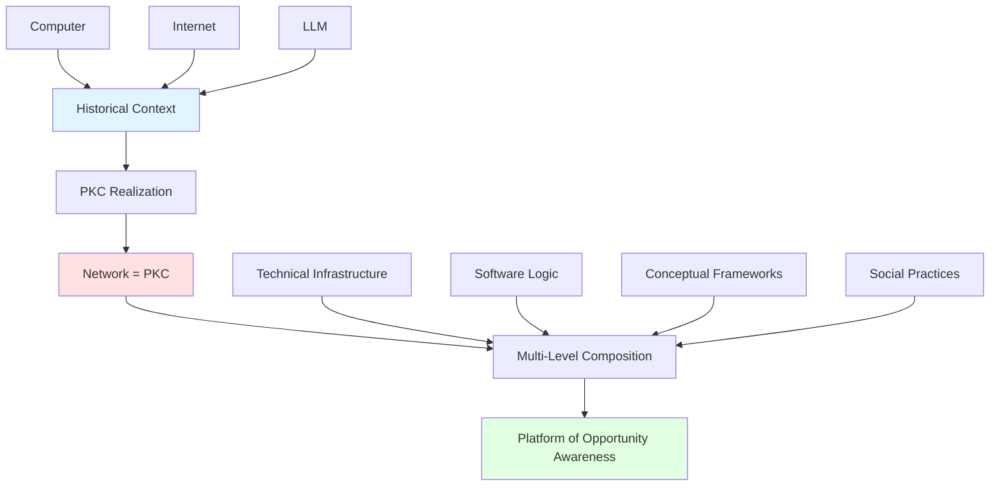
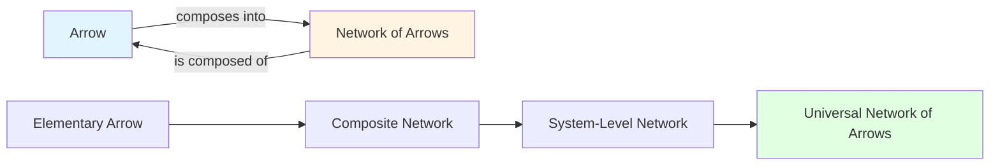
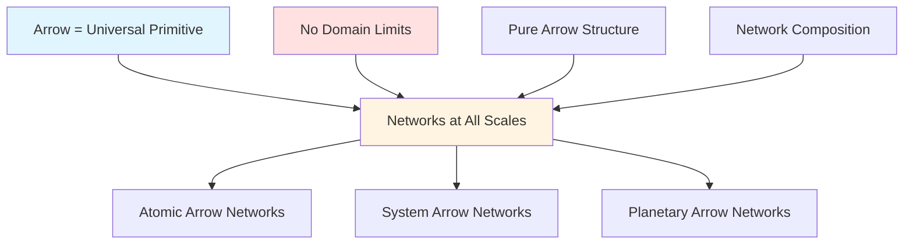
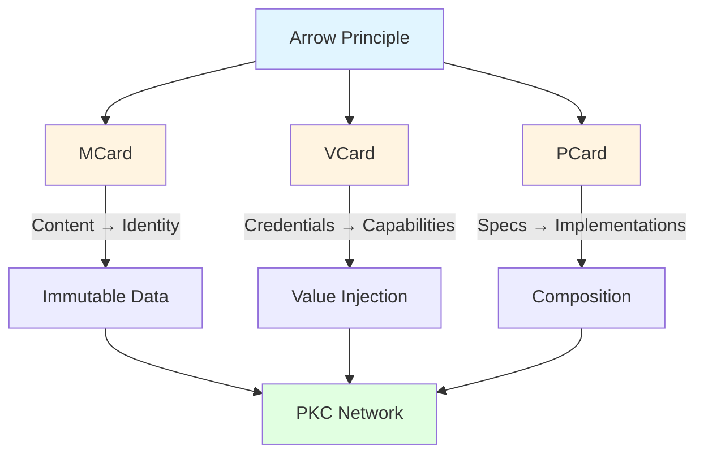
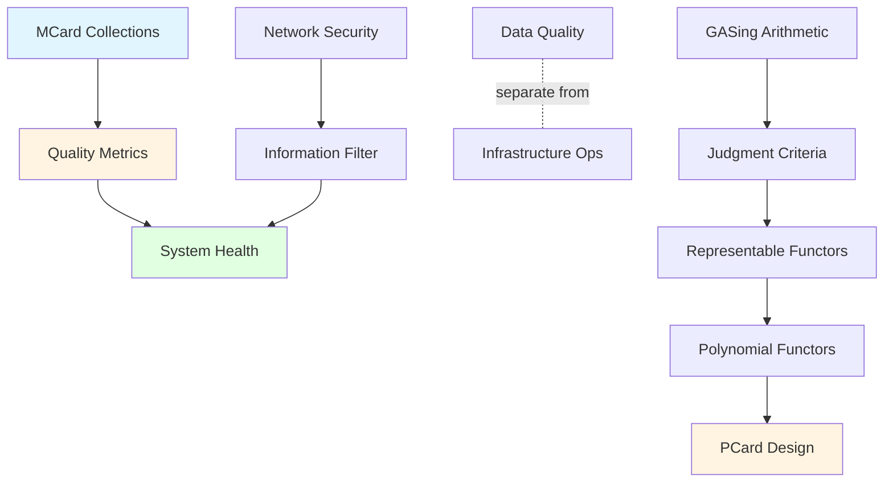
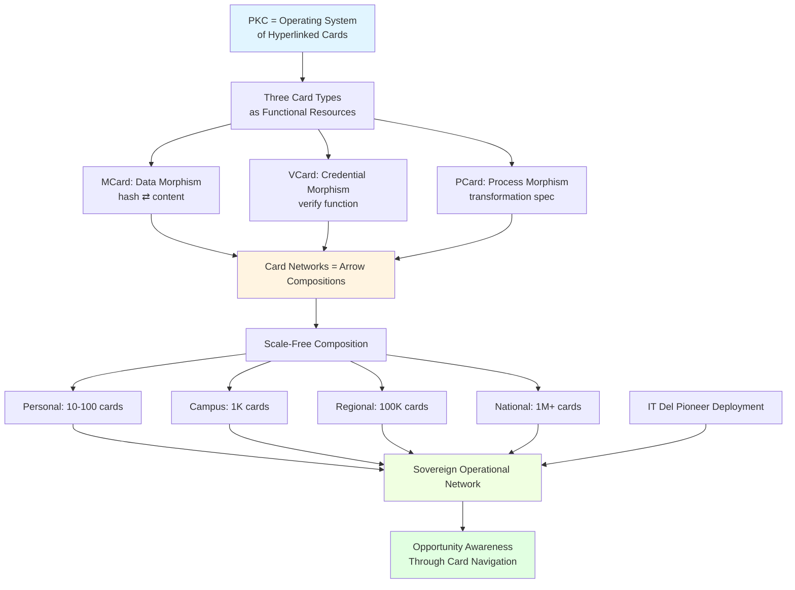

# PKC as the Network

## Prelude

It is now November 4th, 2025, after intensive work deploying Overlay VPN at IT Del and getting close to half of the student body and the Rector to have installed locally-provisioned mesh VPNs, I reached a fundamental realization: rather than deploying PKC as a separate set of microservices, **we should think of the network itself as PKC**. More precisely, PKC is a network of self-sovereign resources, representable as hyperlinked cards. This architectural shift has profound implications, and will significantly streamline future implementations.

**The First and Most Strategic Action: Overlay VPN as Digital Transformation Gateway**

In discussions with Pak Aldo and Ibu Rosni about the strategic importance of this deployment—particularly from Pak Luhut's perspective—I emphasized a critical insight: **guiding students to consciously engage with the installation and authorization of Overlay Private Networks represents the most strategic first step in digital transformation**. Here's why:

**Progressive Network Sovereignty Education**

Students progress through three levels of network understanding:
1. **Private Overlay VPN**: Personal sovereignty—students learn to secure their own devices and data, understanding network identity at the individual level
2. **Community Overlay VPN**: Collaborative sovereignty—students authorize trusted peers and form learning networks, experiencing distributed trust firsthand with their choice of special interest groups
3. **Public Overlay VPN**: Institutional sovereignty—students participate in campus-wide infrastructure, comprehending how individual + community sovereignty scales to organizational networks

This progression is **pedagogically deliberate**: each level builds concrete understanding of network sovereignty, moving from personal control (Private) → selective trust (Community) → institutional participation (Public). By the time students engage with Public Overlay VPN, they already understand *why* network authorization matters and *how* their agency shapes collective infrastructure.

**Why This Must Be First**

Traditional digital transformation begins with services (email, LMS, cloud storage) and treats network infrastructure as invisible plumbing. This creates **passive consumers** who don't understand their digital environment. In contrast, starting with conscious Overlay VPN engagement creates **active participants** who:

- **Understand network identity**: Not just usernames/passwords, but cryptographic authorization and trust boundaries
- **Exercise digital agency**: Making explicit choices about what connects to what, and why
- **Experience sovereignty firsthand**: Controlling their own network participation before depending on institutional systems
- **Build security consciousness**: Learning protection *before* exposure, not after breaches
- **Form networked communities**: Establishing peer-to-peer collaboration patterns that persist beyond institutional walls

**The Historical Context**

Since World War II, humanity's most transformative inventions have not been weapons of destruction like the [[Atom Bomb]], but rather tools of connection and intelligence: the [[computer]], the [[Internet]], and most recently, the [[Large Language Model]] (LLM)—or more colloquially, Artificial Intelligence (AI). Yet each of these tools has initially created **dependencies** before enabling **sovereignty**. By making the public aware of opportunities provided by overlay mesh-VPNs, we can reverse this pattern: students learn sovereignty _first_, becoming architects of their digital future rather than consumers of vendor platforms.

**PKC's Evolution as Infrastructure for Indonesia**

PKC, which began as an intellectual pursuit in Bali, is now transforming into a self-administered network of computers running LLMs within their own self-governed network environment. This represents precisely the kind of infrastructure an archipelago nation like Indonesia needs. 

Over time, PKC has been shaped and informed by diverse applications: online community learning during the Covid pandemic, campus-wide resource sharing, governance technology support developed through the G20 [[Science of Governance]] work, and the [[Tri Hita Karana]] principles of Balinese culture. 

**PKC as Multi-Level Composition**

PKC is not merely a network of computers and programs—it encompasses abstract ideas and community practices. Its essence lies in the **composition of many levels of things**: technical infrastructure, software logic, conceptual frameworks, and social practices, all interacting and co-evolving.

In other words, PKC is the embodiment of all these interacting entities, serving as a **platform of opportunity awareness**. This positions IT Del to be the first institution where all students and faculty members operate within a coherent, self-governing knowledge mesh-network at the Internet scale—a pioneering achievement that will establish IT Del's leadership in this domain.



## Executive Summary

**PKC (Personal Knowledge Container) represents a fundamental architectural breakthrough**: instead of deploying PKC as separate microservices on top of network infrastructure, **the network itself operates as PKC**. This realization dramatically simplifies implementation while enabling truly sovereign, self-governing networks—precisely what archipelago nations like Indonesia require.

The architecture is grounded in a mathematical principle: **all networks are compositions of arrows** (directed relationships). PKC realizes this through three card types—MCard (immutable data), VCard (credentials), and PCard (specifications)—that function as "arrow-like pointers" forming a HyperCard-inspired network. This arrow-based design eliminates entire classes of implementation complexity: immutable primitives prevent race conditions, monadic tracking provides audit trails by construction, and universal composition applies the same logic from single operations to planetary scale.

**IT Del's pioneering deployment establishes the first institution** where students and faculty operate within a coherent, self-governing knowledge mesh-network at Internet scale. This proves the viability of PKC as national infrastructure, positioning Indonesia to lead in sovereign network technology—transforming diversity from challenge into strategic advantage.

## Networks of Functional Arrows: The Universal Primitive

**Why This Mathematical Foundation Matters**

To understand why PKC's network architecture is revolutionary—and why it dramatically simplifies real-world deployment—we need to grasp its mathematical foundation. Don't worry: this translates directly to very practical benefits like eliminating service maintenance burdens, enabling graceful degradation, and allowing any quality-level service to join the network. The mathematics isn't academic—it's the reason IT Del's deployment can scale from campus to nation with the same architecture.

**Networks as Compositions of Arrows**

The profound insight underlying PKC's architecture is that **all networks are composed of arrows**, and **all arrows compose into networks**. This recursive principle reveals that networks and arrows are two perspectives on the same underlying reality: directed relationships forming functorial compositions at every scale.

[[Category Theory]] articulates this foundational principle through **morphisms (arrows/functions)**—the universal building blocks from which all structures emerge. Everything—objects, processes, networks, and phenomena—can be represented as arrows or compositions thereof. Critically, this means:

- An arrow **connects** to form a network
- A network **is composed of** arrows
- Arrows and networks are **mutually defining** at every scale



**The Arrow: The Only Symbol Needed**

When arrows ([[morphism|morphisms]]—think: hyperlinks connecting web pages) serve as the only primitive, networks emerge naturally from their composition. The system requires only one topological symbol: **the arrow**, or directed relation. Each arrow in the network represents:

- A directed relationship (what connects to what—like a URL pointing to a page)
- A compositional link (how arrows chain together—like following multiple links in sequence)
- A network node (where multiple arrows meet—like a hub page with many incoming/outgoing links)

**Networks at Every Scale: From Arrows to Arrow Networks**

Arrow networks achieve true scale-freeness because the **same compositional structure repeats at every level**:

- **Elementary level**: A single arrow (like one email connection between people)
- **Atomic level**: Identity arrows (like a self-referencing bookmark)
- **Composite level**: Networks of arrows (like a team's shared document links)
- **System level**: Networks of networks (like the entire Internet of interconnected sites)

At every scale, we encounter the same primitive—the arrow—composing into networks recursively. There are no "special" primitives for higher levels of abstraction. A single self-referential arrow forms the simplest network; planetary-scale systems such as commercial satellite networks emerge from the same arrow compositions at massive scale. Between these extremes lies the profound realization: **[[Network as the Universal Data Representation|network is the universal data type]]**, equally capable of representing a personal bookmark, a campus infrastructure, or a global communications system.

**Why "Abstract Nonsense" Enables Network Scale-Freeness**

[[Category Theory]] is often called a mathematical language of "**abstract nonsense**" because it strips away all domain-specific details, leaving only the pure structure of directed relationships and their compositions. This abstraction is not a limitation—it is precisely what enables networks to scale freely:

- No domain-specific arrows means no domain-specific network limits
- Pure arrow composition enables networks at all scales
- The same network algebra applies from micro to macro



**Emergence of Sophisticated Networks from Simple Arrows**

The emerging properties of networks built on this single primitive can exhibit extreme sophistication—as demonstrated by the power of Large Language Models operating over vast data networks. This sophistication emerges not from many types of primitives, but from the compositional properties of **one, and only one type**: the **arrow**. Networks of arrows, regardless of their complexity, remain fundamentally compositions of the same primitive. This unifying choice makes PKC's network representation scale-free.

## HyperCard-Based Architecture: Networks of Arrows Realized

**From Arrow Networks to Card Networks**

Viewing PKC as a **network of information-carrying cards**—classified as [[MCard]], [[VCard]], and [[PCard]]—realizes the arrow principle through concrete architecture. Originally inspired by Apple's [[HyperCard]], this card-based network perspective makes the abstract arrow principle tangible: **cards are arrow-like pointers to other cards, and card collections form directed compositional structures**.

**Cards as Multi-Modal Interface Elements**

The "card" analogy is deliberately chosen because cards can **display and animate diverse information types** within web browsers and similar presentation mechanisms, adapting to user contexts:

- **Visual Cards**: Images, diagrams, charts, videos—rendered as visual compositions
- **Textual Cards**: Documents, specifications, narratives—formatted for readability
- **Audio Cards**: Sound recordings, music, spoken instructions—playable media
- **Composite Cards**: Integrated presentations combining image, sound, and text—multi-sensory experiences
- **Interactive Cards**: Manipulators with sliders, buttons, forms—enabling users to send instructions and control other card-represented objects

This multi-modal capability means the same arrow network can present itself differently depending on context: a PCard specification might appear as formal documentation for developers, an interactive tutorial for learners, or a visual workflow diagram for stakeholders—**all representations of the same underlying arrow composition**.

**Operational Benefits**

This perspective offers immediate benefits: it massively improves comprehension of PKC's essential nature as an arrow network, provides context-adaptive presentation for diverse users, and directly addresses the persistent challenge of ensuring microservices run coherently.

**Network-Centric Operational Model**

By shifting focus from microservice implementation to the network of cards, a fundamental operational simplification emerges: as long as the data represented in the cards maintains connectivity, individual network participants can independently turn services on and off. The connectivity will transcend the operational status. This data orientation removes the burden of service maintenance from individual networks and creates an open participation model where any functional service at any quality levels can all join the network of data. The only constraint is conformance to the [[MVP Cards Design Rationale]].

**Universal Display Substrate**

Since virtually all information can be presented as a web page—or as a "[[HyperCard]]"—this constraint remains minimal. Modern web browsers provide the universal substrate for card display and interaction:
- **Rendering engines** handle multi-modal content (HTML5 video, WebGL graphics, Web Audio API)
- **Animation frameworks** enable dynamic card transitions and real-time updates
- **Interaction APIs** support touch, mouse, keyboard, voice, and gesture inputs
- **Progressive enhancement** ensures cards work across devices (desktop, mobile, embedded)

This browser-native approach enables broad user adoption through its minimalistic architecture while supporting sophisticated interactions—from simple text display to complex data visualizations with interactive controls.

**The Three Card Types: Arrows in Action**

The three card classes—[[MCard]], [[VCard]], and [[PCard]]—are themselves arrows in the categorical sense: directed transformations that compose recursively. Each card type realizes the arrow principle at different levels:

- **MCard (Monadic Card)**: Hash-value-indexed data content—the equivalent of files, objects, and other entities typically managed by operating systems. The "M" in MCard comes from [[Monadology]], an earlier form of Operating System as articulated by [[Gottfried Wilhelm Leibniz|Leibniz]]. These provide content-addressable, immutable data storage.
  - **As Arrow**: Content → Hash-addressed identity

- **VCard (Value Card)**: Credentials or value-carrying data content that are infused into a locally-indexed set of MCards. Each VCard's "value" is judged as it enters the local namespace of hash values, triggering the actions that VCard injection should enable.
  - **As Arrow**: Credentials → Validated capabilities

- **PCard (Polynomial Card)**: Represents any card or composition of multiple cards, allowing multiple perspectives to be chosen for inspecting the nature and implications of the examined card(s). This enables multi-dimensional analysis and transformation. The "P" comes from Polynomial Functors ([[Representable Functor|representable functors]]).
  - **As Arrow**: Specifications → Implementations



**Zero Trust Architecture Alignment**

This card-based classification provides a unifying mechanism to "always check," thereby fulfilling the Zero Trust Architecture principle of "never trust, always check." The three card types working together complete the totality of a **Zero Trust card-based Operating System**. 

## Robustness and Security

**Quality Metrics for Card-Based Systems**

The quality of this card-based information system manifests through two primary dimensions: the quantity of cards and the curation practices governing their collection into MCard Collections. This dual focus provides measurable indicators of system health and trustworthiness.

**Network Security as Information Filter**

The MCard injection process is fundamentally governed by the network security infrastructure. A more secure network enables greater confidence in information filtering policies, ensuring that only validated content enters the collection. Conversely, inadequate network security introduces risks of noise and potentially malicious content contaminating the knowledge base as bad data may be stored in the [[MCard Collection]].

**Separation of Concerns: Data vs. Infrastructure**

This architecture creates a crucial separation: distinguishing data content quality from network infrastructure operations. The primary concern shifts from "how do we run the network?" to "how do we maintain high-quality [[MCard Collection|MCard Collections]]?" This reframing enables more focused optimization strategies.

**High Availability Through Functional Verification**

To achieve highly available, zero-downtime MCard Collection systems, numerous robustness and security enhancement approaches can be deployed. However, all architectural variations ultimately converge on a single quality measure: the integrity and completeness of the MCard Collection itself.

**Category-Theoretic Judgment Criteria**

The judgment criteria for system quality resort to [[GASing Arithmetic - Overview]]—leveraging the unique perspectives of [[Yoneda Lemma]] and [[Yoneda Embedding]] from Category Theory, the mathematical foundation of Functional Programming. 

This functional perspective establishes a core design principle: **thinking of all objects and processes as networks of representable functors**. Where representable functors are also known as Polynomial Functors, which is the "P" in [[PCard]]. This principle guides our approach to designing secure systems with robust performance characteristics, where security emerges from the compositional properties of the network itself.



**Why Arrow-Grounded Networks Make Implementation Simpler and More Robust**

The arrow-grounded, network-of-cards design principle dramatically simplifies implementation and enhances robustness through three foundational properties:

1. **Immutable Primitives via Content-Addressable Storage**: MCards—rooted in [[Monadology]]—provide content-addressable, **immutable data storage**. Once a card's content is hashed, its identity becomes permanent. This immutability eliminates entire classes of bugs: no race conditions on card content, no version conflicts, no "which copy is authoritative?" Implementation becomes simpler because **arrows point to immutable targets**—what an arrow references today remains valid forever.

2. **Monadic Tracking and Verification**: The Monadic properties of MCards (self-contained, composable, context-carrying) make state transitions **explicitly trackable**. Every transformation is an arrow; every arrow is verifiable. When VCards inject credentials or PCards compose specifications, the resulting network of arrows forms an **audit trail by construction**. Implementation becomes more robust because the system's evolution is encoded in the arrow network itself—debugging reduces to "follow the arrows."

3. **Single Primitive, Universal Composition**: Because all three card types realize the same arrow principle at different levels, **the implementation uses one compositional algebra** across all scales. There are no special cases for "system-level" versus "data-level" operations—arrows compose arrows, networks compose networks. This uniformity means implementation complexity does not explode with scale; the same verification, caching, and routing logic applies whether handling a single MCard or orchestrating planetary-scale networks.

Together, these properties mean that **implementation details become systematically manageable**: immutable primitives reduce state complexity, monadic tracking provides built-in observability, and universal composition eliminates architectural discontinuities. The arrow network is not just a conceptual model—it is the implementation strategy. More importantly, it is the scientific principle in the governance of living and interactive systems, which are often composed of components across many spatial and temporal scales.

### Why Networked Cards Scale Beyond Microservice Orchestration

**The Fundamental Architectural Advantage**

Networked cards with cryptographic validation represent a **higher-order abstraction** that fundamentally outperforms microservice orchestration platforms. The key insight: **data and functions unified as representational objects** transcend the operational complexity that plagues service-oriented architectures.

**Microservice Orchestration: The Hidden Complexity Tax**

Traditional platforms (Kubernetes, Docker Swarm, Nomad) treat services as **stateful, continuously-running processes** that must be:
- **Scheduled** across compute nodes (resource allocation problem)
- **Health-checked** continuously (liveness/readiness probes)
- **Version-managed** across deployments (rollout/rollback complexity)
- **Network-routed** through dynamic service discovery (DNS/load balancer overhead)
- **Secret-managed** through external systems (vault integration, key rotation)

Each service becomes a **permanent operational burden**—if a service goes down, the system degrades. Scaling requires provisioning more services, which multiplies the orchestration complexity. The platform must maintain a **global view of system state**, creating bottlenecks and single points of failure.

**Card Networks: Data-Oriented Liberation**

In contrast, Card-based architecture treats computation as **data transformations over immutable, cryptographically-validated objects**:

**1. Services Become Optional**
- MCards (data) persist independently of any service
- PCards (process specs) define transformations declaratively
- VCards (credentials) authorize operations cryptographically
- **Result**: Services can start/stop without system degradation—the card network maintains connectivity

**2. Zero-Overhead Scaling**
- Content-addressable MCards scale through simple replication (hash-based routing)
- PCard execution can happen anywhere (location-independent computation)
- VCard verification is local (no centralized authorization server)
- **Result**: Scaling adds capacity without adding orchestration complexity

**3. Cryptographic Trust Instead of Network Trust**
- Traditional: "Is this service authorized?" (requires checking service mesh ACLs)
- Card Network: "Is this transformation cryptographically valid?" (VCard signature verification)
- **Result**: Zero Trust is built-in, not bolted-on—every arrow composition is verified

**4. Evolutionary Architecture Without Breaking Changes**

The critical advantage for **design evolution**:

**Microservice Problem**: Changing an API breaks all consumers
- Service A v1 → v2 requires coordinated deployment across entire system
- Breaking changes force simultaneous updates (tight coupling)
- Versioning becomes exponentially complex with service count

**Card Network Solution**: Transformations compose, versions coexist
- MCard v1 and MCard v2 coexist (different content hashes)
- PCard can reference either version (composable transformations)
- VCard authorizes based on capabilities, not service versions
- **Result**: System evolves through composition, not replacement

**Example Evolution Scenario**:
```
Microservice World:
AuthService v1 → v2 (breaking change)
→ All 50 dependent services must update simultaneously
→ Coordination nightmare, high risk of cascade failure

Card Network:
VCard_Auth v1 → VCard_Auth v2 (new capabilities added)
→ Old PCCards continue using v1 (content-addressed immutability)
→ New PCCards adopt v2 (opt-in evolution)
→ Both coexist safely (cryptographic verification ensures correctness)
→ Migration happens gradually, no coordination required
```

**Zero Trust Enables Controlled Chaos**

The paradox: **more design freedom through stricter verification**

**Traditional Orchestration**:
- Centralized control (platform decides what runs where)
- Runtime trust (service mesh enforces policies)
- Limited evolution (breaking changes cascade)

**Card Networks**:
- Distributed autonomy (cards compose where needed)
- Cryptographic verification (VCard gates every transformation)
- Unbounded evolution (immutable cards never break)

**Zero Trust Model Advantages**:
1. **No Trusted Network Perimeter**: Every card interaction verified cryptographically
2. **Continuous Validation**: PCard preconditions checked at execution time
3. **Immutable Audit Trail**: MCard hash chains provide complete provenance
4. **Capability-Based Security**: VCards grant explicit permissions, no ambient authority
5. **Fail-Safe Composition**: Invalid compositions rejected at cryptographic boundary

**The Strategic Implication**

Card networks achieve what orchestration platforms cannot: **evolvability without fragility**. New capabilities emerge through composition (adding PCards), not replacement (upgrading services). The system grows organically, like biological systems, where new structures emerge without destroying existing ones.

This architectural superiority becomes critical at national scale: Indonesia's 17,000+ islands can evolve their digital infrastructure independently, adding capabilities through card composition, without requiring centralized orchestration or coordinated upgrades. The same mathematics that enables personal knowledge management enables sovereign national infrastructure—**true scale-freedom through cryptographic composition**.

## Why Arrow-Based Networks vs. Traditional Approaches

**Competitive Landscape Analysis**

To understand PKC's strategic position, we must compare it against established network and distributed systems paradigms:

**Traditional Software-Defined Networking (SDN)**
- **Architecture**: Centralized control plane managing distributed data plane
- **Limitation**: Single point of failure; controller bottleneck at scale
- **PKC Advantage**: Distributed sovereignty—no central controller, every node is autonomous yet coordinated through arrow composition

**Kubernetes and Container Orchestration**
- **Architecture**: Service-oriented deployment with imperative configuration
- **Limitation**: Operational complexity—requires constant maintenance, version management, service health monitoring
- **PKC Advantage**: Data-oriented network—as long as MCards maintain connectivity, services can turn on/off independently; the data transcends service operational status

**Blockchain and Distributed Ledgers ([[Literature/PKM/Tools/Virtualization/Ethereum|Ethereum's "World Computer"]])**
- **Architecture**: Gavin Wood's vision of [[Literature/PKM/Tools/Virtualization/Ethereum|Ethereum]] as a "World Computer"—a consensus-based immutable ledger providing global computational substrate where [[Smart Contract|smart contracts]] execute deterministically across all nodes
- **The World Computer Paradigm**: Wood articulated Ethereum as unstoppable applications running on a decentralized virtual machine, where computation itself is trustless and verifiable through global consensus. See [[Literature/PKM/Tools/Virtualization/Ethereum]] for comprehensive architectural analysis.
- **Limitation**: High energy cost (proof-of-work/proof-of-stake overhead), limited throughput (15-30 transactions/second), complex smart contract verification, expensive state storage (every node stores everything)
- **PKC Advantage**: **Lightweight content-addressing without global consensus requirements**—immutability through hash-indexing rather than blockchain consensus; local verification scales independently; computation happens where needed (edge-friendly) rather than replicated globally
- **Architectural Contrast**: [[Literature/PKM/Tools/Virtualization/Ethereum|Ethereum]] achieves trust through **global replication** (World Computer runs everywhere identically); PKC achieves trust through **cryptographic composition** (VCard-gated transformations verified locally). Both provide unstoppable infrastructure, but PKC scales to archipelagic geography with local-first principle, while Ethereum optimizes for global consensus. See [[Literature/PKM/Tools/Virtualization/Ethereum#Comparison with Alternative Architectures|Ethereum vs PKC Comparison]] for detailed analysis.

**Traditional Cloud Infrastructure (AWS/Azure/GCP)**
- **Architecture**: Provider-controlled infrastructure with vendor-specific APIs
- **Limitation**: Vendor lock-in, sovereignty concerns, cost scaling with usage
- **PKC Advantage**: Self-sovereign infrastructure deployable on any hardware; open standards through MVP Card framework; archipelago-friendly edge computing model

**IPFS and Content-Addressable Storage**
- **Architecture**: Distributed content addressing with DHT-based routing
- **Limitation**: Content storage without process specification or credential management
- **PKC Advantage**: Unified framework—MCard (content) + PCard (process) + VCard (credentials) as integrated arrow network; not just "what" but "how" and "who"

**The Strategic Differentiator**

PKC's unique position emerges from **unifying content, process, and credentials** as a single compositional framework (arrow networks) rather than treating them as separate concerns. This enables:
- **Operational simplicity** through data-orientation (vs. service-orientation)
- **Sovereignty by design** through local-first architecture (vs. cloud-dependence)
- **Scale-free deployment** through universal arrow composition (vs. scale-specific solutions)
- **Archipelago optimization** through edge-friendly content-addressing (vs. datacenter-centric models)

**Beyond the World Computer: Geographic Computation**

While Gavin Wood's [[Literature/PKM/Tools/Virtualization/Ethereum|Ethereum]] "World Computer" achieves unstoppable computation through **global consensus** (every node runs everything), PKC achieves unstoppable infrastructure through **cryptographic composition** (VCard-verified transformations run locally). This distinction is critical:

- **Ethereum**: Trust = Global replication → Limited throughput, high cost, uniform execution
- **PKC**: Trust = Local verification → Infinite scalability, minimal overhead, context-adaptive execution

Both visions share the goal of unstoppable, trustless infrastructure. Ethereum optimizes for **global state consistency**; PKC optimizes for **geographic diversity**. For Indonesia specifically, PKC addresses the fundamental challenge that Ethereum's World Computer cannot: **how to build national digital infrastructure across 17,000+ islands** without requiring global consensus or datacenter-grade connectivity everywhere.

Arrow-based networks work identically whether connecting two campus buildings or two continents—the same mathematics, the same implementation, the same operational model. Where Ethereum provides a single world computer, PKC enables **an archipelago of sovereign computers** that compose through cryptographic arrows rather than global consensus.


## **Conclusion: PKC: The Operating System for Sovereign Operational Networks**

PKC's fundamental architectural insight reveals that **the network IS the operating system**—not an OS running on network infrastructure, but **hyperlinked Cards functioning as the computational substrate** of a [[Hub/Tech/Sovereign Operational Network|Sovereign Operational Network]]. This is not metaphor but operational reality: Cards represent functional resources (data, processes, credentials) that compose through arrows to form scale-free networks of computation.

**Networks of Directed Relations: The Universal Navigator**

The mathematical foundation is clear: **all networks are compositions of arrows** ([[morphism|morphisms]]). From the simplest [[modus ponens]] to interplanetary distributed systems, every network is an arrow composition viewed at scale. Networks and arrows are **dual perspectives on identical structure**: an arrow connects; arrows compose into networks; networks are collections of arrows.

This duality provides the navigational principle that orients computation at every level, from atomic operations to global infrastructure. The arrow shows not just *what is*, but *what connects*, *what flows*, and *what becomes possible*.

**Cards as Hyperlinked Functional Resources**

The three card classes—[[MCard]], [[VCard]], and [[PCard]]—are **not data structures** but **functional resources that ARE arrows**:

- **MCard** = Content-addressable data morphism (hash ⇄ content)
- **VCard** = Cryptographic credential morphism (verification function)
- **PCard** = Polynomial process morphism (transformation specification)

Each card is **simultaneously**:
1. **A functional resource** (usable computational primitive)
2. **A hyperlink arrow** (composable with other cards)
3. **A network node** (where arrow compositions meet)

**From Cards to Card Networks: The Programming Environment**

PKC as OS means **programming the network = composing hyperlinked Cards**. This realizes the vision articulated in [[Sovereign Operational Network]]:

- **Functions are the root type**: Every PKC component IS a function (MCard hash, VCard verify, PCard transform)
- **Networks are the universal data type**: All relationships emerge from card composition
- **Card networks = visual function composition**: HyperCard-inspired interface makes network programming accessible
- **Scale-freedom is proven**: Associative composition guarantees identical semantics from edge device to archipelagic federation

**Scale-Free Operating System: From Device to Nation**

Because Cards compose as arrows, the **same OS primitives** work identically at all scales:

| Scale | Cards Managed | Network Span | Same Operations |
|-------|--------------|--------------|-----------------|
| **Personal** | 10-100 cards | Single PKC node | hash, verify, transform, compose |
| **Campus** | 1,000 cards | Local network | hash, verify, transform, compose |
| **Regional** | 100,000 cards | Federated clusters | hash, verify, transform, compose |
| **National** | 1M+ cards | Archipelagic mesh | hash, verify, transform, compose |

**Security policies and sovereignty mechanisms** that differ drastically across spatial-temporal scales can all be represented in the same Card network framework. A representational system reflecting operational conditions at every network level becomes achievable—not just for elite operators, but inclusively across all capability levels.

**Operational Sovereignty Through Card Composition**

PKC transcends the homelab-to-datacenter spectrum. It is fundamentally about **opportunity awareness**: a reflexive, self-describing network that reveals opportunities to participants by following the hyperlinked Cards. Card networks show where connections form, where larger networks emerge, where opportunities arise.

When networking services, [[Single Sign-On|SSO authentication]], and security features are organized as **networks of composable Cards** (realized through the [[Literature/PKM/Tools/Open Source/MVP Cards Design Rationale|MVP Card framework]]), systems with different security levels and performance requirements become representable in their respective states. Card networks provide the universal interface: **everything that can be composed as arrows can participate in the network**.

This realizes the core vision of [[Hub/Tech/Software-defined Networking|Software-defined Networking]] through the [[Cubical Logic Model]] with LLM inferences—not as separate concerns, but as natural expressions of Card networks operating across all scales.

> **PKC is the Operating System where hyperlinked Cards are both the functional resources AND the network fabric.**



**Card Networks as Living Systems**

Hyperlinked Card networks reveal opportunities by pointing from current state to possible futures, from isolated nodes to connected systems, from individual Cards to collective network intelligence. This scale-free OS—where the same Card composition primitives govern computation at every level—addresses all possibilities of networked systems. It is **Universal** not through comprehensiveness, but through the irreducible simplicity of **Cards as functional arrows**.

**Synthesis: The Network IS PKC, PKC IS the OS**

This returns us to the fundamental realization that opened this document: **the network IS PKC**. Not PKC running on the network, not PKC deployed as microservices on network infrastructure, but **the network itself operating as an OS of hyperlinked Cards**—a self-describing, opportunity-aware composition where:

- Every functional resource **is a Card** (MCard/VCard/PCard)
- Every Card **is an arrow** (composable morphism)
- Every arrow composition **is a network** (of functional resources)
- Every network **is the OS substrate** (for computation and governance)

**IT Del's deployment proves this vision is operational**: The campus network functions as a Card-based OS—and through this functioning, demonstrates that Indonesia can pioneer sovereign digital infrastructure where **diversity becomes computational advantage**.

**Implementation Guidance: Deploying the Card-Based OS**

For institutions and nations considering PKC adoption: **IT Del's pioneering deployment provides a proven implementation pattern for the Card-based Operating System**. The Card composition architecture scales linearly with network size—the same OS primitives apply whether managing 100 functional resources or 100 million.

**Bootstrapping the OS Infrastructure**:
1. **MCard Layer** (content-addressing): Establish immutable data substrate
2. **VCard Layer** (credential management): Deploy zero-trust authorization
3. **PCard Layer** (process definitions): Specify computational workflows
4. **Card Networks** (organic growth): Allow hyperlinked compositions to emerge

The OS grows through Card composition—no centralized orchestration required. Detailed phasing, resource estimates, and technical implementation guides are available through the [[Literature/PKM/Tools/Open Source/MVP Cards Design Rationale|MVP Cards Design Rationale]] and [[Hub/Tech/Sovereign Operational Network|Sovereign Operational Network]] documentation.

**IT Del's Deployment: Proving the Card OS at Scale**

After the Internet connected machines and Generative AI connected intelligence, PKC's [[Hypercard]]-inspired **Operating System of hyperlinked Cards** makes sovereign computational infrastructure finally accessible to all. **IT Del's deployment establishes Indonesia's first-mover advantage** in Card-based OS architecture—a capability that major nations are still theorizing while Indonesia is implementing.

This is not merely academic achievement: **IT Del demonstrates that Card-based OS may work at an institutional scale**, operating reliably under real-world conditions with diverse users, heterogeneous devices, and varying connectivity. The campus functions as a living laboratory demonstrating how the same OS architecture scales from building-to-building to island-to-island to nation-to-nation.

**Strategic Implications**:
- **Technology Export**: Indonesia can export the Card OS architecture and governance model
- **Infrastructure Sovereignty**: Nations control their computational substrate, not just services
- **Educational Innovation**: Learning becomes OS programming through Card composition
- **Economic Opportunity**: First-mover advantage in next-generation infrastructure

This first-mover position enables Indonesia to **lead rather than follow** in digital infrastructure—positioning the nation not as a technology consumer, but as an infrastructure innovator.

**The Evolutionary Convergence**

The evolutionary direction has always been present, waiting to be followed:
1. **Mathematical Truth**: All networks are compositions of arrows ([[morphism|morphisms]])
2. **Functional Resources**: Cards embody data/credentials/processes as composable primitives
3. **Operating System**: Card networks provide the computational substrate
4. **Sovereign Infrastructure**: [[Hub/Tech/Sovereign Operational Network|SON]] realizes computational independence

**IT Del is the first institution to operationalize this truth at scale**: deploying PKC not as applications on traditional OS, but as **the OS itself**—where hyperlinked Cards are both the functional resources and the network fabric, enabling true [[Hub/Tech/Sovereign Operational Network|Sovereign Operational Networks]].

## Next Steps: Pathways for Engagement

Different stakeholders have different entry points into the PKC ecosystem. Here are recommended pathways:

**Immediate Operational Tasks: Scaling IT Del's Pioneer Deployment**

Building on IT Del's successful arrow-network implementation, the following operational priorities will accelerate PKC adoption while establishing Indonesia's leadership in sovereign digital infrastructure:

0. **Institutionalized PKC-Based Learning: AI-Compatible Curriculum Integration**: Mandate all IT Del students and instructors to conduct assignments, projects, and collaborative work within PKC as institutional learning infrastructure—cognitively grounded in [[Cognitive Foundations for Personalized Knowledge Management in PKC]] principles of immediate access with verification, social validation via distributed consensus, and transparent [[TobaLM]] AI interactions. Implementation includes assignments as content-addressed MCCards, collaborative projects as arrow networks, personal knowledge graphs, peer review via VCard validation, and AI interaction logging for metacognition. Gradual rollout from pilot courses (Fall 2025) to institution-wide adoption (2026-2027) establishes IT Del as first institution with unified knowledge management + collaborative learning + AI assistance—the global template for AI-compatible education. See [[IT Del PKC Learning Action Plan]] for detailed roadmap.

1. **Network Data Integration**: Integrate [[TobaLM]] (localized LLM) and [[Internet of Things]] devices as distributed data collectors, enriching MCard collections through edge computing. This operationalizes the "network of arrows" principle at IoT scale—proving that PKC's compositional architecture extends seamlessly from campus infrastructure to embedded sensors. The Overlay VPN part of PKC allows students and instructors to form networks of their own choices, and enable privacy protection, while allowing observability across the authorized network.

2. **AI-Enhanced PKC Operations**: Establish a cross-functional PKC working group to develop AI agent workflows that automate card curation, validate MCard integrity, and optimize VCard credential management. This demonstrates how LLM-powered intelligence layers naturally integrate with arrow-based networks—turning IT Del's deployment into a living laboratory for autonomous infrastructure management.

3. **Knowledge Transfer Programs**: Design and execute [[ABC curriculum|train-the-trainer curricula]] targeting technical teams, institutional leaders, and policy makers across Indonesia. Focus on transmitting both technical implementation (MCard/VCard/PCard deployment patterns) and strategic vision (sovereignty through self-governing networks). Position IT Del faculty and students as primary knowledge carriers—leveraging first-mover experience to accelerate national adoption.

4. **Documentation and Pattern Libraries**: Systematically capture IT Del's deployment learnings as reusable patterns—documenting network configurations, security policies, operational procedures, and governance frameworks as composable PCard specifications. This creates the "arrow library" that enables other institutions to rapidly bootstrap PKC deployments while maintaining local sovereignty.

5. **Observability and ML Pipeline Infrastructure**: Deploy [[OpenTelemetry]] as the universal telemetry collection layer for PKC network operations, integrated with [[Langfuse]] for LLM-specific observability. This arrow-based observability stack enables: (a) unified trace context linking infrastructure and LLM events across the network, (b) structured telemetry data for ML training pipelines that improve TobaLM and agent workflows, (c) vendor-neutral multi-backend export supporting both real-time monitoring and offline analytics. See [[OpenTelemetry and LangFuse Integration for ML Data Collection]] for implementation patterns that realize observability as composable arrows—proving that monitoring, like all network operations, follows the same scale-free compositional principles.

6. **Cognitive Foundations for Personalized Knowledge**: Establish personalized knowledge management architecture grounded in empirically validated cognitive science. See [[Cognitive Foundations for Personalized Knowledge Management in PKC]] for design principles derived from [[Subitizing - The Innate Number Sense|subitizing]] (immediate-yet-verifiable knowledge) and [[Permanent/Projects/AI Toba/GASing Arithmetic|GASing Arithmetic]] (counting as universal computational primitive). GASing's pattern-based, content-addressable arithmetic provides the empirical foundation: just as all computation reduces to counting operations, PKC's Card operations reduce to verifiable, pattern-indexed transformations. This ensures PKC's networked data collection and social validation processes embody epistemologically sound principles: content-addressable instant access (like GASing's strategic lookups), bounded complexity (3 Card types, not arbitrary abstractions), distributed consensus through verifiable operations (not private mysticism), and complete historical traceability (content-addressed provenance).

**For Technical Teams & Implementers**
1. Review [[MVP Cards Design Rationale]] for detailed architectural specifications
2. Study [[MCard]], [[VCard]], and [[PCard]] documentation for card-type implementations
3. Explore [[Cubical Logic Model]] for formal verification foundations
4. Join technical working groups for hands-on deployment support

**For Strategic Leaders & Decision-Makers**
1. Engage with PKC strategic briefings for institutional adoption planning
2. Connect with IT Del campus community leaders for deployment case studies and lessons learned
3. Explore [[GASing Arithmetic - Overview]] for governance framework alignment
4. Consider pilot programs for regional or institutional networks

**For Researchers & Theoreticians**
1. Explore [[Category Theory]] foundations for theoretical extensions
2. Investigate [[Yoneda Lemma]] and [[Yoneda Embedding]] for representational insights
3. Study [[Monadology]] connections to computational philosophy
4. Contribute to formal methods research for arrow-network verification

**For Community Members & Early Adopters**
1. Join [[THKMesh]] community for computable resource sharing
2. Participate in campus or regional PKC deployments
3. Contribute to [[HyperCard]]-based content creation and curation
4. Share use cases and deployment experiences with the broader community

**For Policy Makers & Governance Leaders**
1. Study [[Science of Governance]] integration for policy frameworks
2. Explore sovereignty implications for national digital infrastructure
3. Connect with Indonesian digital sovereignty initiatives
4. Consider PKC adoption for government knowledge management systems

## Glossary: Key Concepts and Terms

This document introduces specialized terminology from Category Theory, functional programming, and network architecture. For detailed definitions:

**Foundational Mathematics**
- [[Category Theory]] - Morphisms, functors, composition, and universal properties
- [[Morphism]] - Structure-preserving maps; the formal definition of "arrow"
- [[Modus Ponens]] - Logical inference as arrow composition
- [[Yoneda Lemma]] - Representational perspective for judgment criteria
- [[Monadology]] - Leibniz's philosophical foundation for encapsulated computation

**PKC Architecture**
- [[MVP Cards Design Rationale]] - Design principles for MCard/VCard/PCard
- [[MCard]] - Content-addressable, immutable data carriers (hash-indexed)
- [[VCard]] - Credential and value injection mechanisms
- [[PCard]] - Process specifications via Polynomial Functors
- [[HyperCard]] - Apple's card-based interface inspiration

**Formal Methods & Verification**
- [[Cubical Logic Model]] - Three-dimensional verification framework
- [[GASing Arithmetic]] - Judgment criteria using Yoneda embedding
- [[Science of Governance]] - Formal governance framework integration

**Network & Infrastructure**
- [[THKMesh]] - A code base that employs popular cloud technologies to enable service hosting
- [[Software-Defined Networking]] (SDN) - Programmable network infrastructure
- [[Overlay VPN]] - Virtual network layer for secure, sovereign connectivity

# References
```dataview 
Table title as Title, authors as Authors
where contains(subject, "SDN")
sort title, authors, modified
```