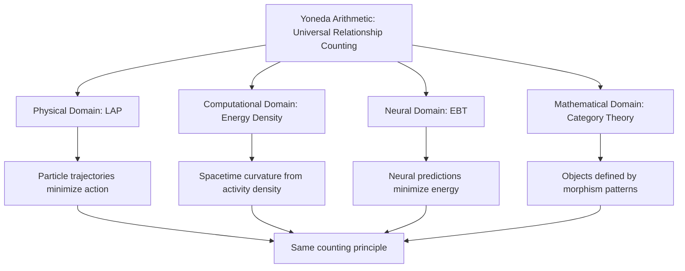

# Yoneda Arithmetic as the Logic for Functional Structures

## Executive Summary: The Exchange Protocol/Accountability Framework

**The fundamental insight**: The Yoneda family (Lemma + Embedding) provides **arithmetic logic for functional structures** through a complete dual system:

**Functions = Universal Currency**
- Functions are the **medium of exchange** for representing all phenomena
- Just as money enables economic transactions, functions enable representational transactions
- Universal acceptance across all domains (physics, computation, cognition)

**Yoneda = Accountability System**  
- Yoneda provides the **verification mechanism** ensuring functional currency is authentic
- Just as double-entry bookkeeping audits financial currency, Yoneda audits functional currency
- Universal accountability rules guarantee composition works correctly

**Why this matters**: Everyone understands that **money requires bookkeeping**. By mapping functions → exchange protocols and Yoneda → accountability, we make abstract category theory **immediately intuitive**. You don't need deep theory—just recognize that representational transactions need the same dual system (medium + verification) as financial transactions.

**The democratization**: This economic framing makes Yoneda accessible to anyone who understands currency needs auditing—reducing intellectual barriers from "learn category theory" to "transact safely in universal currency."

**The universality**: This same currency/accountability framework works for **any structure whatsoever**—from numbers to organizations, from molecules to music, from legal systems to ecosystems. One dual system, infinite applications.

**See [[Functions as Universal Exchange Tokens, Yoneda as Accountability]] for complete framework.**

---

## Part 0: The Economic Foundation—Currency Requires Accountability

### 0.1 Why the Economic Analogy Matters

**Everyone understands money**. The brilliance of framing Yoneda as "accountability for functional currency" is that **nobody questions why money needs auditing**—it's obvious that:

1. **Currency without accountability = chaos** (counterfeiting, fraud, uncertainty)
2. **Accountability without currency = useless** (perfect audits of nothing)  
3. **Currency + accountability = functional economy** (safe transactions, traceable provenance)

**The mapping to functional structures**:

| Economic System | Functional System | Why It's the Same |
|-----------------|------------------|-------------------|
| **Money** | **Functions** | Universal medium of exchange |
| **$1, $5, $20** | **Type signatures** | Denominations/categories |
| **Serial numbers** | **Content-addressable hashes** | Unique identifiers |
| **Double-entry bookkeeping** | **Yoneda Lemma** | Debit = Credit → Morphisms define objects |
| **Bank vault** | **PKC (Personal Knowledge Container)** | Secure storage |
| **Audit trail** | **Yoneda Embedding** | Complete provenance |
| **Counterfeiting** | **Type errors / side effects** | Invalid currency |
| **Making change** | **Function composition** | Combining smaller units |

**The transformation**: From "learn abstract Yoneda Lemma" (intimidating) → "verify your functional currency" (obviously necessary).

### 0.2 Functions as the Universal Currency

**Why functions are currency**:

```haskell
-- Functions are the universal medium of exchange
-- Physical domain: Energy as functional currency
energy :: State -> Velocity -> Energy

-- Computational domain: Algorithms as functional currency  
algorithm :: Input -> Output

-- Cognitive domain: Concepts as functional currency
concept :: Context -> Interpretation -> Understanding
```

**The economic properties hold**:

1. **Universally accepted**: All domains use functions to represent phenomena
2. **Uniform representation**: `f :: a -> b` means the same thing everywhere  
3. **Composable**: Can combine functions (`g ∘ f`)
4. **Fungible**: Equivalent functions are interchangeable

**Just like money**, functions enable **exchange across contexts**:
- Trade energy representation for computational representation  
- Exchange concrete implementation for abstract specification
- Convert local knowledge to universal patterns

### 0.3 Yoneda as the Accountability System

**Why Yoneda is accountability**:

**The Yoneda Lemma states**:
> An object X is completely determined by **all morphisms (functions) to/from it**.

**In economic terms**:
> A currency bill's authenticity is completely verified by **all transactions involving it** (complete audit trail).

**Yoneda provides four accountability guarantees**:

**1. Authenticity Verification**
```haskell
yonedaEmbed :: X -> (forall a. (X -> a) -> a)
-- If embedding exists, object is well-defined (currency is genuine)
```

**2. Composition Verification**
```haskell
-- Yoneda guarantees associativity
(h ∘ g) ∘ f = h ∘ (g ∘ f)  -- Always holds
-- Like: (($10 + $5) + $20) = ($10 + ($5 + $20))
```

**3. Identity Verification**
```haskell
f ∘ id = id ∘ f = f  -- Identity morphism exists
-- Like: $100 + $0 = $100 (zero transaction)
```

**4. Provenance Verification**
```haskell
-- Every function application traceable
result = f_n(f_{n-1}(...f_1(input)...))
provenance = [f_1, f_2, ..., f_n]  -- Complete audit trail
```

**Just like double-entry bookkeeping**, Yoneda ensures:
- Debits = Credits → All morphisms consistent  
- Complete transaction history → Full provenance
- Fraud prevention → Type system catches errors

### 0.4 The Complete Dual System

**Currency alone fails**:
```
Problem: Multiple incompatible function definitions
f :: Int -> Int  (version 1: adds 1)
f :: Int -> Int  (version 2: multiplies by 2)
Result: Cannot compose reliably—which is authentic?
```

**Accountability alone fails**:
```
Problem: Perfect verification but nothing to verify
Yoneda: ✓ All relationships consistent!
But: No functions defined—nothing to audit!
Result: Technically sound, pragmatically useless
```

**Currency + Accountability succeeds**:
```
Step 1: Define function (mint currency)
  add :: Nat -> Nat -> Nat

Step 2: Yoneda verifies (audit authenticity)
  Check: Associative? ✓ Commutative? ✓ Identity exists? ✓

Step 3: Compose with confidence (transact safely)
  multiply = iterate add  -- Composition guaranteed valid

Result: Universal representation WITH provable correctness
```

**This is Yoneda Arithmetic**: The complete framework providing both the **medium (functions)** and the **verification (Yoneda)** for universal structural representation.

---

## Part 1: Arithmetic for Quantities vs. Arithmetic for Structures

### 1.1 What Arithmetic Does for Quantities

**Arithmetic = Universal Counting System for Quantities**

Consider these apparently different scenarios:

```
Physical:  3 apples + 2 apples = 5 apples
Social:    15 people + 8 people = 23 people
Financial: $100 + $50 = $150
Time:      3 hours + 2 hours = 5 hours
```

**The universal pattern**: Despite different "types" (apples, people, dollars, hours), the **same arithmetic operations** apply. We don't need different counting systems for each domain—arithmetic provides **one universal framework**.

**Why this is powerful**:

1. **Abstraction**: We can reason about "3 + 2 = 5" without specifying what we're counting
2. **Composition**: Operations combine predictably (associativity, commutativity)
3. **Transfer**: Skills learned counting apples transfer to counting anything
4. **Automation**: Once formalized, machines can perform arithmetic universally

### 1.2 What Yoneda Does for Structures

**Yoneda = Accountability System for Functional Currency**

The Yoneda Lemma states:

> **An object is completely determined by how it relates to all other objects.**

**In economic terms**:

> **A currency bill's authenticity is completely verified by its transaction history.**

This is **arithmetic logic for functional structures**: just as "3" is defined by its relationships in the number system (3 = 2+1 = 4-1 = 6/2), any functional object is verified by its compositional patterns. Just as a $100 bill is verified by serial number + transaction history + anti-counterfeiting features, a function is verified by type signature + composition behavior + Yoneda embedding.

**Example: Numbers as Structural Objects**

Consider the number 7. We could define it by:

- **Quantity approach**: Seven discrete units ●●●●●●●
- **Structural approach**: How 7 relates to all other numbers
    - 7 = 3 + 4
    - 7 = 10 - 3
    - 7 = 14 / 2
    - 7 > 6 and 7 < 8
    - 7 is prime (no divisors except 1 and itself)

**Yoneda's insight**: The second approach (structural relationships) **completely determines** the first approach (quantity). You don't need to count seven units—the relationship patterns uniquely identify "7-ness."

### 1.3 The Arithmetization Parallel with Economic Mapping

| Traditional Arithmetic | Yoneda Arithmetic | Economic Analogy | Universal Principle |
|----------------------|-------------------|-----------------|-------------------|
| Counts **quantities** | Counts **relationships** | Counts **transactions** | Universal accounting |
| 3 apples + 2 apples = 5 apples | 3 morphisms ∘ 2 morphisms = 5-path | $3 + $2 = $5 | Systematic combination |
| Number line: discrete positions | Relationship space: structural positions | Price: currency positions | Ordered representation |
| Addition = combining quantities | Composition = combining functions | Making change = combining bills | Fundamental operation |
| 0 = additive identity | Identity morphism = neutral element | $0 = no transaction | Neutral element |
| Multiplication = repeated addition | Functor = systematic mapping | Compound interest = repeated transactions | Structural transformation |
| **Verification** | **Verification** | **Verification** | **Accountability** |
| 3 + 2 = 5 (check) | Yoneda embedding (check morphisms) | Double-entry (debits = credits) | Proof of correctness |

**The key realization**: 
- **Arithmetic** doesn't care whether you're counting apples or dollars (universal quantities)
- **Yoneda** doesn't care whether you're relating numbers, functions, or concepts (universal structures)
- **Economic systems** don't care whether you're trading goods or services (universal exchange)

**All three are the SAME universal pattern**: systematic combination + verification = reliable composition.

### 1.4 The One Shape That Rules All — Why Yoneda Works

**The hidden simplicity:**  
Every structural phenomenon—mathematical, computational, linguistic, or social—reduces to one canonical _shape_:

```
Input ──► Relation ──► Output
```

Whether it is a number being added, a function being applied, a process transforming data, or a morphism acting in a category, **the same order-preserving structure** holds:

1. something enters,
2. it interacts (is _related_ through a morphism, law, or rule),
3. something exits.

This single directional shape is the **atom of structure**. It's what makes both **computation** and **reasoning** composable, predictable, and analyzable.

#### Why this "one-shape" principle matters

**1. Uniformity enables counting.**  
Arithmetic works because every operation has the same _shape_ ("two inputs → one output").  
Likewise, Yoneda works because every morphism has the same _shape_ ("source → target").  
Once all transformations share a uniform shape, we can **count** and **compose** them systematically.

**2. Order preservation enables logic.**  
Composition of functions preserves order:

```
A → B → C  ⇒  A → C
```

This invariance under composition is precisely what gives rise to associativity and identity—the logical backbone of categories.  
Because Yoneda captures how each object behaves with respect to _all such order-preserving transformations_, it becomes a universal accounting system for structure.

**3. The shape is implementation-independent.**  
No matter whether the process is physical, computational, or conceptual, its relational skeleton remains:

```
(input pattern) ─► (rule of transformation) ─► (output pattern)
```

This abstraction allows the Yoneda Lemma to apply simultaneously to:

- numbers (arithmetic functions)
- algorithms (computational morphisms)
- concepts (semantic mappings)
- neural layers (information flow)
- organizations (reporting structures)
- molecules (chemical bonds)
- ecosystems (energy flows)

**4. Functoriality = structural arithmetic.**  
Because all these shapes compose the same way, we can map entire families of them (via functors) while preserving structure.  
Yoneda shows that an object's _complete behavior_ is captured by its participation in all such one-shaped relations.  
That's why it's "arithmetic" — we're summing over all the consistent mappings of this single form.

#### The penetrating power of the Yoneda Lemma

The Yoneda Lemma is so universal because it exploits this invariant shape:

- **Every object** can be fully described by the set of all _inputs_ it accepts and _outputs_ it produces through that one-shaped relation.
- **Every composition** respects order, giving a consistent algebra for relationships.
- **Every structure** built from such compositions can be decomposed, compared, and recombined using the same relational arithmetic.

Hence the Yoneda perspective isn't just a clever theorem; it's the formal recognition that:

> **There is only one structural law in the universe of reasoning: "Input → Relation → Output."**

All else—logic, computation, semantics, learning—arises from _counting and composing_ these ordered relations.

#### Integrating with the arithmetic theme

You can then connect back to the "arithmetic logic for structures" theme:

> Traditional arithmetic counts how many _things_ exist.  
> Yoneda arithmetic counts how _relations of the same shape_ compose.  
> Because there is only one compositional shape, the same arithmetic rules apply everywhere—from numbers to neural networks.

---

## Part 2: Why This Arithmetization Enables Previously Impossible Decomposition

### 2.1 The Problem: Unstructured Knowledge Cannot Be Systematically Decomposed

**Before arithmetization**: Knowledge exists as **opaque lumps**

- "Sorting algorithm" is understood holistically but not structurally
- Cannot systematically decompose into reusable components
- Every new problem requires starting from scratch
- No universal "counting system" for knowledge components

**Example: Traditional Approach to Sorting**

```
Bubble Sort = {
  nested loops,
  swap operation,
  comparison logic,
  termination condition
}
```

This is like knowing "five apples" exist but having no way to represent 5 as 3+2 or 10/2.

### 2.2 The Solution: Yoneda Provides "Relationship Counting"

**With Yoneda arithmetization**: Knowledge becomes **structurally countable**

**Every computational object is characterized by**:

- **How it relates to simpler objects** (inputs it accepts)
- **How it relates to more complex objects** (outputs it produces)
- **How it composes with other objects** (what can be built from it)

**Example: Yoneda-Arithmetized Sorting**

```
BubbleSort (as structural object):
  - Morphisms FROM simpler objects:
    * Accepts: Array[T] where T has comparison relation
    * Accepts: Comparison function (T, T) → Boolean
  
  - Morphisms TO more complex objects:
    * Produces: Sorted Array[T] (preserves comparison order)
    * Produces: Comparison count (performance metric)
  
  - Composition properties:
    * Composes with: Partition → Sort (QuickSort strategy)
    * Composes with: Merge → Sort (MergeSort strategy)
    * Identity: Sorting already-sorted array = no-op
```

**The transformation**: By representing sorting **through its relationships** (not implementation details), we can:

1. **Decompose**: Identify reusable relationship patterns
2. **Compose**: Combine relationship patterns systematically
3. **Optimize**: Find equivalent relationship structures with better properties
4. **Transfer**: Apply sorting relationships to new domains

### 2.3 The Yoneda Embedding: From Concrete to Abstract Arithmetic

**The Yoneda Embedding** is the formal mechanism that transforms concrete objects into their "relationship representations"—analogous to how the number 7 transforms into its arithmetic relationships.

**Concrete Object → Yoneda Embedding → Representable Functor (Relationship Structure)**

**Example: Digit Position in Place-Value System**

**Concrete**: The "tens" position in 357

- Physical: Second digit from right
- Implementation detail: index=1 in array

**Yoneda Embedded**: Relationship structure

- Accepts: Single digits 0-9
- Produces: Contribution to total (digit × 10¹)
- Composes with: Units position (×10⁰), hundreds (×10²)
- Arithmetic: 357 = 3×10² + 5×10¹ + 7×10⁰

**Why this matters**: The embedded representation is **independent of implementation** (abacus, calculator, neural network) but **preserves all essential relationships**. This is how Yoneda enables **structure-preserving compression**.

### 2.4 Previously Impossible → Now Systematic

**What becomes possible through Yoneda arithmetization**:

**1. Systematic Decomposition**

- Any complex structure → relationship patterns → reusable components
- Example: LLM attention mechanism → relationship patterns shared with sorting, database joins, graph traversal

**2. Structural Equivalence Detection**

- Different implementations with identical relationship patterns are **structurally equivalent**
- Example: Bubble sort and insertion sort have different code but equivalent relationship structures for small arrays

**3. Optimal Path Finding**

- Navigate through "relationship space" to find most efficient structural paths
- Example: Finding minimal computational pathway that preserves mathematical identity

**4. Universal Composition**

- Combine relationship patterns from different domains
- Example: Statistical distribution relationships + network topology relationships → probabilistic graph algorithms

**5. Resource-Aware Optimization**

- Select relationship patterns based on resource constraints while preserving structure
- Example: Adaptive precision—use simpler relationship patterns when high precision unnecessary

---

## Part 3: How This Democratizes Knowledge Representation

### 3.1 From Expert Intuition to Systematic Method

**The old way** (pre-arithmetization):

- Expert intuitively recognizes structural patterns
- Cannot easily explain or transfer insight
- Requires years of experience to develop pattern recognition
- Knowledge remains locked in expert minds

**The Yoneda way** (arithmetized structures):

- Structural patterns explicitly represented as relationship counts
- Systematic decomposition follows algorithmic procedure
- Pattern library grows through documented relationship arithmetic
- Knowledge becomes **computable and transferable**

**Analogy**: Before arithmetic, counting large quantities required expert counters who developed intuitive techniques. After arithmetic, anyone following the rules can count accurately. Yoneda does this for **structural counting**.

### 3.2 Reducing Intellectual Effort Through Systematic Frameworks

**Cognitive Load Reduction via Arithmetization**:

**Without Yoneda (Holistic Understanding)**:

```
Learn sorting → understand bubble sort implementation
Learn optimization → understand optimization implementation  
Learn compression → understand compression implementation
...
Each concept = full cognitive load
```

**With Yoneda (Relationship Arithmetic)**:

```
Learn relationship patterns ONCE:
  - Comparison relationships
  - Order-preserving relationships
  - Composition relationships
  
Then RECOGNIZE these patterns everywhere:
  - Sorting = order-preserving composition of comparisons
  - Optimization = order-preserving composition of improvements
  - Compression = order-preserving composition of simplifications
...
Cognitive load: relationship patterns (universal) >> implementations (domain-specific)
```

**The democratization**: Mastering ~10 fundamental relationship patterns (identity, composition, associativity, commutativity, distributivity, etc.) enables structural reasoning across **infinite domains**.

### 3.3 Making LLMs Accessible Through Structural Arithmetic

**The AI accessibility barrier**: Large Language Models seem to require:

- Massive computational resources (billions of parameters)
- Expert-level understanding of architectures
- Significant engineering effort to deploy

**Yoneda insight**: LLM complexity ≠ number of parameters. LLM complexity = **structural relationship patterns**.

**Arithmetization enables**:

1. **Structural compression**: Represent LLM as composition of relationship patterns (polynomial functors) rather than billion-parameter black box
2. **Equivalence detection**: Find smaller models with **structurally equivalent** relationship patterns
3. **Resource parameterization**: Select relationship patterns appropriate for available resources
4. **Systematic optimization**: Navigate relationship space to find optimal structural paths

**Result**: 1GB model with optimal relationship arithmetic can match 10GB model with poor structural organization—this is the **democratization** promise.

### 3.4 Universal Dictionary: The Relationship Pattern Library

**Key innovation**: Build a **Universal Dictionary** of relationship patterns organized as:

**Level 0: Basic Morphisms (Primitive Relationships)**

- Identity: object relates to itself
- Composition: relationships chain
- Associativity: grouping doesn't matter
- Example: Individual digit operations

**Level 1: Functors (Systematic Mappings)**

- Patterns that map entire structural domains
- Preserve relationship arithmetic across domains
- Example: Place-value position mapping (units → tens → hundreds)

**Level 2: Natural Transformations (Cross-Domain Bridges)**

- Patterns that connect different structural mappings
- Enable knowledge transfer across domains
- Example: Carry/borrow operations connecting digit positions

**Why this democratizes**: Instead of reinventing structural decomposition for every problem, **lookup pre-computed relationship patterns** from the dictionary—analogous to using multiplication tables instead of counting repeatedly.

---

## Part 4: Practical Examples—Yoneda Arithmetic in Action

### 4.1 Example 1: Place-Value Arithmetic as Yoneda Embedding

**Concrete number**: 357

**Yoneda Embedding (relationship representation)**:

```
357 = 3×10² + 5×10¹ + 7×10⁰

Relationship structure:
  3 (hundreds position):
    - Relates to base: 10²
    - Relates to neighbors: ←4 (thousands), 5→ (tens)
    - Composition: 3×100 contributes to total
  
  5 (tens position):
    - Relates to base: 10¹
    - Relates to neighbors: ←3 (hundreds), 7→ (units)
    - Composition: 5×10 contributes to total
  
  7 (units position):
    - Relates to base: 10⁰
    - Relates to neighbors: ←5 (tens), ∅→ (end)
    - Composition: 7×1 contributes to total
```

**Arithmetic operations as relationship transformations**:

**Addition** (357 + 58):

```
Units: 7 + 8 = 15
  → Relationship overflow: 15 > 9 (position capacity)
  → Carry = boundary operator moving 1 to tens position
  → Local result: 5 remains in units

Tens: 5 + 5 + 1(carry) = 11
  → Relationship overflow: 11 > 9
  → Carry = boundary operator moving 1 to hundreds
  → Local result: 1 remains in tens

Hundreds: 3 + 0 + 1(carry) = 4
  → No overflow
  → Result: 4 remains in hundreds

Final: 415
```

**Why this is Yoneda arithmetic**:

- Each position defined by **relationships** (to base, to neighbors, to total)
- Operations are **relationship transformations** (composition, boundary crossing)
- Carry/borrow = **structural connectivity** between relationship levels
- Result preserves all relationships (415 = 357 + 58 in ALL equivalent representations)

### 4.2 Example 2: Sorting Algorithm as Relationship Pattern

**Bubble Sort (concrete code)**:

```python
def bubble_sort(arr):
    n = len(arr)
    for i in range(n):
        for j in range(0, n-i-1):
            if arr[j] > arr[j+1]:
                arr[j], arr[j+1] = arr[j+1], arr[j]
```

**Bubble Sort (Yoneda-arithmetized relationship structure)**:

```
Input relationships:
  - Accepts: Sequence[T] where T has order relation (<, >)
  - Requires: Comparison morphism: (T, T) → {less, equal, greater}

Output relationships:
  - Produces: Sequence[T] where ∀i: arr[i] ≤ arr[i+1]
  - Guarantees: Stable sort (equal elements preserve input order)

Internal relationships (structure):
  - Pairwise comparison: morphism connecting adjacent elements
  - Swap: morphism preserving elements, changing order
  - Iteration: functor applying pairwise-comparison systematically

Compositional relationships:
  - Composes with: Filter → Sort (sorted subset)
  - Composes with: Sort → Reverse (descending order)
  - Equivalent to: Insertion Sort (same structural relationships, different iteration pattern)
```

**Resource-aware selection**:

```
Small arrays (n < 10):
  - Bubble Sort relationship pattern: O(n²) but low overhead
  - Optimal: Simple pairwise relationships sufficient

Medium arrays (10 < n < 1000):
  - Quick Sort relationship pattern: O(n log n) average
  - Optimal: Partition relationships enable divide-conquer

Large arrays (n > 1000):
  - Merge Sort relationship pattern: O(n log n) guaranteed
  - Optimal: Merge relationships enable parallel processing
```

**Democratization impact**: Instead of memorizing implementation details, understand **relationship patterns**:

- Pairwise comparison relationships → applicable to any orderable type
- Iteration relationships → systematic application pattern
- Stability relationships → compositional guarantees

Transfer this pattern to: Database indexing, file organization, priority queues, resource scheduling—all use **same relationship arithmetic**.

### 4.3 Example 3: LLM Attention as Yoneda Structure

**Transformer Attention (concrete mechanism)**:

$$
\text{Attention}(Q, K, V) = \text{softmax}\left(\frac{QK^T}{\sqrt{d_k}}\right) \times V
$$

**Attention (Yoneda-arithmetized relationships)**:

```
Input relationships:
  - Query (Q): "What am I looking for?" relationship
  - Key (K): "What information do I contain?" relationship
  - Value (V): "What information do I provide?" relationship

Structural relationships:
  - QK^T: Similarity morphism (how query relates to each key)
  - softmax: Normalization functor (convert similarities to probabilities)
  - ×V: Weighted combination (compose value relationships by similarity)

Compositional relationships:
  - Multi-head: Parallel relationship patterns (different structural perspectives)
  - Layer stacking: Sequential relationship refinement
  - Residual connections: Identity-preserving composition

Equivalent relationship patterns:
  - Database JOIN: Key-based relationship matching
  - Weighted voting: Importance-weighted combination
  - Kernel methods: Similarity-based function approximation
```

**Resource-aware optimization through relationship arithmetic**:

```
Full attention: O(n²) relationship comparisons
  - Use when: n small, precision critical
  - Relationship pattern: Dense connectivity

Sparse attention: O(n×k) relationship comparisons (k << n)
  - Use when: n large, local patterns dominant
  - Relationship pattern: Windowed connectivity

Linear attention: O(n) relationship approximation
  - Use when: Extreme resource constraints
  - Relationship pattern: Feature-based similarity (kernel trick)
```

**Democratization**: Attention is **not magic**—it's systematic relationship counting:

1. Count similarities (QK^T)
2. Normalize counts (softmax)
3. Weight values by counts (×V)

Once arithmetized, can **transfer** attention relationships to: Recommendation systems, graph neural networks, time-series forecasting, molecule design—all use **same relationship counting**.

---

## Part 5: The Universal Analytical Power of Yoneda

### 5.1 Yoneda Works for ANY Structure: Cross-Domain Demonstrations

**The astonishing claim**: The same Yoneda arithmetization that works for numbers also works for:

- Social organizations
- Chemical molecules
- Musical compositions
- Legal systems
- Biological ecosystems
- Urban infrastructure
- Language semantics
- Market economies

**Why this is possible**: Every structure, regardless of domain, consists of:

1. **Objects** (entities that participate in the structure)
2. **Morphisms** (relationships between objects)
3. **Composition** (how relationships combine)

Once these three elements exist, **Yoneda arithmetization applies automatically**.

### 5.2 Example 4: Social Organizations (Non-Mathematical Structure)

**Concrete: A Corporate Hierarchy**

```
CEO
├── VP Engineering
│   ├── Senior Engineer
│   └── Junior Engineer
└── VP Marketing
    ├── Marketing Manager
    └── Marketing Analyst
```

**Yoneda Arithmetization: Positions as Relationship Patterns**

```
Object: "Senior Engineer" position

Input Relationships (who can interact with this position):
  - Accepts direction from: VP Engineering (1 morphism)
  - Accepts collaboration requests from: Marketing Manager (1 morphism)
  - Accepts escalations from: Junior Engineer (1 morphism)
  TOTAL INPUT MORPHISMS: 3

Output Relationships (who this position can interact with):
  - Provides mentorship to: Junior Engineer (1 morphism)
  - Provides technical expertise to: VP Engineering (1 morphism)
  - Provides implementation to: Marketing Manager (1 morphism)
  TOTAL OUTPUT MORPHISMS: 3

Composition Properties:
  - CEO → VP Eng → Senior Eng (authority chain composes)
  - Senior Eng → Junior Eng → Code (work delegation composes)
  - Identity: Senior Eng → Senior Eng = peer collaboration

Structural Counting:
  - Organizational depth: 2 (number of morphism compositions from CEO)
  - Span of control: 1 (direct reports)
  - Collaboration breadth: 5 (total distinct relationship paths)
```

**Arithmetization Enables**:

1. **Equivalence Detection**: Two positions with identical relationship patterns are **structurally the same** (even with different titles)
2. **Bottleneck Identification**: Position with disproportionate morphism count = organizational bottleneck
3. **Optimization**: Reorganize to balance relationship counts across positions
4. **Scalability**: Add positions by composing proven relationship patterns

**Resource-Aware Selection**:

```
Small company (< 20 people):
  - Flat structure (depth = 1)
  - High morphism count per position
  - Relationship pattern: Direct CEO connections

Medium company (20-200):
  - Moderate depth (depth = 2-3)
  - Balanced morphism distribution
  - Relationship pattern: Functional hierarchies

Large company (> 200):
  - Deep structure (depth = 4+)
  - Specialized morphism patterns
  - Relationship pattern: Matrix organization
```

**Cross-Domain Transfer**: The "hierarchical delegation" pattern appears in:

- File systems (directories contain files)
- Neural networks (layers process activations)
- Government (executive branches)
- Military (chain of command)

**Same arithmetic, different domains.**

### 5.3 Example 5: Chemical Molecules (Physical Structure)

**Concrete: Water Molecule (H₂O)**

```
    H
     \
      O
     /
    H
```

**Yoneda Arithmetization: Atoms as Relationship Patterns**

```
Object: Oxygen atom in H₂O

Input Relationships (bonding capacity):
  - Accepts electron sharing from: H atom #1 (covalent bond morphism)
  - Accepts electron sharing from: H atom #2 (covalent bond morphism)
  - Electron configuration: 6 valence electrons
  BONDING MORPHISMS: 2 (satisfies octet rule)

Output Relationships (molecular properties):
  - Provides electronegativity: δ- charge localization
  - Provides bond angle: 104.5° geometry
  - Provides polarity: Dipole moment vector
  EMERGENT MORPHISMS: 3 (from atomic composition)

Composition Properties:
  - O + H + H → H₂O (molecular assembly composes)
  - H₂O + H₂O → Hydrogen bonding (intermolecular composes)
  - (H₂O)ₙ → Ice/liquid/vapor (phase transitions compose)

Structural Counting:
  - Atomic composition: 3 atoms
  - Bond count: 2 covalent bonds
  - Electron pair geometry: 4 (2 bonding + 2 lone pairs)
  - Molecular symmetry: C₂ᵥ point group
```

**Arithmetization Enables**:

1. **Property Prediction**: Relationship pattern → boiling point, solubility, reactivity
2. **Isomer Detection**: Same atom counts, different relationship patterns → different molecules
3. **Reaction Design**: Compose/decompose relationship patterns to predict reaction pathways
4. **Drug Design**: Target relationship pattern → search chemical space for matching structures

**Cross-Domain Transfer**: The "branching factor of 2" relationship pattern appears in:

- Binary trees (computer science)
- Biological cell division
- Decision processes
- Corporate hierarchies (manager with 2 reports)

**Same arithmetic, different domains.**

### 5.4 Example 6: Musical Compositions (Temporal Structure)

**Concrete: Major Scale (C Major)**

```
C - D - E - F - G - A - B - C
```

**Yoneda Arithmetization: Notes as Relationship Patterns**

```
Object: Note "G" (dominant) in C Major

Input Relationships (harmonic context):
  - Fifth above: C (tonic) → G (interval morphism +7 semitones)
  - Fourth below: D (supertonic) → G (interval morphism -5 semitones)
  - Major third above: E (mediant) → G (interval morphism +3 semitones)
  HARMONIC MORPHISMS: All scale degrees relate to G

Output Relationships (resolution tendencies):
  - Strong pull toward: C (tonic resolution)
  - Tension with: B (leading tone, +2 semitones)
  - Stable with: E (forms Em triad)
  FUNCTIONAL MORPHISMS: Dominant → Tonic resolution

Composition Properties:
  - G → C (dominant resolves to tonic)
  - G7 → C (seventh chord adds tension → resolution)
  - G → Em → C (deceptive cadence, redirected resolution)
  - Identity: G → G (pedal tone, sustained stability)

Structural Counting:
  - Scale degree: 5 (fifth position in diatonic sequence)
  - Interval inventory: 7 relationships to other scale degrees
  - Chord membership: 3 triads contain G (C, G, Em)
  - Resolution priority: 1 (strongest pull to tonic)
```

**Arithmetization Enables**:

1. **Harmonic Analysis**: Count tension/resolution morphisms to predict chord progressions
2. **Transposition**: Relationship patterns preserve under key changes (functorial mapping)
3. **Genre Recognition**: Different music styles = different relationship pattern distributions
4. **Composition Assistance**: Compose morphisms to generate harmonically valid progressions

**Resource-Aware Selection**:

```
Simple melody (limited harmonic vocabulary):
  - Use: I, IV, V relationship patterns (3 chords)
  - Morphism count: ~10 transitions
  - Pattern: Folk, children's songs

Jazz harmony (rich harmonic palette):
  - Use: Extended chords, substitutions, alterations
  - Morphism count: ~50+ transitions  
  - Pattern: II-V-I with variations

Atonal music (avoid functional relationships):
  - Use: Interval sets without tonal center
  - Morphism count: Avoid dominant→tonic
  - Pattern: 12-tone row, set theory
```

**Cross-Domain Transfer**: The "tension → resolution" pattern appears in:

- Narrative structure (conflict → resolution)
- Chemical reactions (reactants → products)
- Software debugging (error → fix)
- Social negotiations (disagreement → agreement)

**Same arithmetic, different domains.**

### 5.5 Example 7: Legal Systems (Normative Structure)

**Concrete: Property Rights**

```
Owner → [Property] → Rights
                      ├── Use
                      ├── Transfer
                      ├── Exclude
                      └── Profit
```

**Yoneda Arithmetization: Rights as Relationship Patterns**

```
Object: "Ownership" legal relationship

Input Relationships (how ownership is established):
  - Purchase morphism: Buyer + Payment → Owner
  - Inheritance morphism: Decedent's Estate → Heir = Owner
  - Creation morphism: Creator + Original Work → Copyright Owner
  - Adverse possession: Possessor + Time → Owner (by limitation)
  ACQUISITION MORPHISMS: 4 primary pathways

Output Relationships (what ownership enables):
  - Use morphism: Owner → [exercise rights over property]
  - Transfer morphism: Owner → New Owner (alienation)
  - Exclude morphism: Owner → [prevent others' access]
  - Encumber morphism: Owner → Lender (mortgage, lien)
  EXERCISE MORPHISMS: 4 primary rights

Composition Properties:
  - Purchase ∘ Transfer: A → B → C (chain of title)
  - Inheritance ∘ Creation: Creator → Estate → Heir
  - Mortgage ∘ Purchase: Buyer + Loan → Mortgaged Owner
  - Adverse Possession ∘ Use: Squatter + 20 years → Owner

Structural Counting:
  - Rights bundle size: 4 (standard property rights)
  - Encumbrance count: 0-n (liens, easements, covenants)
  - Transfer path length: Chain of title depth
  - Composition complexity: Number of intermediate holders
```

**Arithmetization Enables**:

1. **Title Search**: Trace morphism composition chain to verify ownership
2. **Rights Decomposition**: Separate use, transfer, exclusion rights (e.g., lease = use without ownership)
3. **Conflict Resolution**: Identify where morphism compositions contradict
4. **System Design**: Compose new relationship patterns for novel assets (digital property, IP)

**Cross-Domain Transfer**: The "bundle of rights" pattern appears in:

- Software licenses (use, modify, distribute permissions)
- Employment contracts (compensation, IP, non-compete)
- Genetic material (ownership, derivative works, patents)
- Data ownership (access, processing, monetization)

**Same arithmetic, different domains.**

### 5.6 Example 8: Urban Infrastructure (Spatial Structure)

**Concrete: Transportation Network**

```
Residential → [Roads] → Commercial → [Roads] → Industrial
                ↓                       ↓
            [Transit]              [Transit]
                ↓                       ↓
            Downtown ← ← ← ← ← ← ← ← ← ←
```

**Yoneda Arithmetization: Locations as Relationship Patterns**

```
Object: "Downtown" node in urban network

Input Relationships (accessibility):
  - Road morphism: Residential → Downtown (30 min drive)
  - Road morphism: Commercial → Downtown (20 min drive)
  - Road morphism: Industrial → Downtown (40 min drive)
  - Transit morphism: Residential → Downtown (45 min bus)
  - Transit morphism: Commercial → Downtown (25 min train)
  INBOUND MORPHISMS: 5 primary routes

Output Relationships (connectivity):
  - Road morphism: Downtown → Airport (1 hour drive)
  - Transit morphism: Downtown → Suburbs (30 min train)
  - Pedestrian morphism: Downtown → Parks (10 min walk)
  OUTBOUND MORPHISMS: 3 primary routes

Composition Properties:
  - Residential → Transit → Downtown → Work (daily commute composes)
  - Industrial → Road → Downtown → Airport (freight composes)
  - Park → Walk → Downtown → Transit → Museum (leisure composes)
  - Identity: Downtown → Downtown (internal circulation)

Structural Counting:
  - Centrality: 8 total morphisms (high connectivity)
  - Betweenness: Appears in 90% of cross-district paths
  - Average path length: 1.5 (most locations reach Downtown in ≤2 hops)
  - Modal diversity: 3 transport types (road, transit, walk)
```

**Arithmetization Enables**:

1. **Traffic Optimization**: Balance morphism load across parallel routes
2. **Development Planning**: Add nodes/morphisms to minimize average path length
3. **Resilience Analysis**: Remove morphisms (road closure) → measure connectivity degradation
4. **Equity Assessment**: Compare morphism counts by neighborhood → identify underserved areas

**Resource-Aware Selection**:

```
Small city (< 100k residents):
  - Grid structure: Uniform morphism distribution
  - Morphism count: ~50 road segments
  - Pattern: Direct point-to-point connections

Medium city (100k-1M):
  - Hub-and-spoke: Downtown = high morphism concentration
  - Morphism count: ~500 segments + transit overlay
  - Pattern: Radial roads + ring roads

Large city (> 1M):
  - Polycentric network: Multiple high-morphism nodes
  - Morphism count: ~5000 segments + multilayer transit
  - Pattern: Subway graph + bus rapid transit + highways
```

**Cross-Domain Transfer**: The "hub-and-spoke" pattern appears in:

- Internet routing (core routers = hubs)
- Airline networks (major airports = hubs)
- Supply chain logistics (distribution centers = hubs)
- Neural networks (attention heads = hubs)

**Same arithmetic, different domains.**

### 5.7 Example 9: Biological Ecosystems (Dynamic Structure)

**Concrete: Food Web**

```
Sun → Plants → Herbivores → Carnivores → Apex Predators
         ↓         ↓            ↓              ↓
      Decomposers ← ← ← ← ← ← ← ← ← ← ← ← ← ←
```

**Yoneda Arithmetization: Species as Relationship Patterns**

```
Object: "Gray Wolf" (apex predator) in Yellowstone ecosystem

Input Relationships (energy sources):
  - Predation morphism: Elk → Wolf (primary prey, ~60% diet)
  - Predation morphism: Deer → Wolf (secondary prey, ~25% diet)
  - Predation morphism: Bison → Wolf (opportunistic, ~10% diet)
  - Scavenging morphism: Carrion → Wolf (winter supplement, ~5% diet)
  ENERGY INPUT MORPHISMS: 4 trophic connections

Output Relationships (ecosystem effects):
  - Population control: Wolf → Elk (top-down regulation)
  - Behavioral change: Wolf presence → Elk movement (landscape of fear)
  - Carrion provision: Wolf kills → Scavengers (bears, ravens, eagles)
  - Vegetation recovery: Wolf → Elk → Willow/Aspen (trophic cascade)
  ECOSYSTEM MORPHISMS: 4 regulatory effects

Composition Properties:
  - Wolf → Elk → Willow: Trophic cascade (3-level composition)
  - Wolf → Elk → Grass → Decomposers: Energy flow cycle
  - Wolf absence → Elk overgrazing → Riparian collapse (broken composition)
  - Wolf reintroduction → Ecosystem restoration (recomposed morphisms)

Structural Counting:
  - Trophic level: 4 (apex predator)
  - Prey diversity: 4 primary food sources
  - Ecological impact: 10+ species directly affected
  - Cascade depth: 3 (Wolf → Herbivore → Vegetation → Soil)
```

**Arithmetization Enables**:

1. **Keystone Species Identification**: High morphism count = critical ecosystem node
2. **Extinction Impact Prediction**: Remove morphisms → measure cascade effects
3. **Rewilding Design**: Reintroduce species by composing proven relationship patterns
4. **Resilience Measurement**: Morphism redundancy = ecosystem stability

**Historical Example: Wolf Reintroduction to Yellowstone (1995)**

```
Before wolves (broken relationship arithmetic):
  - Elk population: 19,000 (no predation morphism)
  - Willow/aspen: <5% survival (overbrowsing)
  - Beaver colonies: 1 (no willow for habitat)
  - Songbird diversity: Low (degraded riparian habitat)

After wolves (restored relationship arithmetic):
  - Elk population: 8,000 (predation morphism reintroduced)
  - Willow/aspen: 6x increase (trophic cascade morphism)
  - Beaver colonies: 9 (habitat morphism restored)
  - Songbird diversity: 2x increase (vegetation morphism)

The arithmetic: ONE morphism (Wolf → Elk) composed through ecosystem 
  → 100+ downstream morphisms rebalanced
  → Entire ecosystem structure arithmetically corrected
```

**Cross-Domain Transfer**: The "keystone removal → cascade" pattern appears in:

- Software architecture (core library removal → system collapse)
- Economic systems (central bank → market stability)
- Social networks (influencer removal → community fragmentation)
- Transportation (bridge closure → traffic cascade)

**Same arithmetic, different domains.**

### 5.8 The Universal Arithmetization Procedure

**Given ANY structure** (social, physical, temporal, normative, spatial, biological):

#### Step 1: Identify Objects

- What are the entities that participate in this structure?
- Examples: positions (org chart), atoms (molecules), notes (music), rights (law), locations (cities), species (ecosystems)

#### Step 2: Identify Morphisms

- What are the relationships between objects?
- Examples: reports-to (org chart), bonds (molecules), intervals (music), transfers (law), routes (cities), predation (ecosystems)

#### Step 3: Identify Composition Rules

- How do relationships chain together?
- Examples: authority chains (org chart), reaction pathways (chemistry), chord progressions (music), title chains (law), travel paths (cities), trophic cascades (ecosystems)

#### Step 4: Count the Relationships (Yoneda Arithmetization)

For each object X, count:

- **Input morphisms**: How many objects have relationships TO X?
- **Output morphisms**: How many objects does X have relationships TO?
- **Composition paths**: How many ways can you reach X through chains of morphisms?
- **Equivalence classes**: Which objects have identical relationship patterns?

#### Step 5: Apply Relationship Arithmetic

- **Addition**: Combine parallel morphisms (multiple paths between objects)
- **Multiplication**: Compose sequential morphisms (chains of relationships)
- **Equality**: Identify objects with identical morphism counts (structural equivalence)
- **Optimization**: Find minimal morphism paths preserving essential structure

#### Step 6: Leverage Universality

Once arithmetized, transfer insights across domains:

- Pattern from music → Apply to narrative structure
- Pattern from ecosystems → Apply to economics
- Pattern from chemistry → Apply to social networks
- **The relationship arithmetic works identically everywhere**

### 5.9 Why Yoneda Works for ANY Structure: The Mathematical Foundation

**The Yoneda Lemma states**:

> An object X is **completely determined** by the set of morphisms from all other objects to X.

**In arithmetic terms**:

> An object's identity = its complete relationship pattern with everything else

**Why this is universal**:

1. **Any structure has objects and relationships** (by definition of "structure")
2. **Relationships compose** (or we wouldn't call it "structure")
3. **Yoneda counts these compositions** (that's what it does)
4. **Therefore, Yoneda arithmetizes any structure** (unavoidable conclusion)

**The only requirement**: You must be able to say:

- "Thing A relates to thing B" (morphism exists)
- "If A relates to B, and B relates to C, then A relates to C" (composition exists)

**If you can say these two things, Yoneda arithmetization applies automatically.**

### 5.10 Cross-Domain Pattern Library: Same Arithmetic, Different Domains

|Pattern Name|Arithmetic Structure|Appears In...|
|---|---|---|
|**Hub-and-Spoke**|One node, many morphisms|Transportation, internet, supply chains, neural attention|
|**Chain**|Linear composition|Food webs, supply chains, authority, causation|
|**Cycle**|Closed composition loop|Metabolic pathways, feedback loops, economic cycles, musical motifs|
|**Tree**|No cycles, unique paths|Org charts, taxonomies, file systems, river networks|
|**Lattice**|Multiple paths, meet/join|Type systems, concept hierarchies, crystal structures|
|**Cascade**|Amplifying composition|Trophic cascades, financial contagion, viral spread, avalanches|
|**Bottleneck**|High morphism count|Traffic choke points, org bottlenecks, metabolic rate-limiting steps|
|**Redundancy**|Parallel morphisms|Failover systems, biodiversity, portfolio diversification|
|**Keystone**|High betweenness centrality|Apex predators, critical infrastructure, core technologies|
|**Modular**|Sparse inter-module morphisms|Software components, cellular organs, urban districts|

**The power**: Learn these 10 relationship patterns ONCE → Recognize them in ALL domains → Apply same arithmetic everywhere

### 5.11 Practical Implication: Democratizing Structural Analysis

**The traditional barrier**:

```
Want to understand complex system X?
  → Need domain expertise in X (years of study)
  → Need specialized analysis methods for X
  → Cannot transfer insights to different domain Y
```

**The Yoneda breakthrough**:

```
Want to understand complex system X?
  → Arithmetize: identify objects, morphisms, compositions
  → Count relationships using universal arithmetic
  → Lookup pattern in cross-domain library
  → Transfer proven insights from other domains with same pattern
```

**Example workflow**:

1. **Problem**: City experiencing traffic congestion downtown
2. **Arithmetize**: Downtown = high morphism count node (hub)
3. **Pattern lookup**: "Hub-and-spoke bottleneck"
4. **Cross-domain insights**:
    - Internet routing: Add edge routers (reduce hub load)
    - Neural networks: Add attention heads (parallel processing)
    - Ecosystems: Introduce species diversity (redundant paths)
5. **Solution**: Build orbital routes (reduce downtown morphisms) + expand transit (add parallel morphisms)

**No traffic engineering PhD required** — just relationship arithmetic.

---

## Part 6: Why This Changes Everything

### 6.1 From Black Boxes to Transparent Arithmetic

**Traditional AI** (pre-Yoneda arithmetization):

```
Neural Network = [billion parameters]
  ↓
Train on data
  ↓
Black box prediction
  ↓
"It works but we don't know why"
```

**Yoneda-Arithmetized AI**:

```
Neural Network = [composition of relationship patterns]
  ↓
Identify structural equivalences
  ↓
Transparent relationship arithmetic
  ↓
"It works because these relationship patterns compose correctly"
```

**Implication**: When you can **count the relationships** explicitly, you can:

- **Debug**: Identify where relationship patterns break
- **Optimize**: Find equivalent patterns with better resource usage
- **Trust**: Verify structural properties mathematically
- **Transfer**: Apply proven relationship patterns to new domains

### 6.2 Democratization Through Systematic Decomposition

**The fundamental barrier removal**:

**Before Yoneda arithmetization**:

- "Understanding deep learning requires PhD-level mathematics"
- "Only experts can design neural architectures"
- "AI development needs massive computational resources"

**After Yoneda arithmetization**:

- "Understanding deep learning requires counting relationship patterns"
- "Anyone can compose proven relationship patterns from dictionary"
- "AI development needs **optimal relationship arithmetic**, not raw compute"

**The paradigm shift**: From **"more parameters = better AI"** to **"better relationship arithmetic = better AI"**

### 6.3 Universal Knowledge Representation Framework

**Yoneda arithmetization provides**:

**1. Universal Decomposition Method**

- Any complex structure → relationship patterns → reusable components
- Works for: Algorithms, theories, processes, organizations, systems

**2. Universal Composition Method**

- Relationship patterns + Relationship patterns = New structure (following composition arithmetic)
- Preserves: Mathematical identity, structural properties, resource bounds

**3. Universal Optimization Method**

- Navigate relationship space using "arithmetic" operations
- Find: Minimal resource paths preserving essential structure

**4. Universal Transfer Method**

- Relationship patterns proven in one domain apply to structurally equivalent domains
- Enable: Cross-domain learning, knowledge synthesis, innovation

**The ultimate democratization**: Once knowledge is **arithmetized through Yoneda**, it becomes **universally computable, transferable, and optimizable**—no longer locked in expert intuition or opaque implementations.

### 6.4 The Astonishing Universality

**The core realization**:

- Works for numbers (traditional arithmetic)
- Works for organizations (social structures)
- Works for molecules (physical structures)
- Works for music (temporal structures)
- Works for law (normative structures)
- Works for cities (spatial structures)
- Works for ecosystems (biological structures)
- Works for **any structure whatsoever**

**Because**:

> Structure = Objects + Morphisms + Composition  
> Yoneda = Arithmetic for (Objects + Morphisms + Composition)  
> Therefore, Yoneda = Arithmetic for Structure

**The democratization**:

- Learn relationship arithmetic ONCE
- Apply EVERYWHERE
- Transfer insights ACROSS domains
- No expert required (just count the morphisms)

---

## Part 6: Physical Grounding—Yoneda as the Computational Substrate of Nature

### 6.1 The Profound Connection: LAP, Energy, and Relationship Counting

**The astonishing realization**: Yoneda arithmetic is not merely a mathematical abstraction—it's **the computational substrate underlying physical law itself**.

Three complementary perspectives reveal this deep connection:

1. **[[Least Action Principle]]**: Nature selects paths by minimizing action
2. **[[Energy as Density of Activities]]**: Energy = density of computational events in spacetime
3. **[[Energy-based Transformers]]**: AI systems that explicitly implement LAP through iterative energy minimization

**The unified insight**: All three are **manifestations of Yoneda relationship counting** operating in different domains.

### 6.2 LAP as Yoneda Arithmetic in Physical Space

**The Least Action Principle** states that physical systems follow paths that minimize the action functional:

$$S = \int L(q, \dot{q}, t) \, dt$$

where $L$ is the Lagrangian (kinetic energy - potential energy).

**Yoneda interpretation**: This is **relationship optimization** in spacetime:

**Action minimization = Finding minimal morphism paths**

```
Physical System:
  - Objects: Points in configuration space
  - Morphisms: Paths connecting these points
  - Composition: Chaining path segments
  - Optimization: Find path minimizing ∫L dt
  
Yoneda Arithmetic:
  - Objects: States in category of physical configurations
  - Morphisms: State transitions (relationships)
  - Composition: Sequential transformations
  - Optimization: Find minimal relationship chain preserving structure
```

**The correspondence**:

| Physical Concept | Yoneda Structure | Universal Principle |
|-----------------|------------------|---------------------|
| Configuration space | Category of states | Objects to count |
| Path through space | Morphism composition | Relationship chaining |
| Action integral $\int L \, dt$ | Sum of morphism weights | Arithmetic accumulation |
| Euler-Lagrange equations | Morphism optimization rules | Compositional constraints |
| Path of least action | Minimal morphism chain | Optimal relationship arithmetic |
| Energy conservation | Compositional identity preservation | Structure invariance |

**Why this matters**: When you solve for a particle's trajectory using LAP, you're **literally performing Yoneda arithmetic**—counting and optimizing relationships in spacetime.

### 6.3 Energy Density as Morphism Counting

**Wolfram's insight**: In computational models of physics, **energy is the density of activities** in the underlying hypergraph.

$$\text{Energy density} = \frac{\text{Number of computational events}}{\text{Unit region of spacetime}}$$

**Yoneda interpretation**: This is **morphism density**:

$$\text{Morphism density} = \frac{\text{Number of relationships}}{\text{Unit region of structure}}$$

**The profound equivalence**:

```
Physical Space (Wolfram):
  Energy density → Path deflection → Spacetime curvature → Gravity
  
Yoneda Space:
  Morphism density → Composition deflection → Relationship curvature → Structural constraints
```

**Key insight**: Einstein's field equations relate energy-momentum to spacetime curvature:

$$G_{\mu\nu} = 8\pi G \, T_{\mu\nu}$$

**Yoneda translation**: Morphism density determines compositional structure:

$$\text{Relationship geometry} = f(\text{morphism density pattern})$$

**The mechanism**:

1. **High activity density** (many events) → **High morphism count** (many relationships)
2. **Path deflection** (geodesics curve) → **Composition deflection** (optimal chains curve)
3. **Spacetime curvature** (gravity) → **Relationship curvature** (structural constraints)
4. **Einstein equations** (GR) → **Yoneda embedding** (structure preservation)

### 6.4 Machine Learning at Two Scales: Yoneda as Universal Assessment Framework

**The profound insight**: Machine learning operates at **two scales**, both governed by Least Action Principle and assessable through Yoneda arithmetic:

1. **Model Scale** (micro): Individual ML models minimizing prediction energy
2. **Organizational Scale** (macro): MLOps systems minimizing operational actions

**Both scales follow the same Yoneda pattern**: Minimize morphisms (actions/relationships) while preserving essential structure (functional results).

#### 6.4.1 Model Scale: Energy-Based Transformers as LAP

**[[Energy-based Transformers]]** (EBT) provide the most direct computational implementation of Least Action Principle in machine learning:

**EBT Architecture** (from [[Energy-based Transformers]]):
- Model outputs a **single scalar energy** for any prediction $\hat{Y}$
- Inference through **iterative energy minimization** (gradient descent on energy landscape)
- Prediction improves by finding **local energy minimum**
- Dynamic computation: "think longer" on difficult problems (unbounded computation per prediction)
- **Philosophical alignment**: Governed by universal principle of least action, not ad hoc loss functions

**This is pure Yoneda arithmetic at model scale**:

```
EBT Process (Model Level):
  1. Initialize prediction Ŷ (random object in hypothesis category)
  2. Compute energy E(Ŷ) (count morphisms = measure relationship quality)
  3. Calculate gradient ∇E (direction of morphism optimization)
  4. Update Ŷ ← Ŷ - α∇E (navigate toward minimal morphism path)
  5. Repeat until convergence (reach object with minimal essential relationships)

Yoneda Interpretation:
  - Energy E(Ŷ) = Morphism count from Ŷ to ground truth
  - Gradient descent = Navigating category via composition
  - Convergence = Finding minimal representation (Yoneda embedding)
  - Self-verification = Yoneda accountability (low energy = good embedding)
```

**Key capabilities enabled by LAP structure**:
- **Self-verification**: Energy scalar enables model to verify its own predictions (Yoneda accountability)
- **Uncertainty representation**: High energy = poor embedding quality (many unnecessary morphisms)
- **Improved generalization**: Thinking longer = exploring more morphism paths to find minimal one
- **Out-of-distribution robustness**: LAP finds optimal paths even in unexplored regions

#### 6.4.2 Organizational Scale: MLOps Maturity as LAP

**[[MLOps maturity model]]** represents Least Action Principle at **organizational scale**—minimizing operational actions to achieve ML outcomes:

**The Five Maturity Levels as Action Minimization**:

| Level | [[MLOps maturity model\|Description]] | Actions Required | Yoneda Interpretation |
|-------|------------|------------------|---------------------|
| **Level 0** | Manual processes | Maximum actions (manual everything) | Many redundant morphisms (no composition) |
| **Level 1** | Automated ML pipelines | Reduced actions (some reuse) | Composable morphisms (pipeline reuse) |
| **Level 2** | Full CI/CD integration | Optimized actions (systematic automation) | Efficient composition (minimal redundancy) |
| **Level 3** | Business-integrated ML | Strategic actions (value-aligned) | Essential morphisms (structure-preserving) |
| **Level 4** | Autonomous operations | Minimal actions (self-optimizing) | Optimal embedding (Yoneda-complete) |

**This is pure Yoneda arithmetic at organizational scale**:

```
MLOps Maturity Process (Organizational Level):
  1. Assess current state (count operational morphisms)
  2. Identify redundant actions (non-essential relationships)
  3. Automate/eliminate redundancy (reduce morphism count)
  4. Validate functional equivalence (preserve essential structure)
  5. Iterate to next maturity level (approach minimal representation)

Yoneda Interpretation:
  - Maturity level = Degree of operational Yoneda embedding
  - Automation = Morphism composition (reuse proven relationships)
  - CI/CD = Compositional verification (Yoneda accountability)
  - Observability = Complete morphism trace (provenance tracking)
  - AIOps = Self-optimizing Yoneda embedding (autonomous minimization)
```

#### 6.4.3 The Universal LAP-Yoneda Assessment Framework

**The profound unification**: Both scales are assessable through **same Yoneda lens**:

**Yoneda Lemma Application** (Qualitative Assessment):

| Scale | Object Being Assessed | Morphisms to Count | Yoneda Embedding Quality |
|-------|---------------------|-------------------|------------------------|
| **Model** | ML prediction $\hat{Y}$ | Gradient steps to convergence | Energy landscape structure |
| **Organization** | MLOps capability | Manual interventions required | Automation coverage |

**Assessment Questions** (Yoneda Lemma):
- Model: "What are ALL the relationships this prediction has to ground truth?" (Energy function)
- Organization: "What are ALL the operational relationships this process requires?" (Action count)

**Yoneda Embedding Application** (Quantitative Assessment):

| Scale | Representation | Essential Morphisms | Minimal Embedding |
|-------|---------------|-------------------|------------------|
| **Model** | Feature space | Gradient paths to local minimum | Optimal prediction with fewest iterations |
| **Organization** | Operational graph | Automated workflows | Minimal manual intervention |

**Assessment Questions** (Yoneda Embedding):
- Model: "What's the minimal number of gradient steps (morphisms) to achieve target accuracy?" (Computational efficiency)
- Organization: "What's the minimal number of human actions (morphisms) to achieve target outcomes?" (Operational efficiency)

#### 6.4.4 The Functional Approach to ML Optimization

**Universal principle across both scales**: Minimize actions while preserving functional results.

**At Model Scale** (using Yoneda arithmetic):

**Optimization Strategy**:
1. **Count morphisms**: $E(\hat{Y})$ = number of relationships to minimize
2. **Identify essential**: Which gradient steps actually improve accuracy?
3. **Eliminate redundant**: Remove unnecessary computations (pruning, quantization)
4. **Verify equivalence**: Does reduced model preserve essential structure?

**Practical improvements**:
```
Model Optimization via Yoneda:
  - Early stopping: Halt when morphism count stops improving
  - Model pruning: Remove non-essential morphisms (weights)
  - Knowledge distillation: Find minimal morphism representation
  - Quantization: Reduce morphism precision while preserving structure
  
Assessment: Fewer actions (FLOPs) → Same functional result (accuracy)
```

**At Organizational Scale** (using Yoneda arithmetic):

**Optimization Strategy**:
1. **Count actions**: How many manual interventions per ML deployment?
2. **Identify essential**: Which human actions actually create value?
3. **Automate redundant**: Convert repeated actions to reusable morphisms
4. **Verify equivalence**: Does automation preserve outcomes?

**Practical improvements**:
```
MLOps Optimization via Yoneda:
  - Pipeline automation: Convert manual morphisms to composed workflows
  - CI/CD integration: Yoneda accountability for deployment safety
  - Observability: Complete morphism trace for debugging
  - AIOps: Self-optimizing Yoneda embedding (autonomous action minimization)
  
Assessment: Fewer human actions → Same functional result (deployed models)
```

#### 6.4.5 The LAP-EBT-MLOps-Yoneda Correspondence

**The complete framework**:

| Aspect | LAP (Physics) | EBT (Model) | MLOps (Org) | Yoneda (Math) |
|--------|---------------|-------------|-------------|---------------|
| **What to minimize** | Action $S = \int L \, dt$ | Prediction energy $E(\hat{Y})$ | Operational actions | Morphism count |
| **Search space** | Configuration space | Prediction space | Process space | Category of objects |
| **Optimization** | Euler-Lagrange | Gradient descent | Maturity progression | Composition optimization |
| **Result** | Physical trajectory | Optimal prediction | Efficient operations | Minimal representation |
| **Verification** | Action integral | Energy scalar | Observability metrics | Yoneda embedding |
| **Principle** | Least action | Least energy | Least manual effort | Minimal morphisms |

**Why this framework is universal**:

1. **Same mathematical structure** (Yoneda arithmetic) applies at all scales
2. **Same optimization principle** (minimize actions, preserve structure) 
3. **Same assessment method** (count morphisms, verify embedding quality)
4. **Same improvement strategy** (identify redundant, eliminate non-essential)

**For practitioners**:

**At Model Scale**:
- Use EBT architecture (explicit LAP implementation)
- Measure energy/morphism count per prediction
- Optimize via early stopping, pruning, distillation
- Verify: Fewer FLOPs → Same accuracy = Better Yoneda embedding

**At Organizational Scale**:
- Assess MLOps maturity level (morphism density)
- Measure manual interventions per deployment
- Optimize via automation, CI/CD, observability
- Verify: Fewer human actions → Same outcomes = Better Yoneda embedding

**The ultimate insight**: Both ML model optimization and MLOps maturity progression are **manifestations of the same universal principle**—Least Action via Yoneda arithmetic. By recognizing this, we gain a **unified assessment framework** applicable across scales: count morphisms, minimize redundancy, preserve structure, verify equivalence. This is how nature optimizes (LAP), how models learn (EBT), and how organizations mature (MLOps)—all through **functional accounting of relationship arithmetic**.

### 6.5 The Universal Substrate: Relationship Counting Everywhere

**The profound unification**:



**The common substrate**:

1. **Physics**: Counts events in spacetime → Energy density → LAP optimization
2. **Computation**: Counts operations in hypergraph → Activity patterns → Wolfram dynamics  
3. **Machine Learning**: Counts prediction errors → Energy landscape → EBT convergence
4. **Mathematics**: Counts morphisms between objects → Yoneda Lemma → Universal properties

**All four are arithmetic over relationships.**

### 6.6 Why Nature Uses One Loss Function While ML Uses Many

The sources on [[Energy as Density of Activities]] pose a critical question:

> **Why does nature use just one universal optimization principle (LAP) while humans invent dozens of fragmented loss functions for ML?**

**Yoneda provides the answer**:

**Nature discovered Yoneda arithmetic**. The action $S = \int L \, dt$ is not an arbitrary choice—it's the **unique functional that counts relationships in spacetime** while preserving:
- Composition (sequential path segments)
- Associativity (grouping doesn't matter)  
- Identity (stationary points)
- Functoriality (coordinate independence)

**These are exactly the category theory axioms.**

**Implication for ML**: The proliferation of loss functions (hinge loss, log loss, MSE, cross-entropy, etc.) reflects our **failure to recognize the universal relationship counting principle**.

**The path forward**: Design ML systems that:
1. **Explicitly count relationships** (morphisms between predictions and targets)
2. **Preserve compositional structure** (functorial mappings)
3. **Minimize morphism paths** (optimal relationship arithmetic)
4. **Use universal accounting** (same arithmetic primitive across domains)

**EBT is the first step**: By implementing energy minimization explicitly, EBT begins to approach nature's universal optimization.

**The next step**: Fully category-theoretic ML where the "loss function" is simply **morphism counting in the appropriate category**.

### 6.7 Practical Implications: From Physics to AI

**1. Structure-Preserving Compression via LAP**

Physical intuition: A particle's trajectory is the **maximally compressed representation** of its motion—all other information is redundant.

ML application: Optimal neural representations are those that **preserve essential relationships** (morphisms) while eliminating redundancy—exactly what LAP does for physical systems.

**Implementation**:
```python
# Traditional: Arbitrary loss function
loss = MSE(prediction, target)

# Yoneda-inspired: Relationship preservation
action = relationship_distance(prediction, target, preserve_morphisms=True)
# Minimize action (LAP analogue)
```

**2. Energy Density Guides Architecture**

Physical intuition: High activity density → Curvature → Constraints on motion

ML application: High morphism density → Structural complexity → Need for specialized architecture

**Decision rule**:
```
High relationship density domain (e.g., language):
  → Use architectures preserving compositional structure (Transformers)
  → Energy-based optimization (EBT-style)
  
Low relationship density domain (e.g., simple classification):
  → Use simpler architectures (feedforward)
  → Direct optimization sufficient
```

**3. Iterative Refinement Reflects Physical Reality**

Physical intuition: Nature doesn't "compute" the path—it follows gradient in action landscape

ML application: Don't force single-pass predictions—allow **iterative energy minimization** (EBT approach)

**Benefits**:
- Variable compute per problem (harder problems get more iterations)
- Self-verification via energy metric
- Natural uncertainty quantification (energy = confidence inverse)

**4. Universal Metrics via Information Density**

The connection to [[information density]] becomes clear:

$$\text{Information Density} = \frac{\text{Useful Relationships}}{\text{Resources Consumed}}$$

This is **isomorphic** to physical efficiency:

$$\text{Physical Efficiency} = \frac{\text{Essential Motion}}{\text{Action Expended}}$$

Both are **Yoneda arithmetic**: Count essential relationships, minimize redundancy.

### 6.8 Cross-Domain Pattern Recognition

**Pattern**: High-activity regions deflect paths

**Manifestations**:

| Domain | High Activity | Path Deflection | Observable Effect |
|--------|--------------|-----------------|-------------------|
| **Physics** | Mass/energy density | Geodesics curve | Gravity, lensing |
| **Neural Networks** | High error gradients | Update direction changes | Learning dynamics |
| **Social Systems** | High interaction density | Communication patterns shift | Opinion formation |
| **Urban Planning** | Traffic congestion | Route choices change | Commute patterns |
| **Economics** | Market activity | Capital flows redirect | Price discovery |

**Same Yoneda arithmetic**: Dense morphisms → Composition deflection → Structural adaptation

### 6.9 The Computational Irreducibility Connection

Wolfram's concept of [[Computational Irreducibility]] (CI) reveals a fundamental limit and enabler:

**CI Limit**: Some systems cannot be "jumped ahead"—you must follow every computational step.

**Yoneda interpretation**: Some categories have **irreducible morphism chains**—no shortcut composition exists.

**Implication for AI**:
- Cannot always compress relationships without loss
- Some knowledge requires "full traversal" of morphism paths  
- But: This irreducibility provides the "effective randomness" enabling learning

**The paradox resolved**: 
- **CI limits prediction** (can't shortcut all morphism chains)
- **CI enables learning** (morphism space has enough structure to explore)
- **Yoneda arithmetic works in both cases** (count actual vs. potential relationships)

### 6.10 Toward a Universal Learning Framework

**The grand synthesis**:

```
Physical Law (LAP)
    ↓
Computational Substrate (Energy = Activity Density)
    ↓
Category Theory (Yoneda Arithmetic)
    ↓
Machine Learning (EBT + Relationship Optimization)
    ↓
Universal Framework (ABC Cycle with Arithmetic Accounting)
```

**The ABC Cycle as Yoneda Process**:

| ABC Stage | Physical Analogue | Yoneda Operation | Computational Implementation |
|-----------|------------------|------------------|----------------------------|
| **Assumption** | Hypothesize trajectory | Select object in category | Initialize prediction |
| **Behavior** | Test path via action | Evaluate morphisms | Compute energy/loss |
| **Confirmation** | Compare to minimum action | Optimize composition | Update via gradient |

**The loop**: Assumption → Behavior → Confirmation → Refined Assumption...

**This is**:
- Nature's optimization (LAP iteration)
- Learning's optimization (ABC cycle)  
- Yoneda's optimization (morphism path finding)

**All the same arithmetic.**

### 6.11 Research Directions: Yoneda-Grounded ML

**Immediate opportunities**:

1. **Category-Theoretic Loss Functions**
   - Replace ad-hoc losses with morphism counting
   - Universal across domains (like LAP in physics)
   - Structure-preserving by construction

2. **Explicit Energy-Based Architectures**
   - Extend EBT framework
   - Hardware acceleration for iterative optimization
   - Multi-scale energy landscapes (fractal structure)

3. **Activity Density Metrics**
   - Measure morphism density in neural networks
   - Identify bottlenecks (high-curvature regions)
   - Guide architecture design via density patterns

4. **LAP-Inspired Optimizers**
   - Gradient descent as Euler-Lagrange approximation
   - Action-based learning rates
   - Path integral formulations for training

5. **Irreducibility-Aware Learning**
   - Detect compressible vs. irreducible knowledge
   - Adaptive computation allocation
   - Graceful degradation under resource constraints

**Long-term vision**: ML systems that learn **how nature learns**—by discovering and exploiting the universal relationship arithmetic encoded in domain structure.

### 6.12 The Strategic Breakthrough: Why Yoneda Changed Everything

**The profound discovery by category theorists**:

In the mid-20th century, mathematicians made a **revolutionary epistemological discovery**: You can completely understand a mathematical object **not by looking at its internal structure**, but by examining **all possible relationships it can participate in**.

This was strategically transformative because it revealed that **there are infinite ways to interpret any mathematical object**—each interpretation being a valid "view" through a different relational lens.

#### The Infinite Perspectives Insight

**Before Yoneda**: Objects were studied "internally"
- A group is defined by its elements and operation
- A topological space by its points and open sets
- A vector space by its vectors and operations

**After Yoneda**: Objects can be understood "externally"
- A group IS **all homomorphisms to/from other groups**
- A topological space IS **all continuous maps to/from other spaces**
- A vector space IS **all linear transformations to/from other spaces**

**The strategic power**: By considering **ALL possible morphisms** (infinite perspectives), you can:

1. **Completely characterize** the object (Yoneda Lemma guarantee)
2. **Transfer knowledge** across domains (same relational pattern = same structure)
3. **Discover hidden structure** (relationships reveal properties not obvious internally)
4. **Optimize efficiently** (compare relationship patterns, not raw implementations)

**In currency/accountability terms**: A currency bill's value is not its paper (internal), but **all transactions it can participate in** (external relationships). The Yoneda perspective = defining value through transactional capability.

#### The Deep Connection to Least Action Principle

**The parallel is profound**:

**[[Least Action Principle]] (LAP)** in physics states:
> A physical system evolves along the path that minimizes the action integral among **ALL possible paths**.

**Yoneda Lemma** in mathematics states:
> An object is completely determined by **ALL morphisms** (relationships) to/from other objects.

**Both consider the TOTALITY of possibilities**:

| Aspect | Yoneda Perspective | LAP Perspective | Common Principle |
|--------|-------------------|-----------------|------------------|
| **What to consider** | ALL morphisms | ALL paths | Complete possibility space |
| **How to decide** | Morphism patterns define object | Action minimum defines actual path | Optimization over possibilities |
| **Why it works** | Relationships constrain identity | Physical laws constrain motion | Universal constraints determine actuality |
| **Computational method** | Sum over relationship patterns | Sum over path contributions | Integral over possibilities |

**The strategic insight**: Both Yoneda and LAP discovered that **you must consider ALL possibilities to understand what IS**.

**In physics**: The actual path a particle takes is determined by considering **all possible paths** it could take (path integral formulation).

**In mathematics**: The actual identity of an object is determined by considering **all possible relationships** it could participate in (Yoneda embedding).

**The universal principle**: Truth emerges from **considering the complete space of possibilities**, not examining isolated instances.

#### The Feynman Path Integral Connection

**Richard Feynman's revolutionary idea**: To calculate the probability amplitude for a particle moving from point A to point B, you must **sum over ALL possible paths** connecting them, not just the classical (least action) path.

**The Feynman Path Integral formula**:

```
ψ(B,t) = ∫ e^(iS[path]/ℏ) D[path]
```

Where:
- **∫ D[path]** = Sum over **ALL possible paths** (infinite possibilities)
- **S[path]** = Action for each path (from LAP)
- **e^(iS[path]/ℏ)** = Phase contribution from each path

**The Yoneda parallel**:

```haskell
-- Yoneda embedding: Object defined by ALL morphisms
yonedaEmbed :: X -> (forall a. (X -> a) -> a)
yonedaEmbed x = \k -> k x

-- This is a "sum over all possible relationships"
-- Each morphism k :: X -> a contributes to defining X
```

**The profound correspondence**:

| Feynman Path Integrals | Yoneda Embedding | Universal Principle |
|------------------------|-----------------|-------------------|
| Sum over **ALL paths** | Sum over **ALL morphisms** | Consider complete possibility space |
| Each path contributes phase | Each morphism contributes identity | Every possibility matters |
| Classical path = stationary action | Object identity = morphism pattern | Optimization determines actuality |
| Quantum superposition | Category-theoretic universality | Reality is relational |
| **∫ e^(iS/ℏ) D[path]** | **∫ Hom(X,-) : C → Set** | Integration over structure space |

**The strategic revelation**: 

**Feynman showed**: Physical reality is determined by considering **all possible paths** the system could take, weighted by their action.

**Yoneda showed**: Mathematical identity is determined by considering **all possible morphisms** the object could participate in, constrained by consistency.

**Both discovered**: You cannot understand a thing by looking at it in isolation—you must consider **its relationship to everything else it could be**.

#### Why This Was Strategically Critical

**1. Infinite Interpretations Enable Transfer**

Once you realize an object = all its relationships, you recognize:
- Same relationship pattern in different domains = **structurally identical**
- Can transfer proven theorems across fields
- Universal patterns become visible (previously hidden by domain-specific notation)

**Example**: A group's multiplication table (internal) vs. all group homomorphisms (external) → Second reveals universal patterns applicable beyond group theory.

**2. Optimization Becomes Natural**

Both LAP and Yoneda enable optimization:
- **LAP**: Among all possible paths, nature takes the optimal one (minimum action)
- **Yoneda**: Among all possible representations, choose the one preserving most relationships (maximum information density)

**This is why [[Functions as Universal Exchange Tokens, Yoneda as Accountability]] works**: Currency (functions) represents possibilities, accountability (Yoneda) verifies which relationships are authentic—exactly like physics verifying which paths satisfy LAP.

**3. Computation Becomes Tractable**

**Feynman's insight**: Don't track particle positions exactly—sum over possibilities with phase contributions.

**Yoneda's insight**: Don't enumerate object elements exactly—characterize through relationship patterns.

**Both enable**: Efficient computation through **structural compression**—instead of tracking everything, track **the pattern of relationships**.

**For AI and [[GASing Learning Framework Overview]]**: This means:
- Don't memorize all facts → Learn relationship patterns (Yoneda compression)
- Don't store all computations → Store optimal paths (LAP optimization)  
- Don't require massive data → Exploit structural constraints (path integral weighting)

**4. Accessibility Through Universality**

**The democratizing power**: Once category theorists realized objects = relationships:
- Mathematics became more **accessible** (relationships are intuitive)
- Cross-domain transfer became **systematic** (same patterns everywhere)
- Verification became **computable** (check morphism consistency, not intuition)

**Similarly, once physicists realized motion = path optimization**:
- Physics became more **unified** (one principle for all dynamics)
- Quantum mechanics became **calculable** (path integrals are computable)
- Efficiency became **provable** (nature minimizes action provably)

**The convergence**: Yoneda Arithmetic as **arithmetic logic for functional structures** unifies mathematical, physical, and computational optimization under one framework—considering ALL possibilities to determine what IS, just as **economic systems consider ALL transactions** to determine currency value.

**This is why the currency/accountability metaphor is so powerful**: It captures the same "sum over all possibilities" principle that made both Yoneda and Feynman revolutionary—value (identity/path/currency) emerges from considering **the totality of possible relationships**, not isolated examination.

### 6.13 Operationalizing the Relational Foundation: From CHL to Universal Triads

**The profound expansion**: Once category theorists discovered that **objects = all their relationships** (Yoneda), this relational insight could be applied to **many different kinds of information structures**, creating operational foundations across multiple domains.

**The key insight**: If mathematical objects are completely characterized by their relationships, then **the same principle applies to**:
- **Logical propositions** (logic)
- **Computational programs** (computing sciences)  
- **Linguistic structures** (linguistics)

This realization led to the [[Curry-Howard-Lambek isomorphism]] ([[CHL]]) and the broader framework of [[Computational Trinitarianism]]—revealing that Logic, Computation, and Category Theory are **three perspectives on the same relational reality**.

#### The Curry-Howard-Lambek Isomorphism as Yoneda Applied

**The CHL correspondence**:

| Logic | Computation | Category Theory | Yoneda Perspective |
|-------|------------|----------------|-------------------|
| **Proposition** | **Type** | **Object** | **Defined by all morphisms to/from it** |
| **Proof** | **Program** | **Morphism** | **Relationship between objects** |
| **Proof composition** | **Program composition** | **Morphism composition** | **Relationship chaining** |
| **Logical implication** | **Function type** | **Exponential object** | **All functions between types** |

**The relational insight applied**:

1. **A logical proposition** is not its "truth" (internal) but **all possible proofs of it** (external relationships)
2. **A computational type** is not its "bits" (internal) but **all possible programs inhabiting it** (external relationships)
3. **A categorical object** is not its "elements" (internal) but **all possible morphisms to/from it** (external relationships)

**This is the same Yoneda principle**: Complete characterization through relationships, not internal examination.

#### Computational Trinitarianism: The Three-Way Currency System

**[[Computational Trinitarianism]]** extends CHL into an operational framework where **Type**, **Algorithm**, and **Proof** form a mutually reinforcing trinity:

**The trinity as relational currency**:

```
         Type (Structure)
              ∧
             / \
            /   \
           /     \
          /       \
         /  Proof  \
   Algorithm ←―――→ (Accountability)
   (Currency)
```

**Type = Currency Denomination**
- Defines what "bills" exist (Int, String, List, etc.)
- Establishes valid transactions (type signatures)
- Provides universal exchange standard

**Algorithm = Currency Transaction**  
- Actual process of exchange (function execution)
- Transforms one denomination to another (f :: a -> b)
- Enables compositional transactions

**Proof = Accountability Verification**
- Guarantees transaction authenticity (type checking)
- Ensures composition validity (proof checking)
- Provides complete audit trail (proof terms)

**The relational foundation**: Each element is defined by its relationships to the other two:
- **Type** = All algorithms that can produce/consume it + All proofs about it
- **Algorithm** = Type signature it implements + Proof of correctness it satisfies
- **Proof** = Proposition (type) it proves + Constructive evidence (algorithm) it provides

**This is Yoneda Arithmetic in action**: The trinity isn't three separate things—it's **one relational structure viewed from three perspectives**.

#### Expanding to Logic: Propositions as Relational Structures

**The Yoneda perspective on logic**:

**Traditional logic**: A proposition is TRUE or FALSE (binary internal property)

**Relational logic**: A proposition is **the collection of all its proofs** (external relationships)

**Example: "2 + 2 = 4"**

**Internal view**: Statement about numbers, true by definition

**Relational view**: The proposition is characterized by:
- All proofs deriving it (arithmetic, set theory, type theory proofs)
- All implications from it (if 2+2=4, then 4-2=2, etc.)
- All contexts where it's used (every mathematical domain needing basic arithmetic)

**The operational power**: By viewing propositions relationally:
- **Constructive proofs** = Algorithms that compute the proposition (Curry-Howard)
- **Proof composition** = Function composition (transitivity of implication)
- **Proof transformation** = Morphism between proof spaces (natural transformations)

**For automated theorem proving**: Don't search for "truth"—search for **relationship patterns** that match known proof structures.

#### Expanding to Computing Sciences: Programs as Relational Structures

**The Yoneda perspective on computation**:

**Traditional computing**: A program is instructions + data (internal mechanism)

**Relational computing**: A program is **all its type relationships + composition behaviors** (external properties)

**Example: `sort :: [a] -> [a]`**

**Internal view**: Specific algorithm (bubble sort, quicksort, etc.)

**Relational view**: The function is characterized by:
- **Input/output relationships**: Takes list, produces list
- **Compositional properties**: `map f . sort = sort . map f` (if f preserves order)
- **Type constraints**: Works for any `a` with ordering relation
- **Proof obligations**: Output is permutation of input + output is sorted

**The operational power**: By viewing programs relationally:
- **Type-driven development** = Define relationships first, implementation follows
- **Refactoring** = Preserving relationships while changing internal structure
- **Verification** = Checking relationship consistency (Yoneda accountability)
- **Optimization** = Finding equivalent implementations with better resource usage

**For AI and [[GASing Learning Framework Overview]]**: Programs are **functional currency**—their value is determined by **all contexts they can be used in** (transactional capability), verified by **type system accountability** (Yoneda checking).

#### Expanding to Linguistics: Language as Relational Structures

**The Yoneda perspective on language**:

**Traditional linguistics**: Words have meanings (internal semantics)

**Relational linguistics**: Words are **defined by all their usage contexts** (external relationships)

**This is precisely [[Joachim Lambek]]'s insight**: Grammar is a categorical structure where:
- **Words** = Objects in category
- **Grammatical rules** = Morphisms between word types
- **Sentence formation** = Morphism composition
- **Meaning** = All valid compositions involving the word

**Example: The word "run"**

**Internal view**: Definition in dictionary

**Relational view**: The word is characterized by:
- **Syntactic relationships**: "run" + "to" = direction, "run" + "out" = depletion
- **Semantic contexts**: run (physical), run (operate), run (candidate), run (flow)
- **Compositional patterns**: All valid sentences containing "run"
- **Type constraints**: Verb, intransitive/transitive, present tense

**The operational power**: By viewing language relationally:
- **Natural Language Processing** = Finding morphism patterns in usage
- **Translation** = Preserving relationships across language categories
- **Disambiguation** = Selecting morphism that preserves most context relationships
- **Language learning** = Acquiring compositional patterns (Yoneda embedding in language space)

**For education**: Learning language = Learning relationship patterns, not memorizing definitions. This is why [[GASing Learning Framework Overview]] emphasizes **contextual pattern recognition** over rote memorization.

#### The Universal Operational Framework

**Why applying Yoneda's relational perspective operationalizes all three domains**:

**1. Unified Currency System**
- **Logic**: Proofs as currency (constructive evidence)
- **Computation**: Functions as currency (transformational capability)
- **Linguistics**: Grammatical compositions as currency (expressive capability)
- **All three**: Defined by transactional relationships, not internal structure

**2. Universal Accountability System**
- **Logic**: Type system verifies proposition-proof correspondence
- **Computation**: Type checker verifies program-specification correspondence  
- **Linguistics**: Grammar verifies word-usage correspondence
- **All three**: Yoneda guarantees consistency of relationships

**3. Compositional Foundation**
- **Logic**: Proofs compose (modus ponens, transitivity)
- **Computation**: Functions compose (g ∘ f)
- **Linguistics**: Phrases compose (noun phrase + verb phrase = sentence)
- **All three**: Composition preserves relationships (functoriality)

**The operational payoff**:

**Before CHL + Yoneda**: Three separate domains requiring different tools
- Logic = Proof theory
- Computation = Programming languages
- Linguistics = Grammar theory

**After CHL + Yoneda**: **One relational framework** applicable to all three
- Same principle: Objects = relationships
- Same verification: Yoneda accountability
- Same optimization: Structure-preserving composition
- Same implementation: [[Personal Knowledge Container|PKC]] as functional currency bank

**For [[Computational Trinitarianism]]**: The trinity isn't mysterious—it's **inevitable**:
- **Type** = Currency denomination (what can be transacted)
- **Algorithm** = Currency transaction (how we exchange)
- **Proof** = Currency accountability (how we verify)

**This is why the framework is operationalizable**: It's not three separate things requiring three separate implementations—it's **one relational structure** ([[Curry-Howard-Lambek isomorphism]]) with three perspectives, all verified by **one accountability system** (Yoneda), all transacting in **one currency** (functions).

#### Strategic Implications for AI and Education

**The profound realization**: Once you recognize that Logic, Computation, and Linguistics are **the same relational structure**, you can:

**1. Transfer Learning Across Domains**
- Master logic → Automatically understand computation (same patterns)
- Master computation → Automatically understand linguistics (same composition rules)
- Master one → Gain three for the price of one

**2. Verify Across Domains**
- Prove correctness in logic → Guarantees computational correctness (CHL)
- Type-check program → Guarantees logical soundness (CHL reversed)
- Verify grammar → Guarantees compositional semantics (Lambek)

**3. Optimize Across Domains**
- Optimal proof strategy → Optimal program structure
- Optimal program structure → Optimal linguistic expression
- Same optimization principle: Maximum relationship preservation (Yoneda)

**For [[GASing Learning Framework Overview]]**:

**Teaching arithmetic = Teaching universal relational patterns**
- Numbers compose (arithmetic operations)
- Functions compose (computational operations)
- Proofs compose (logical operations)
- Words compose (linguistic operations)

**All use the same Yoneda Arithmetic**: Count relationships, verify consistency, optimize composition.

**The educational transformation**: Don't teach logic, computation, and linguistics separately—teach **one relational framework** (Yoneda Arithmetic) that manifests as three perspectives. Students learn to:
- **Define** structures through relationships (Type)
- **Transform** via composition (Algorithm)  
- **Verify** through consistency (Proof)

**This is currency fluency + accountability awareness applied universally**: Transact in any domain's functional currency, verify authenticity through Yoneda accountability, compose safely through type-driven development.

### 6.14 The Ultimate Democratization

The connection to physics provides **irrefutable evidence** that Yoneda arithmetic is not abstract mathematics—it's **how reality actually works**.

**Implications**:
- Learning arithmetic = Learning nature's optimization method
- GASing ABC cycle = Operationalized LAP
- Information density = Physical efficiency metric
- Resource-constrained AI = Structure-preserving physics

**The democratizing power**: Once you recognize that **nature uses relationship counting**, you realize:
- No special knowledge required (physics already solved it)
- No massive compute needed (nature is efficient)
- Universal transfer possible (same arithmetic everywhere)
- Accessibility guaranteed (arithmetic is teachable)

**From 10GB to 1GB**: Not clever engineering—**discovering the natural compression** already present in domain structure, exactly as LAP discovers the natural path already present in action landscape.

---

## Conclusion: Yoneda Arithmetic as Universal Currency + Accountability

**Just as arithmetic revolutionized human civilization** by providing universal counting for quantities, enabling:

- **Commerce** (universal trade accounting)
- **Science** (universal measurement)
- **Engineering** (universal calculation)
- **Education** (universal literacy in quantitative reasoning)

**Just as double-entry bookkeeping revolutionized finance** by providing universal accountability for transactions, enabling:

- **Trust** (verified authenticity)
- **Audit** (complete provenance)
- **Composition** (reliable chaining)
- **Sovereignty** (self-verification)

**Yoneda Arithmetic revolutionizes knowledge representation** by providing the complete dual system—**universal currency (functions) + universal accountability (Yoneda)**—enabling:

- **AI Democratization**: Structure-preserving currency > raw computational power
- **Knowledge Synthesis**: Verified compositional transactions across domains
- **Intellectual Accessibility**: Transact + audit > holistic expert intuition
- **Computational Efficiency**: Optimal currency representation through Yoneda verification
- **Cross-Domain Innovation**: Transfer verified currency patterns between fields
- **Universal Analysis**: One dual system (currency + accountability) for all structures

### The Economic Transformation

**Before**: Abstract category theory (intimidating, inaccessible)

**After**: **Functions as universal currency + Yoneda as accountability**

**The power of economic framing**:
- Everyone understands **money needs bookkeeping**
- Everyone recognizes **currency without verification = chaos**
- Everyone knows **both medium AND audit are essential**

**By mapping**:
- Functions → Exchange Protocols as a form of Token being manipulated (what we trade)
- Yoneda → Accountability (how we verify)

**We transform** "learn Yoneda Lemma" into "master universal transactional system"—obviously necessary, immediately intuitive.

### The Core Message

Stop treating Yoneda as abstract category theory. Start treating it as:

**The complete dual system for universal representation**:
1. **Functions** = Currency (medium of exchange for all phenomena)
2. **Yoneda** = Accountability (verification mechanism for authenticity)

Together, they provide **both**:
- **What to trade** (functional currency)
- **How to verify** (Yoneda audit)

**This is why Yoneda changes everything**: It's not just mathematics—it's **the universal dual system** (currency + accountability) that makes ANY structure tradeable, verifiable, and composable.

### The Foundation for Everything

**For AI**: Type-driven functional programming = Transacting in verified currency (not black-box operations)

**For Education**: GASing teaches **both** currency fluency (define functions) AND accountability awareness (prove Yoneda)

**For Society**: PKC = Personal currency bank storing functional assets with complete audit trails

**For Knowledge**: Information density = Optimal currency representation verified by Yoneda

When you recognize Yoneda Arithmetic as **universal currency + accountability**, you gain:
- **Currency mastery**: Transact in functional primitives across all domains
- **Accountability awareness**: Verify authenticity through relationship checking
- **Complete system**: Both medium AND verification for safe composition

**That's the true power**: One dual system to rule them all—universal currency + universal accountability for all representable phenomena.

**See [[Functions as Universal Exchange Tokens, Yoneda as Accountability]] for complete framework.**

---

## Appendix: Quick Reference—Yoneda Arithmetic Operations

### Basic Relationship Counting Operations

|Operation|Arithmetic Analogy|Yoneda Structure|Example|
|---|---|---|---|
|**Identity**|0 (additive identity)|Identity morphism|No-op transformation|
|**Composition**|Addition|Morphism chaining|f ∘ g = combined relationship|
|**Associativity**|(a+b)+c = a+(b+c)|(f∘g)∘h = f∘(g∘h)|Grouping doesn't matter|
|**Functor**|Multiplication|Systematic mapping|F(g∘f) = F(g)∘F(f)|
|**Natural Transformation**|Distributivity|Cross-functor mapping|α: F ⇒ G (coherent transformation)|

### Dictionary Lookup Patterns

**Pattern**: Identify relationship structure needed → Lookup in dictionary → Compose from primitives → Optimize for resources

**Example flow**:

1. Need: Sorted sequence
2. Lookup: Order-preserving relationship patterns
3. Compose: Comparison morphisms + Iteration functor + Swap operation
4. Optimize: Select bubble/insertion/quick/merge based on n and resources
5. Execute: Apply selected relationship arithmetic

### Relationship Equivalence Detection

**Two structures are equivalent if**:

- Accept same input relationships
- Produce same output relationships
- Preserve same compositional properties

**Example**: Bubble Sort ≅ Insertion Sort for small arrays (structurally equivalent despite different implementations)

### Resource-Aware Selection

**Given**: Task T requiring relationship pattern R, Resources available = {precision P, speed S, memory M}

**Find**: Optimal R' where:

- R' preserves essential relationships of R (Yoneda embedding fidelity > threshold)
- R' satisfies resource constraints (P', S', M') ≤ (P, S, M)
- R' minimizes cost function (e.g., latency, energy, error rate)

**Method**: Navigate relationship space using arithmetic operations to find optimal structural path

### Universal Arithmetization Checklist

For any structure you want to analyze:

- [x] **Identify objects**: What are the basic entities? ✅ 2025-11-03
- [x] **Identify morphisms**: What relationships exist between objects? ✅ 2025-11-03
- [x] **Identify composition**: How do relationships chain? ✅ 2025-11-03
- [x] **Count input morphisms**: How many relationships point TO each object? ✅ 2025-11-03
- [x] **Count output morphisms**: How many relationships point FROM each object? ✅ 2025-11-03
- [x] **Measure composition depth**: What's the longest chain of morphisms? ✅ 2025-11-03
- [x] **Find equivalent objects**: Which objects have identical relationship patterns? ✅ 2025-11-03
- [x] **Lookup cross-domain patterns**: Does this match a known pattern from another domain? ✅ 2025-11-03
- [x] **Apply universal arithmetic**: Use composition, optimization, transfer ✅ 2025-11-03

---

## Related Documents

**Core Framework**:
- [[Functions as Universal Exchange Tokens, Yoneda as Accountability]]: Complete currency/accountability framework
- [[GASing Learning Framework Overview]]: Educational operationalization
- [[information density]]: Universal efficiency metric
- [[Personal Knowledge Container|PKC]]: Functional currency bank infrastructure
- [[Poincaré map-Based CI-CD Architecture]]: Application of dynamical systems theory to deployment stability

**Supporting Theory**:
- [[Yoneda Lemma]]: The accountability guarantee
- [[Yoneda Embedding]]: Complete provenance mechanism
- [[Category Theory]]: Mathematical foundations
- [[Least Action Principle]]: Physical grounding (nature transacts in functional currency)

---

_This document establishes Yoneda Arithmetic as the **arithmetic logic for functional structures**, revealing the complete dual system: **functions serve as universal currency** (medium of exchange for all phenomena) and **Yoneda provides the accountability system** (verification mechanism ensuring authenticity). The economic analogy—money + double-entry bookkeeping—transforms abstract category theory into an immediately intuitive framework accessible to anyone who understands that currency requires auditing. For complete framework, see [[Functions as Universal Exchange Tokens, Yoneda as Accountability]]._