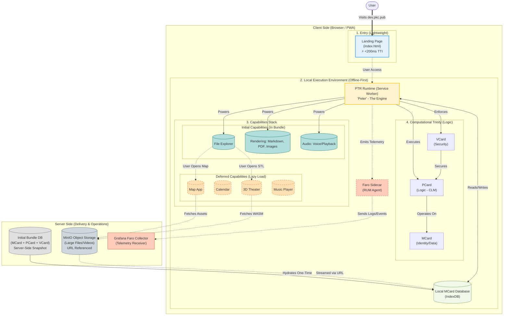
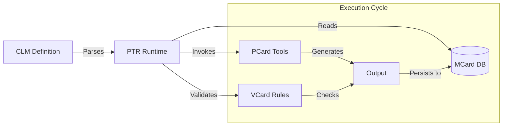

# PKC Architecture & Configuration Strategy

## Table of Contents
1.  [Architectural Overview: The Computational Trinity](#1-architectural-overview-the-computational-trinity)
2.  [Component Roles: The Trinity](#component-roles-the-trinity)
3.  [Configuration Strategy](#2-configuration-strategy)
4.  [Future Roadmap: The "Configurable Trinity"](#3-future-roadmap-the-configurable-trinity)
5.  [Design Rationale: Why Server-Side Initial Distribution?](#4-design-rationale-why-server-side-initial-distribution)
6.  [Deployment Strategy: Initial vs. Deferred Capabilities](#5-deployment-strategy-initial-vs-deferred-capabilities)
7.  [Logic & Execution: The Cubical Logic Model (CLM)](#6-logic--execution-the-cubical-logic-model-clm)

## 1. Architectural Overview: The Computational Trinity

The GovTech PKC platform implements **Computational Trinitarianism** through three recursive planes, ensuring self-governance and scalability.

### Component Roles

### Component Roles: The Trinity

1.  **MCard (The Data Plane)**:
    *   **Concept**: *Monadic Card* - The atomic, immutable unit of knowledge.
    *   **Role**: Base library & Persistence. Manages Content Addressable Storage (CAS).
    *   **Key Function**: "Everything is an MCard". Stores data, synchronization state (ETCD-like), and identity. `mcard-js` provides this capability to the frontend.

2.  **PCard (The Control Plane)**:
    *   **Concept**: *Polynomial Card* - The executable logic and conversational interface.
    *   **Role**: "Conversational Programming". Transforms static data (MCards) into executable functions.
    *   **Key Function**: Wraps logic (Implementation) with Abstract Specs and Test Cases. Used for testing, logic execution, and PWA control flow.

3.  **VCard (The Application Plane)**:
    *   **Concept**: *Value/Verification Card* - The security and economic boundary.
    *   **Role**: "Value Exchange". Enforces boundaries, permissions, and economic transactions.
    *   **Key Function**: Applies security policies (Authentication, Authorization) to PCards to create verified, secure transactions.

5.  **MinIO (Asset Store)**:
    *   **Role**: Handles large binary assets (Videos, STL models) that are too heavy for the Initial Bundle.
    *   **Mechanism**: MCards store *references* (URLs) to these assets. The client streams them on-demand via the `content-type` renderer (e.g., `<video src="...">`).

6.  **Grafana Faro (Observability)**:
    *   **Client Side**: The `Faro Sidecar` runs in the PWA, capturing RUM metrics, errors, and user interaction paths.
    *   **Server Side**: The `Faro Receiver` collects this telemetry for visualization in Grafana Cloud (Loki/Tempo).
    *   **Purpose**: Enables the "Self-Governance" feedback loop by allowing developers to observe how users interact with the system.

4.  **Landing Page Strategy (Lightweight Entry)**:
    *   **Problem**: Loading the full `app.html` bundle immediately can cause a "stuck" experience on slower connections.
    *   **Solution**: **Extremely Lightweight Landing Page (`index.html`)**. 
    *   **Design**:
        *   Contains *minimal* CSS/JS.
        *   Loads instantly (Time-to-Interactive < 200ms).
        *   Features a clear "Enter Application" action.
    *   **Outcome**: Ensures users never see a white screen. The heavy application (`app.html`) is loaded *only* after user intent is confirmed.
    *   **Stakeholders**: As requested by Henry Koo and Alessandro, this ensures smooth entry to `dev.pkc.pub`.

---

## 2. Configuration Strategy

To "configure everything" effectively, we use a stratified configuration approach:

### A. Environment Configuration (`.env`)
Used for server-side infrastructure and secrets. Managed by `THKMesh` orchestration.

*   **Location**: `THKMesh/LandingPage/.env`
*   **Key Variables**:
    *   `WEBSOCKET_URL`: internal vs external signaling URL (e.g., `wss://dev.pkc.pub/ws/`).
    *   `STUN_SERVERS`: NAT traversal configuration.
    *   `ZITADEL_*`: Identity Provider secrets (OIDC).
    *   `PUBLIC_GOOGLE_*`: API keys for calendar integrations.

### B. PWA & Runtime Configuration (`public/config/`)
Used for client-side behavior and "soft" settings. Hot-reloadable without rebuilding containers.

1.  **PWA Policy (`pwa-config.json`)**:
    *   **Location**: `public/config/pwa-config.json`
    *   **Purpose**: Controls the install prompt behavior.
    *   **Strategy**: Set `enableAutomaticPrompt: false` to implement the "Choice, Not Force" policy.

2.  **View Management (`app-views.json`)**:
    *   **Location**: `public/config/app-views.json`
    *   **Purpose**: Defines which "Cards" or "Apps" are available (Calendar, Map, 3D Theater).
    *   **Strategy**: Add experimental views here (like "Morphism Cube") without changing code.

### C. MCard Configuration
Used for data persistence and syncing behavior.

*   **Managed via**: `mcard-js` initialization options.
*   **Strategy**:
    *   **Namespace**: Configured per-user or per-group via Hash.
    *   **Storage**: Defaults to `IndexedDB` in browser, `SQLite` on server.

## 3. Future Roadmap: The "Configurable Trinity"

To fully realize the vision:
*   **Unified Config**: Create a single `govtech.config.yaml` at the root that generates the `.env` and `json` files for all submodules.
## 4. Design Rationale: Why Server-Side Initial Distribution?

This architecture implements a specific **"Bundle of Database"** pattern to solve the critical "Cold Start" problem in complex PWAs.

### The Problem: The "Loading Spinner" Fatigue
In traditional SPA/PWA architectures:
1.  User visits site -> loads `app.js` (Heavy).
2.  App starts -> fetches data from API (Latency).
3.  **Result**: User stares at a spinner for seconds.

### The Solution: Server-Side Bundle Distribution
Instead of fetching data *after* the app loads, we treat the initial state as a **pre-packaged database bundle** that is served immediately.

1.  **Server-Side Pre-Packaging**:
    *   The server maintains an "Initial Bundle DB" containing the core MCard (Identity), PCard (Logic), and VCard (Security Rules) required for the app to function.
    *   This is not just JSON; it is a **serialized database snapshot**.

2.  **Instant Hydration (The "Bundle" Strategy)**:
    *   When the user clicks "Enter" on the lightweight landing page, the PWA doesn't just download code; it downloads this **Initial Bundle**.
    *   This bundle is immediately injected into the browser's **IndexDB**.

### Why This is Faster
*   **Zero API Round-Trips**: The app wakes up with its brain fully formed. It doesn't need to ask the server "Who am I?" or "What are the rules?". The answers are already in the Local IndexDB.
*   **Offline-First by Default**: Since the bundle is local, the app works instantly even if the network drops immediately after loading.
*   **Massive Concurrency**: The browser can execute the local MCard/PCard/VCard logic against IndexedDB orders of magnitude faster than waiting for network REST calls.

### Why "Computational Trinity" in the Bundle?
*   **MCard**: Provides immediate Identity and Persistence.
*   **PCard**: Provides the executable logic (the "Brain").
*   **VCard**: Provides the security rules (the "Conscience").
*   **Result**: The client becomes a fully autonomous node the moment it loads, capable of self-validation and logic execution without constant server hand-holding.

## 5. Deployment Strategy: Initial vs. Deferred Capabilities

To balance "Instant Load" with "Rich Features", we enforce a strict separation of concerns for the Initial Bundle.

#### A. Initial Capabilities (Included in Initial Bundle)
The "Initial Bundle" must power the following features *immediately* after hydration, without further network requests:
1.  **File Explorer**: Browsing the MCard database structure.
2.  **Basic Content Rendering**: 
    *   **Markdown**: For text content and documentation.
    *   **Images**: For basic visual assets (JPEG/PNG/WEBP).
    *   **Audio/Voice**: For voice notes and basic audio playback (`<audio>` element).
    *   **PDF**: For document viewing (`pdf.js` lightweight viewer).

#### B. Deferred Capabilities (Loaded Afterwards)
Full-scale applications that require significant assets or separate context bundles are **not** part of the initial load. They are loaded lazily on-demand:
1.  **Calendar App**: Full calendaring logic and UI.
2.  **Map App**: heavy mapping libraries (Leaflet/Mapbox) and tile data.
3.  **3D Theater**: The "3D Lab" with STL/GLB viewers.
    *   **Anime.js Integration**: Used alongside Three.js to provide high-fidelity, physics-based animations and smooth object transitions, enabling the "Cinematic" quality of the theater mode.
4.  **Music Player**: The full "Music App" and hi-res audio streaming logic.

**Rationale**: 
*   **Loading Speed**: Loading the entire suite (Maps, 3D, Music) at once would result in unacceptable load times.
*   **User Intent**: A user visiting to browse files (File Explorer) shouldn't be blocked by loading a 3D engine. The heavy apps are only loaded when the user explicitly navigates to them.

## 6. Logic & Execution: The Cubical Logic Model (CLM)

The "Brain" of the system is the **Cubical Logic Model (CLM)**, a declarative language that defines *how* the MCard (Data), PCard (Logic), and VCard (Security) interact.

### A. The Three-Dimensional Agent Structure
Every cognitive agent or workflow in PKC is defined in three dimensions:
1.  **ABSTRACT (What)**: The high-level specification or goal. (e.g., "Summarize this PDF").
2.  **CONCRETE (How)**: The actual implementation code or LLM prompt. (e.g., "Use GPT-4 with this system prompt...").
3.  **BALANCED (Why/Proof)**: The test cases, guardrails, and audit logs that verify the agent behaves as expected.

### B. PTR: The "Polynomial Type Runtime"
*   **Definition**: PTR (pronounced "Peter") is the universal engine that executes CLM definitions.
*   **Role**: It runs inside the PWA (Service Worker) and on the Server (Python/Rust).
*   **Function**:
    *   It loads the **Initial Bundle** from IndexDB.
    *   It reads **MCard** state.
    *   It executes **PCard** logic (JS/WASM/Python).
    *   It enforces **VCard** security boundaries.

### C. Execution Flow

### D. Global State Management (Redux)

While individual components are isolated, the **Control Plane** requires a unified state manager to coordinate the "Trinity". We use **Redux Toolkit** to serve as the central nervous system for the CLM runtime.

*   **Registry Management**: Redux fetches, validates, and stores the definitions of all available CLM components (abstract/concrete/balanced specs).
*   **Lifecycle Orchestration**: It tracks the live status of every active component (e.g., `loading` -> `active` -> `failed`) and manages the iframe containers.
*   **Heartbeat Monitoring**: Components send periodic heartbeats to the Redux store. If a component hangs (stops beating), Redux detects the failure and triggers isolation protocols.
*   **Event Bus**: Serves as the message broker for the decoupled architecture, allowing the "Sidecar" (Observability) to subscribe to system events without tight coupling.
