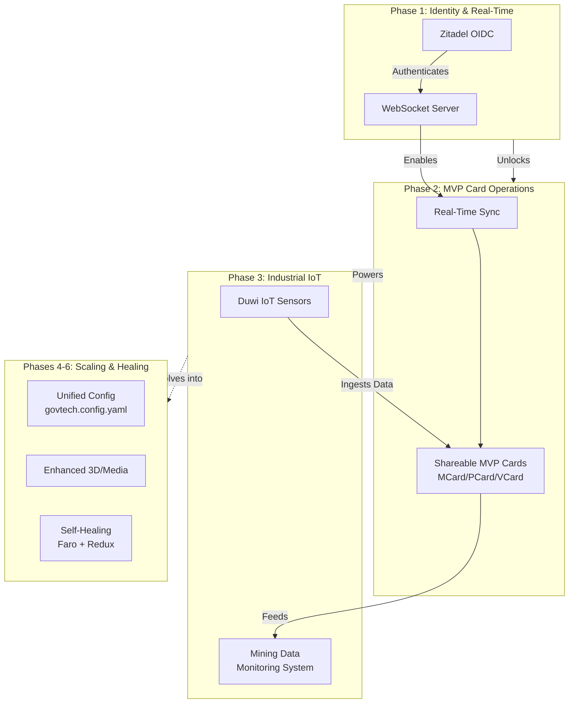

# PKC Usage and Development Roadmap

This document outlines the operational usage, configuration protocols, and future developmental roadmap for the GovTech PKC (Personal Knowledge Container) platform, based on the principles of the Computational Trinity and the Cubical Logic Model (CLM).

## 1. Usage & Configuration Guide

The PKC platform employs a stratified configuration approach to balance immediate load times with rich, offline-first application capabilities.

### Environment & Infrastructure Configuration
- **Server and Secrets**: Managed via `THKMesh/LandingPage/.env`. This includes `WEBSOCKET_URL` for signaling, `STUN_SERVERS` for NAT traversal, `ZITADEL_*` for OIDC identity provisioning, and third-party API keys (e.g., Google Calendar).

### Client-Side Settings (Hot-Reloadable)
- **PWA Policy (`public/config/pwa-config.json`)**: Controls installation behavior. Specifically, set `enableAutomaticPrompt: false` to implement the "Choice, Not Force" policy.
- **View Management (`public/config/app-views.json`)**: Used to control and toggle which "Cards" or applications (Calendar, Map, 3D Theater) are exposed to the user without necessitating a container rebuild. Can be used for experimental views (like "Morphism Cube").
- **MCard Configuration**: Initialized via `mcard-js`. Data namespace represents users or groups, storing to IndexedDB in the browser and SQLite on the server.

### Application Capabilities
The bundle strategy ensures extreme speed by hydrating a database snapshot instantly, dictating how features are used:
- **Immediate Execution (Initial Bundle)**: Instantly available via the Service Worker (PTR) offline-first IndexDB hydration. Includes core tools like the File Explorer, Markdown/PDF rendering, and basic Audio playback.
- **Lazy-Loaded Execution (Deferred)**: Heavy applications accessed on-demand by the user, such as the Map App (Leaflet/Mapbox), Calendar, Music Player, and the 3D Theater (using Three.js and Anime.js). Assets for these are streamed from MinIO Object Storage.

### Logic and State Management (PTR Engine)
- **Execution Engine**: PTR ("Peter") orchestrates logic in the Service Worker and server. It interacts directly with MCards (Data), calls PCards (Logic/Functions), and enforces security through VCards.
- **Unified State Matrix**: Interactions are coordinated by a central Redux Toolkit state, managing component registries, lifecycle orchestration (iframe containers), and component heartbeat monitoring (to isolate hung components).

---

## 2. Development Roadmap

The future development of the PKC platform builds toward a fully autonomous, scalable, and connected ecosystem, prioritizing shareable assets and real-time industrial integrations.

| Phase | Title | Key Objectives |
| :--- | :--- | :--- |
| **Phase 1** | Identity & Real-Time Communications | **Zitadel & WebSocket Integration**: Establish functional, secured WebSocket connections authenticated via Zitadel. |
| **Phase 2** | Operationalizing the MVP Card | **Shareable MVP Cards**: Transition the MVP (MCard, PCard, VCard) framework from an isolated local store to a networked, shareable asset among users. |
| **Phase 3** | Industrial IoT & Telemetry Integration | **Duwi IoT Sensor Integration**: Interface the PKC platform with IoT hardware from Duwi to actively ingest and manage sensor data streams.  **Mining Data Collection & Monitoring**: Configure the PKC to reliably collect operational data for mining company use cases. This includes deploying a robust **monitoring data system** to manage and visualize the industrial telemetry in real-time. |
| **Phase 4** | Unified Configuration (The "Configurable Trinity") | **Implementation of `govtech.config.yaml`**: Transition toward a single source of truth at the project root that automatically generates necessary `.env` and `.json` artifacts for all submodules. |
| **Phase 5** | Refined Execution & 3D Capabilities | **PTR Optimization & PCard Modularity**: Optimize the CLM execution pathway and encapsulate apps (Maps, Calendar) into swappable PCards that dynamically fetch remote assets from MinIO.  **Enhanced 3D & Media**: Expand the 3D Theater using Three.js and Anime.js for high-fidelity object transitions. |
| **Phase 6** | Observability & Self-Healing Governance | **Self-Governance Loop & Component Healing**: Utilize Grafana Faro for RUM telemetry and connect Redux heartbeat monitoring to automatically isolate and restart hanging PCards on the client without a full app refresh. |
