# Advanced Examples: LaTeX, TikZ & Mermaid 🎨

This card demonstrates advanced rendering features including LaTeX math, TikZ diagrams, and Mermaid diagrams.


ABC 123 XYZ

## LaTeX Math Rendering

### Inline Math

You can write inline math like this: $E = mc^2$ or $\sum_{i=1}^{n} i = \frac{n(n+1)}{2}$

### Display Math

Display equations are centered and larger:

$$
\int_{-\infty}^{\infty} e^{-x^2} dx = \sqrt{\pi}
$$

$$
\frac{d}{dx}\left(\int_{a}^{x} f(t)dt\right) = f(x)
$$

### Complex Equations

$$
\nabla \times \vec{\mathbf{B}} -\, \frac1c\, \frac{\partial\vec{\mathbf{E}}}{\partial t} = \frac{4\pi}{c}\vec{\mathbf{j}}
$$

$$
\mathcal{L} = \frac{1}{2}\rho v^2 S C_L
$$

## TikZ Diagrams

### Simple Node Graph

```tikz
\begin{tikzpicture}
  \node[circle,draw] (A) at (0,0) {A};
  \node[circle,draw] (B) at (2,0) {B};
  \node[circle,draw] (C) at (1,1.5) {C};
  \draw[->] (A) -- (B);
  \draw[->] (B) -- (C);
  \draw[->] (C) -- (A);
\end{tikzpicture}
```

### Flow Diagram

```tikz
\begin{tikzpicture}[node distance=2cm]
  \node[rectangle,draw] (start) {Start};
  \node[rectangle,draw,below of=start] (process) {Process};
  \node[diamond,draw,below of=process] (decision) {Decision};
  \node[rectangle,draw,below left of=decision] (yes) {Yes};
  \node[rectangle,draw,below right of=decision] (no) {No};
  \draw[->] (start) -- (process);
  \draw[->] (process) -- (decision);
  \draw[->] (decision) -- node[left] {yes} (yes);
  \draw[->] (decision) -- node[right] {no} (no);
\end{tikzpicture}
```

## Mermaid Diagrams

### Flowchart


### Sequence Diagram


### Class Diagram


### Git Graph


## Combined Example

Here's a mathematical formula $f(x) = \int_{0}^{x} t^2 dt = \frac{x^3}{3}$ followed by a diagram:

```mermaid
graph LR
    A["Input: x"] --> B["Calculate: x³/3"]
    B --> C["Output: result"]
```



## Related Cards

- @welcome - Introduction
- @example-markdown - Basic markdown examples
- @quick-guide - Getting started guide

**Try editing this card to experiment with LaTeX, TikZ, and Mermaid!** ✨
