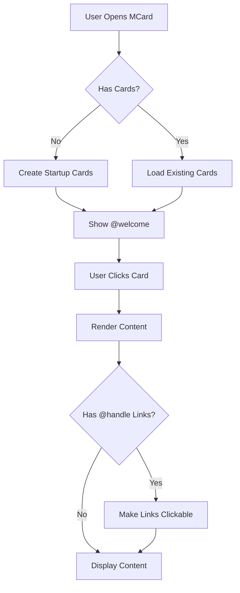
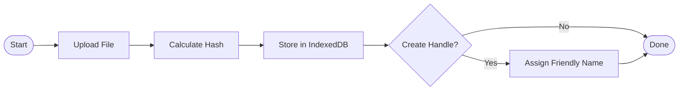
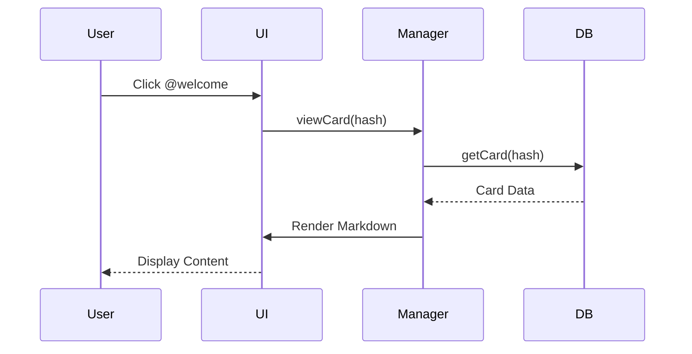

# Markdown Example 📝

This card demonstrates various markdown formatting options you can use in MCard Manager.

👉 **New here?** Check out @welcome and @quick-guide first!

## Text Formatting:
- **Bold text** - Use `**text**`
- *Italic text* - Use `*text*`
- `inline code` - Use backticks
- ~~Strikethrough~~ - Use `~~text~~`

## Lists:
1. First item
2. Second item
3. Third item

### Unordered:
- Bullet point
- Another point
  - Nested point
  - Another nested point

## Code Block:
```javascript
// Example code with syntax highlighting
const greeting = "Hello, MCard!";
console.log(greeting);

// You can reference other cards
const welcomeCard = "@welcome";
```

## Mermaid Diagrams:
You can create diagrams using Mermaid syntax!



### Flowchart Example:


### Sequence Diagram:


## Quotes:
> "Content-addressed storage is the future of data management."
> 
> Use blockquotes for emphasis or citations.

## Handle References:
You can link to other cards using @handle syntax:
- Click @welcome to see the introduction
- Click @quick-guide for instructions
- Click @example-markdown (this card!) to return here

These become **clickable links** automatically! Try it!

## External Links:
You can also create regular links: [MCard Documentation](https://example.com)

## Headers:
Use `#` for headers (1-6 levels):
# H1 Header
## H2 Header
### H3 Header

---

**Try editing this card to create your own version!**

💡 **Tip**: When you edit a card with a handle, you create a new version. The handle (@example-markdown) will point to your new version!

## Related Cards:
- @welcome - Back to welcome page
- @quick-guide - Learn how to use MCard Manager
- @advanced-examples - LaTeX, TikZ, and Mermaid examples
